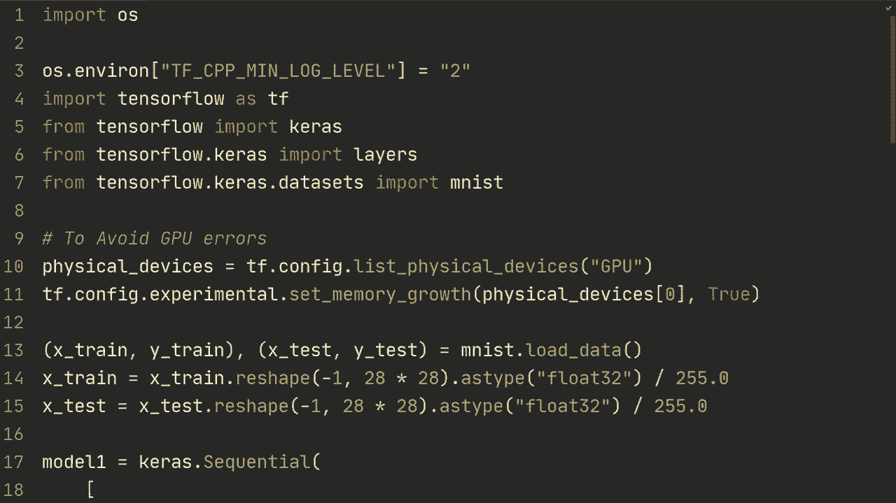
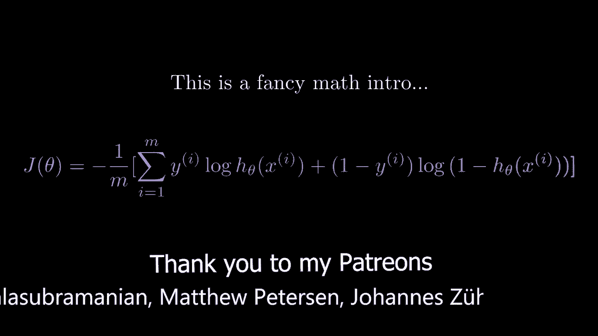

# “当前最好的 TensorFlow 教程！”，看完就能自己动手做项目啦！＜实战教程系列＞ - P10：L10- 保存和加载模型 - ShowMeAI - BV1em4y1U7ib

在本视频中，我们将探讨保存和加载模型权重的方法，以及如何保存整个模型，并执行被称为序列化模型的操作。

好的，这里有一些代码，希望你能从之前的教程中感到熟悉。我们首先进行一些基本的导入，然后加载 Ms 数据集。接下来我在这里创建了三个不同的模型。它们都是相同的模型架构，只是使用了不同的 API。第一个模型使用的是顺序 API，包含两个具有 64 个节点的全连接层和一个具有 10 个输出节点的层；类似地，model2 将使用功能 API 创建相同的模型。

最后，我们使用子类化的方法。首先，我们来为这个视频创建一个大纲。首先，我将向你展示如何保存和加载模型权重。其次，我将向你展示如何保存和加载整个模型，这被称为序列化模型。

因此，当我们保存和加载整个模型时，它将被保存为数据结构，这意味着它可以在不同的 TensorFlow 框架上加载，例如 TensorFlow.js、TensorFlow Lite。举例来说，你可以在你的 PC 上训练一个模型，然后如果你想将其投入生产并创建一个应用程序，你可以直接加载你之前训练的模型，而无需进行任何转换。此外，这样做将保存权重，也会保存模型架构，因此你不必实际拥有模型的代码，同时也会保存训练配置，这就是你传递给模型的原因。

编译。最后，它还会保存优化器和状态。例如，如果你使用的是 Adam 优化器，它将跟踪指数加权平均值，这在优化器内部。所以如果你只是保存权重，那么每次从模型加载权重时，优化器的状态都会被重置。

好的，让我们先从如何保存和加载模型权重开始。你要做的是在训练后进行保存，所以我们在模型训练后进行评估，然后使用 `model.save_weights`，并指定文件夹。我们来做一个保存模型的操作，如果现在运行它，打开我们运行脚本的文件夹，里面将会有一个名为 save_model 的文件夹，所有保存权重的文件都将存放在这个文件夹里。

现在加载模型时，你可以使用`model.load_weights`并指定该文件夹，保存模型后运行。同时，在之前的第一次训练后，准确率大约是90%，而现在经过一个周期后，准确率是97%。

这意味着它实际上是从之前加载权重。因此，需要记住的一点是，你不能在不同的实现之间交换和加载权重。例如，如果我们使用来自功能API的模型运行，那么会出现错误，说明它们不兼容。因此，这里的一条一般规则是，你需要以保存时的确切方式加载模型。如果你已经使用顺序或功能API进行过操作，并且知道如何做到这一点，请留言。

这对某些人可能会有所帮助。但总的来说，你需要以完全相同的方式加载模型。因此，如果你使用顺序创建并保存了模型，那么在加载模型时也需要保持原来的形式。现在，当保存模型时，你可以使用不同的格式。例如，我认为你可以指定保存格式，比如H5格式。因此，TensorFlow保存的有两种不同的格式：TensorFlow默认格式和HDF5格式，HDF5格式是之前在TensorFlow 1中使用的，而自TensorFlow 2以来，他们使用了TensorFlow默认的保存格式。所以，你可以查看官方文档，了解如何使用特定文件格式进行保存和加载。我将展示如何操作。

默认情况下，当我们想要保存和加载整个模型并序列化模型时，我们将执行`model.save`，然后进行完整保存模型或类似的操作。

它会将模型保存到该文件夹中。是的，我们会收到这个错误警告，来自TensorFlow的。对此你无能为力，如果你收到了，就忽略它。从我的理解来看，我们没有做错任何事情，希望在未来的版本中能修复。但无论如何，你现在是在保存模型，而你可以完全移除这一部分，因此可以删除模型编译部分，只需指定`model = ksmod.load_model`，然后指定该目录，完整保存模型，这样就会加载整个架构。

所以你在这里还可以做的是，可以删除你现在正在加载的模型的代码，这也将在加载模型内部完成，并且它也会加载训练配置，所以模型编译就是我们可以删除那部分的原因，现在。

我们重新运行这个。我们可以看到它在那个点继续训练，然后我们再次遇到这个错误，因为它正在保存模型，无论是使用顺序、功能还是子类化，这都有效。因此，之前你保存的默认格式是 HDF55 格式。

你必须做一些我想是令人烦恼的事情，你需要在这里创建一个明确的获取配置函数，同时你也需要从配置文件创建一个新格式的函数。你不必这样做。因此，如果你使用旧格式，我将参考官方文档说明如何操作，但这就是如何使用 Tensorflow 保存和加载模型，包括权重和序列化模型版本。希望这个视频对你有帮助，如果你有任何问题，请在下面的评论中留下。

非常感谢你的观看，期待在下一个视频中见到你！
