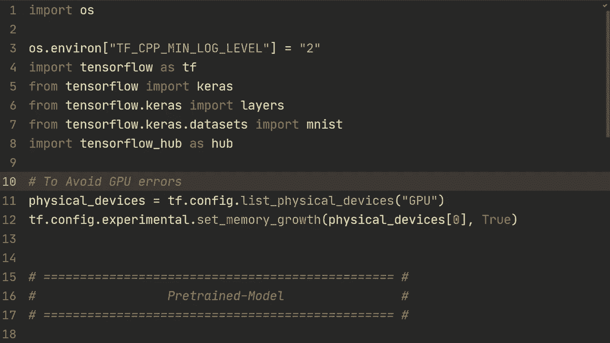
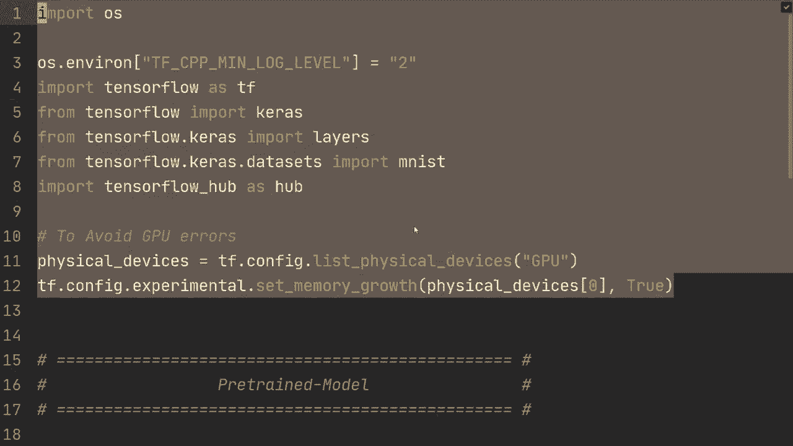
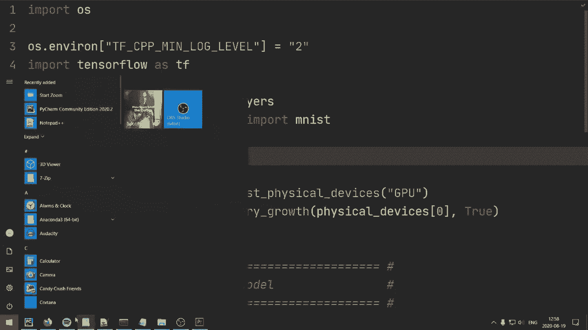
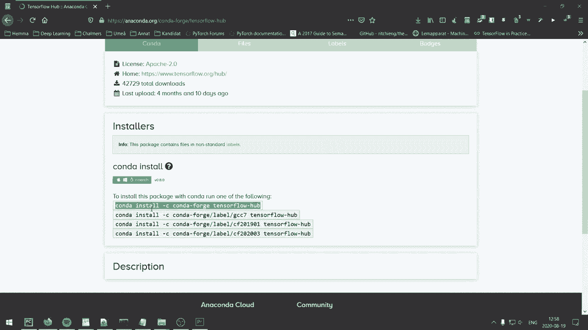
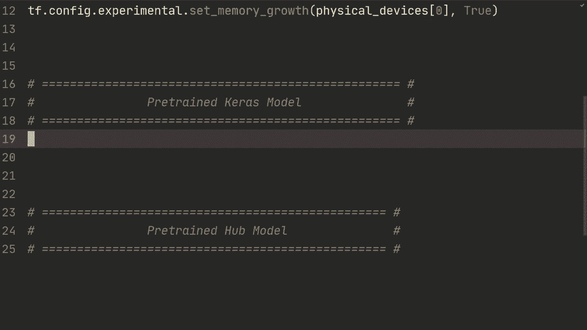
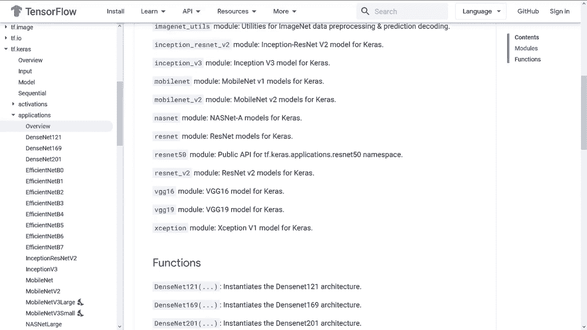
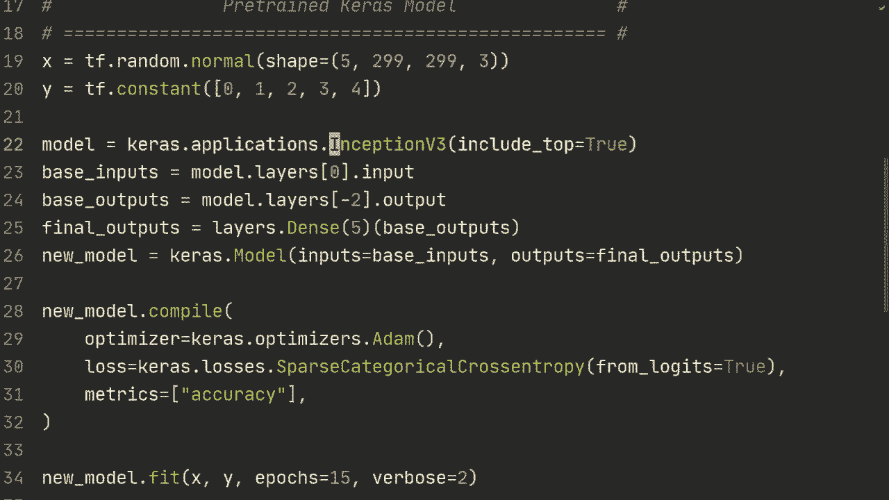
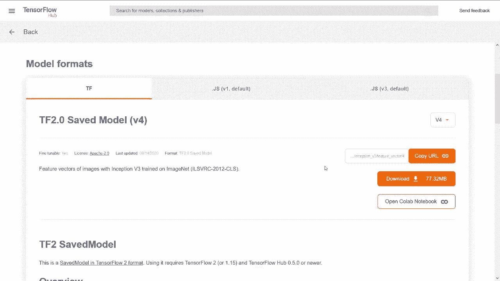
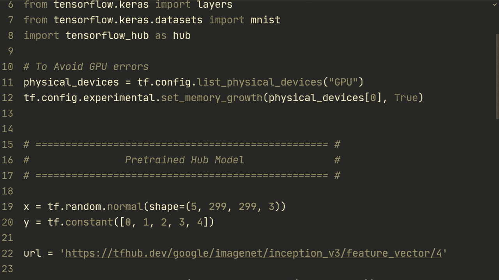

# “当前最好的 TensorFlow 教程！”，看完就能自己动手做项目啦！＜实战教程系列＞ - P11：L11- 迁移学习、微调和 TensorFlow Hub - ShowMeAI - BV1em4y1U7ib

在这个视频中，我将向你展示如何使用预训练模型，包括如何冻结层和进行微调。所以在这段精彩的介绍之后，我们开始吧！

好的，现在我们面前的代码应该会让你感到很熟悉。我们几乎在所有视频中都使用过这些代码，除了这一行命令：Tensorflow Hub。稍后我会详细解释这个命令，但首先，如果你没有安装，可以谷歌搜索 Conda Tensorflow Hub，你会找到这个页面，链接也会在描述中，你可以使用这个命令下载它。如果你使用 Conda，就运行这个命令；如果你使用 Pip，则只需运行 `Pip install Tensorflow Hub`，就这样。

在这个视频中，我主要想做三件事。首先，如果你有之前训练的预训练模型，我会向你展示如何使用它。如果你不熟悉保存和加载模型的内容，可以查看我之前的视频。接着，我将向你展示如何使用 Keras 模型，Keras 有许多可以轻松导入的预训练模型。

最后，我将向你展示如何从 Tensorflow Hub 加载预训练模型。Tensorflow Hub 有很多预训练模型。正如我所说的，我稍后会详细介绍这一点。首先，对于我们的预训练模型，我将复制数据集加载的相关内容。

这里是 Ms 数据集。我们已经制作了多个视频。接下来，我将加载一个预训练模型。因此模型会加载。这个模型可能是你训练的，或者是你在 GitHub 上找到的某个模型。

你只需加载该模型，然后可以使用 `print(model.summary)`。接下来，你需要查看你想要的部分。如果你想要整个模型，那么就加载该模型，继续训练。但是通常在进行迁移学习时，我们会选择几个层进行训练。

假设我们想要。假设我们想要除了最后一个以外的所有内容，对吧？假设我们有，假设这个类别数是 1000，对于 imagenet 或类似的东西。但对于 Ms，我们将有 10 个类别，所以我们必须用自己的最后一层替换这一层，但我们可以使用那个特定模型的前面层。所以我们如何做到这一点是，我们会这样做，sort of 基础输入，我们会做 model 的层，我们将取我们想要开始的层，那是第一层，所以我们要做 model layers 0 然后点输入。然后我们要做基础输出，我称之为基础是因为我们将使用这个预链模型作为我们的基础模型，然后我们将 sort of 在那之上构建一个层。所以我们在这里做的是，sort of 检查哪个，通过检查 sort zero1 到。

3，4，5，6，7。所以你想要从第七个输出。或者你可以从后往前数，所以你可以这样做，这是 minus1，然后 minus2。所以我们要做的是 model 的层，然后 minus2。然后点输出。所以我们想要从这个展平层输出。在其他词中，我们。

我们正在移除这个层。最后的密集层。所以也有其他方法可以做到这一点。你也可以使用 get layer，然后 sort of 取名字。但我们只会坚持使用索引。这样就可以了。然后我们要做。输出，我们将构建自己的。所以这可以是一个模型。

一个顺序模型或类似的东西。我们只会添加一个单独的层。所以我们要做的就是层，然后10个输出节点，然后是基础输出，对吧，所以我们首先通过这里运行，然后基础输出的输出将被发送到这个最终输出。

然后，我想我们可以称之为最终输出。然后我们将做 model 等于 ks 那个。不，等等，我们要做，是的，Ks 那个模型基础输入。输入等于基础输入。输出等于最终输出。输出，我想，因为有多个。所以接下来。我们可以打印模型的总结。也许这也应该叫别的什么，而不是模型，所以我们可以。

你知道，我们可以称这个新模型，因为我们已经改变了另一个有趣的是。我们实际上没有改变任何东西。我们只是替换了，因为我们之前预训练的模型有这一层。但你大致明白这个点，你可以用不同的类别数等替换它。所以这只是一个简单的例子，说明你实际上是如何做到的。

所以如果我们现在打印新模型的摘要，是的，正如我所说的，我们会得到完全相同的模型，但这里的模型现在是不同的，所以如果我们例如将其更改为15，那么最后的层将会有15个输出节点，但在这种情况下我们想要10个。然后你会像平常一样进行操作，我将复制编译和拟合的部分。

我认为这并不是非常相关。我们在之前的视频中已经看过了。所以在这种情况下，你只需创建一个新模型并编译，然后拟合新模型，我们现在可以运行这个。好吧，在仅仅一个周期后，我们可以看到它的准确率超过了97%，这暗示了预训练确实有一些效果。同时，我们可以看到，经过三个周期后，它的准确率几乎达到了99%。

你还可以做的是，假设这个预训练模型你不想实际训练整个模型，这就是你想进行微调的情况。因此，我们需要冻结这个预训练模型的层，而你可以很简单地做到这一点，就是执行`model.trainable = False`。这样会冻结所有的层。

你还可以做的另一件事是迭代模型的层。因此，`for layer in model.layers:`。然后你可以，在这种情况下，我们已经将每一层都设置为不可训练，因此我们可以做一些像`assert layer.trainable == False`的操作。但如果我们没有在这里执行这一行代码，例如。

如果你只想更改特定的层，你也可以迭代特定的层，比如从1到5，然后你可以将层设置为不可训练。是的，这里有两种不同的方法来做同样的事情。是的。

所以我注意到一个错误，在编辑视频时，我写的是可训练层为false。嗯，我不太确定这到底是什么意思，但我们想要的应该是将某层的可训练性设置为false，所以这只是一个打字错误，出于某种原因它仍然运行了，我不确定这有什么区别，但这就是我们想要做的，而这已经在这一行代码中完成，所以其实没关系。

但如果你想要迭代你的层，这就是你应该怎么做。这样做的好处是，如果我们现在运行它，重新运行，我不知道你是否看到过，但运行一个周期大约花费了15秒或16秒，因此如果我们现在运行它而不这样做，我们会发现实际时间几乎减半。所以，进行微调和冻结层的好处在于，它的运行速度会快得多，我想这就是预训练模型的常见使用案例，你会拿这个巨型模型，将某些层冻结到特定点，然后只在最后添加几个线性层以适应你的具体用例。

是的，实际上我们可以看到，在这种情况下，它的性能确实更好。基本上是相同的。这是因为这些导入的层之前已经在Ms上训练过。所以我想这是一个场景，当你有自己的模型或加载了自己的模型时，我现在要去掉代码，我们将继续下一个部分。所以如果你想使用预训练的ks模型的话。

因此，ks库有很多可以很容易导入的模型，我将向你展示一个用例。它将与我们之前所做的非常相似，但使用这些模型的CA API。所以让我们创建一些随机数据，仅用于演示以运行模型。所以我们将做Tf随机正态，然后形状我们将做，比如说三个示例，五个示例299。

和9乘以3。这只是为了适应我们将要导入的模型。我马上会给你展示，但这些是X标签或特征。它们是299的图像，然后是RGB的三个通道。然后我们有TF常量，可以说是0，1，2，3，4。

所以有五个类别，它们都是不同的独特类别。然后模型是Kas应用程序。在这里，你可以使用许多不同的模型。所以我将选择inception V3。然后有许多参数可以在这里传入，你可以阅读更多官方文档。

但最重要的一点是，你可以将include top设置为true或false。基本上，在最后的全连接层中，你可以去掉这些，只获取特征向量，然后将其输入到你自己的顺序模型中或类似的东西。所以这可能是最重要的参数之一。我们可以先这样做。

然后让我们做模型摘要，看看它是什么样的。是的，所以我们可以看到，在这种情况下，实际上对于inception V3，最后只有一个全连接层。所以我假设你熟悉inception模块。

但本质上，它在这一层有不同卷积网络的连接，然后进行全局平均池化，最后进行全连接。所以如果你设置include top为false，它将去掉最后的全连接层。但假设我们只是想从这个开始。那么我们现在要做的与之前非常相似。

你可以将基本输入设置为模型的layers 0 .input。然后基本输出是这些输出是模型的层。然后我们假设再次，我们只想去掉最后一个全连接层，但当然，如果最后有多个全连接层的话。

你可以执行-3-4，删除你想要的确切数量。在这种情况下，我们只想删除最后一个。然后是 dot output。接下来我们要做的是最终输出。再次强调，我们只进行一层，因此让我们设置五个节点，因为我们有五个类别。

然后是基础输出。这与我们之前所做的非常相似。接着新模型是 Kas，模型输入等于基础输入，输出等于最终输出。然后你就可以编译。因此，我将复制这段以节省一些时间。编译，我们就用 atom。

分类处理，没什么。没有新内容。接下来我们要做的是 new model dot fit。所以让我们执行 new model dot fit。X 和 Y，然后 epox 设为 15，verbose 设为 2。这应该非常快，对吧，我们只有五个示例，5 个随机数据点。所以让我们看看它能否使用这个巨大的 Inception V3 网络过拟合 5 个数据点。

基础输入未定义，好吧。😔，基础输入就在那儿。好吧，所以在这 15 个回合的训练进行得相当快。正如我们所见，准确率达到了 100%，损失非常低。不过，当然，这只是一个演示，展示了如何使用这个 ks 应用程序模型导入内容。所以我现在想向你展示如何使用 Tensorflow hub。Tensorflow hub 实际上就是 Tf hubub dev，它基本上是一个你可以获取许多不同预训练模型的地方，适用于不同场景。假设我们只想要一些图像，你可以在这里找到很多模型，可以浏览并查看。

假设我们想要再次使用 Inception V3，所以我们可以直接去这个模型。它是为特征向量而设计的，这与 kis 模型类似，其中你可以设置 top 等于 false，这样就会给你一个特征向量，这正是这个模型的作用。

他们将 Inception V3 分离为一个包含全连接层的模型和一个仅返回特征向量的模型。

然后你做的就是复制 URL。当你有了 URL。

然后你可以返回代码。所以，再次让我们生成一些随机数据。我们生成的 TF 随机正态分布形状为 5，2，99，2，99，3。这几乎正是我们之前为加载 ks 所做的。再一次，我们正在加载完全相同的模型。所以这不会有什么新东西，只是向你展示如何使用 Tensorflow hub。

然后你要做的是 URL 设为，然后你将 URL 粘贴到这里。接着，你要做的是基本模型，然后 Uub 等于 ks.Layer.U。然后，输入形状为 299，2，99，3。接下来，你要做的是 model 等于 kas sequential。然后再做基本模型，对吧，这不包括全连接层。

然后你可以添加你想要的任何层。因此层的节点数为一百二十八。激活函数等于。不再。我们的层数为64，激活等于relu。然后是的。让我们做一个最终的层，10个上升，5个输出节点。我们只有五个类别。然后再次，你将进行模型编译和模型拟合。所以我只是要把这些复制过来。

然后我想我漏掉了KRS模型的一件事，当然。你可以做我们做的第一个示例，所以你可以设置基础模型的可训练性为false，这样你就可以进行微调。我可能也应该为另一个模型展示这一点，因为这是所有模型都可以做的事情。是的，作为示例，让我们尝试运行这个并看看它的样子。好的。

所以在这种情况下，它实际上并没有过拟合太多。因此我们可能需要运行更长时间，但正如我们所看到的，至少它达到了100%的准确率。差不多就是这样。这些是我想向你展示的不同预训练和微调、冻结层的方式。希望这个视频对你有用，如果你有任何问题，请在评论中留下，我希望在下一个视频中见到你。

