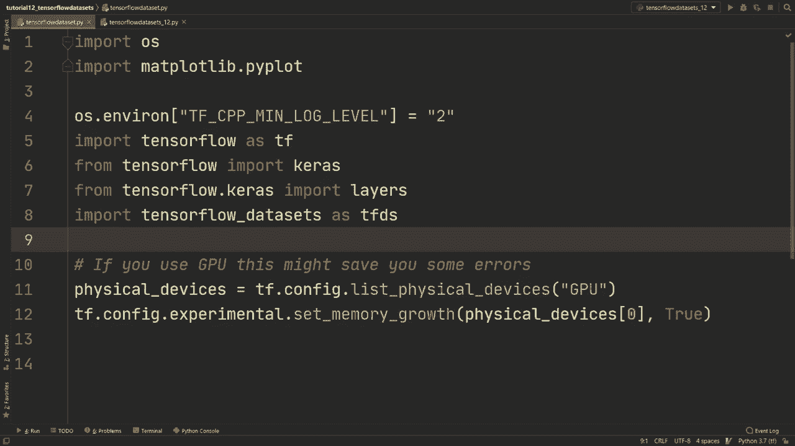
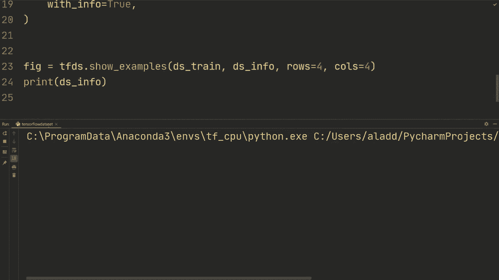
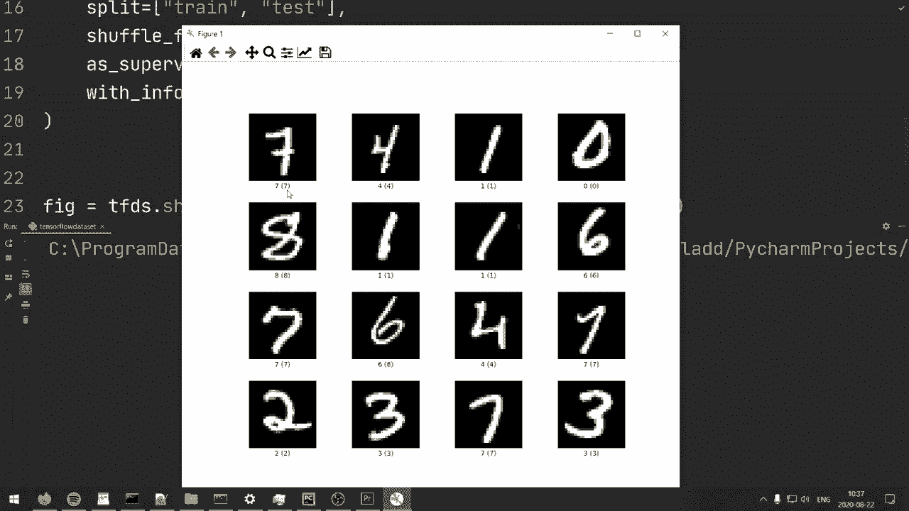

# “当前最好的 TensorFlow 教程！”，看完就能自己动手做项目啦！＜实战教程系列＞ - P12：L12- TensorFlow 数据集 

在这个视频中，我们将查看 TensorFlow 数据集，以及如何加载不同的数据集，进行预处理并高效加载数据。

好的，下面是通过 Ka datasets 提供的数据集，这也是我们到目前为止主要使用的。正如你所看到的，数据集相对较少，我们一直在使用 Cycipher 10 和 MNist。如果我们现在只看 TensorFlow 数据的比较，如此可见，我们有许多其他数据集，包括音频、图像、图像分类和目标检测。

问答、结构、文本摘要、视频翻译。我的意思是，这个数据集上有很多种类。因此我们学习它是有意义的，同时也使我们能够极高效地加载数据。现在我觉得有必要提到的是，我们将要处理的内容与 Tf 数据并不相同。

TensorFlow 数据使加载数据变得简单，它使用 Tf 数据。但是，如果你有自定义数据需要加载，那么你需要使用 Tf 数据。因此，TensorFlow 数据是一个高层封装器，旨在使加载常用数据变得非常简单。在接下来的视频中，我们将看看如何使用 Tf 数据来构建数据集的输入管道，或许是你自己收集的，或是从互联网上抓取的等等。

在这个数据集中，会有一些相似性，因为 Tf 数据是 Tf 数据的封装器。因此我们在这个视频中学到的内容在加载自定义数据时仍然会有用。

好了，够了，不再多说了。现在我们要做的是看看代码。你现在看到的就是我们一直在使用的标准导入。这个是新的，来自 TensorFlow 数据的导入 TFDS，这个是新的。如果你没有这些，可以搜索一下如何下载。所以对于这个，只需执行 Pip install TensorFlow 数据。

说明中也会提供 Anaconda 的链接，以及 Pip 的命令。好的，当你下载完毕后，我们要做的是先加载 Ms 数据集。我们在 Ms 上工作了很多，我想我们都感到厌倦了。

但这实际上只是一个简单的用例，展示它是如何工作的。所以我们将进行 DS train 和 DS test。我们将从 TensorFlow 数据集中获取一个训练数据集和一个测试数据集。然后，我们还会获取一些关于数据集的 DSS 信息。我们这样做的方式是通过 TfDS 加载。

然后我们将进行 Mnist。所以我们进行分割，这里的字符串就是你在 Tensor 数据目录中找到的内容。然后你只需将数据集名称写成字符串。接着我们将进行分割，并且将进行训练和测试。

所以这就是我们将 DS Strain 作为这个元组中第一个输出的原因。因此我们先进行训练分割，然后进行测试。一些数据集也有验证集，因此你还需要在这里添加一个验证字符串。Emmins 没有这个，但你需要检查特定的数据集。

所以你需要了解该数据集的分割情况。然后我们将设置 shuffle files 为 true。Tensorflow 数据集通常将内容存储在称为 TF records 的东西中，通常分成多个文件，比如说每个文件有 1000 个示例，这样做的原因是可以流式传输。因此，如果你在服务器上工作，可以通过互联网进行流式传输，然后在训练时同时加载，这在使用 Google TpUs 等进行训练时非常有用。因此我们希望打乱这些文件，以便不再看到完全相同的文件序列，尽管那些 1000 个示例内的批次将被打乱和随机化，我们仍希望打乱文件，以便顺序不同。

好的，然后我们将设置为 supervise equals true。这意味着它将返回一个元组，即图像和标签的元组。否则，它将返回一个字典。然后我们将设置 info 为 true。所以这就是我们获得 Ds info 的原因。如果我们移除这个。

我们将其设置为 false，我们只会获取 Ds train 和 Ds test。首先，通常我们会打印 DS 的信息，以便实际查看数据集的样子。在这种情况下，我想我们已经知道了，但图像形状是 28x28，数据类型是 Tf U in 8，标签没有形状，它只是一个整数，类型是 Tf in 64，并且我们有 10 个类别。

总例数为 70,000、10,000 和 60,000 用于我们的训练，然后你可以看到引用等。如果你将其用于论文或类似的事情。好的。如果你还有更新版本的 Tensorflow，我认为是 2.3 及以上。然后你也可以做类似的事情，figure equals Tftds 显示示例 DSs train DSs info，所以我们将设置测试集及其信息，而不是训练集，然后设置行和列，你会看到这将如何运行。

所以让我们重新运行它，将 supervised 设置为 false，然后你会看到它会看起来像这样，你可以看到你的数据集的一些示例。在这里，我们有四行四列，如我们指定的那样，然后我们可以看到下面的名称和标签。接下来，我们需要做的就是创建一个函数，因此我们将定义 normal image，并传入一张图像。

以及一个标签。我们要做的就是对图像进行归一化。因此，本质上我们要确保图像为 TF flow 32，然后将其除以 255，使其在 0 到 1 的范围内。因此我们将返回 TF.dot ca image，然后 TF.dot flow 32，再除以 255。

然后我们将返回标签。那么，现在我们可以执行 Ds train 等于 DSstrain.map，然后归一化图像。好的，这本质上会对每一个示例进行映射，并首先运行这个函数。

然后我们还可以指定 nu parallel calls，因为在发送到这个归一化图像时，没有固有的序列需要执行，因此可以并行处理，然后我们指定要进行多少个并行调用，你可以自己指定，比如 5 或 10，基本上这将是模型的一个超参数。一个很酷的事情是 TensorFlow 允许你进行自动调优，因此它会找出 TensorFlow 认为最好的方法，想要进行自动调优，你可以执行 Tf do data that experimental.dot auto tune。

然后我们将执行 Dstrain 等于 Dstrain.dot cache，这个缓存本质上是在第一次加载数据后，它会在内存中跟踪其中的一些数据，以便下次加载更快。接着，DSstrain 等于 DSstrain.dot shuffle，我们可以设置缓冲区的大小，比如设置为 1000，这意味着它不会看到数据集的整个范围。

但这个数字在某种程度上也依赖于文件的大小，在这种情况下，Tf 数据集将它们存储起来，但你也可以在这里执行 DSs info.dot splits，然后获取训练数据，接着你可以执行 nu examples，这样我们就可以确保随机打乱它们。

然后我们将执行 Dstrain 等于 Dstrain.dot batch，然后可以设置一些批处理大小。让我们在这里设置批处理大小，假设批处理大小为 64。好的，回到这里。另外，我们还将执行 D Strain.dot prefetch，然后我们也会在这上面设置自动调优。

此外，在预取阶段，当它在GPU上运行时，会预取64个示例，以便在GPU调用完成后可以立即运行。我们在测试集上也要做同样的事情。所以我们要做的基本上是相同的操作。

所以我们将执行`D S test = D S test.map(normalize_image)`，并且`nonpar`设置为`auto tune`。然后我们将执行`Bch`，因此我们不会在测试集上打乱数据。最后，我们将执行`prefetch`，并设置为`auto2`。好的，这部分是实际数据处理，这与我们使用TF数据加载数据时会非常相似。

所以这已经是由这个工具方便加载的Tensorflow数据了。但在那之后，当我们有自定义数据集时，这正是我们要做的。接下来我们需要做的是创建一个简单的模型。让我们用`keras.Sequential`来创建，并设置输入为`28，28，1`。

然后我们只需添加一个卷积层，32个输出通道，3的卷积核大小，然后是`relu`激活。接着我们将展平。然后再添加一层。就是这样。现在我们要做的就是编译模型。你之前都见过这些。所以模型编译时优化器设置为`keras.optimizers.Adam`，我们可以设置学习率。

然后损失设置为`keras.losses.sparse_categorical_crossentropy`，指标将是准确率。接着，我们将在训练集上调用`model.fit`，通常你需要传入`x`和`y`。所以如果你有`x`和`y`，你将传入`x`然后是`y`。现在因为我们在训练集中有了所有数据。

我们可以直接传入，这将包含`x`和`y`标签，然后我们可以将`epochs`设置为5或者其他值，然后在测试集上评估模型。如果没有错误，让我们看看。希望这能正常工作。是的，我们需要做的事情有一件。

我们在想要展示示例时设置了`supervise equals false`。但为了让它工作，我们必须将`supervise`设置为`true`。所以让我们重新运行一下，看看问题出在哪里。我们需要做的是将`logicit`设置为`true`。否则，这将无法训练。我想这就是我们缺少的部分。好的。

因此，我们在测试集上得到了98%的准确率。这是一个与图像相关的示例。我在想我们也可以看看一些不同的文本分类内容。这将稍微复杂一些，因为这也涉及文本的处理等。

我们将非常简单地进行操作，专注于数据。但我们将查看 IMDB 数据评论。因此，基本上这些是关于电影的评论，我们想要对这些评论进行情感分析，并判断评论是积极的还是消极的。举个例子，有些评论可能是“这部电影太糟糕了”，那么我们会给它一个零，因为这是负面的。

然后如果有人说“这部电影真的很好”，那么我们可能会将其设置为一。所以这就是我们正在处理的数据，和之前类似。D S train，D S test。我们将进行 TFDS dot load，然后指定 IMDB 评论。我们将拆分为 train 和 test。

然后我们将设置 shuffle 文件为 true，supervised 也为 true。然后设置 info 为 true。好的，就和我们刚刚做的一样。现在我们还需要做的是，如果我们只是...那么我们可以做的第一件事是，实际上，我们可以打印 D S info，然后我们可以做。我不知道，类似于...对于 S train 中的文本和标签，我们可以打印文本。

然后我们就结束吧。只用一个例子。所以开始理解一下它的样子。然后我们要进行拆分。好的。我们获得了一些信息。我们有测试和训练。所以我们有 25k 个训练示例，25k 个测试示例。然后这个无监督的，我想是我们没有标签的评论。

然后，没错，我们会很有趣。我和八个朋友一起参加了这部电影的提前观看。是的，你可以看到。这是一个相当长的评论，不过无论如何。然后，这就是我们首先需要做的，实际上是进行分词，以便我们不能将整个句子发送到我们的模型中。我们需要先进行分词，假设我们有一个字符串“你好，我爱这个”。

我爱这部电影。然后我们要进行分词。基本上，输出将是一个独立单词的列表。所以我爱，然后等等，你明白我的意思。接下来我们需要做的是将其数字化，因为我们不能在这里发送字符串。我们需要使用某个词汇将这些单词转换为索引。好的。

所以我们需要做的是进行分词，并且我们可以使用 Tensorflow 数据来完成这个任务。我们可以对特征文本进行分词。而这里有一点就是，Tensorflow 有很多不同的方式来处理文本，老实说，有点让人困惑。你可以用 Tensorflow 数据进行预处理，CAs 也有一个分词功能。你可以对其进行预处理，然后还有一个名为 Tensorflow text 的库，但实际上关于它的信息并不多。

所以是的，我目前不太确定这三种中哪一种最好，这个 Tensorflow 数据似乎运作得很好。不过无论如何，在我们获取这个分词器之后，我们将定义构建词汇表。然后我们将创建一个词汇表，它将是一个集合。接着我们将处理文本，而在 DS S 训练中我们不需要标签。我们将更新词汇表。

分词器对该文本进行分词。然后我们需要将其转换为 numpy。然后我们将其转换为小写，这样字母大小写就不太重要了。有一件事，如果你很观察的话，我们现在在我们的词汇表中添加每一个单词，这并不是理想的。对吧，通常会设置一些频率。假设它在我们的数据中出现五次，然后我们将其添加到词汇表，因为那样它就是一个重要的词。

所以这并不是为了效率，也不是为了准确性。我只是想给你展示一个如何做的非常简单的例子。我想你可以尝试让它更好。是的，可以做一些检查，看看那个特定单词出现了多少次，然后如果它出现，就添加进去。

如果某个词出现了一定次数，类似于这个情况。然后我们将返回这个词汇表。所以我们将词汇表等于构建词汇表。然后我们现在要做的一件事是我们将进行编码器。如我所说，我们需要对所有已分词的单词进行数字化处理。

这将通过 TFTS 进行特征处理，即文本进行分词编码。然后我们将首先发送我们的词汇表，接着我们将指定超出词汇的标记。如果我们得到一个不在词汇表中的单词，在这种情况下。

我们不会得到任何正确的结果，因为我们在添加每一个单词，但无论如何。然后我们将设置小写为真。分词器，我们将指定我们的分词器。好的，现在我们可以定义我的编码。我们将获取一些文本张量，然后获取一些标签，我们将做的是返回编码器来编码该文本张量。我们将先将其转换为 Ny，然后返回标签。所以这个编码器的本质是对其进行分词，然后根据这个词汇表将其转换为索引。所以它将完成我们所需的一切。

然后我们要做另一个函数。所以我们将进行编码映射。我们将发送一些文本和标签。这里的事情是数据加载也是 Tensorflow 图的一部分。所以这是一个 Python 函数，我们需要做一个函数以指定此函数的输入和输出，使其成为图的一部分。因此我们将做编码文本，然后标签是 Tf py 函数，所以我们实际上将指定我们将通过某个 Python 函数发送它，并且我们将指定该函数，因此我的编码，我们还需要指定输入，这是因为它是图的一部分，我们将做文本和标签，然后我们将 T out 设置为 Tf in 64 Tf in 64，因为在进行数字化时，它将变成代表我们词汇表中单词的整数。

并且这两个都将是整数。然后我们还需要进行编码和文本点设置形状。因此我们需要指定形状，并且我们将指定为 none。我们之所以指定 none 是因为我们实际上有一个序列，而该序列可以是任意长度。尽管标签只会是单个整数 0 和 1。好吧，然后在最后。

返回编码文本，逗号，标签。因此这可能会感觉有点，我不知道，笨拙。像是不必要的，但。可能还有更好的方法来做到这一点。这只是。我设法让它工作，似乎这是一个标准的做法。好吧，然后我们将进行自动调整 Tf，那是实验点自动调整。

我们要做 DS 训练是 DSstrain 点映射。我们将通过编码映射发送它。我们在代码映射中称其为。然后，nu 并行。调用是自动调整。然后我们要做这个。让我们做缓存。所以点缓存。然后我们将 D S 训练设置为 DS 训练点洗牌。我们写 10000。

现在我们要做的是 D S 训练。那个填充批处理。我们必须进行填充批处理，因为我们批中的所有序列长度都不同。所以我们需要填充到最长的示例。然后我们在这里做填充批处理 32，并且需要指定填充形状。嗯。

所以我们需要做 none。然后只是一个元组。在 Tensorflow 的新版本中，这部分不是必需的，但我们在这里所做的基本上是指定将要填充的形状。因此，当我们在这里指定 none 时，那些是用于图像或文本序列的。这就是我们想要填充的。因此我们在那个上写 none。

然后 Tensorflowlow 将会知道我们想要填充那个，然后我们要进行 DS 的训练。那是预取。然后再一次。自动调整。同样对于我们的测试集，我们只需进行 DS 的测试。点映射和代码映射。编码映射。就是这样。然后我们也会在那个上进行填充批处理。所以 D S 拥有那个填充批处理。32。

然后再次，填充形状。A将为无，并且只是一个元组。好的。这就是文本和数据的预处理。我们现在要做的是创建我们的模型。所以我们只是要创建一个非常简单的模型。然后我们首先要做的是层开始掩蔽。

掩蔽值等于0。因此，基本上。在这里，我们告诉TensorF，填充的值将用索引0填充。这些值将在计算中被忽略。假设我们有一个长度为1000的序列，还有一个长度为20。那么长度为20的序列将被980个零填充，执行所有这些的计算是完全不必要的。

所以当我们做这个层掩蔽时，我们只是让Tensorflow知道忽略那些值为0的，不进行任何计算。是的，所以。然后我们要做层嵌入。输入维度将是词汇表的长度，再加上2加2。因为我们在进行这个填充批次时将索引0添加到了我们的词汇表中。

我们还有一个超出，超出词汇的索引。因此，我们只是将其加2。然后让我们指定一些输出维度，我们将指定32，这对于嵌入大小来说非常小。通常，你会有300或者类似的。但再次强调，这只是为了说明。

然后你还会做一些LCSTM或某种序列模型。在这种情况下，我们要做的是全局，全球平均。1D池化。假设我们的序列中有1000个单词。然后我们将每个索引，每个单词映射到输出维度32。因此，基本上我们有。

你知道，批量大小。在这种情况下乘以1000。然后在嵌入之后，我们将得到批量大小乘以100乘以32。所以每个单词都映射到输出维度32。然后在这个平均池化之后，我们将得到批量大小乘以32。

本质上是对所有示例的所有序列取平均。是的。所以然后我们要做层开始密集。64的激活等于re。然后在最后。我们只需添加一个密集层。假设它将输出一个单一的浮点值。如果它小于0，那么就是负数。所以小于零。

负数，大于0。正数或者可能大于或等于。所以我们要做的是使用二元交叉熵，这将使用sigmoid激活函数。所以，是的，我想这一部分稍微有点高级。如果你没完全跟上，也没关系。但现在我们要做的是模型编译。

我想你还可以做的一件事是，可以像我们之前做的那样输出两个节点。然后你可以使用`sparse categorical cross entropy`，就像我们通常所做的那样。只是当我们有两个类别时，我们可以使用另一种损失函数，而这个损失函数就是`binary cross entropy`。

交叉熵，然后从`logicit`等于真。然后我们可以指定优化器，优化器使用`atom`，学习率为`3e-4`。然后我们可以指定剪切值，以避免梯度爆炸的问题。然后在指标方面，我们将使用`Accuracy`。好的，最后，我们只需执行`model.fit(D, S_train)`。我们就这样做1nypos。

然后我们将对测试集进行评估。因此，再次强调，这不是为了准确性或其他什么，仅仅是为了演示我们如何从TensorFlow数据集中获取数据，构建词汇表，预处理文本，进行高效加载，然后创建一个简单的模型来展示它的工作原理。所以让我们运行它，看看结果。好的，首先。

我们能不能先聊聊它第一次运行时没有任何错误的事情。我是说，我写了所有这些代码，它第一次运行就成功了。这可能是第一次真正发生这种情况。所以在测试集上，我们最终得到了89%。让我们看看能否向上滚动。这就是我设置`verbose`为2的原因。

顺便说一下，然后在训练集上我们得到了大约96%。所以，好吧，我们可以，有一些正则化的空间，也有一些空间。我们可以尝试再训练一段时间。当然，我们可以让模型变得更大等等。但在这种情况下，这样就可以了。所以好吧。

所以希望这个视频对你有帮助。我知道最后这一部分可能有点复杂，但我也想展示一下如何处理文本，并且我还想提到有很多不同的方法可以做到这一点。这是其中一种。如果你有觉得更好的替代方法来处理这些文本，请在评论中告诉我。不管怎样，非常感谢你观看这个视频。我希望在下一个视频中见到你。

