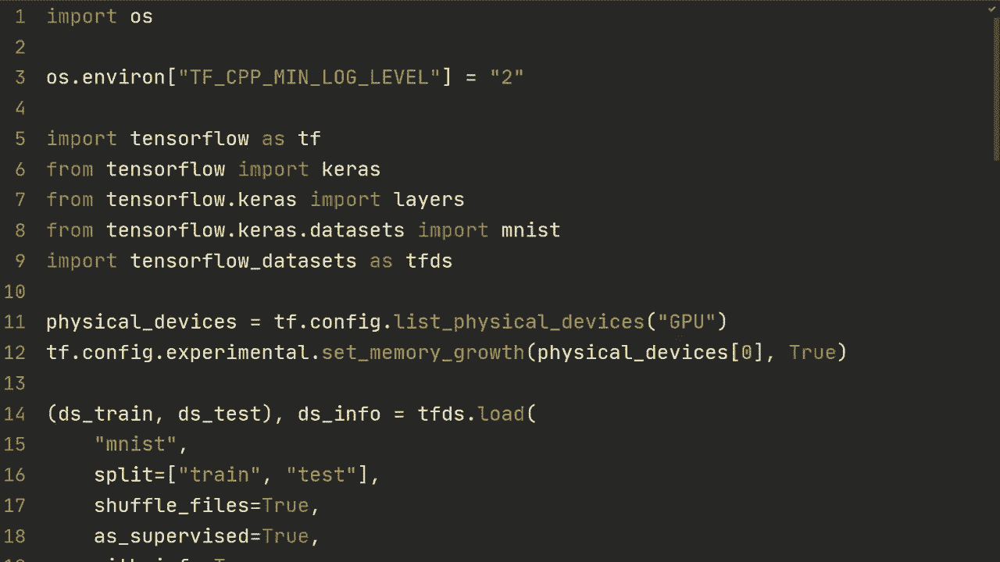
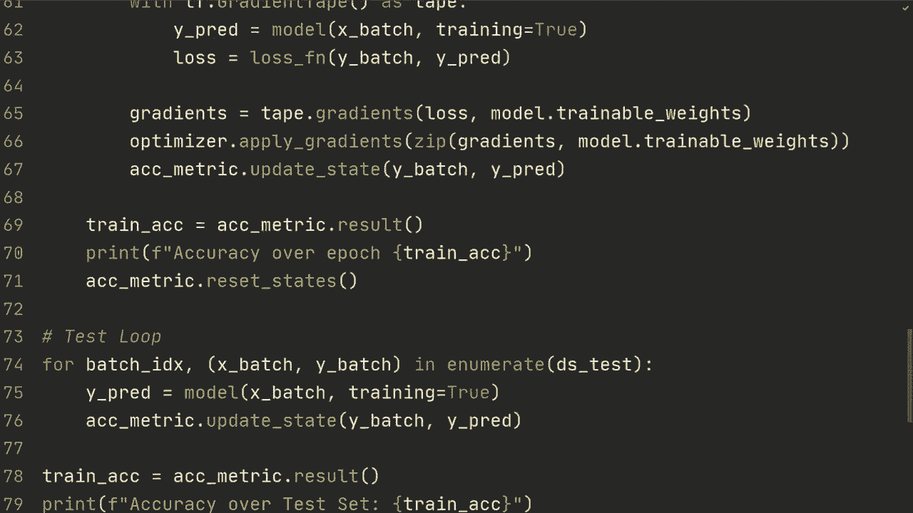
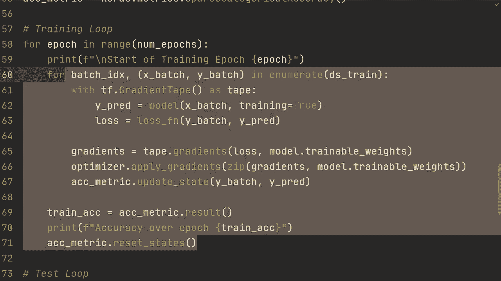
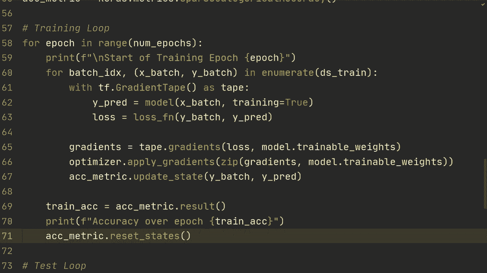

# “当前最好的 TensorFlow 教程！”，看完就能自己动手做项目啦！＜实战教程系列＞ - P16：L16- 自定义训练循环 - ShowMeAI - BV1em4y1U7ib

大家好，希望你们过得非常棒。在这个视频中，我将向你展示如何从零开始实现训练循环。

这意味着我们不再使用`model.fi`，而是完全从头开始自己做。如果你对编码和Pythtorch熟悉，那么这将更符合你训练网络的习惯。不过，让我们开始吧，在这个视频中，我们不会在训练内容和数据等方面做任何复杂的事情。

重点是向你展示它的整体结构。这里的启动代码只是一些你在之前视频中见过的基本导入。我们将使用`Tensorflowlow data sets`，所以如果你还没看过那个视频，可以在右上角找到。我们在这里加载`Ms data set`，所以我们有训练集和测试集，然后我们还有一个用于标准化图像的函数，这些都是从那个视频复制粘贴过来的，然后我们这里有一个非常非常简单的模型。

只需一个卷积层和一个全连接层，然后我们在这里添加全连接层，就像这样，然后我们就可以开始了。首先，我们需要一些指标，所以让我们设置准确率指标，这是`ks do metrics dot our`。

分类准确率。接下来，我们先进行训练循环。首先，我们将训练若干个周期。在这种情况下，我们将训练`epochs`为5。我们只需写`for epoch in range epochs`，或者我们可以称它为😔，`Num epoch`。

所以就在这里进行`nu epoch`。😔 然后我们可以打印。只需打印。换行，然后开始训练周期。接着，我们可以这样做：`epoch`。现在我们使用F字符串。接下来，我们将遍历训练中的所有批次。我们将使用`for batch index`然后`X batch comm a Y batch in enumerate AD train`。

好的，我们将进行若干个周期的训练。在这里，我们首先写`with Tf gradient tape`作为`tape`。这用于记录我们在前向传播中要进行的所有操作，以便后续进行模型权重的反向传播。我们将进行`Y prediction is model.X batch`，然后指定`training is true`。

然后我们将计算损失，使用我们在这里指定的损失函数。我们将输入`y batch`，真实标签，以及`y predictions`，就是我们刚刚通过前向传播计算得到的。好的，这样我们就有了那些在`tape`下的内容，然后我们可以计算梯度`our equal tape dot gradient`。

然后我们指定损失，然后是模型我们的可训练权重。所以我们基本上想要损失对可训练参数的梯度。然后或者说是可训练权重。然后我们将进行优化器。应用梯度。我们可以 zip 梯度，模型可训练权重。

然后我们将进行准确度指标 dot 更新状态。Y batch 和 Y 预测。这样我们就能了解那个 epoch 的准确度。到这里结束。我们将做训练准确度等于准确度指标的结果。然后我们可以打印，这样我们就可以处理 epoch 的准确度，然后。我们可以直接做。

训练准确度就是这样。然后我们可以重置准确度指标，以便它在下一个 epoch 时为零。所以 accuracysymmetric dot 重置状态。这就是训练循环的内容。这看起来非常类似于我们在上一个视频中讲解如何自定义模型的过程，只不过现在我们只是去掉了模型的拟合，而是为我们想训练的 epoch 数添加了一个循环。

然后我们想做的就是，我想。测试循环。这是用于训练的，然后我们将需要一个测试循环来评估我们的模型。我们不需要运行几个 epoch。我们可以只运行一次数据集。所以我们将做批次索引和 X batch。

Y batchge 列举 DSs 测试，我想现在我们并没有使用批次索引。但我的意思是，你可以。所以我想你也可以遍历 DSs 测试，没有必要做 enumerate。不过有时你会想要批次索引。无论如何。我们不需要使用梯度记录。我们不会收集梯度。因此，我们将在这个模型中做 y 预测，当 X batch 训练等于真时，然后 accuracysymmetric dot 更新。

状态 Y badge，然后 Y 预测。最后我们可以做训练准确度等于 accuracysymmetric dot 结果。对，就像我们在这里做的一样。然后我们可以，我想我们可以打印测试集的准确度。然后我们可以像这里一样写训练。最后，我们可以再次重置。虽然我们不必这样做，因为那是我们要做的最后一件事。不过无论如何。

如果你想要一个训练循环和测试循环，它看起来就是这样，当然你也可以。我是说，你可以把这个放在一个像 define train 的函数里。然后你可以，比如说，按范围的 epoch 只需调用那个函数。

训练1个周期，也许。然后运行它。所以你知道你可以思考一下你想如何构建这个结构。但是这就是训练循环的基本原理。这非常简单，我们以最简单的方式实现了它，当然，如果你在做一些更复杂的事情，比如生成对抗网络或GAN，那么它看起来会比这个复杂得多。

但基本方法仍然是相同的，我认为如果你理解了这个基本框架，那么在处理更复杂的事情时，这将帮助你理解它的整体结构。好的，首先我们应该运行这个并确保它能工作。但它没有。

所以它没有属性梯度。这是因为我们想要一个tap dot梯度。好的。正如我们所看到的，这很有道理，它正在训练并且有效。所以是的。无论如何，这就是本视频的内容，希望你觉得有用，如果你有任何问题，请在下面的评论区留言。我想我之前说过感谢观看，但谢谢你观看，希望在下一个视频中见到你。

