# “当前最好的 TensorFlow 教程！”，看完就能自己动手做项目啦！＜实战教程系列＞ - P18：L18- 图像的自定义数据集 - ShowMeAI - BV1em4y1U7ib

在这个视频中，我们将学习多种高效加载自定义图像数据集的方法。也许你已经在线抓取了这些数据，或者自己创建了它。因此，我将向你展示三种不同的方法，这些方法都是高效且良好的，但其中一种可能更方便，具体取决于你的数据集结构。

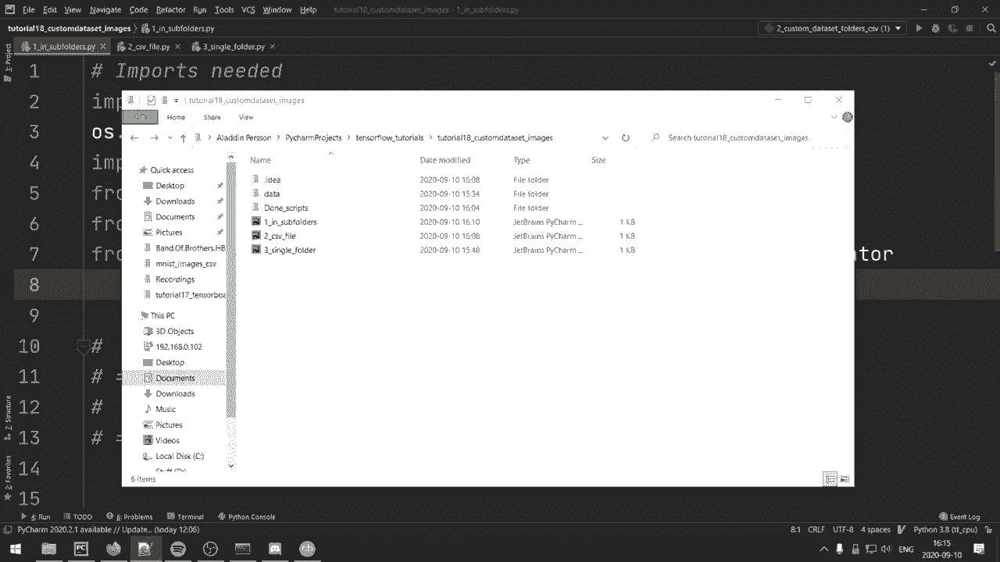

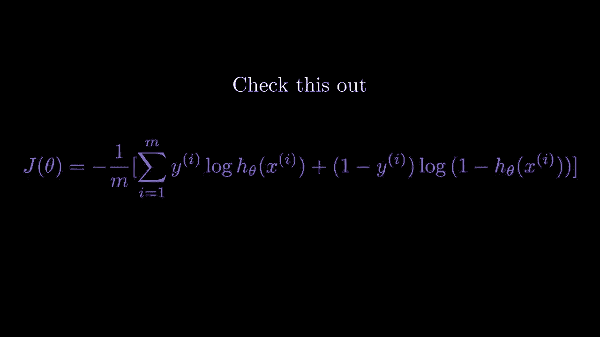

第一个方法是我们将图像放在不同的子文件夹中。通常我们会有一个好的老MNT，在这种情况下，我们有01到9的文件夹。如果你查看其中一个子文件夹，我们只有五张图像，但当然你可以想象有很多张。在这里，我们有所有与该类对应的图像，对于第九个文件夹，我们有数字9，当然在这种情况下，标签与类名完全相同，但你也可以想象其他情况，比如说猫和狗的数据集，那么你只需将0替换为猫，然后再为狗创建一个文件夹。在这种情况下，标签正好就是类名。因此，进入代码，这些是我们将使用的所有导入。

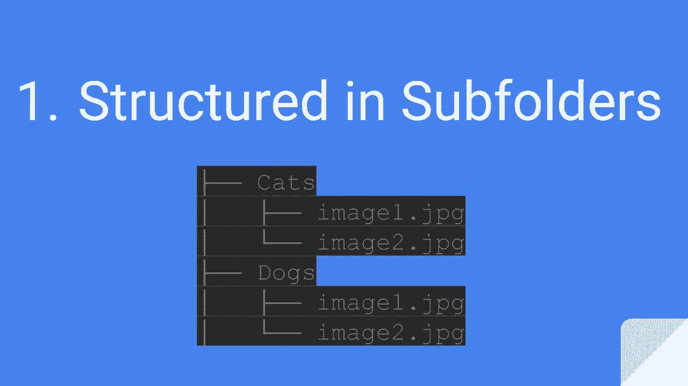

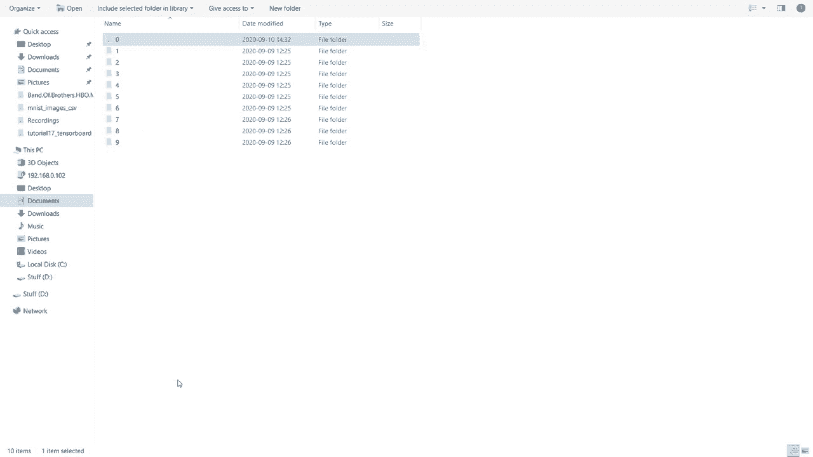

我将向你展示两种加载此数据的方法，因此我们先指定图像高度，图像高度将是28，图像宽度也将是28。然后我们设定批处理大小为2，因为我们只有这么少的示例。同时，我们还将创建一个非常简单的k序列模型，只是为了演示这能工作，并且我们可以对这个小数据集进行过拟合。现在让我们进入第一种方法。

我们将使用来自目录的数据集。因此，我们要做的是将Ds train作为Tf ks，处理这个图像。来自目录的数据集。首先，我们要指定图像所在的文件夹，或者说子文件夹的位置。在这个例子中，它位于data中，然后在Mist子文件夹下。

然后我们将进行标签推断。这意味着标签是根据子文件夹的结构按字母顺序推断的。接着我们将指定标签模式为整数。这里有不同的选项，但整数是最常见的选项，你也可以使用类别或二进制，这意味着这将是一个类别向量。所以基本上这会用于一热编码等等。

然后你还可以发送一些叫做类名的东西。所以在这种情况下我们的类名将是 0，1 到 3 等等，这样理解是对的。但假设我们在这里替换 1 和 0。这意味着索引 0 实际上代表数字 1。但是，当然，这会有点混淆。

所以让我们把那些改回去。然后我们可以指定颜色模式。在这种情况下。我们要指定灰度。你也可以在这里指定 RGB。然后你指定批量大小。假设是两个。我们有参数。是的，我们这里有批量大小等于。所以我们来做批量大小。将是两个。

然后我们可以做图像大小，将是图像高度和图像宽度。它会重新调整大小，如果不是这个尺寸。然后我们将设置 shuffle 等于 true，以便我们获得随机顺序。然后我们可以指定种子，如果你想要的话，这很重要。

假设你将其分为验证集和训练集，并且每次运行时希望得到完全相同的训练和验证集，那么设置种子是很重要的。然后我们也可以做类似验证拆分的事情。让我们将其设置为 0.1。

所以 10% 的图像将会在验证数据中。然后为了确保这是训练，我们可以指定子集等于训练。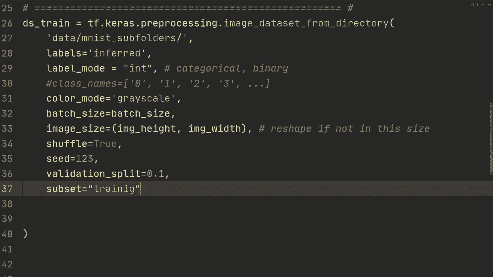

训练。😔 然后我们对验证所做的只是简单复制粘贴所有内容。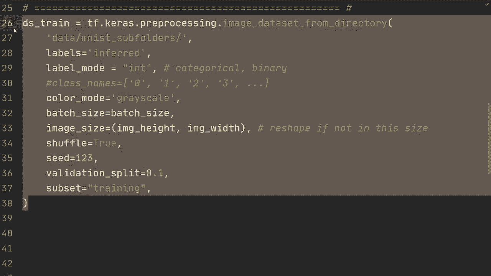

然后我们首先将名称更改为，比如说，D validation。然后在这里我们会将其拆分为验证，这样它将随机拆分为原始数据的 10% 的验证数据，存放在子文件夹中。

现在当我们使用来自目录的这个图像数据集时，它将会是一个 TensorFlow 数据集格式，现在我们知道该怎么做来自之前的视频。假设我们想做一些数据增强，那将是相当简单的。

我们将像在数据增强教程中那样做，给我一个简单的例子。我们会使用图像是 Tf 图像随机的 **亮度**，然后让我们传入 X。指定一些最大增量。然后我们会返回图像和 Y。所以这只是一个非常简单的数据增强。我们会做 DS S train 等于 D Strain.dot map 然后 augment。😔

然后假设你想要训练这个。你会在范围内进行四个时期，我不知道，10 或你选择的时期数。所以让我们明确一下。这是为自定义循环而做的。然后你会对 S train 中的 x 和 Y 进行操作。然后你会进行训练。但现在我们先不深入这个，但我们在之前的教程中已经讨论过了。

当然，如果你想要使用model.dot compile，那也是可以的。所以你只需要，让我复制一下，这样我们就不必在这上面花费不必要的时间。所以再一次，这些在之前的教程中都有介绍，但在这里我们用Adam优化器和稀疏分类交叉熵来编译模型，然后我们用model.fit进行10个周期的训练。假设我们只需运行这个，我们可以在这里看到它找到50个文件，然后使用其中45个进行训练，而验证使用其中5个。为了明确，这45个中没有任何一张图片会与这5个用于验证的图片相同，因此它们是独特的，我们没有在验证数据上进行训练。

好的，然后我们可以看到每110个框，我们有100%的训练准确率。这意味着我们对这45个训练样本过拟合。好的，这就是方法一。这个方法很好。然后对于方法二，我们将使用图像数据生成器，然后从目录中流式传输。我们首先要定义这个图像数据生成器。所以我们要做的是data_generator=ImageDataGenerator，我们在顶部导入了这个。

所以我们在这一行导入了这个。所以我们要做的是图像数据生成器，首先，我们将指定重缩放，并将其设置为1/255。我们这样做是为了确保它是浮点数。我们将通过255进行除法来标准化图像，然后我们可以在这个图像数据生成器中指定很多数据增强。

所以我们来举个例子，我们可以做旋转范围，并且你可以传入很多不同的参数。我会把文档部分放在屏幕上，让你可以看到，但实际上有很多，所以比我现在展示的要多。

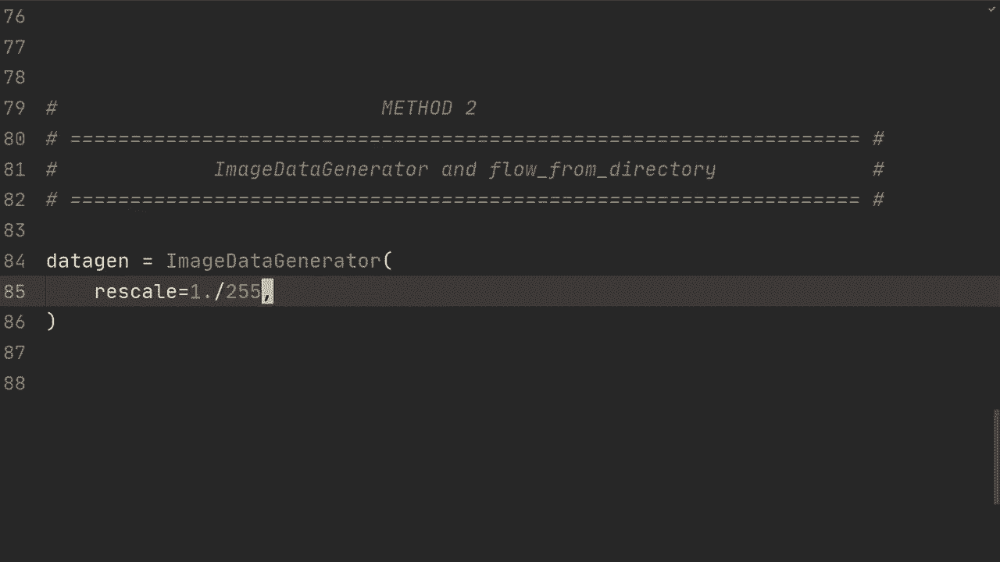

然后你可以做像缩放范围这样的操作，假设是0.99到0.99。这将意味着缩小1%，然后在这个范围内再缩小1%。但是这将是随机进行的。所以，我的意思是，这非常，非常少，让我们至少设定5%。然后我们可以进行水平翻转，并将其设置为false。

我们不想翻转数字，这会毁掉其中的一些。因此我们也可以进行垂直翻转。默认情况下，它们也是false。我只是展示一下你会怎么做。你可以指定更多内容，比如数据格式，我们可以设置通道为最后。这是TensorFlow希望的标准方式。

但是如果你愿意，你也可以先有通道。然后你也可以像我们之前那样指定验证拆分。不过我们现在就将这个设置为0。然后D类型将是TF float 32。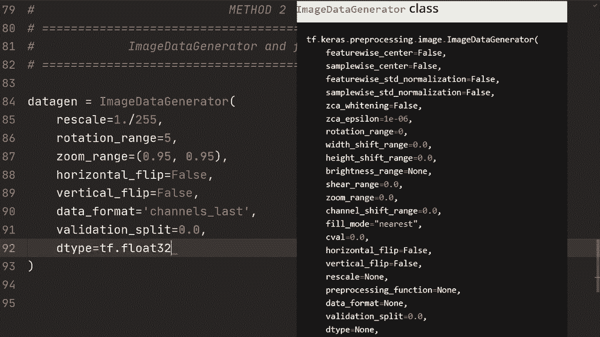

当我们有数据的图像数据生成器时，我们将构建这个训练生成器，因为到目前为止我们尚未为任何图像指定目录。所以现在我们只是指定了数据处理方式。因此我们所做的就是使用 datagen。通过目录流动。

所以我们通过目录从这个数据生成器流动，在这个图像数据生成器对象上。然后在这里我们指定数据，然后再指定子文件夹，然后是目标大小。我们将指定图像。图像高度，图像宽度。然后我们指定批大小。假设批大小为二，颜色模式为灰度。

但你也可以将其设置为RGB，类别模式将是稀疏的，这样做是因为我们希望它是一个表示那一个的整数。我们不想要独热编码。然后我们可以再次进行随机化，我们希望数据被随机化，然后我们可以做子集训练，在这种情况下，由于我们将验证分割设置为零。

这将是整个过程，但你可以像之前那样复制这个，然后指定验证生成器，然后在这里指定验证。所以如果你在这里使用验证数据，你将只需复制粘贴所有内容，然后指定子集为验证。假设你将它们放在不同的文件夹中，你将有一个训练文件夹和一个验证文件夹，你只需在这里更改文件夹，也许你不想进行数据增强，因此你还需要指定一个新的数据生成器。

但对，所以我们将指定 see，这在我们希望不同运行得到相同结果时很重要。然后，好的。这就是实际生成器的内容。让我给你展示一个示例。我们来做一个训练循环。让我们只是执行传递。

但在这里你可以指定一个训练步骤。然后我将首先向你展示自定义循环。这与我们之前看到的稍有不同。所以假设在我不知道的范围内，再做10次或者你选择的训练周期。我们需要在这里计算批次数。因此假设我们从0开始。

我们将执行4 x 和 y 在 D S 训练中。我们将通过增加批次数来迭代一次。现在我们已经处理了一个额外的批次。我们将步进一次。然后我们将进行训练。因此，我们将在这里调用训练，并且这在自定义循环教程中，如果你对此不熟悉的话。

然后我们要检查如果批数大于等于25。因此基本上如果等于25。我选择25的原因是因为那是我们的数据集长度，或者更具体地说，是我们的训练数据集长度除以批大小。所以如果是这种情况。那么我们现在已经遍历了整个数据集，我们需要中断。

我们需要中断的原因是因为我们有一个生成器对象，如果不中断它将永远运行。所以这是你如何指定自定义训练循环设置的方式。让我复制一下代码。节省一些时间。让我过一下，如果你要进行模型编译。是的，我们重新进行模型编译只是为了重置优化器状态。

然后我们将使用稀疏分类列度量准确率，这里没有什么奇怪的，然后当我们进行模型拟合时，我们将发送我们在这里构建的训练生成器，然后进行每个时期的步骤，与这里的步骤完全相同，如果批量数量为25。那么每个时期的步骤是25，verbose设置为2，这很正常。

如果我们有一个验证生成器，我们会将验证数据设置为等于该验证生成器。然后验证步骤将与每个时期的步骤类似，即验证集的长度除以批量大小。好的。这希望能为你提供两种不同方法的清晰视角，假设数据是以子文件夹的方式结构化的。

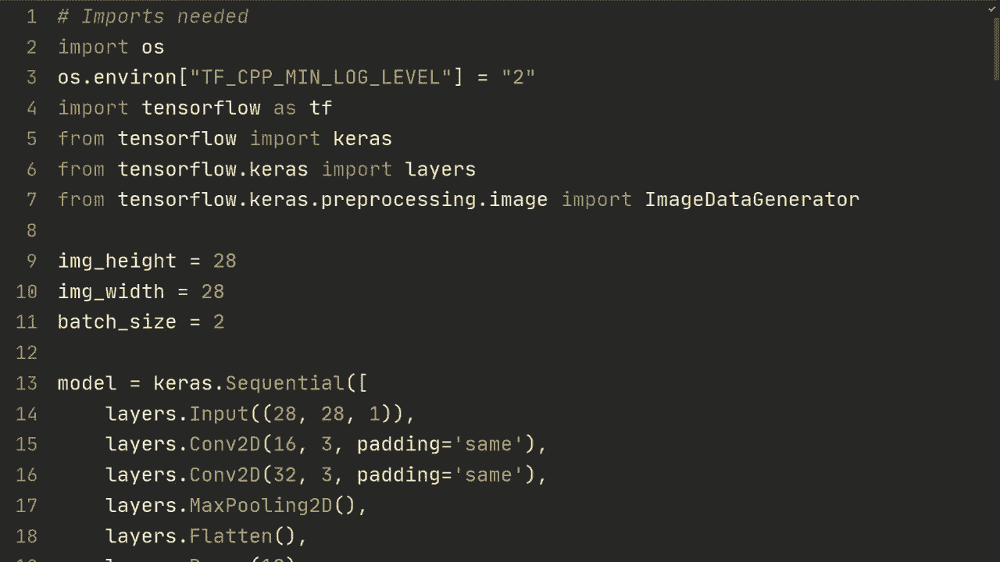

第二种你的数据集可能结构化的方式是，你将所有图像放在一个文件夹中，然后有一个对应的CSV文件，CSV文件告诉你文件名和标签。例如，在这种情况下，它说明0_1 JPEG是目标标签，所以数字是0。

标签是0，然后对文件夹中的所有图像都这样处理，并给出所有对应的标签。所以如果这是数据结构化的一种常见方式，那么我将告诉你该如何进行。接下来是代码，这些是我们将要使用的导入，我想这没有什么奇怪的。我们要做的第一件事是指定目录，哦我的天，目录是数据，然后是Mmunist images CSV，这就是我决定的名称。我们要做的第一件事是使用pandas读取CSV以创建数据框。

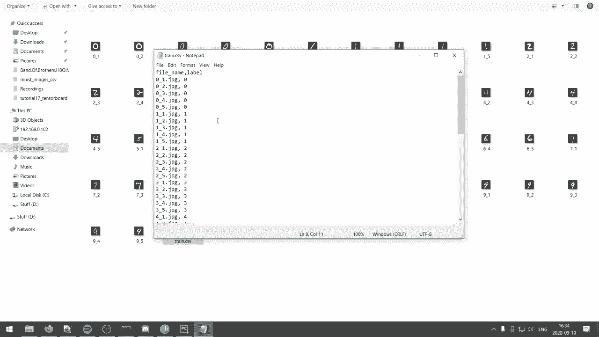

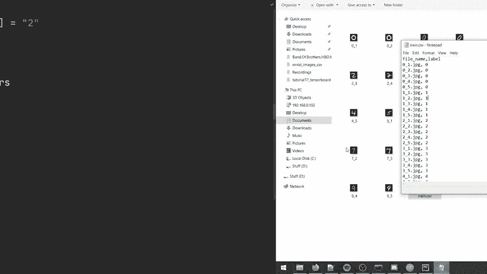

然后我们将使用pandas读取CSV文件。我们将指定目录，然后进行。然后我们将添加train.csv。现在我们有了CSV文件，我们可以处理文件路径。我们可以创建数据框，然后从该列中获取，记住我们称之为文件名的那一列。

然后我们可以处理这些值。这将给我们所有的正确结果，让我实际打印一下。这样会更清晰。我想。所以，像这样。哦，文件路径。好的，正如你所看到的，我们基本上得到了所有文件名的列表，在这种情况下，它们格式很好。你知道。

你在这里有标签，然后你有那个的索引。所以这是 digit0、digit0、digit1，依此类推。不过，不管怎样，我们有文件路径，我们可以获取标签。我们可以通过做几乎相同的事情来做到这一点，但我们做标签，然后我们做 dot values。现在我们有了文件路径和标签，而在这种情况下，标签将是整数。

然后我们做的是 Dtrain 是 Tf dot data do data set dot from tensor slices。好吧，所以我们做的是发送文件路径。然后是标签。好的，我们这样做是因为在这个列表中，第一个值将等于这个标签列表中第一个元素的标签。因此我们使用 from from tensor slices 将它们映射在一起，类似于你在 Python 中使用 zip。然后我们做一个读取图像的函数。

所以我们发送图像文件，也发送标签。我们首先做的是 TF do o do 读取文件。所以我们将从图像文件中读取那个文件。此外，我们需要先指定目录，然后添加图像文件。对吧。

我们正在读取那个文件，然后我们将做 TF dot image dot decode image。接下来我们将发送图像，通道设置为 1，因为我们有灰度图像。然后我们将 D type 设置为 Tf floatat 32，然后我们只返回图像和标签。为了说明，让我也给你展示一下，或者说不展示你将会。

你可以定义增强。如果你想要数据增强，你需要图像和标签。然后，我想这里是数据增强，但在这种情况下，我们只返回图像和标签，然后你会像之前一样做映射。所以 DSre dot map，我们会发送给读取图像，然后你知道的 dot map augment，然后我们可以进行两个的 dot batch。好的。因此，现在我们有了 Ds train。这就是加载数据的全部内容。

我只想给你展示如何为训练设置，它非常基本。我们将做 for poC 在 10 的范围内。然后我们将做 4 x 和 Y 在 DS S train。因此我们将在这里训练。在这种情况下，我们只会 pass。让我们做打印。现在，让我们只做 pass。好的。那么让我复制一下，给你展示它是如何工作的。

这里我们有与之前看到的相同的模型，简单模型。然后我们有 model compile。接下来是 model fit。所有这些在之前的视频中应该非常熟悉。然后如果我们运行它，我们可以看到我们很快就过拟合了，因为图像太少了。但这正是我们所期待的。这就是方法。

希望这能给你一个很好的方法，展示如何做到这一点。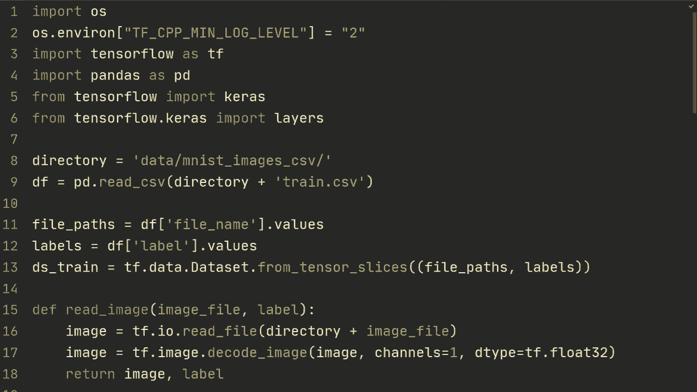

好的，第三种方式是如果你将所有图像放在一个单独的文件夹中。因此在这种情况下，我们没有CSV文件，只是将所有文件放在一个文件夹中，但我们假设这里有某种良好的格式，以便我们可以通过文件名解释该图像的标签。因此在这种情况下，正如我们之前所说，首位数字代表图像的类别，第二个值只是索引，因此我们实际上可以仅通过文件名进行处理。

我们可以解释该图像的标签应该是什么。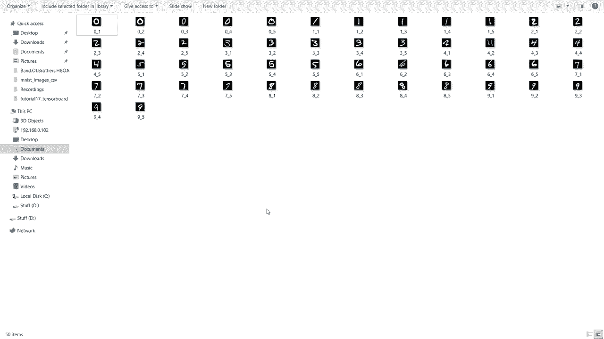

所以进入代码，这些是我们将要使用的输入，我们还将使用`Pathlib`。它在标准库中，我将在稍后给你展示我们将用它做什么。因此，让我们开始指定，我想，我们将批大小设置为2，然后图像高度为28，图像宽度为28。接下来我们将指定目录。

也就是数据，并且仅限于EMNIST图像。因此首先，要创建TensorFlow数据集，我们将执行`Ds_train = TF.data.Dataset.list_files`。然后我们将执行一个字符串，在这里我们将指定使用`pathlib`。所以不深入探讨，我们使用`pathlib`是因为这是`list_files`希望的默认目录格式。

所以我们将使用`pathlib.Path`，然后获取目录。接着加上`.jpeg`，好的。所以它基本上会找到该目录中以`.jpeg`结尾的所有文件。好的，那么你接下来要做的是定义一个处理函数。

给定文件路径，我们需要处理图像，就像我们在之前的文件中看到的那样。因此，我们将定义处理路径。我们会发送文件包。然后我们将使用`TFIO.read_file`读取文件路径中的图像。接着我们会进行`TF.image.decode_jpeg`，然后通道设置为1。然后，标签将取决于图像的文件格式。

所以这对于每种场景都是不同的，我只是给你展示一种方法。因此这里的标签是`TF.strings`，我们将执行`TF.strings.split`，我们将使用文件路径，然后指定分割。所以在这种情况下，我们是按路径分隔符分割的，我认为它被称为，然后在我们的情况下。

也许我可以这样做。因此对于`x`和`y`在`S_train`中，我可以执行`Y.print`。`Y.TF.strings.split`。而且或者说，我们只是有一个文件路径，所以文件路径。我们将通过这个来分割文件路径。你将看到它的样子。通过这种方式，我认为你可以更容易地跟随我所采用的逻辑。所以这里我们有数据。

仅限于emmin图像。然后我们有这个。当然，这里是关于文件的重要信息。那么我们要做的是取这个列表的第二个索引。我们将取这部分。在我们的情况下，这取决于您的数据集，但在我们的情况下，我们可以直接取这个并将其转换为数字。

那么我们如何做到这一点呢？让我们看看，我们可以做label是`Tfstrs.substr`，从label位置零开始，长度为一。如果您的类名称长度不一，您可以再次分割，例如，如果您有像猫这样的东西。

狗，马之类的，如果这两者的长度不同，您需要以某种方式进行分割。但这只是处理字符串的方式。然后label，我们可以使用`TF strings do2 number`，传入label，并且我们也可以指定输出类型为TF in 64。所以在这种情况下，我们有处理过的图像和标签。那么我们要做的是`DSstrain`是`DSstrainin`。

映射。然后我们只需做一个处理路径。接着我们会进行批处理并传入批量大小。好的，我将再次复制模型，确保它能正常工作。因此，我们有，您知道的，之前的简单模型。我们模型编译与之前相似，模型拟合，并传入`D S train`。

所以让我们运行一下，确保它能正常工作。哦，对了。这里我们还需要取`index2`。所以让我们重新运行一下。好的，我们看到在tiny buck之后，我们将获得100%的训练准确率。非常感谢您观看这个视频，这里介绍了三种加载自定义图像数据集的方法，希望您觉得这个视频有用，期待在下个视频中见到您。

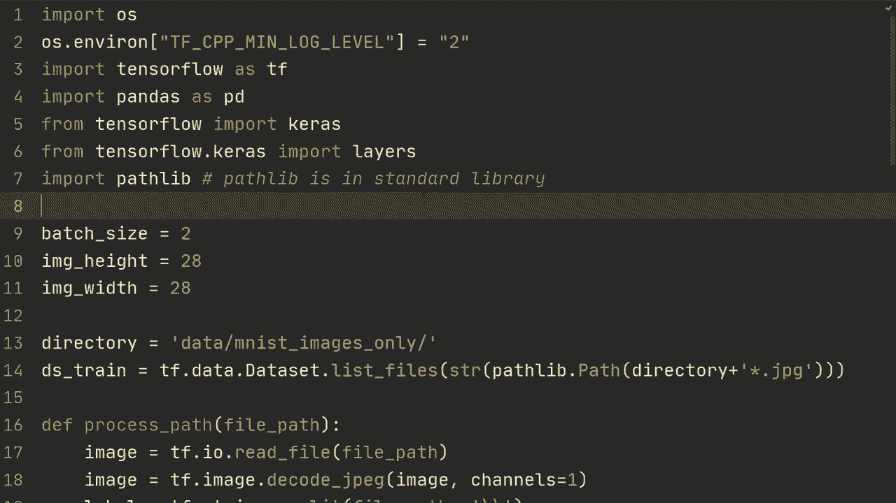

