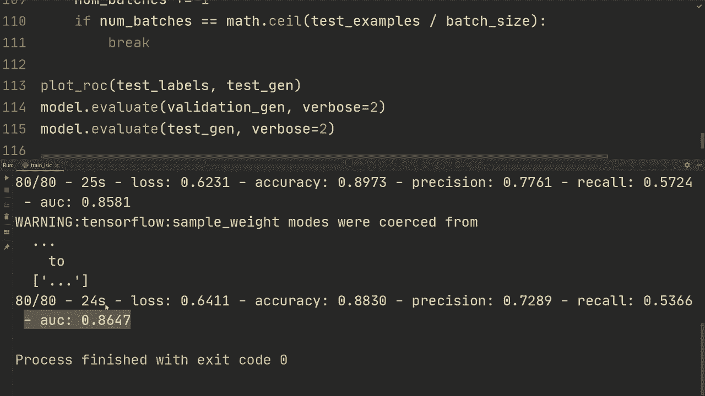

# “当前最好的 TensorFlow 教程！”，看完就能自己动手做项目啦！＜实战教程系列＞ - P20：L20- 皮肤癌分类项目 - ShowMeAI - BV1em4y1U7ib

🎼欢迎来到本系列教程的最后一部视频。在这个视频中，我想通过一个项目示例，这也是这些教程开始时的目标，即我们构建一个扎实的 Tensorflow 基础，以便自信地开始自己的项目。在这个项目中，我们希望建立一个网络，可以分类皮肤病变的图像是良性还是恶性。

这意味着它们是无害的，或者如果它们是恶性的，那实际上就是癌症。因此，像任何项目一样，我们在过程中可能会遇到一些问题，我们将看到如何解决这些问题。

所有项目中的第一件事是获取一些数据，经过一些谷歌搜索，我发现了一个名为 IIic 数据集的数据集。让我给你展示一下如何下载它。我们将搜索 IIac 训练数据。我们只需打开这个链接，它也会在视频描述中。

我们要做的就是输入我们的电子邮件地址，完成后，我们将获得带有输入的训练数据，格式为 JPEG 图像，并且还有一个 CSV 文件，记录了皮肤病变所在的年龄、性别和位置。

还有如果实际病变是恶性或良性的标注。然后我们有测试数据，所以我们有 25000 张这样的图像，还有一个包含 8200 张图像的测试数据集，但正如你所看到的，它们没有真实标签，这是因为这个 IsIic 实际上是一个挑战。IsIac 挑战是，他们在这 8200 张图像上能获得什么样的准确率？因此在这个视频中。

我们会稍微改变一下方法。我们将选择这 25000 张图像，将其分成测试集、训练集和验证集。然后我们将看看能获得什么准确率。因此，在实际挑战中，由于我们会有更多的数据，我们可能会获得更好的性能，但我认为这就是。

这已经足够好了，你知道，我们有很多图像。因此，要下载它们，我们只需按下这三个按钮。在这种情况下，你知道，由于我们有很多图像，实际上是 10GB，下载会花一些时间。所以在下载后，我们会得到这三个文件，并且我们会得到一个包含所有图像的文件夹，然后还有两个 CSV 文件。

所以我们有真实值。看起来是这样的。我们有图像，图像的文件名，然后第一列是它是否是恶性的。所以0代表良性，1代表恶性。然后他们还对实际情况有不同的类别。是什么类型的皮肤病变，但我们会简化一下，实际上我们只关心这两个。

所以我们关心的只是皮肤病变是否实际上是癌症，而不是它是什么类型的皮肤病变。然后在这里我们有训练元数据。所以如果我们打开它，我们得到文件名，然后我们得到那个人的年龄以及它的位置，性别我们在这个视频中也将进一步简化，我们将完全忽略这个文件，所以我们只会获取图像，而不包含关于年龄的额外信息。

但是如果你想提高准确性，我只能想象拥有这些信息会使模型更好。因此，我只是编辑了文件名，然后将文件夹更改为图像，然后我们有标签，再加上我们可以移除的额外信息，因为我们不会使用这些。因此，首先我们现在需要做的是创建一个训练集。

一个测试集和一个验证集，因此我们需要编写一些处理脚本，可以将这些图像放在一个文件夹中，然后你可以用不同的方式来做，但我的想法是把它们放在一个例如训练文件夹中，然后在这个训练文件夹中，我们创建两个额外的文件夹，一个用于良性，另一个用于恶性。

然后我们将所有良性文件放入这个文件夹中用于训练集，而所有恶性文件放入那个文件夹中，然后我们可以使用图像数据生成器，正如我们在之前的教程中所见，以加载这个自定义图像数据集，所以让我删除这个文件夹，我们将创建一个为我们完成所有这些的脚本。

好的，这些是我们将要使用的所有导入。我们将调用这个过程为数据处理。因此首先，我们要做的一件事是设置一个种子。我们将其设置为1，以便在多次运行脚本时获得完全相同的拆分。

然后我们将对这个种子进行随机种子处理。接着我们将指定图像的目录。因此我们要做的目录是。我称之为存放图像文件夹和所有那些东西的文件夹。因此在Isaac中，在那个文件夹中会有一个图像文件夹。我们还将指定训练集，这将会是。

我们将把它放入数据的一个文件夹中，并且它将位于训练的子文件夹中。然后我们将获取测试数据，并将进行数据测试。然后我们还会有一个验证集。所以我们将把它放入数据验证中。如果这些文件夹不存在，我们需要创建它们。

所以我们将使用 OS 创建目录。我们将创建训练文件夹，然后添加良性，并且我们将再做一个。用于训练的恶性文件夹。然后我们复制粘贴这个，并且我们将为训练和验证做这个。我更倾向于测试集，然后是验证。所以测试。测试。😔，然后验证。验证，好的。

现在我们应该在数据文件夹中放置所有需要的文件夹，并且在这些文件夹内，我们有三个子文件夹：训练、测试和验证，并且在这些文件夹内，我们还有两个额外的文件夹：良性和恶性。我们现在要做的一件事是统计我们要放入每个文件夹的示例数量，因此我们将测试示例。

等于训练示例，等于验证示例，所有的初始化为零。然后我们要在打开的环境中执行四行操作，我们将读取那个 CSV 文件的标签。CSV 文件包含它是否实际上是恶性的或良性的。接下来我们要读取这些行。我们将从第一行之后一直读取到最后一行，因为我们不想要第一行。

第一行只是关于列的信息。然后我们将分割这一行。我们正在进行行的分割，并且会按逗号分割，因为这是 CSV 文件。它是以逗号分隔的。我们将获取图像文件，它将是分割行的第一个索引。如果它是良性还是恶性。

这将是分割行的索引 1。好的，所以现在当我们实际进行分割时，我们需要决定测试集应该有多少示例，验证集应该有多少示例。在这种情况下，我将把 80% 放在训练上，把 10% 放在验证上，然后将剩余的 10% 放在测试集上。

所以我们将获取一些随机数，并将进行随机选择，这将是 0 到 1 之间的均匀随机数。然后我们将检查这个随机数是否小于 0.8，如果是，那么我们将设置位置为训练。并且我们将训练示例加 1。或者如果随机数小于 0.9。

好的，它将转到磁盘。首先，如果它小于 0.8，那么我们将检查它是否小于 0.9，这实际上意味着如果它在 0.8 和 0.9 之间。然后我们将其设置为验证。并且我们将迭代验证示例加 1。否则。

它将介于0.9和1之间。然后我们只是将位置设置为测试集。是的，然后我们将以每次1的方式迭代测试示例。好的。现在我们将做的是如果良性或恶性的浮动整数，我们得这样做，因为这里是0.0，所以我们得先转换为浮动，然后是整数。我尝试仅使用整数，但没有成功。

然后，如果这是零，我们将使用chatill.copy。所以我并不打算实际移动文件，如果有任何错误。我只是将它们复制，然后如果这个可行，你可以删除文件。所以我们将处理Isaac图像，然后加上图像文件再加上.JPEG。

这是图像的文件格式。然后我们将其移动到位置。加上bin9，加上图像文件，然后是.JPEG。好的，所以我们是从这个位置移动到这个位置，而这个位置依赖于这个随机数。

所以它要么在训练测试中，要么在验证中。好的。那么另一个场景是，如果你可以在这里使用Els。我要使用Elsif整数的良性恶性等于一。然后我们将进行左侧复制。我们可以直接复制粘贴这个。

这里将基本上和它一样，只是它不会是良性，而是恶性。最后，我们可以打印。可以用F字符串显示训练示例的数量，因为我们已经计算过了，对吧？

我们可以这样处理训练示例。然后我们可以复制，粘贴，并为验证和测试集做同样的事情。所以我们可以设置测试示例的数量，验证示例的数量也会相应。好的。希望这个脚本现在可以工作，我将运行它，看看我们得到什么，好的。

现在，如果我打开那个文件夹，我们会看到这里有一个名为数据的文件夹。然后在里面我们有所有的拆分。因此对于测试集，我们有良性或恶性，然后我们有属于那个文件夹的所有文件。

好的，现在我们实际上处理了数据。现在我们可以继续这个训练脚本。

首先，我已经复制了所有导入，以免浪费时间。我们在之前的视频中都用过它们，但如果你没有，可以当然安装它们。好的，首先，让我们看看我们有所有的示例。所以我将首先写出这些。训练示例是20225。

我们有测试示例是2551，然后是验证示例。我们使用2555。接着，我们将指定图像高度，这将是图像宽度，我们将其设置为224。因此，我认为其中一些实际上可能超过1000像素，甚至更大。

因此，我们将把所有图像调整为224乘224，这是相当标准的像素高度和宽度。然后我们将指定批处理大小，我们将指定为32。接着我们需要一个实际的模型。你在这里有很多选择。你可以使用Resnet，使用Inceptionnet，或者许多不同的Efficient nets。

我会使用一个有点奇怪的模型。我会使用一个叫做Nonet nacenet的模型。我不太确定如何发音。不过，我之前没听说过这个模型。有时候尝试新东西是很有趣的，我不认为这是最好的选择。我认为你可以使用Efficient net，它会更好。好吧。

加载模型的方式是model equals kos dot sequential。我们现在将创建整个模型。所以我们将使用Tensorflow hub，正如我们之前看到的，我们将使用hub dot k layer。我将复制粘贴这个链接，如果我们从这个URL获取它，我会在视频描述中粘贴这个链接。

这样可以获得特征向量，然后我们将使用逗号并设置trainable equals true，所以我们也会训练这个。接着我们将执行layers flatten，其实这并不是必须的。我认为它已经是扁平化的，是的，我们可以删除这一行，然后我们将执行layers dense one，并且我们将激活函数设置为sigmoid。这是因为我们只有两个类。好吧。

通常你可能会使用这个预训练的模型，然后可以添加一些层。在这种情况下，我们将用这个预训练模型训练整个模型，并且我们只会有一个单一的全连接层。所以，你知道，我并不是在构建最大的模型，这个Nasnet其实也不大。但它会很好地用于演示，你知道，我们仍然会获得不错的性能。

然后我们将进行训练数据生成器，我们将指定图像数据生成器。正如我们在之前的视频中看到的，我们将首先将比例调整为1除以255。我们将设置旋转范围来指定数据增强，假设为15度。你也可以在这里做得更多，以获得更多的数据增强。

但15似乎是一个不错的值，然后缩放范围我们将设置为0.95到0.95，这意味着它将随机缩小5度，然后放大5度，我们将指定水平翻转为真，垂直翻转也为真，因为无论你如何旋转或翻转图像，如果它是癌细胞，翻转后仍然是癌细胞，这与图像数字6或9的情况并不相同。

但在这种情况下是可行的。所以我们将数据格式设为通道最后。我们将进行验证拆分，但实际上并不进行验证拆分。因此我们将数据类型设为TF flow 32。然后我们将进行验证数据生成器，并且我们将使用图像数据生成器。顺便说一下，为什么这里不使用验证拆分是因为如果我们这样做的话。

然后所有这些数据增强也将应用于验证集，这并不是我们想要的，我们希望验证集与测试集相似，而测试集将没有任何数据增强。所以这里我们只将重缩放为1/55。然后我们将进行TF flow 32。然后我们将对测试数据生成器做同样的操作。

图像数据生成器的重缩放为1除以255，然后数据类型为TF flow 32。好的，现在我们有数据生成器来指定如何加载图像，并且实际上并没有指定我们在获得带数据增强的图像时应该做什么。

然后我们将进行train generator是train.data generator do flow from directory。这里我们指定数据训练，也就是文件夹对吧。然后目标大小将等于图像高度，图像宽度。如果不是指数则将进行重缩放。然后我们将批量大小设为批量大小。

颜色模式将为RGB，我认为默认也是RGB。然后我们将类模式设为二进制。然后shuffle设为true。然后我们也将设置一个Cd。好的，所以让我们复制这个，我们也将用于验证和测试集。

所以复制粘贴。然后我们将进行验证生成器，它将是验证数据生成器。然后我们只需将其更改为验证，但其余部分应完全相同。然后是测试生成器，测试数据生成器。然后我们将这里更改为测试。好的，现在我们拥有所有这些。

然后我们将进行model.dot compile。我们将指定编译。我们将指定优化器，并使用Kaas optimizers.dot at。我们将学习率设置为3e-4。我们将损失设为binary cross entropy。然后从Loit等于false。

然后指标在这种情况下只是准确性。好的，我还想说几句关于我们如何加载数据的事。在这种情况下，我们使用的是图像数据生成器。但如果你看过我关于图像的自定义数据集，我展示了两种方法，如果按这种方式结构化，我认为将其转换为TensorFlow数据集并进行数据增强会更有效。

如果你想提高性能，以及这个程序运行和加载数据的速度，我认为这样做会更快。但我觉得这样稍微方便一些，所以我在这里使用它，但请知道你绝对可以提高它的性能。你能改善它的原因是你可以并行加载数据，并且可以进行预取等操作。

好的，现在我们有了模型，我们将进行模型拟合，我们将发送训练生成器，我们将周期设置为，我不知道，先设置为1。然后我们将进行每个周期的步骤，我们将进行训练示例。

按批次大小进行整除。然后我们要进行验证数据。验证生成器。验证步骤是验证示例。按批次大小进行划分。好的，那我们就先从这里开始，并确保它能够运行。我们会很快改进这个。好的，所以我实际上要在这里停止训练。

它只运行了15个批次，但我们得到了准确率，已经是77%。好的，如果你没有考虑过这一点，那么什么是好的准确率呢？通常如果是两个类，那就是50%，超过50%就比单纯猜测要好。因此，这意味着在仅仅15个批次后，这是一个非常好的模型。

如果你使用的是像Mist这样的工具，类是平衡的，那样是可以的，但在这种情况下，我们的数据非常不平衡。你知道，可能不到1%或1%的案例实际上是恶性的，而绝大多数，即99%是良性案例。所以在这种情况下，准确性将是一个非常有缺陷的指标。这是你在做项目时可能遇到的问题的一个例子。

最初只考虑使用准确性。嗯。我们很快意识到这是一个缺陷。

好的，接下来我们要引入一些新指标，我将链接到Andrew Ug的两场讲座，他在讲解为什么在我们有偏斜类的情况下不能使用这些指标，以及我们可以做些什么，比如使用精确度和召回率。它们将在描述中，我建议你观看，这将让我们接下来的内容更加清晰。

所以我们将引入这些新度量。我们将执行metrics等于Keras.metrics。我们仍然可以使用二进制准确率。我们将设置name等于准确率。我们仍会使用它，但这并不是特别重要。我们可以删除这个，因为它并没有告诉我们太多信息。

然后我们可以使用精度，并将其命名为精度。然后我们可以使用Keras度量召回率。召回率是另一个度量，我不确定他在那两个视频中是否有提到Keras度量AU。我建议你谷歌一下这些是什么。

我不会深入探讨，这会是另一个视频。所以我只专注于如何在这个视频中使用它们。然后我们在这里设置这个度量标准。我们将要设置度量标准。所有。现在我们有了这些改进的度量标准。嗯。最后。

我们可以在验证生成器上评估你的模型。假设verbose等于2，那么我们也做这个。然后可能我们还想在测试生成器上进行评估。实际上我有一个我训练过的模型，我想我训练了大约50个周期。

所以我将加载那个模型以节省一些时间，我们将执行model等于Kras models加载模型Isaac model，它在那个目录里。所以你知道这里就是我使用的确切模型，我只是训练了更长时间，我们将把它用作我们的预训练的一部分或其他什么。

所以我们可以将这个epoch保持为一。否则，我们将不得不训练大约50个周期。然后我们将在验证生成器和测试生成器上进行评估。我还将向你展示如何绘制ROC曲线，因为将会有一个。

ROC曲线将预测真阳性率与假阳性率之间的关系。因此这两者之间会存在权衡。我们将绘制一条曲线来确切地看到这种权衡是如何进行的。所以我要定义绘制ROC。我们将发送标签和一些数据。

然后我们将执行predictions等于model.predict在那个数据上。接着我们将计算假阳性率和真阳性率。我们将从SK学习的ROC曲线中获取，所需的仅是发送这些标签和那些标签的预测。然后我们将执行PLT.plot，假阳性率乘以100来获得百分比，真阳性率作为Y轴。

在这种情况下，x轴标签将是假阳性。y轴标签将是真阳性。同样，以百分比表示。然后我们只需执行PLT.show。我们需要在这里发送实际标签，但我们只有一个生成器。因此，我们将执行测试标签这个空的Numpy数组。

我们将批次数量设为0，然后我们将迭代测试生成器。因此在测试生成器中，测试标签将是NP数据和测试标签2，然后我们将Y附加到测试标签上。因此，我们必须迭代，批次数量加1。如果批次数量。

数学上，这是测试样本的总数除以批量大小。因此这只是将测试集中的所有示例整合成一个数组。然后我们将中断。好的。因此现在我们有测试标签，然后有数据。那么我们可以做什么呢？

我们可以绘制测试标签的R O C曲线，然后我们正在处理测试生成器。这将在图上给我们那个R O C曲线。因此，不仅在这里获得所有指标，我们还将在最后得到一个漂亮的图。我想我评论了那个模型。是的。

所以我们在这里加载这个模型。但当然，如果你想的话，可以稍微训练一下。然后你只需保存那个模型。因此我们将使用这个来保存，以确保不丢失到目前为止的模型，我们要去这个指标，并且我们要做的不等于。等等，确实是在fit中。是的，我们要去这里。回调等于ks.Dot callbacks。

模型检查点。我们将指定给以撒模型。这将每个周期保存当前模型。现在运行这个，希望一切正常。好的，因此我们从该训练周期获得所有值，正如你所见，我们已经训练了很多，且在训练数据上过拟合了。

这意味着我们可能需要引入更多的正则化。但我们也得到了验证准确率、验证精确度等等。然后我们还得到了这个图，长得像这样。这里有一点，正如你所看到的，我们的验证A U大约是86%。这意味着这是该曲线下的面积。

这是一种常见的指标，通常人们会使用。因此在测试集上运行并评估，我们可以看到我们得到了约6073%的精确度。因此，实际上这意味着如果你去看医生，而他有70%的精确度。这意味着如果他说你有癌症，他在73%的情况下是正确的。然后是召回率。

这意味着如果你去他的办公室，而你有癌症。他在54%的情况下会告诉你你实际上有癌症。然后在这种情况下的A U C，这是一种汇总指标，大约是87%在测试集上。

好的，值得注意的是，这也是一个奖金为$30,000的挑战。这正是我们刚才看到的数据集，只不过他们使用的是训练数据，然后在提交模型时。

它是在这个未知的测试数据上进行测试的。因此我们可以在这里看到排行榜。他们在这里的分数，而这里的分数实际上是我们为AUC计算的分数，这个分数是接收操作特征曲线下的面积，这正是TensorFlow计算的。那么我们得到了什么呢？

我们得到了0分，约87分，而他们得到了95分。因此，正如你所看到的，他们的模型要好得多。我还想说，这些结果不一定可比，因为我们没有使用相同的测试集，并且我们并没有在完全相同的数据上进行训练。实际上，我们只是在他们训练的子集上进行训练，因为他们可能使用了整个训练数据。不过，看到这种情况并进行比较，至少作为我们模型好坏的一个近似是非常有趣的，但我们离获胜还有很大距离。

0000，但也许你可以训练一个更大的模型，可能你可以做一些数据增强，或许你可以将准确率提高到90%以上，或者类似的水平。所以这就是本视频的内容，希望你能够跟上这个项目示例。我也希望你从这些TensorFlow教程中学到了很多，并且你觉得自己现在准备好开始做自己的项目，并在TensorFlow中创建东西。

非常感谢你观看这个视频和这些教程视频。我希望在未来的另一个TensorFlow教程中再见到你。
