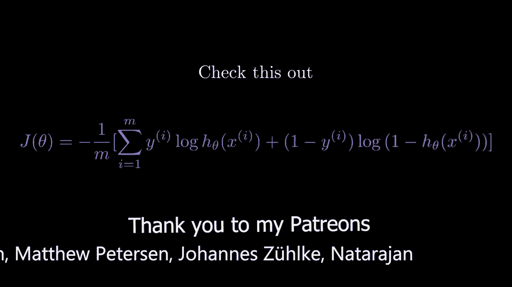
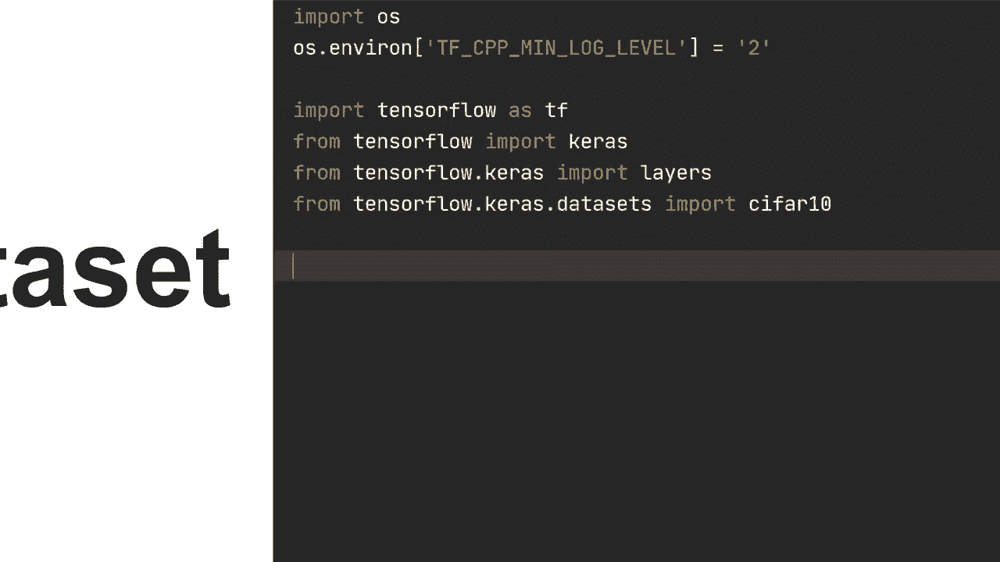
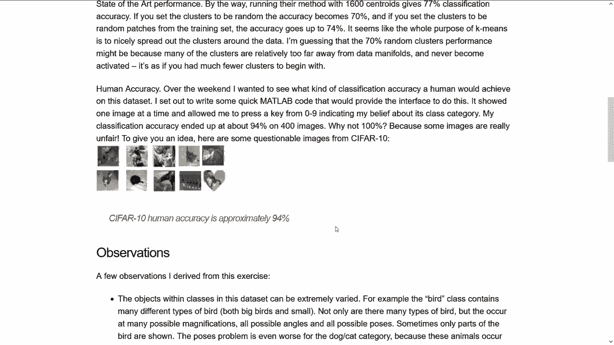
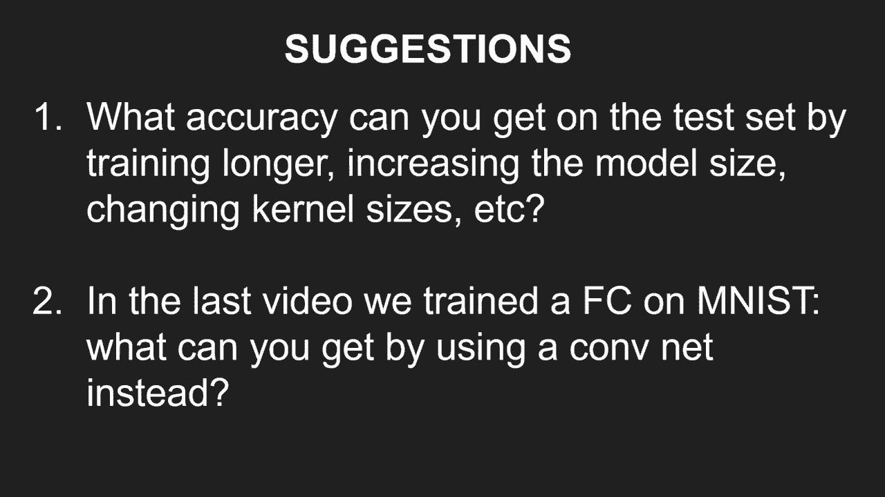

# “当前最好的 TensorFlow 教程！”，看完就能自己动手做项目啦！＜实战教程系列＞ - P4：L4- 具有顺序和功能 API 的卷积神经网络 

欢迎回来，大家希望你们一切都好。在这个视频中，我们将继续并构建一个卷积神经网络，和往常一样，视频描述中有资源链接，可以进一步了解本视频的概念。所以话不多说。

让我们开始吧。我们首先导入 OS，然后我们将使用 OS dot environment 设置 Tf CPP Min log level，这只是为了忽略 Tensorflow 的一些信息消息，这些消息可能会让人有点烦。接着，我们将导入 Tensorflow，使用 Tf。从 Tensorflow 导入 ks。

从 Tensorflow dot ks 导入 layers，然后从 Tensorflow dot Cars 导入数据集。我们将导入 Cypher 10。所以在这个视频中，我们将看看 Cypher 10 数据集，它基本上是来自 10 个不同类别（如飞机）的更多自然图像。

汽车、手机、鸟、卡车等等。图像如下。

我们有 50,000 张训练图像，10,000 张测试图像，总共 60,000 张，每张图像是 32 x 32 像素，所以它们相对较小，而且是 RGB 彩色的，因此它们有三个通道。我发现了 Andrea Kpathy 的一篇很有趣的博客文章，他实际上自己在 Cypher 10 上进行了训练，并得出结论，看看 Cypher 10 的人类水平准确率约为 94%，如果你查看最近在 Cypher 10 上训练的模型，它们的性能超越了这一点，因此更近期的模型在这个数据集上远远超过人类的表现。

现在我将复制两行代码，你可能并不需要它们，但如果你在 GPU 上运行并遇到任何问题，那么这两行可能会帮助你。好的，回到我们在这个视频中实际想做的事情。

我们首先想要加载 Cypher 10 数据集，这与我们在上一个视频中加载 MNIS 的方法非常相似。所以我们将执行 x train、Y train、X test、Y test，然后调用 Cypher 10 dot load data。我们再次希望将其转换为 F 32，因为在 F 64 中计算效率不高，属于不必要的计算。

我们可以做的是将 xtrain 赋值为 xtrain 的类型，然后为 float 32，然后为了归一化，我们还可以将其除以 255，使像素值在 0 和 1 之间。同样对于 X test，我们可以将 x test 赋值为 x test 的类型 float 32。

然后我们只需除以255。好的。所以对于我们的实际模型，让我们从一个顺序模型开始，然后我们将构建并使其更高级一点。我们将执行model = K.as.Sequential，并指定输入形状。由于我们正在使用卷积神经网络，我们不会在开始时进行重塑。

这意味着我们将保持高度为32，宽度为32，并且有三个RGB通道，所以这就是每个图像的输入形状。接下来我们将执行layers.co2d，我不太确定，32个输出通道是第一个。这里的第一个参数是我们希望这个卷积层输出多少个通道，所以一开始我们有三个通道，我们希望输出为32。接着我们将指定卷积核大小，我们将其设置为3，如果在这里设置一个整数，它将扩展为高度和宽度相同的卷积核大小，所以本质上是更简洁地写出这个。

然后我们可以指定填充方式，在这里你可以选择有效或相同，因此有效是默认的。那么发生的情况是，这些像素值。如果我们使用相同的卷积，那么它们将被保持，因此在这一层之后，它们仍将是32像素的高度和32像素的宽度。

但是如果我们使用有效的填充，那么这将根据我们的卷积核大小而变化。在这种情况下，它们实际上将变成30乘30像素。所以这本质上只是一个超参数，你可以随意调整。我会将其设置为有效，虽然这样做没有意义，因为这是默认参数。

然后我们可以设置激活函数，类似于我们为神经网络所做的设置为RE。接着进行最大池化到D。在这里我们可以指定池大小，假设为2乘2，这样输入就会减半。例如，如果我们在这里使用有效卷积，那么结果将是30乘30，当然你可以打印模型摘要来实际查看这些变化。

也许我们真的可以这样做，所以让我们打印模型摘要。让我们看看。正如我们现在所看到的，第一次过后，将是30乘30，然后我们有32个通道，最大池化后，输入大小像素将是15乘15。接着我们可以再添加几层，所以层数是D。

假设有64个输出通道，内核大小为3。然后我们再次使用有效的填充和激活函数。嗯。再进行一次最大池化。然后，我们将有128个通道，我们只需将其翻倍，再加上3，激活函数为相对。然后对于我们的实际输出，我们将进行层展平，假设有一个中间层，因此我们将在这个全连接层中有64个节点，激活函数为相对，最后我们只需进行密集层，有10个输出节点。

这就是我们的实际模型。然后我们将编译我们的模型。因此，编译模型时指定损失函数为CAs，该损失函数是稀疏的分类交叉熵，与我们在上个视频中使用的相同，因为我们的输出没有softmax激活。然后假设优化器使用Adam，因此我们还需要设置学习率。

设置为3e-4，然后指标保持跟踪准确率。好的。这就是我们模型的编译，现在实际上训练模型。让我们进行模型拟合x_train，y_train，批大小假设为264。然后运行10个周期，设置verbose等于2，这样每个周期后会打印输出，以便你不会看到进度条。

但是它将在每个训练周期打印有关训练的信息。训练后，让我们在测试集上评估模型。然后同样，设置批大小相同，没有周期，因为我们只会运行一次，verbose等于2。好的，让我们运行这个，希望一切正常。

那么，让我们在这里打印模型摘要。然后我们可以检查一下。😔 好吧，所以我们开始训练了。在这里我们可以看到模型的大部分参数。总参数数量为1225,000。

这实际上是一个非常非常小的网络，因此我们并不期待得到非常非常高的准确率，而只是为了说明如何构建卷积层，然后使用最大池化等等。我相信 AlexNet，这是第一个真正革命性地改变计算机视觉的卷积神经网络，大约有6000万个参数，所以让我们来看看225,000究竟有多小。

好的，让我们看看训练是否完成，然后再打印模型摘要。好的，所以我们去掉那个。😔 然后看看我们得到了什么，最后训练准确率为72%，测试准确率为68%。现在你可以看到我们有很大的提升空间。如果你训练更久，可能会得到更好的准确率，但我们并不太关注这个。接下来我们将看看如何使用函数式API构建功能，并构建一个非常相似的卷积神经网络，但我们会添加一些更高级的内容。

让我们做一个函数。首先定义我的模型。然后在里面，让我们设定输入为`Kas input`，形状为32，32，3。接下来，让我们设定`x`等于`layers.com2d`，使用32个通道，卷积核大小为3。然后我们将输入传入该层。

我们将使用批归一化，视频描述中会有相关信息。如果你不熟悉批归一化，我们将初始化它，然后将`x`传入。你可能注意到这里没有使用激活函数，这是因为如果我们使用批归一化，我们希望先通过卷积层，然后再通过批归一化，最后通过激活函数。我们可以这样实现。

激活函数是`x`的`re`。对了，让我们添加一些最大池化。实际上我们不需要指定池化大小，所以让我们看看，是的，我在这里做到了。但我们实际上不需要在这时指定池化大小为2乘2，这是默认参数。

当然，你可以更改为你想要的任何东西，只是2乘2是你最常用的。所以我们先做最大池化，然后通过这个进行处理，再创建另一个层。让我们做`layers.column2d` 64，我不知道。

让我们设定卷积核大小为5，填充为相同，然后做一个`Another batch norm`，也就是批归一化，作用于`x`。然后是激活函数`activations.relu`，作用于`x`。在这之后，让我们再来一次，设置`layers.com2d` 128，3，然后是`x`。然后是另一个批归一化，作用于`x`的激活。

然后我们将通过一个全连接层。所以我们将使用`layers.dense`，64个节点，激活函数为`re`。输出将是`layers.dense`的10个节点，作用于`x`。然后为了创建我们的模型，我们将设定`model = Cas model`，接着需要指定输入和输出。

这将根据这些内容创建模型。因此，我们将输出和输入分别等于输入和输出。然后我们将返回我们的模型，对吧？所以现在这是我们的模型，看起来与之前的模型非常相似，只是我们添加了批量归一化。我们可以做的是用 `my_model` 来表示模型，然后可以使用与顺序模型相同的编译、拟合和评估方法，所以现在让我们来运行它。

好的，我们出现了一个错误。让我们看看问题出在哪里。好的，我想我知道问题所在，我们需要在中间添加一个扁平化层，因为当我们通过全连接层时，形状将不匹配。因此，我们将使用 `layers.Flatten()`，然后对X进行处理，希望这次可以正常工作。好的，我们可以看到的一件事是，在使用这些批量归一化后，经过10个训练周期，训练速度明显加快。我记得之前的训练准确率为72%，现在几乎达到了93%。

尽管测试集的准确率并没有显著提高，我认为实际上有所下降。这显然是模型对训练数据过拟合的迹象。因此，当模型过拟合时，我们需要以不同的方式使用正则化。实际上，我们将在下一个视频中查看如何改善这个问题，以使这两个结果的差距缩小一些，而不是如此之大。

这里有几个建议，可以尝试对代码进行修改，以获取更多的经验。首先是检查你在测试集上可以获得怎样的准确率，通过延长训练时间或增加模型大小，可能还可以通过改变内核大小、调整填充等方式来尝试。第二点是在上一段视频中，我们在Eminist上训练了一个全连接神经网络，使用COvnet处理该数据集会得到怎样的结果。不过不管怎样，在这个视频中你看到的是如何使用顺序和功能API来训练一个基本的神经网络。如果你有任何问题，请在下面的评论中留言。非常感谢你观看这个视频，希望在下一个视频中见到你。

