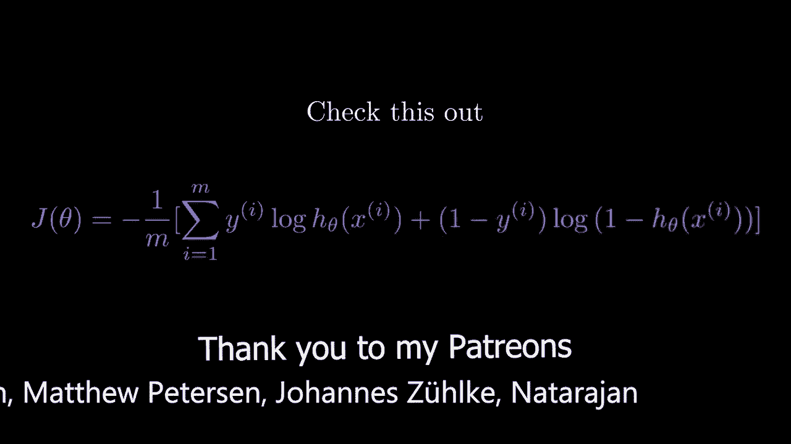
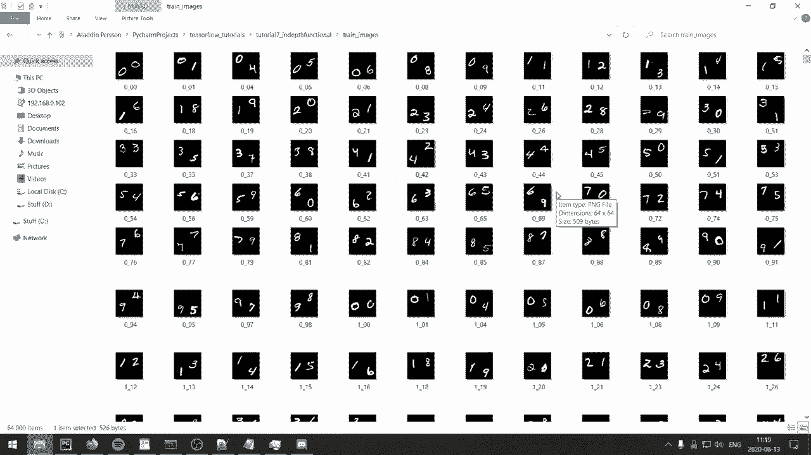
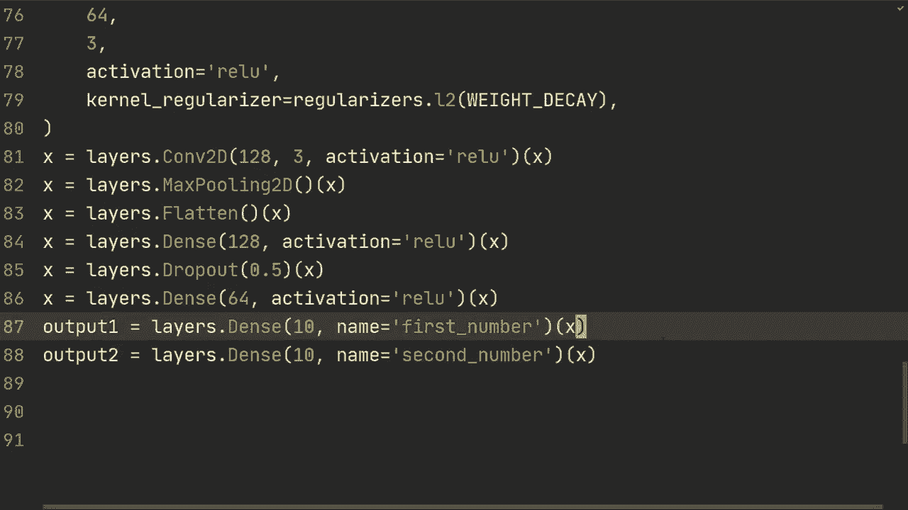
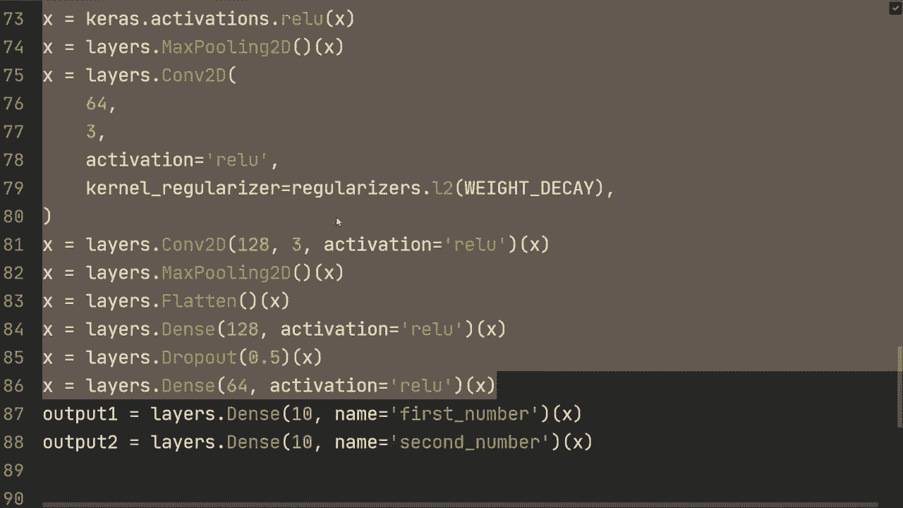
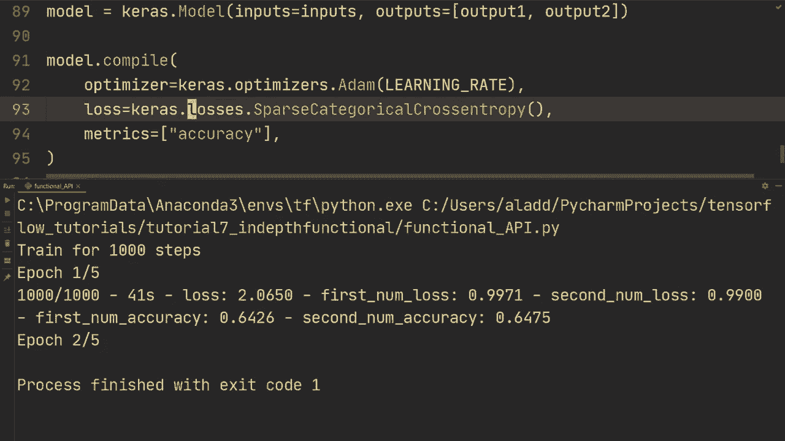

# “当前最好的 TensorFlow 教程！”，看完就能自己动手做项目啦！＜实战教程系列＞ - P7：L7- 函数式 API 的更深入示例 - ShowMeAI - BV1em4y1U7ib

大家好，希望你们过得不错，欢迎回来参加另一个TensorFlow教程。我有点愧疚，因为到目前为止，我们一直在使用顺序和函数式API，但实际上我提供的示例并不需要使用函数式API，所以我想给你一个更真实的例子，在这个例子中你确实不能只使用顺序API。我们再来看一下MNIST，但稍微有些不同，我们现在每个示例有两个数字，例如这里有数字零和一。

我会在描述中提供一个链接，以便你可以下载这些内容，以便你也能跟着视频一起学习。不过，我们现在不会专注于自定义数据。因此，实际数据的加载将在未来的单独视频中进行。现在我只是想给你一个更实际的例子，说明函数式API如何变得有用。所以让我们开始代码，这里是我们一直在使用的基本导入，还有一个是pandas，这将用于加载数据集，你可以使用Conda安装pandas，我相信这样你就会得到这个。因此，正如我所说，我们不会专注于实际的数据加载部分，意味着我将在这里复制粘贴一些东西，我不喜欢复制粘贴，但我们不会在这个视频中关注那部分，所以在描述中也会有一个链接，你可以复制粘贴这段代码。

我将粘贴代码，基本上这是用于加载实际数据的代码。所以我们使用pandas从CSV文件读取数据，然后使用Tf数据，再次强调，我将在另一个视频中详细讲解如何加载数据。所以我想重点关注的是，现在每个示例有两个目标值，这意味着我们不能使用顺序模型，因为顺序模型只能将一个输入映射到一个输出，但现在我们实际上有两个输出，所以我们要构建一个模型，记住我们必须现在使用函数式API，所以我们将从Keras开始。

输入形状我们将指定为64乘64像素，并且它们只有一个通道，因为它们是灰度图像，然后我们将使用一个2D卷积层，假设过滤器数量为32，我们将指定当前值。

假设大小为3，为了简单起见。然后是的。我想我们可以设置相同的填充，然后我们还要进行正则化。所以让我们回到顶部，我还想指定一些超参数。让我们来设置超参数。并且指定批处理大小。

我们做64，然后指定权重衰减为0.001。关于我们两部视频前所做的L2归一化，我相信。然后我们指定学习率为0.001。好了，现在我们回到模型。我们将做卷积正则化器。我将T cart。实际上，我们可以。

我们还可以导入这一点。所以我们来做层。输入正则项。然后，返回。😔。然后正则化器点L2，再加上权重衰减。好的。然后我们得到一组输入。现在我们来做一个批量层。所以层批量归一化X。到目前为止，没什么新鲜事，对吧，我们之前都做过这些。

而且没什么不同，但我只是想给你一个更深入的示例，实际上你会使用这个。所以区别在于我们得到输出时。但无论如何。然后让我们做Keras的激活函数为relu，然后再做一个卷积到。嗯，我不知道，假设64，3，然后卷积正则化器等于正则化L2的权重衰减。

然后我们也将输入X传入。再一次。我们将做一个批量归一化，传入x，然后Keras激活为relu。对x做一个最大池化。嗯。我不知道。我们再做一个卷积层。卷积到。让我们指定64和3。然后做relu。所以这里没有池化，然后是卷积正则化器。

Keras只是正则化L2的权重。好的。然后。是的，我们可以再做一层，所以到D 128的过滤器，现在我们将其加倍，激活为Relu，然后传入x。然后我们可以做一次最大池化，然后。让我们扁平化。现在我们来得到输出。我们要做的是做一个全连接层。

所以层是128个节点。让我们设置激活函数为值，然后发送下一个。并且。我们还要添加一些正则化，所以我们来做层丢弃0.5，然后传入X。然后。是的，我们实际上可以再做一层，所以我们来做层64，激活等于X的值。现在我们得到实际的输出。我们现在要做的是什么。

我们来做输出1，并做一个全连接层。你将做10个节点，然后。我们给它一个名字。让它成为我们的第一个数字。然后我们将传入x，再做输出2。我们将做层10，名字为第二个数字。然后我们将传入x。所以如你所见，我们使用输入X映射到两个不同的输出，对吧，这实际上会给出两个不同的分支，这就是功能API变得有用的时候，对吧，就这两行，因为我们使用顺序模型是不错的。

这非常简单，非常紧凑，但它不能像这样做事情。这就是当我们实际上必须使用功能时，它是如此狭窄，你也可以将它们结合起来。例如，你可以在顺序模型中这样做，然后你可以在功能模型上做这两个。所以你也可以结合这两者。但无论如何。

我只是想说这只是为了两个输出，然后我要做模型。

模型关心的是模型输入等于输入输出现在是一个列表，我们将进行输出1。输出2。当我们执行模型时。😔，编译。我们将设置优化器。让我们使用Adam优化器。然后在这里设置学习率。接着我们将指定损失。而损失实际上将是两个损失。

所以我们将进行损失，稀疏。我们将使用稀疏分类交叉熵。并且从large，它等于true。或者实际上，这次我们去掉它。这样做。我们可以在这里指定激活等于softmax。就这样。这样我们就不需要从Loit做了。所以激活是softmax。

然后我们将进行一个损失函数。我想有一种方法可以让这个更紧凑。我实际上还没有尝试过，但我认为如果你只是指定这个，那将对两者都适用。但你可以试试看。所以安全的方式就是将它们全部写上。因此我们将使用稀疏的分类交叉熵。

对于两者。然后我们想跟踪指标等于。准确性。现在和往常一样，我们将在这种情况下执行模型训练。我们只需传入训练数据和批量大小，所有内容都在数据加载部分内部处理，而我还没有再次覆盖。但我们不太关心这个，然后让我们做5个epoch，两个都等于2，然后模型进行评估。

在测试数据集上进行评估。然后verbose等于2。是的。所以让我们运行这个，看看当我们在这个多位数的Mist上训练时，如果不出错我们会得到什么样的准确性。所以我们。Cars没有属性。😔，激活，所以我相信我们得做激活。让我们找出那个错误，看看。激活。回去。😔，来了激活。

所以激活就在这里。希望没有其他地方。会有更多。好的，所以我可能忘记在这里发送它。😔，还有其他错误吗，让我们看看。我找不到更多错误，所以我们再运行一次。好的，输出一次是输出一次。是的，我们可以做输出。所以我称之为输出。就这样。现在，请工作。得到了。

没有为第一个提供数据。数字。好的，所以经过很长时间，我想我找到了错误。错误是没有为第一个数字提供数据。每个键在第一个数字和第二个数字中都有数据。好的，令人惊讶的是。我不知道为什么，但如果我只是去掉。这样说第一和第二。

然后如果我重新运行它，它实际上开始训练而没有错误。实际上我不知道这是为什么。如果你知道，请评论，因为我对此非常惊讶。这可能是我遇到的最奇怪的错误之一。在五个完整的训练周期后，我们在训练集上对这两个数字几乎都达到了96.3%。有趣的是，当它开始识别其中一个数字时，它也开始识别另一个数字，因此它们几乎是同等水平地提高。如果你继续训练，我猜它们会有相当大的提升，但在测试集上又如何呢。

我们得到了大约90%，但是在第二个值上只得到了83，所以我猜在测试集上可能更难识别第二个数字。不过，我还想检查的一个事情是，如果我们去掉，然后只用一个损失函数，那如果能扩展到两个函数就好了，所以我们来试试看，这似乎是有效的。好了，这就是本视频的内容，感谢你的观看。

看看Fun API的一个更实际的例子，非常感谢你观看这个视频，希望在下一个视频中再见到你。
