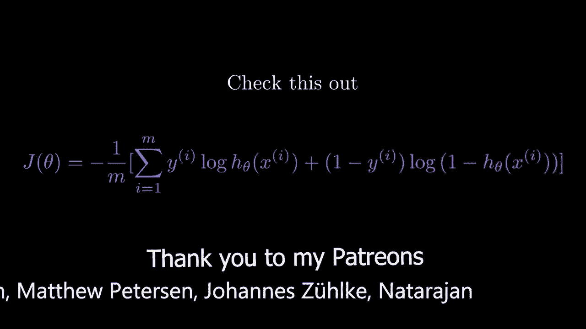
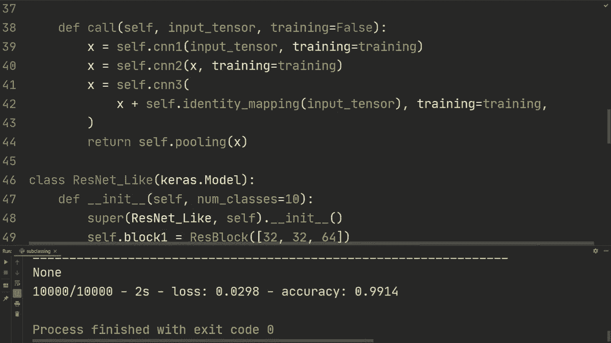

# “当前最好的 TensorFlow 教程！”，看完就能自己动手做项目啦！＜实战教程系列＞ - P8：L8- 使用 Keras 进行模型子类化 

大家好！希望你们一切都好，欢迎回来观看这个视频。我们将迈出构建模型的下一步，学习模型子类化。这是一种极其灵活的构建模型的方法。到目前为止，我们接触到了顺序 API，它的灵活性很小，但使用起来非常方便；我们也看到了功能性 API 的例子，它在构建模型时提供了更多的灵活性。在这个视频中，我们将使用子类化，这是最灵活的方法。所以我会复制所有的导入和其他内容，我们之前都见过这些，确保不浪费太多时间。导入 OS 和忽略 TensorFlow 的信息消息，使用 Keras 的层来构建我们的模型。这两行代码将帮助你解决在 GPU 上运行时遇到的问题，然后这三行代码将加载数据集。

我们正在加载 MNIST 数据集，然后在这里进行形状调整。我们只是在这里调整形状，以添加通道数量的维度，然后将其转换为 F32，并通过 255 进行归一化。好吧，这些都是你之前见过的内容。现在我们想要做的是，首先激励一下我们要做的事情：我们已经看到了一个卷积网络的例子，并将其映射到批量归一化，然后再运行。这个结构我们已经使用了多次，假设你需要写这段代码 10 次，那将会写出很多代码。所以我们实际上可以为这种块创建一个类。让我们来做这个，定义类 CNN 块。

我们将从层继承，这将跟踪所有进行反向传播等操作的内容。然后，我们创建一个初始化函数，指定输出通道的数量，以及内核大小。如果你熟悉 PyTorch，子类化的使用与创建 PyTorch 模型是完全一样的。

首先我们创建我们的初始化函数，了解如何构建这个模块，并使用 super 来运行父类层。然后我们将做 CNNM 块的初始化，并创建我们的组合层。因此，Seph.co 是 layers.Com2D，我们将指定输出通道和内核大小。

然后我们让填充保持不变。然后对于批归一化，我们将只做 layers.batch.normalization。然后我们将只做调用方法。所以我们将做调用输入张量，然后我们将指定训练。我们将其默认设置为训练，默认值为 false。

所以我们在这里指定训练，因为我们使用了批归一化。批归一化的工作方式在训练模式和评估模式下是不同的，但无论如何。我们有一个调用方法在这里。调用方法，如果你熟悉 Pytorch，本质上就是前向方法。但无论如何。

所以我们正在初始化要使用的模块，这里是 comm 2 D 和批归一化。然后在调用方法中，我们接受一些输入张量，并将其通过这些层运行。因此，我们将做 x 等于 self.com 的输入张量，然后我们将做 self.baor 的 x。

然后我们将指定训练等于训练，然后我们将做 x 等于 Tf.nn.Relu.Of x。所以我们正在进行批归一化的 ReLU，然后我们将返回 X。这就是我们在这里看到的结构。虽然现在我们可以多次从这个类中重用它。例如，我们可以做一些类似的事情。我们的模型是 Kra.dot.sequential。

然后我们要做 CNN 块，假设我们有 32 个输出通道。CNN 块 64 个输出通道。CNN 块 128，然后层展平。然后层1s 10 个节点。好的，如果你在这里写这段代码，仅仅为了这个块，它将是多行。三行，对吧，它将是批归一化、ReLU 和其他的，这会非常麻烦，会占用不必要的空间，并且不那么简洁。所以这是我们可以做到的一种方式，我们也可以现在指定，所以我们可以做 model.compile。

我们可以做优化器等于 ks.do.optimize.do.atom，我们可以做损失等于 ks.losses.spars.Pateorical.cross.entropy，然后从逻辑上讲等于 true。指标，我们将使用准确率作为指标。然后我们可以做 model.fit。在我们的 x train，y train。批大小，64 轮次。我不知道，3。然后详细程度等于 2，然后让我们也做 model.evaluate x test，y test。

批大小为64，两个都等于2。然后我们运行它。所以经过3个块后，我们在训练集上获得99%的准确率，在测试集上为98.75%。创造这些块并调用这些方法的惊人之处在于，它感觉非常像Pytors，如果你习惯了，但如果你习惯于Nmpy，它又像是在使用Nmpy。我听说这有点像面向对象的Nmpy，我同意，因为这感觉非常直观，我们可以做诸如打印X.dot shape的事情，每次调用时，它将打印出此时x的形状，而这个CNN块根据通道运行多次，第一次是32，然后是64，再到128，然后再次运行，因此是32，6428，这使得调试变得非常简单。

这样做可以让你在任何你想打印的地方打印形状。不过，让我们现在做一些更复杂的东西，或者说一个更大的模型。我们要创建一个名为Resblock的类，所以我们将构建一些类似于Resnet的东西，并希望在这个视频结束时，你能够从这样的角度看待：如果我们使用功能性或顺序API重建一些类似的内容，或许你会觉得这非常好。

非常困难或占用很多空间，并不像我们在这个视频中那样紧凑。因此，如果你不熟悉Resnet，可以观看描述中的视频，以便更熟悉。我们不会重建Resnet，而是做一些类似于Resnet的事情。所以我们再次进行层叠层。

然后我们将进行初始化。接下来，让我们设置通道。好的，所以我们来做一个res block。首先，我们需要调用super init。然后假设这个res block将包含三个我们创建的CNN块。因此，我们可以在这里传递通道，假设它的默认值。

我不知道，32，6428，类似这样的。然后我们将做一些。其实，让我们不初始化它们。假设我们有通道。它将是一个包含三个值的列表。我们将创建三个CNN块。所以让我们做self CNNN 1是CNN块，然后我们将使用通道，通道0和卷积核大小3。

而且我们实际上不需要指定这一点。所以记住，我们在这里使用关键字参数，并将其设置为3，因此可以保持这样，然后是self.dot CNN N 2。我们将做另一个块，使用通道1。然后self CNN3，我们将进行CNN块，通道2。接下来我们可以做一些类似池化的操作。

Layers.dot max oing 2 d。😔，然后所以。我们将运行三个这样的块，每个块都是一个CNN，一个batchor，然后是Relu，接着我们将运行一个最大池化，以保持输入尺寸的高度和宽度。然后我们将使用一个身份映射，类似于Resnets，配合这些跳跃连接。因此我们要做的是进行身份映射，以确保它具有相同的通道数量。

所以记住，我们不改变，因此我们使用相同的卷积，所以高度和宽度不会改变。但通道可能会改变。因此我们需要进行身份映射，我们将设置层来D。我们只是指定通道为1。然后我们将做卷积核大小为3。添加保持相同。然后对于调用，如果这一点有些。

现在这感觉不是很清楚，不用担心，我会再解释一遍。但我们将使用冷静的方法，我们将使用一个输入张量，并将训练默认设置为false。然后我们将做x等于self。CNNnn1，我们将把输入张量传递通过第一个CNNn块。接着，我们将训练等于训练。我们将对x的CNN 2进行处理。

然后再次指定训练。然后我们将其通过最后一个，好的。对于这个，我们将做x，但我们也会添加这个身份映射。我们将做input.tensot，然后我们将指定训练等于训练。因此我们在这里所做的是使用这些跳跃连接。

但对于这个，它已经通过CNNnn2并将原始的通道数量更改为通过这个列表传入的通道数量。因此，这个整数通道的index1，所以这就是我们要做的，将其通过CNN块运行，然后匹配通道数量，以便我们实际可以进行这个加法。

我们首先将输入张量通过身份映射，然后将其添加到x。好的，所以在编辑这个时，我实际上发现这里有个错误。因此，对于身份映射，我们使用卷积核大小为3，这不应该是这样，然后我们实际上在做一个comp层，但我们只是想做一个身份映射。

改变输出的通道数量。所以在这里你需要做的就是将这个卷积核大小改为1，这样唯一的作用就是进行身份映射并改变通道的数量。然后在最后。

我们先进行X的池化，然后返回结果。因此返回self的X池化。好的。到目前为止，我们已经进行了，去掉那个。我们不会再使用它。因此到目前为止，我们已经完成了CNNM块。我们完成了这个res块。接下来让我们做最后的模型，对吗？所以我们要做的是class resnet。

我们称之为共振，现在对于父方法，我们将使用ks做模型。好的，这适用于层。我们将使用层，层的意思是我们不会把它作为最终模型，因此当我们从ks模型继承时，它具有层的功能，但也有一些额外的功能。例如，我们有内置的训练评估，以便可以在模型中使用我们熟悉的`do fit`和`model evaluate`。

所以这些在从ks做模型继承时是可用的，但如果你只做层，则不可用。此外，你还有其他属性，可以例如检查模型中的所有层、模型摘要，并且你也可以做序列化，然后保存你的模型，虽然我们将在另一个视频中讨论这个。

只需知道CAs模型具有层所没有的额外功能。你应该在最终模型上使用CAs模型，希望这能让你明白。那么我们要做的就是在这里定义它，并在这里指定类别的数量，比如说10。

然后我们首先，看看我们将调用Resnet的super。然后，self。然后，初始化。接着self.block1将是res块。我们看看。这是你可以尝试的内容，比如说32、32、64。然后block 2，设为res块128、128到56。然后，block 3，Res块128、256、512。

我们只是为这个res块中的每个CNN块指定通道，因此你可以看到我们在扩展这个块，可能会变得难以理解，但如果你一步一步来，首先我们创建CNN块，仅使用combat re，因为我们想为不同的通道数量重用它。然后我们构建这个res块，它多次使用这些块，并与这个身份映射一起使用一个池化层，最后我们在resnet样式的模型中使用这个块，最后我们将执行self.dot pool，将执行layers.global average pooling 2D，你可以阅读有关此内容的资料，但本质上这会进行平均。

拉动高度和宽度。然后我们将做一个，例如，你可以替换一个平坦层。所以不使用这个，你可以做layers.flatten，如果你对此更为舒适。因此，我们以相同的功能使用它，我们希望将其平坦化或缩小高度和宽度，然后通过最后的分类层发送它。

所以现在我们要做的是执行`self.dot classifier layers dense`和类的数量。现在剩下的就是调用，所以我们要进行输入张量（input tensor）。我们将设置训练，默认为`false`。然后，我们要执行输入张量的第一个块（block one）。我们将指定训练。

根据我的理解，这里指定训练将在模型拟合（model fit）或模型评估（model evaluate）时完成，我们将在未来的视频中展示如何进行自定义训练循环等等。但是我认为如果我们在这里指定训练，这将在模型拟合内部完成，这会根据例如这里的训练将参数设置为`true`，在评估时则设置为`false`。

然后，我们要进行输入`x`的第二个块（block 2），再次指定训练。接着我们要进行输入`x`的第三个块（block 3），同样，指定训练。最后，我们将执行`self.dot pool of x`，然后将`x`返回，实际上就是返回`self.dot classifier of x`。此时进行模型摘要（model summary）会有所帮助。在模型拟合（fit）之后。

让我们打印模型摘要（model dot summary）。就在那里。我们让它运行一个周期（epoch）。首先，好的，是的，我们还需要指定我们的模型。所以我们要做`model equals res.Ne`。然后我们可以设置类为`10`，希望现在可以运行。好的，所以我们可以看到经过一个周期后，我们在训练集上的准确率为`97%`。

然后在这里我们可以看到模型的层次结构。我们有一个残差块（res block），再是平均池化（average pooling），然后有点烦人的是我们有多个输出形状，这通常发生在你进行子类化时。

但我找到了一种变通方法。我不确定这是否是最佳方法，但现在你可以使用这个方法，所以我们可以执行模型`self`。我们要做的是指定输入形状的`x`。然后让我们做`28, 28, 28, 1`。接着返回`ks.dot model inputs equals x`，然后输出为`self.dot call of x`。

这将覆盖模型的调用（call），然后我们可以像这样执行模型调用（model model call），接着做`.summary`，通过这种方式我们实际上将获得输出形状。所以我就让这个运行，然后我们看看结果是什么样的。

好的，现在我们可以看到输出形状实际上是包含的，我们对批次数没有任何限制。经过第一次重构块后，输入图像的形状是28281，通道数为64，接下来是14乘14，所以它包括了一个最大池化，然后我们再次进行了最大池化，再进行了一个最大池化，然后通过平均池化处理。如你所见，在这种情况下我们有512个通道，宽度和高度为3乘3，我们基本上是将所有的3乘3512通道平均成一个单一的512，然后我们通过一个密集层进行处理，总参数量为300万，我想这比我们之前做的要大得多，但相对其他模型来说，这仍然算是比较小的。因此，希望你能看到，如果你构建了这个模型，那将是巨大的。

我们甚至无法从模型摘要中看到所有层，对吧？我们只看到这些块，但这些块，每个块都有多个CNN块，所有这些残差块都是多个。如果你绘制这个模型，会发现它非常庞大。如果你使用的是顺序API，我认为你甚至无法使用顺序API，但它会是。

构建这个模型会更加麻烦。因此，希望这能够说明为什么进行子类化是非常好的，你也有很多灵活性，可以几乎按照自己的想法构建模型，并且你可以在调用过程中打印一切，这非常直观。

我真的觉得子类化是构建模型的一个很好的方法，在下一个视频中，我们还将展示如何使用子类化来创建自定义层。例如，假设我们现在使用这个密集层，实际上你该如何自己构建一个密集层等等。所以这就是我们下个视频要做的，我想只是为了好玩。

我们可以再运行一段时间，看看我们实际上能从到目前为止构建的最大模型中获得什么样的准确度。所以让我们开始运行，这会花费一些时间，但对你来说会很快。所以我会让它运行，直到完成。

好的，经过大约20个周期，我们在训练集上得到了99.84%的准确率，在测试集上得到了99.14%的准确率。我认为如果你再训练一段时间，可以将其提升到99。当我之前训练时，我在测试集上实际上得到了99.4%的准确率，但然后我又训练了几个周期。我认为你还可以添加正则化，模型会改善。不过，我认为这个视频确实展示了子类化的强大功能，希望你在观看完这个视频后也觉得子类化很棒。非常感谢你观看这个视频，希望在下一个视频中见到你。

