# 140分钟入门 PyTorch，官方教程手把手教你训练第一个深度学习模型！＜官方教程系列＞ - P1：L1- PyTorch 简介 

你好，我的名字是Brad Heinz。我是Facebook Pytorrch团队的合作工程师。在这个视频中，我将向你介绍Pytorrch，它的特性、关键概念和相关工具及库。这个概述假设你是第一次接触Pytorrch进行机器学习。

在这个视频中，我们将涵盖Pytorrch和相关项目的概述。张量，它们是Pytorch的核心数据抽象。自动微分，它尝试快速计算模式，使模型快速迭代成为可能。我们将讨论如何使用Pytorch模块构建模型。

我们将讨论如何高效加载数据以训练模型。我们将演示一个基本的训练循环。最后，我们将讨论使用Torchscript进行部署。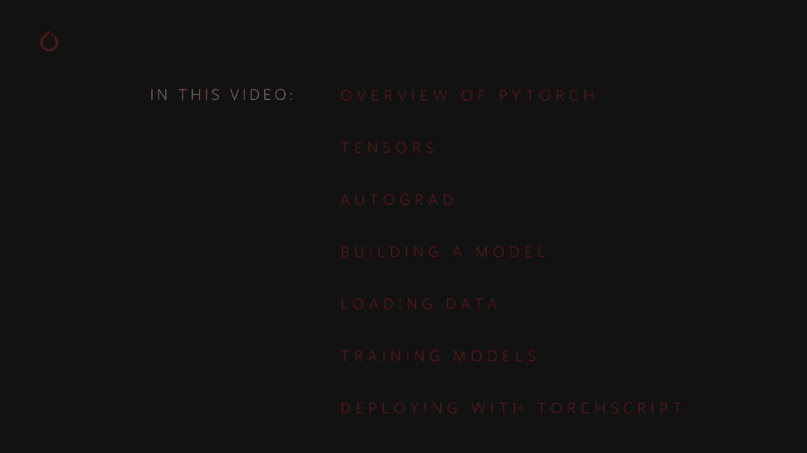

在我们开始之前，你需要安装Pytorrch和torchvisions，以便能够跟随演示和练习。如果你还没有安装最新版本的Pytorrch，请访问Pytorrch.org。首页有一个安装向导。这里有两个重要事项需要注意。首先，Mac上不提供CUDA驱动程序。因此。

在Mac上不会提供GPU加速。其次，如果你在配备一个或多个Nvidia CUDA兼容GPU的Linux或Windows机器上工作，请确保你安装的CUDA工具包版本与机器上的CUDA驱动程序匹配。

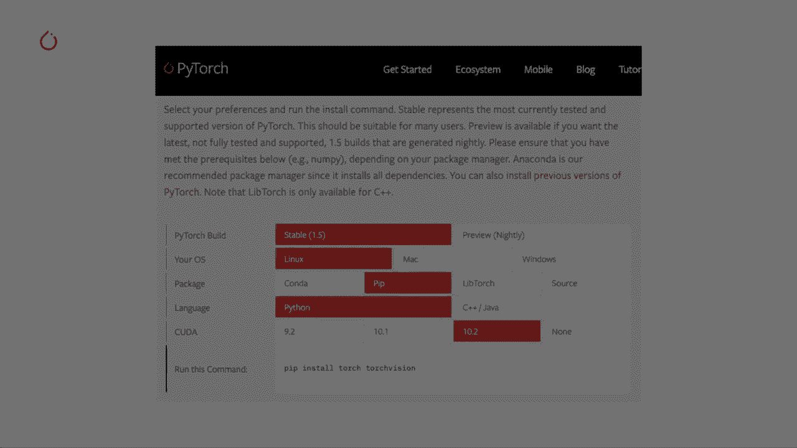

那么Pytorch是什么呢？

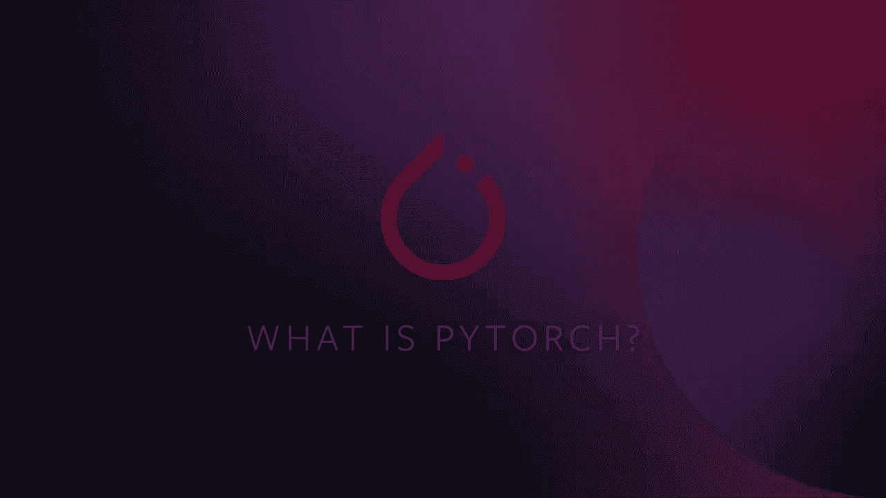

Pytorch.org告诉我们，Pytorch是一个开源机器学习框架，能够加速从研究原型到生产部署的路径。让我们详细了解一下。首先，Pytorch是机器学习的软件。它包含构建和部署机器学习应用程序的完整工具包，包括深度学习的基本元素，如神经网络层类型。

激活函数和基于梯度的优化器。它在Nvidia GPU上具有硬件加速，并且有与计算机视觉、文本、自然语言和音频应用相关的库。Torchssion，Pytorch计算机视觉应用的库。

还包括预训练模型和打包数据集，你可以用来训练自己的模型。Pytorch旨在快速迭代你的机器学习模型和应用程序。你可以在常规的Python中工作。构建计算图时无需学习新的特定领域语言，Pytorch的自动微分引擎，模型的反向传播通过单个函数调用正确完成。

无论计算在代码中走哪条路径，都提供了无与伦比的模型设计灵活性。Pytorch 拥有适用于企业规模的工具，如 Torchcr，它可以从 Pytorrch 代码创建可序列化和可优化的模型，还有 Torchserv。

Pytorrch 的模型服务解决方案以及多种量化模型以提高性能的选项。最后，Pytorrch 是一个免费开源软件，免费使用，欢迎社区的贡献。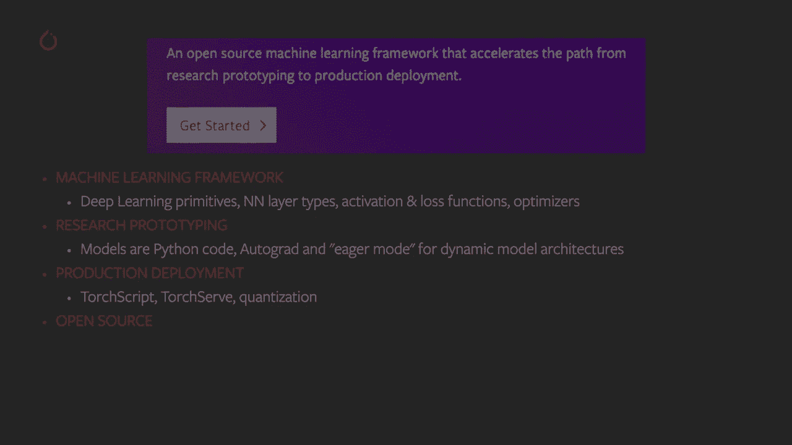

它的开源特性也促进了丰富的社区项目生态系统，支持从随机过程到基于图的神经网络的用例。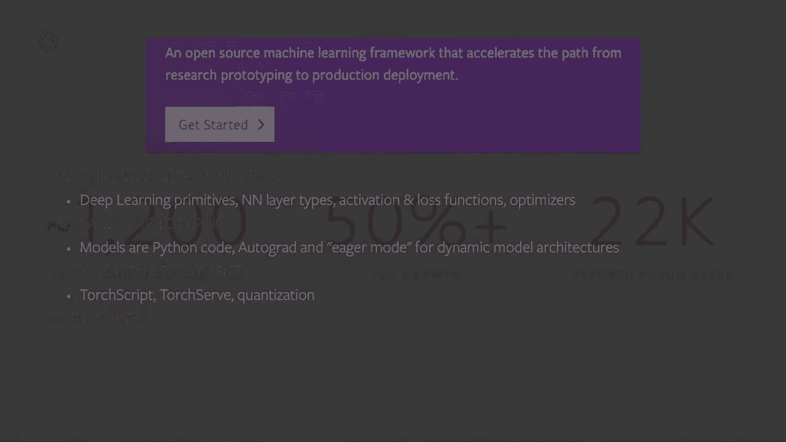

Pytorrch 社区庞大且不断壮大，来自全球的贡献者超过 1200 名，研究论文引用年增长率超过 50%。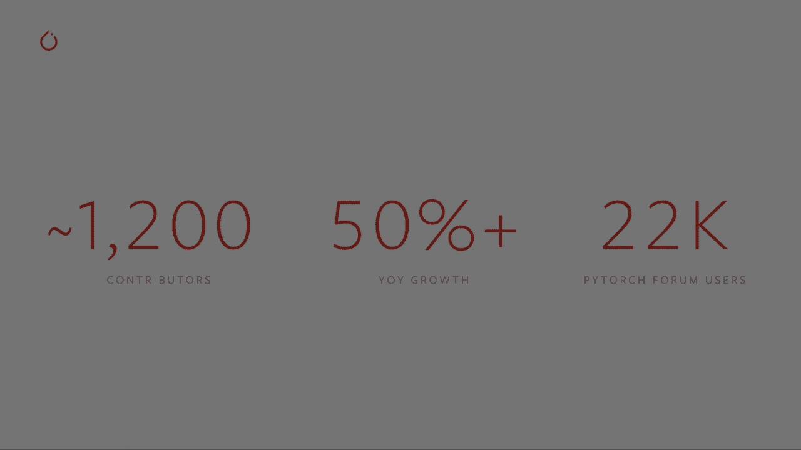

Petorrch 在顶级公司中得到了应用，并为像 Alan N LP 这样的项目提供了基础。它是一个开源深度学习研究库，专注于自然语言处理，Fast AI 简化了使用现代最佳实践进行快速和准确的神经网络训练。Classy Vision 是一个用于图像和视频分类的端到端框架。

一个开源可扩展库，帮助你理解和解释模型的行为。现在你已经了解了 Pytorrch，让我们深入探讨一下。张量将是你在 Pytorrch 中所做的一切的核心。你的模型、输入、输出和学习权重都以张量的形式存在。

现在，如果张量不是你常用的数学词汇，只需知道在这个上下文中，我们谈论的是多维数组，但带有许多额外的特性。Pietorrch 张量附带超过 300 种可对其执行的数学和逻辑操作。尽管你是通过 Python API 访问张量，但计算实际上是在为 CPU 和 GPU 优化的编译 C++ 代码中进行的。

让我们看看 Pytorrch 中一些典型的张量操作。

我们需要做的第一件事是通过 `import torch` 调用来导入 Pytorrch。然后我们将继续在这里创建我们的第一个张量。我将创建一个具有五行三列的二维张量，并用零填充它。我将查询这些零的数据类型。

在这里，你可以看到我得到了请求的 15 个零的矩阵，数据类型为 32 位浮点数。默认情况下，Pytorrch 创建的所有张量都是 32 位浮点数。如果你想要整数，你可以随时覆盖默认设置。在下一个单元中，我创建了一个充满 1 的张量。我请求它们为 16 位整数，并注意到在我没有被问及时打印出来。

Pytorrch告诉我这些是16 B整数，因为它不是默认的，可能与我预期的不符。通常会随机初始化学习权重，常常使用特定的随机数生成器种子，以便在后续运行中重现结果。我们将演示如何用特定数字对Pytorch随机镜像生成器进行加种。

生成一个随机张量。生成第二个随机张量，预期它与第一个不同，通过使用相同输入重新设置随机数生成器。最后，创建另一个随机张量，预期它与第一个匹配，因为它是在对随机生成器加种后创建的第一个张量。果然，这些结果是我们得到的。第一个张量和第三个张量确实匹配。

而第二个则不行。Pytorch张量的算术操作是直观的。相似形状的张量可以相加、相乘等等，而标量与张量之间的操作将分布到张量的所有单元上。所以让我们看几个例子。首先，我将创建一个满是1的张量。

然后我要创建一个满是1的张量，但我将其乘以标量2。结果是所有的1都会变成2。这个乘法在张量的每个元素上分布。然后我会将这两个张量相加。我能这样做是因为它们形状相同。操作在它们之间按元素进行。

我们现在得到了一个满是3的张量。当我查询该张量的形状时，它与加法操作中的两个输入张量形状相同。最后，我创建两个不同形状的随机张量并尝试将它们相加。因为没有干净的方式在两个不同形状的张量之间进行按元素的算术操作，所以我得到了一个运行时错误。

这是Pytorch张量上可用的数学操作的小样本。我将创建一个随机张量并调整它，使其值在-1和1之间。我可以取它的绝对值，看到所有值变成正数。我可以取它的反函数，因为值在-1和1之间，得到一个角度。

我可以执行线性代数操作，比如求行列式或进行奇异值分解。此外，还有统计和汇总操作，比如均值、标准差、最小值和最大值等等。关于Pytorch张量的强大功能还有很多要了解的。

包括如何为GPU的并行计算设置它们。我们将在另一个视频中深入讨论。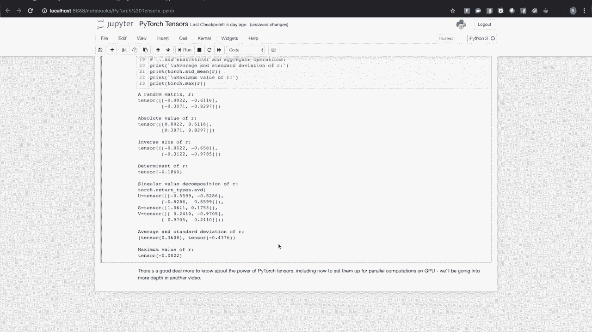

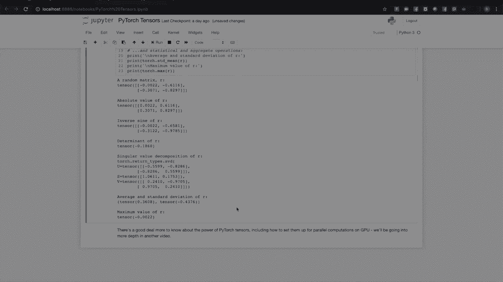

作为对自动求导的介绍，Pytorcht的自动微分引擎。我们来考虑一次单一训练传递的基本机制。在这个例子中，我们将使用一个简单的递归神经网络（RNN）。我们开始时有四个张量，X，输入H，RNN的隐藏状态，这赋予了它记忆，以及两组学习权重。

每个输入和隐藏状态都有一个。接下来，我们将权重乘以各自的张量。在M中，代表自然乘法。之后，我们将两个矩阵乘法的输出相加。并将结果通过激活函数，这里是双曲正切。最后。

我们计算这个输出的损失。损失是正确输出与我们模型的实际预测之间的差异。因此，我们已经取了一个训练输入，通过模型运行，得到了输出并确定了损失。这是训练循环中的一个环节，我们必须计算该损失对模型每个参数的导数，并利用梯度调整学习权重，以减少损失的方式来调整这些权重。

即使是这样一个小模型，也有一堆参数和大量的导数需要计算。但好消息是，你可以用一行代码完成。每个由此计算生成的张量都知道它是如何产生的。例如，I到H携带元数据，表明它来自W X和X的矩阵乘法。

而且它会继续向下延续到图的其余部分。这种历史跟踪使得反向方法能够快速计算模型在学习中所需的梯度。这种历史跟踪是使模型灵活和快速迭代的因素之一。

即使在具有决策分支和循环的复杂模型中，计算历史也会跟踪特定输入在模型中所走的路径，并正确计算反向导数。在后续视频中，我们将向你展示如何使用autograd进行更多技巧，比如使用autograd分析器、计算二阶导数，以及如何在不需要时关闭autograd。

到目前为止，我们谈到了张量、自动微分以及它们如何与Pytorcht模型相互作用。但这个模型在代码中是什么样子的呢？让我们构建并运行一个简单的模型以获取感觉。首先，我们将导入PyTorch。我们还将导入torch.nn，它包含我们将组合成模型的神经网络层。

还有模型本身的父类。我们将导入torch.nn.functional，以便提供激活函数和最大池化函数，这些函数将用于连接层。因此，这里我们有一个Linenette 5的示意图。它是最早的卷积神经网络之一，也是深度学习爆炸的推动者之一。

它是为了读取手写数字的小图像而构建的。该数据集旨在正确分类图像中所表示的数字。下面是其工作原理的简要版本。层C1是卷积层，这意味着它扫描输入图像以识别在训练期间学习到的特征。

它输出了在该图像中看到的每个学习到的特征的位置图。这个激活图在层S2中进行了下采样。层C3是另一个卷积层，这次扫描C1的激活图以寻找特征组合。它还输出一个激活图，描述这些特征组合的空间位置。

该输出在层S4中进行了下采样。最后，位于5F6的全连接层和输出是一个分类器，它接受最终的激活图并将其分类为表示10个数字的10个箱子之一。那么我们如何在代码中表达这个简单的神经网络呢？看看这段代码。

你应该能看到与上面的图表有一些结构上的相似之处。这展示了一个典型的PyTorch模型的结构。它继承自Torch和N.dot模块，模块可以嵌套。实际上，这里的2D卷积层和线性层也是Torta和N.dot模块的子类。

每个模型都会有一个初始化方法，在其中构建将组成其计算图的层，并加载可能需要的任何数据工件。例如，一个NLP模型可能会加载一个词汇表。模型将具有一个前向函数。这是实际计算发生的地方，输入通过网络层在各种函数中传递以生成输出。

一个预测。除此之外，你可以像构建其他Python类一样构建你的模型类，添加任何你需要支持模型计算的属性和方法。所以让我们实例化这个，并通过它运行一个输入。这里发生了几个重要的事情。我们正在创建一个限制的实例。

我们正在打印对象，现在是Tortra的一个子类并在一个模块中。将报告它创建的层及其形状和参数。这可以为你提供一个模型的方便概述，以便你了解其处理的要点。下面，我们创建了一个表示32×32图像和一个颜色通道的虚拟输入。通常。

你需要加载一个图像切片并将其转换为这种形状的张量。你可能注意到我们的张量有一个额外的维度。这是批量维度。PyTorch模型假设它们在处理数据批量。例如，一批16个图像切片将具有形状16×1×32×32。

由于我们只使用一张图像，我们创建了一个形状为1×1×32×32的批量。我们通过调用它作为一个函数来请求模型进行推断，net input。这个调用的输出表示模型对输入表示特定数字的信心。因为该模型实例尚未经过训练。

我们不应该期望在输出中看到任何信号。查看输出的形状，我们可以看到它还有一个批次维度，大小应该始终与输入批次维度相匹配。如果我们传入一个16个实例的输入批次，输出的形状将是16×10。你已经了解了如何构建模型，以及如何提供一批输入并检查输出。

不过，模型并没有做太多，因为它尚未经过训练。我们需要提供大量数据，以便训练我们的模型。我们需要一种方法来批量提供数据。这就是Pytorch数据集和数据加载类发挥作用的地方。让我们看看它们的实际应用。

所以这里我在线声明Matplotlib，因为我们将在笔记本中渲染一些图像。我正在导入Pytorch，同时也导入torchvision和torchvision变换。这些将为我们提供所需的数据集和一些需要应用于图像的变换，以便让它们适合我们的Pytorch模型。因此，我们需要做的第一件事是将传入的图像转换为Pytorch张量。

在这里，我们为输入指定了两个变换。Transs to Tensor将由Pillow库加载的图像转换为Pytorch张量。transformers.dot normalize会调整张量的值，使其平均值为0，标准差为0.5。大多数激活函数在0点附近的辐射最强。

因此，中心化我们的数据可以加速学习。还有许多其他可用的变换，包括裁剪、中心化、旋转、反射，以及你可能对图像进行的其他大多数操作。接下来，我们将创建一个Car 10数据集的实例。

这是一组32×32的彩色图像瓷砖，代表10类物体，包括6种动物和4种车辆。当你准备好以上所有内容时，可能需要一两分钟的时间来下载这个数据集，所以请注意这一点。这是使用Pytorch创建数据集的一个示例。

可下载的数据集，如上面的Siffer 10，是Torch和Us数据集的子类。Pytorch中的数据集类包括可在torchvision中下载的数据集，以及Torch文本和torch音频，还有一些实用的数据集类，例如Torchvision datasets中的图像文件夹，它将读取一个标记图像的文件夹。你也可以创建自己的数据集子类。

当我们实例化我们的数据集时，需要告诉它一些信息，包括我们希望数据存放的文件系统路径，是否将此数据集用于训练，因为大多数数据集会在训练和测试子集之间进行拆分。是否希望下载数据集（如果我们还没有下载的话）以及我们希望对图像应用的变换。

一旦你准备好数据集，就可以将其交给数据加载器。现在，数据集子类封装了对数据的访问，并专门针对其所服务的数据类型。数据加载器对数据一无所知，但根据你在上面的示例中指定的参数，将数据集提供的输入张量组织成批次。我们请求数据加载器从训练集中给我们提供四张图像的批次，随机化它们的顺序。

当设置为shuffle为真时，我们告诉它启动两个工作线程从磁盘加载数据。可视化数据加载器提供的批次是一种良好的实践。运行这些单元应该会显示出四张图像的条带，并且你应该能看到每张图像的正确标签。那么，这里是我们的四张图像，实际上看起来像是一只猫和一只在两辆卡车里的鹿。

我们已经深入了解了张量和自动求导，并看到了PyTorch模型是如何构建的，以及如何高效地为它们提供数据。是时候把所有的部分结合起来，看看一个模型是如何训练的。所以，我们回到了笔记本，你会看到这里的导入。

除了Torchdot Opum，所有这些在视频早些时候应该看起来都很熟悉。我们首先需要的是训练和测试数据集。如果你还没有运行下面的单元，请确保数据集已下载。如果你还没这样做，可能需要花一分钟的时间。

我们将检查数据加载器的输出。再次，我们应该看到四张图像的条带，这看起来是正确的。抱歉，数据加载器很好。这是我们将训练的模型。现在，这个模型看起来很熟悉，因为它是Lyette的一个变体。

我们在本视频早些时候讨论过这一点，但它被调整为处理三种颜色的图像。我们需要的最终组成部分是损失函数和优化器。损失函数，如本视频早些时候讨论的，是衡量模型预测与理想输出之间差距的指标。交叉熵损失是像我们这样的分类模型的典型损失函数。

优化器是推动学习的关键。在这里，我们创建了一个实现随机梯度下降的优化器，这是最简单的优化算法之一。除了算法的参数，如学习率和动量外，我们还传入了net的参数，这是模型中所有学习权重的集合，优化器会调整这些权重。

最后，所有这些都汇集到训练循环中。继续运行这个单元，因为它会花几分钟来执行。从第一行你可以看到，我们只进行了两次训练历程，即对训练数据集的两次完整遍历。每次遍历都有一个内循环，用于迭代训练数据。

处理批次的变换图像及其正确标签。在第9行中处理梯度是一个非常重要的步骤。当你运行一个批次时，梯度会在该批次中累积。如果我们不为每个批次重置梯度，它们将继续累积并提供不正确的值，从而导致学习停止。在第12行中。

我们向模型请求其对该批次的实际预测。在接下来的行中，行13，我们计算损失。输出与标签之间的差异。在行14中，我们进行反向传播，计算将引导学习的梯度。在行15中，优化器执行一次学习步骤。它利用反向调用中的梯度来推动学习权重朝着减少损失的方向调整。

所以循环的其余部分只是对史诗编号和已完成的训练实例数量进行一些简单报告。总体损失在训练史诗上是多少。因此请注意，损失是单调下降的，这表明我们的模型在训练数据集上的表现不断提高。

作为最后一步，我们应该检查模型是否真的在进行一般学习，而不是简单地记忆数据集。这称为过拟合，通常表明你的数据集太小，示例不足，或模型过大，超出了规范。

对数据进行建模。你正在处理它。所以我们的训练完成了。嗯。无论如何，我们检测过拟合并防止它的方法是测试模型在未训练过的数据上。这就是我们拥有测试数据集的原因。所以我将运行测试数据，我们将得到一个准确度度量。55% 好吧，这并不算先进。

但这比我们期望的随机输出的10%要好得多。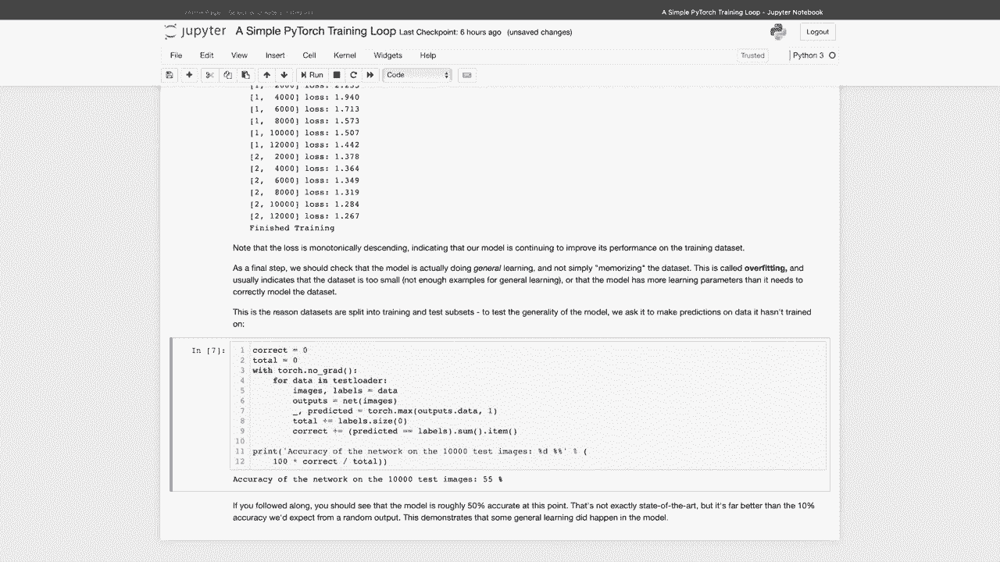

这表明模型确实发生了一些一般学习。现在，当你花费时间构建和训练一个非平凡模型时，通常是因为你希望将其用于某个目的。你需要将其连接到一个系统，以便输入数据并处理模型的预测。如果你热衷于优化性能，可能希望在不依赖Python解释器的情况下做到这一点。

好消息是PyTorch为你提供了torch script。😊，Torchscript是Python的一个静态高性能子集。当你将模型转换为torchscript时，模型的动态和Pythonic特性会被完全保留。控制流在转换为torchscript时得到保留。

而且你仍然可以使用方便的Python数据结构，如列表和字典。查看右侧的代码，你会看到用Python定义的py torch模型。在此之下，创建模型的实例，然后我们将调用torch dot dot script my module。只需一行代码，就可以将你的Python模型转换为torchscript。

该序列化版本保存在最后一行，其中包含有关您模型计算图及其学习权重的所有信息。模型的torch grip渲染显示在右侧。Torch脚本旨在被PyTorch即时编译器或Jit使用。

Jit寻求运行时优化，如操作重排序和层融合，以最大化您模型在CPU或GPU硬件上的性能。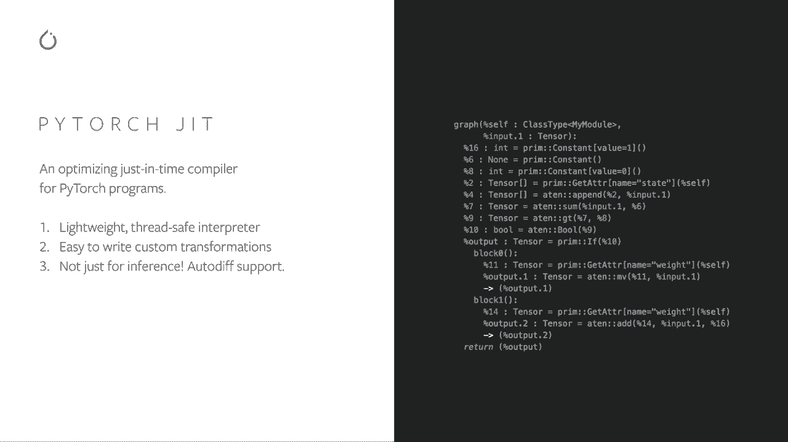

那么，您如何加载和执行torch脚本模型呢？您可以通过torch shott Jet dot load加载序列化包，然后像其他模型一样调用它。更重要的是，您可以在Python中这样做，也可以将其加载到Pytorrch C++运行时中，以消除对解释语言的依赖。

在后续视频中，我们将更详细地讨论Torch脚本、部署的最佳实践，并涵盖Torch Ser P Torch的模型服务解决方案。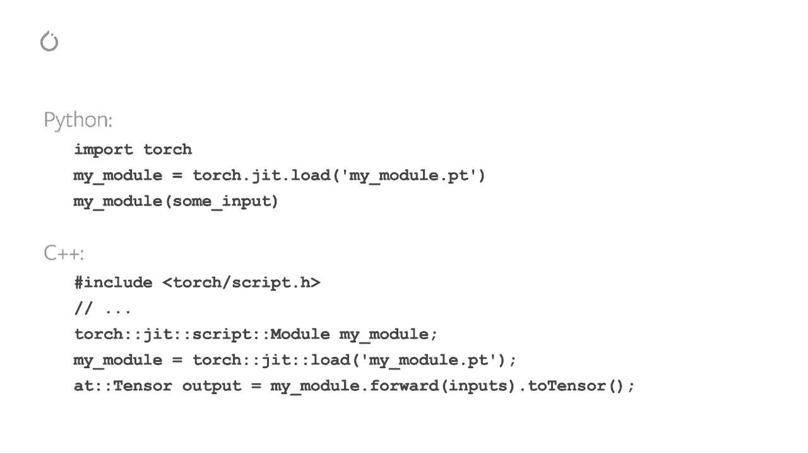

所以这就是我们对Pyetorrch的快速概述。我们在这里使用的模型和数据集相对简单。但Pytorrch在大型企业中用于强大的实际应用场景，例如在人类语言之间进行翻译、描述视频场景的内容或在视频中生成逼真的人声。接下来将深入探讨这里讨论的所有主题，涵盖更复杂的用例，就像您在现实世界中看到的那样。

😊，感谢您的时间和关注。希望在Pytorrch Fors见到您。
