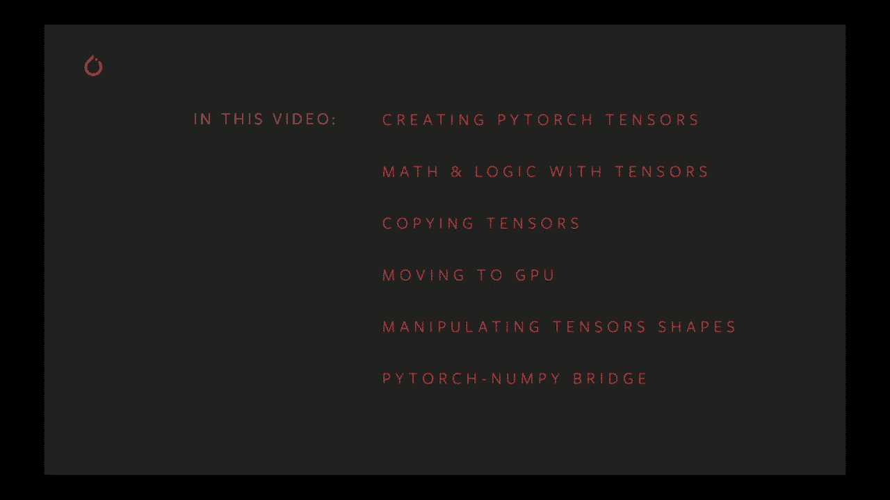
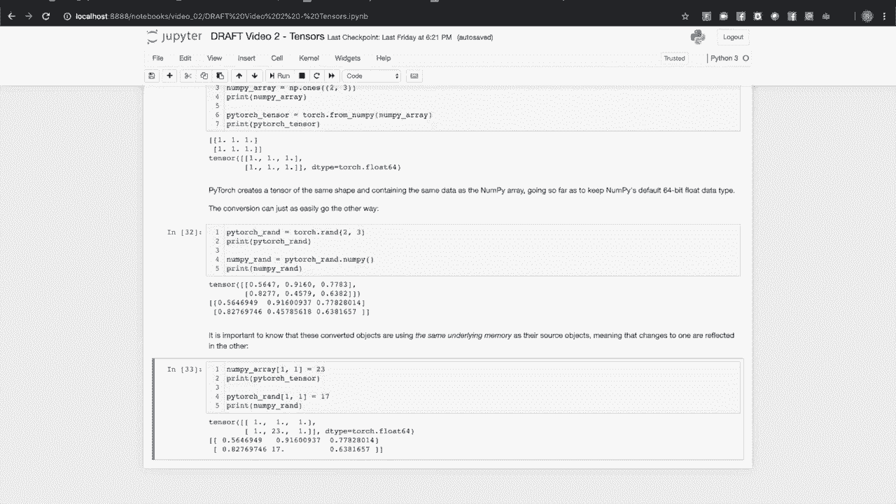

# 140分钟入门 PyTorch，官方教程手把手教你训练第一个深度学习模型！＜官方教程系列＞ - P2：L2- PyTorch 张量简介 

欢迎。在这个视频中，我们将深入探讨 PyTorch 张量。在 PyTorch 深度学习模型中，所有的数据输入、输出和学习权重仅以张量的形式表达，这是一种可以包含浮点数、整数或布尔数据的多维数组。特别是在这个视频中。

我们将讨论创建 PyTorch 张量的一些方法。如何在数学和逻辑操作中单独或相互使用张量。复制张量的方法。如何移动到 GPU 进行硬件加速？

操作张量形状和 PyTorch 的 Nuy bridge。如果你还没有这样做，我建议去 PyTorch 示例库下载与这个视频配套的交互式笔记本。

好吧，在这里的第一个单元中，我们将导入 PyTorch。我们还将导入 Python 的 math 模块以使用一些常量。我们将要讨论的第一件事是创建张量。所以这里有创建张量的最简单方法，torch.empty 调用。

Torch 模块有多个工厂方法，可以让你以有或没有初始值以及你需要的任何数据类型创建张量。这是分配张量的最基本方式，torch.empty 这里将创建一个三行四列的张量。

我们可以看到，对象本身是类型 torch.tensor。当你运行这个单元时，你可能会看到输出中出现随机的值，这是因为 torch.empty 仅分配内存，而不写入任何值。因此，在你分配这个张量时，内存中存在的内容就是你在这里看到的。关于张量及其维度和术语的一点简要说明。

有时当我们有一维张量时，我们会称之为向量，因为它只是一个有序的维度元组。二维张量通常被称为矩阵，而任何更大的张量我们都称为张量。现在，更常见的是，你会希望用一些值来初始化你的张量。

常见情况是全零、全一或随机值。Torch 模块为所有这些情况提供了工厂方法。所以在这里如果我们运行这个单元，你会得到你在方法名称中可能期望的结果，一个充满零的二行三列张量，一个充满一的二行三列张量。

然后是充满 0 到 1 之间随机值的张量。现在说到随机张量。你可能已经注意到在实例化那个张量之前调用了 torch.manual_seed。这是怎么回事呢？现在，用随机值初始化张量，例如你的模型学习权重是很常见的，但通常你会希望你的结果是可重复的。

尤其是如果你在研究环境中工作。因此Ptorrch为你提供了一个工具来做到这一点。手动种子调用。每当你使用特定的整数种子调用手动种子时，你将重新初始化你的伪随机数生成器，并在再次调用时获得相同的结果。

所以在下面的单元格中作为一个例子。我们调用手动种子，我们调用Torchdot Rand。我们输出一些值，然后再次调用Torchdot Rand并输出一些值。接着当我们再次调用手动种子并进行这两个torchdot随机调用时。我们会发现两次的结果都是相同的。因此，这就是确保依赖随机数的相同计算能提供相同结果的方式，如果你需要这种可重复性。

因此，通常当你对两个或多个张量执行操作时。它们需要具有相同的形状。即在每个维度上具有相同数量的维度和相同数量的单元格，或者在每个维度上的相同范围。我迄今为止在torch模块上展示的所有工厂方法都有相应的方法。后面加上下划线。当你将张量作为参数传递给empty或zeros时。

使用这些其他方法，你将得到一个根据你的指定初始化的张量。但它的形状与作为参数传入的张量相同。因此在这里我们运行了单元格，我们可以看到我们的初始张量是2 by 2 by 3，尽管我们没有为O张量指定形状。它们也都会以你所期望的方式输出为2 by 2 by 3。

当我们想要找出张量的形状时，我们总是可以查询其形状属性。这将给我们返回一个维度及其范围的列表。现在我们将要讨论的创建张量的最后一种方法是直接从Ptorrch集合中指定其数据。因此在这里，如果你看看这些例子，我们有一个嵌套数组和一个元组，以及一个包含元组的元组在列表中。

当我们调用Torchdot张量并将这些集合作为参数时。我们会得到一个用我们指定的数据初始化的新张量。因此在这里你可以看到在所有三个案例中，我们得到了一个形状和包含预期数据的张量。因此torchdot张量创建了数据的副本。知道Python列表的底层内存表示与张量的底层内存表示是不同的是很重要的。

因此，在以这种方式创建新的张量并用数据初始化时，我们总是复制那些数据。现在我之前提到过，张量可以有浮点或整数布尔底层数据类型。指定数据类型的最简单方法是在创建时进行。因此在这个单元格中，我正在创建一个int16和一个float 64，你会看到当我打印出来时A是由16位整数表示的一组1。

你会看到没有任何一个后面有小数点，这表明我们处理的是整数而非浮点数。我们还可以看到，因为我们覆盖了默认数据类型，默认是 32 位浮点数。当我们打印张量时。

PyTorch 有用的报告告诉我们这是该张量的基础数据类型。类似地，当我们使用 64 位浮点数时。改变张量的数据类型或将其真正移动到所需数据类型的新张量的另一种方法是使用这两种方法。因此，这里我调用 B.do2，并表示我希望将此数据作为 32 位整数。仔细查看打印出来的 B 和 C 的值。

C 的值只是 B 的值被截断为整数。因此，这是一个浮点到整数的转换。你可能注意到的另一件事是，这里指定了张量的维度为一个元组。典型情况下，PyTorch 对张量的维度期望一个元组，但当维度是方法的第一个参数时。

这让我们有点侥幸，只需输入一系列整数。但为了让代码更易读，我将张量的形状分离为一个元组。你可以使用的数据类型有布尔值、五种事件类型和四种浮点数类型。首先让我们看看基本的算术运算，以及如何让张量与标量交互，现在如果我们运行这个单元。

看，看这里的第一行，我们将创建一个满是零的张量，并将整数 1 加到其中。这意味着将一个整数加到张量上有什么含义。好吧，在这里。我们将在张量的每个元素上执行此操作，因此该张量中的每个零都应该加上一个 1。如果我们查看输出。

这实际上是我们所看到的。类似地，对于乘法、除法、减法和指数运算。对于整数或浮点幂，我还要指出，因为张量和标量之间的二元运算会输出与最初相同形状的张量。

你可以直观地将这些算术运算链接在一起。你可以在我们创建三的那一行看到这一点。现在，用两个张量执行相同的算术运算行为是你所期望的那样。因此，我们取出我们的二。我们的小 2x2 张量充满了两个浮点数 2。

我们将使用指数运算符。现在我们将指定幂 1、2、3 和 4。因此，数学运算将在每个张量的对应元素之间逐元素执行，因为它们具有相同的形状。因此，如果我们运行这个单元，你可以看到实际上，二的幂在第一个张量中。

我们添加了两个全是1和4的张量，得到了5；如果我们将3和4相乘，就得到了12。这里一个关键点是，我们在这些张量二元操作的示例中展示的所有张量都是相同形状的。因此，当我们运行这个单元时，发现当我们尝试对两个不同形状的张量进行操作时，会出现运行时错误，尽管这两个张量的单元数量完全相同。

之间没有自然的映射方式。因此在一般情况下，你的张量必须具有相同的形状，但有一个重要且有用的例外，那就是我们所称的广播。这里有一个例子，我创建了一个随机张量，两个行四列，并且在这里你可以看到我与一个一行四列的张量相乘，实际上我们得到了我们预期的结果，所以在第一个打印语句中看到我们的随机输出，而在第二个打印语句中显示了所有结果翻倍。

那我们该怎么做呢？我们如何将两个不同形状的张量相乘并得到直观的结果？

广播是一种在具有特定相似形状的张量之间执行操作的方法。在这里的单元中，那个一行四列的张量与随机张量的每个两行四列逐元素相乘。

这是深度学习中的一个重要操作。一个常见的例子是使用输入批次。因此，你的PyTorch机器学习模型在一般情况下不会期望单一输入进行训练或推理，而是会期望一个输入批次。因此，在这里对批次中的每个实例分别应用操作，但返回一个相同形状的张量是你所期望的。在我们的随机张量中，有两行随机值，我们与一行2相乘，逐行操作，这类似于我们对张量每个部分分别执行操作的批处理操作。

广播有一些规则。第一个是不能有空张量，因此每个张量必须至少有一个维度，然后在你想对其执行操作的两个张量的维度和范围之间有一些规则。

因此，当我们从最后一个维度到第一个维度比较两个张量的维度大小时，必须要么每个维度相等，要么其中一个维度的大小为1，或者在一个张量中该维度不存在。以下是一些展示我刚刚描述的规则的例子。

看这些可能比推理更容易，因此我们从一个充满1的张量开始。它是一个三维张量，有四层，三行和两列。我们将其与一个随机的3行2列张量相乘。如果我们查看输出，我们可以看到我们将随机张量与原始的充满1的张量的四层逐一相乘。

所以我们说，操作在这些层上广播到第一个维度。同样，在接下来的这一行中，我们将A乘以另一个随机张量以得到C。这次我们在做一个3x1的张量，所以这会给我们带来什么？这遵循规则，因为在最后一个维度中，一个维度是1，第二个维度匹配，而在其中一个张量中，第一个维度是缺失的。

输出看起来像这样。如果我们把进入C的随机张量看作是一个三元素列向量，你可以在输出中看到，当我们将其乘以一组一时，每个三元素列在我们的输出张量中都是相同的，因此我们对张量中的每个三元素列进行了广播这个操作。同样，在最后一个例子中，将一个随机的二张量与一个充满一的张量相乘。

这与上次的情况类似，但现在每个三元素列上执行的操作变成了每个二元素行上执行的操作。现在在这个广播主题上有一个Pytorch文档的说明。

如果你对更多细节感兴趣，我强烈建议你阅读它。现在，我想给你一些会打破规则并且无法工作的操作的例子。所有这些行应该会给你一个运行时错误，因此在第一种情况下，尝试创建B。我们总是从最后到第一比较维度，B的最后维度是三或者有一个三的范围。

A的范围是2，这些不匹配，我们无法在这里广播乘法。就像我所看到的，最后两个维度是2和3而不是3和2，它们是不同的，这样就不行了。在最后一个例子中，我们尝试创建一个空张量并在其上广播一个操作，维度为。

这不行，我们不能用空张量来进行操作。现在，Pytorch张量有超过300种数学操作可以执行，这里是一些主要类别的例子。在第一部分，我们有一些你可能会用来操作数字的函数，如绝对值、向上取整、向下取整和一个设置张量最小值和最大值的钳制函数。

所有这些操作都会作用于张量的每一个元素，三角函数也是如此。因此，我在这里创建了一个充满角度的张量，我想得到这些角度的正弦，然后得到那个正弦的反函数。你可以从运行单元格中看到，我们得到了预期的结果。我们可以对布尔或整数张量进行按位逻辑操作，这里我有两个整数张量，并对它们执行按位异或操作。

我们可以看到，这正是你所期望的，如果你在做类似的按位与或C。例如，我们也可以进行张量的比较。因此，我们将得到一个张量，你可以指定一些数据，我们将是一个充满一的张量。我们会测试它们的相等性。我们可以看到，因为张量D的第一个值是1。

但是其余的都不同，我们可以看到那里有一个真值和三个假值，这正是我们所期待的。你还可以对单个张量执行多种归约操作。例如，在这里我们可以获取一个张量的最大值，无论这个张量有多大。这将返回一个单一值。我们的张量中有一个单一值。

如果你想从那个单元素输出张量中提取那个值，我们使用点项调用。如果你查看这些归约节点的输出，首先我们得到一个包含我们值的张量，然后在调用项之后，我们实际上提取了这个值。你还可以计算均值和标准差。

有便利的方法来执行算术运算，包括张量的所有元素。因此，在这里通过点积调用，我们正在计算张量中所有数字的乘积。我们还可以作为另一个例子，获取张量中的所有唯一元素。这些行为或多或少都是你所期待的。当然。

线性代数是深度学习中很多工作的核心。因此有很多向量、矩阵和线性代数操作。例如，我将创建两个对应于 X 和 Y 单位向量的向量，并将创建两个矩阵。其中一个是随机的，另一个将是三倍的单位矩阵。

我们可以用它们做一些事情。Torch 在两个向量之间计算叉积。所以如果我们按照顺序将 Y 单位向量与 X 单位向量进行叉乘，我们应该得到负的 Z 单位向量，这实际上就是我们得到的。我们可以对我们的两个矩阵进行矩阵乘法。所以我们有了随机矩阵。

然后当我们将其乘以三倍的单位矩阵时，我们应该期待得到一个大约是我们输入值三倍的矩阵，实际上我们确实看到了这一点。你还可以进行更复杂的高级操作，比如奇异值分解。因此，这只是与 Pytorch 张量相关的 300 多个数学和逻辑操作中的一小部分。

我建议你查看文档以了解完整的清单。现在，有时候如果你正在进行两个张量的计算，你会说它们是某种中间值。当你完成时，你可能不需要那些中间值。能够回收内存是一个不错的优化。如果你需要一个与将要丢弃的中间张量大小和数据类型相同的张量。作为这个例子的再次说明，我将创建一个充满角度的张量。我将从中获取正弦值。你可以看到当我们运行这个单元并检查输出时，我们得到了一个。

这些是我们的角度，我们有这些角度的正弦。如果我们回头看一下，我们可以看到a没有改变。因此，我们看到Torch的sign给我们返回了一个新张量，并保留了旧张量在原地。但是因为我们在这里作用于一个单一张量，如果我们不需要输入值，我们可以直接将输出放在那个张量本身中。

像sign这样的带下划线的方法意味着你正在就地修改张量。你放入的那个张量，它是一个参数。所以现在如果我们做完全相同的事情，B是一个包含与A相同角度的张量。我们进行同样的操作，对它进行正弦计算。我们可以看到那是我们最初的角度，还有该正弦操作的输出。

但这次B已经改变，我们告诉它我们想使用B的内存，并且它的数据类型和大小是兼容的。因此B在原地被修改。如果你想对二元算术运算执行此操作，有一些函数的行为与二元pitorch操作符类似。因此，我们将创建两个2x2矩阵，A和B。我们可以查看它们的值，然后。

我们称之为就地加法方法。你可以看到这里a已经改变。覆盖二元操作的方法。调用的张量将是被就地改变的那个。因此，同样地，当我们对B进行相同操作时，如果我们对B的随机内容进行平方，但使用mo下划线，我们将得到我们预期的结果。

请注意，这些就地算术函数是torch张量对象的方法，而不是像许多其他函数一样附加到torch模块。调用的张量，正如我所说，是那个在原地被改变的张量。还有另一种选择，可以将计算结果放入一个已经分配的现有张量中。到目前为止，我们看到的许多方法和函数，包括张量的创建方法。

都有一个out参数，可以让你指定一个张量来接收输出。如果out张量与输出具有相同的形状，并且数据类型匹配输出的数据类型，则可以在不分配新内存的情况下发生这种情况。因此，如果我们运行这个单元格。我们将创建张量A和B，它们是两个2x2的随机矩阵，然后是C。

这是一个充满零的2x2矩阵，我们将使用Python ID调用来获取该对象的ID。我们将打印出来，我们将对A和B进行矩阵乘法，并将C指定为那个可选的输出参数。然后，如果我们查看C的下一个打印结果，会发现它已不再是零。所以C与A和B的大小相同，数据类型都是32位浮点数的默认类型。

因此，当我们进行乘法时，指定C来接收输出，我们看到它确实如此。我们还将输出赋值为另一个标签D的返回值。如果我们查看，将会发现C和D实际上是同一个对象，这个断言没有触发。所以C和D是同一个对象，我们还可以通过一个断言看到C的ID没有改变。

我们处理的是内存中的同一个对象。因此，我只是想给你一个具体的例子，说明这一切是如何运作的，它也适用于创建调用。所以当我们调用Torchdot Rand时，带有一个可选的输出参数，只要形状和数据类型符合要求，我们就会得到一个同一对象中的张量。所以我们已经看到如何创建和操作张量。那么，关于复制它们呢？

张量就像Python中的任何对象，这意味着如果你将其赋值给一个变量，那么该变量只是对象的标签，而不是创建对象的副本。创建一个满是一的张量，我们将其赋值给A，假设B等于A。如果你注意到，当我们改变A的值并打印B时，B中的值也发生了变化。

所以这只是同一个对象的两个标签。如果你需要数据的单独副本会怎样？这可能发生在你构建一个具有多个计算路径的复杂模型时，因此你想要对输入进行单独的副本，以传递给模型的不同部分。在这种情况下，你会使用克隆方法，所以我们将在这里做类似的事情。

我们将创建一个满是一的二维矩阵。我们将说B现在在同一个Josea中。但现在我们要克隆A，而不是仅仅进行赋值。我们可以通过断言验证它们实际上在内存中是不同的对象。我们还可以通过Torrsch EQ调用验证它们的内容是相同的。当我们再次改变A时。

我们可以验证，当我们打印B时，它没有改变。因此，有一件重要的事情需要注意，使用克隆时，如果你的源张量启用了autograd，那么该张量的克隆也会启用。我们将在关于autograd的视频中更深入地讨论这个问题。

但是如果你想要详细信息的简化版本，这里就是。嗯。因此作为一个例子，假设你有一个复杂模型，在其前向方法中有多个计算路径，原始张量及其克隆或副本将贡献于模型的输出。为了使模型学习，你希望这两个张量都启用autograd。

如果你的源张量启用了autograd，通常情况下是的。如果它是一组学习权重，或者它源于涉及权重的计算。那么其他地方的变化，它会提前知道，你将得到你想要的结果。另一方面，也许你正在进行一个计算，既不需要跟踪原始张量也不需要跟踪其克隆。

在这种情况下，只要源张量关闭了autograd，你就可以继续。还有当然，还有第三种情况，假设你在模型的前向函数中执行一些计算，其中所有内容默认情况下都开启了梯度跟踪。

但是你想在中间提取一些值来生成指标。你希望这些与正在处理的数据分开。因此在这种情况下，你不希望源张量的克隆副本跟踪梯度。这会降低性能，并且在这个示例用例中实际上没有任何作用。所以为此。

你可以对源张量使用detach方法。因此，如果我们运行。我们将看到这是我们创建的两个随机值的二乘二张量。我们将设置requires grad等于true。因此，现在每个后续计算都会跟踪其历史。我们知道它的来源，并可以计算反向导数。这是通过clone实现的。

所以在这里我们从A克隆B，当我们打印B时，看到grad函数等于clone backwards。这告诉我们B正在跟踪其历史。现在，如果你查看创建C的那一行，我们说a.dot detached.dot clone。然后当我们打印C时，我们得到相同的数据，只是没有附加历史。如果我们打印A。

我们会看到那个detach调用实际上没有改变A。它基本上只是说，做所有事情就像autograd被关闭一样。Pytorch的一个核心优势是硬件加速。如果你有兼容的Nvidia GPU和已安装的驱动程序。

你可以显著加速训练和推理的性能。到目前为止，我们所做的一切都是在CPU上。默认情况下，当你创建一个张量时，它是在CPU和内存中实例化的。那么我们如何移动到更快的硬件呢？首先，我们应该检查是否有更快的硬件可用，我们通过Torch.kuudo来做到这一点。

可用。所以如果我运行这个单元，你会看到它会告诉我们这个设备上是否有GPU可用。一旦你确定一个或多个GPU可用，你需要将数据放在GPU可以看到的地方。你的CPU处理的是存储在机器RAM中的数据。

你的GPU还附带专用内存。无论你希望在哪个设备上执行计算，都必须将该操作所需的所有数据移动到目标设备可以访问的内存中。现在我们知道我们有一个或多个GPU可用，我们运行。

现在有多种方法可以将数据传输到目标设备，但最简单的方法是在创建时。你可以在这里看到，当我们有可用的KUa GPU时，我们将创建一个带有可选参数的张量，该参数指示设备等于kuda。当我们创建一个想要移动到GPU的张量时。

我们将在工厂方法中使用可选的设备参数，所有我为你展示的创建张量的工厂方法都会接受这个设备参数，这里我们放入字符串kuta，表示我们希望将这个张量移动到GPU可访问的内存中，当你打印张量时。

你会看到它报告张量位于GPU设备上。你也可以查询GPU的数量，如果有多个，你可以通过在Kuda字符串后添加冒号来按索引指定它们，例如Kuda:0，Kuda:1。eta将是你作为设备参数输入的字符串。作为一般工程实践。

通常不建议在代码中到处使用魔法常量字符串，因此更好的做法是在计算开始时选择你希望在哪个设备上进行计算，并获取该设备的句柄，然后在下一个单元中传递该句柄。

我们有一个例子，其中我的设备取决于是否有可用的GPU，可能是Torch.device("cuda")或Torch.device("cpu")。一旦我们获得了该设备的句柄，我们可以将其作为可选参数传递给创建张量，如最后几行所示。因此创建张量，如果你有一个现有的张量。

它在一个设备的内存中，而你想将其移动到另一个设备。你该如何操作？在这个单元中，我们将演示如何创建一个张量在CPU中，例如，如果你想将其移动到GPU，你可以输入字符串ka或k:0，k:1。或者你可以传递先前获取的设备的句柄。

你可以将其传递给two方法，如此，这就是允许你更改张量数据类型的same two方法。如果你想同时更改数据类型和设备，则必须指定参数的名称，比如dtype=Torch.float16，device=你的GPU。

这就是如何将所有张量、学习权重以及从CPU内存移动到GPU的过程。有时你会有一个张量，需要它以不同的形状存在。因此我们将查看几种常见情况以及Pytorch提供的工具来帮助你处理这些情况。你可能需要改变维度数量的一种情况是当你向模型传递单个输入实例时。

Pytorch模型期望批量输入，而不是单个实例。例如，如果我们有一个图像分类模型，输入为一幅三色图像，226x226像素。每个输入图像将表示为一个3x226x226的张量。你的模型期望的形状是n x 3 x 226 x 226。

其中n是批次中的图像数量，例如在训练时可能是8或16。但假设你在逐个进行推理，如何将其批量化为1？我们将使用unsqueeze方法来实现。我们从一个随机张量开始，代表我们的输入。

3 x 226 x 226 的图像表示，然后我们将调用 unsqueeze 的零，并获取该张量并检查其形状。我们会看到它变成了 1 x 3 x 226 x 226。我们在开头添加了一个维度。这就是 unsqueeze 中的 0，表示我们希望这个新维度是第一个维度，即索引 0 的维度。这就是 unsqueeze 的意思。我们在这里所说的 squeezing 是指什么。

我们利用了扩展为 1 的任何维度不会改变张量中的元素数量这一事实。因此，例如，在这里如果我们创建 C，一个 1 x 1 x 1 x 1 x 1 的张量。当我们打印它时，我们看到它只有一个元素，还有很多方括号。所以继续上面的示例，使用我们的图像分类器。

假设模型的输出是每个输入的 20 元素向量。你可以期待输出具有 n x 20 的形状，其中 n 是输入批次中的实例数量。因此，你放入的输入实例越多，你希望得到的预测也越多。这意味着对于一个单一的输入批次，我们将获得形状为 1 x 20 的输出。那么，如果你想对该输出进行非批处理计算呢？

对于这一点，我们只是期望得到一个 20 元素的向量，所以我们有 squeeze。那么这里发生了什么呢？我们再次创建了一个随机的 1 x 20 向量，作为我们的输出张量。我们可以检查它的形状并验证它是 1 x 20。然后我们可以对其调用 squeeze 的零。那就是说，我们希望将该扩展为 1 的维度压缩掉。

当我们调用时，我们查看 B 的形状，可以看到它只是一个 20 元素的张量。现在这只能在扩展为 1 的维度下完成。因此，在接下来的诗句中，使用变量 C 和 D，我们创建一个随机的 PyTorch 张量。然后我们尝试压缩它的第一个维度。

如果你检查 squeeze 的输出形状，你会发现它与开始时的形状相同。我们没有失去一个维度，因为在这种情况下没有办法做到这一点而不损坏数据。因此，squeezing 和 unsqueezing 只会在扩展为 1 的维度上有效。你可能在其他地方使用 unsqueeze 来帮助广播。如果你之前记得。

我们有一些代码来演示广播，我们将一个 4 x 3 x 2 的张量与一个 3 x 1 的张量相乘，结果是当维度对齐时，原始张量中的每个三元素列都应用了相同的操作进行乘法。

现在，如果我们没有 3 x 1，而是有一个我们想要进行广播求和操作的三元素列向量呢？

如果我们查看下一个单元，我们可以看到如果我们直接查看 A 和 B 的创建情况。广播在这里无法发生。尾部维度不匹配。那么我们该怎么办？我们使用 unsqueeze。在单元中创建一个扩展为 1 的额外维度。然后当我们将随机的三元素向量与较大的张量相乘时。

我们可以看到张量中的每个三元素列都有一个乘法操作在其上广播。因此，这可以是一种操纵维度的方式，以便让广播为你工作，而无需转置任一张量的维度。Squeeze和unsqueeze方法也有就地版本。就像我们早些时候看到的数学方法一样，如果我有一个输入实例。

如果我想创建一个批次为1，而不是调用unsqueeze，我可以调用带下划线的unsqueeze，并进行就地操作。现在，有时你会想更激进地改变张量的形状，同时保留张量中元素的数量及其内容。

这种情况发生在一个例子中，即图像分类器。此类模型的计算开始时通常涉及卷积层，而最后的分类部分则涉及全连接层或线性层。

现在，卷积层在处理图像时，通常会输出一个三维张量。你会有一些水平和垂直的范围，用于将特征的检测在图像上进行空间映射。然后，它还会有一个深度，这将是该卷积核学习到的特征数量。接下来的全连接层则只期望一维向量。

那么，我们如何在这两种情况下进行转换，其中输出向量变为输入向量，但需要改变形状，但保持相同数量的单元呢？好吧，我们能做到的就是使用reshape方法。因此，在这里我们将创建一个6乘20乘20的张量，作为我们卷积层输出的占位符。

我们将把它重塑为一个一维张量，包含6乘20乘20个元素，这些元素代表我们全连接层的输入。现在，当它可以时，reshape实际上会在原始张量上输出一个视图。因此，它不会创建一个具有新内存分配的新张量对象，而是创建一个新的张量对象，指向第一个张量底层的相同内存。这一点很重要，如果你使用reshape并且返回原始张量的视图。

请注意，源张量中的更改将在新张量中反映，除非你克隆它。在此介绍的范围之外，还有条件需要reshape返回带数据复制的张量，更多信息可以参考相关文档。我最后写的主题是张量简介。

数据在numpy张量和PyTorch张量之间的可移植性如何？现在，在上面的部分，我们简要提到PyTorch的广播语义与numpy相似。但这两个库之间的连接更深。如果你有现有的机器学习或科学代码，其中数据存储在NI和D数组中。

你可能希望将相同的数据表示为 Pytorrch 张量，以利用 PyTtorrch 的 GPU 加速或其高效的深度学习模型构建抽象。在 Numpy、Di Rays 和 Pytorrch 张量之间切换非常简单。所以在这里的第一个单元我将导入 Ny。然后我们将创建一个 Nuy 数组。

一个充满一的 2x3 矩阵。现在要将其表示为 Pi Torch 张量，我们用 Numpy 数组作为参数调用 Torch。我们得到一个张量并将其打印出来，我们会看到它的形状相同，包含相同的数据，甚至保留了 64 位浮点数据类型，这是 Numpy 的默认值。转换在另一方向上同样简单。

所以在这里我们将创建一个随机的 Pi Torch 张量。然后我们将在其上调用 Numpy，我们会得到一个 Numpy 和 D。现在重要的是要知道这些转换后的对象使用与其源对象相同的底层内存。这意味着对一个的更改会反映在另一个上。所以当我运行最后一个单元时，你会看到更改了 Numpy 数组中的一个元素的值。

我们在从中创建的 Pi Torch 张量中看到了这一点。同样，当我更改我们制作的 Pi Torch 张量中的一个值时，它会反映在我们从中创建的 Nuy 张量中。所以，如果你已有代码在操纵 NPI 中的数据，将其迁移到 P Torches 是轻而易举的。

这是我们对张量的第一次深入探讨。我们今天讨论的主题和 Pytororch.org 上的文档应该是你在后续视频中和独立工作中开始所需的一切。感谢你的收听。
