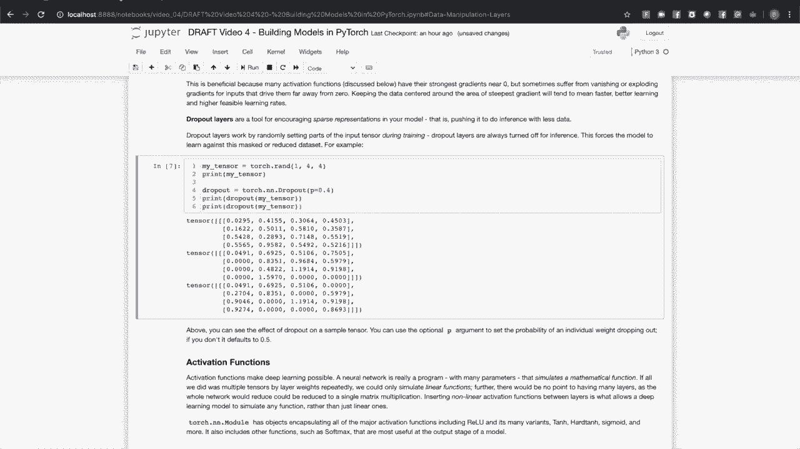
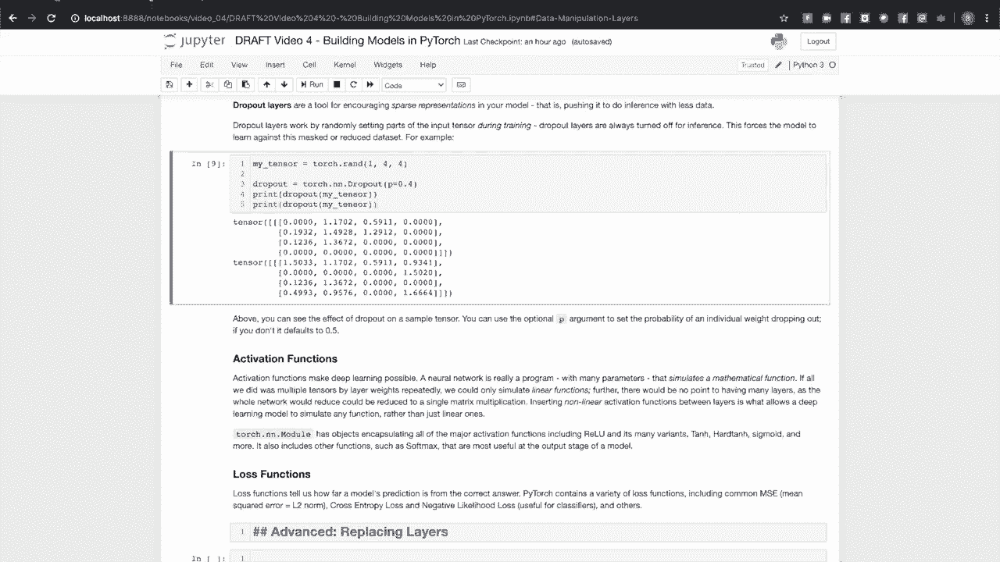

# 140分钟入门 PyTorch，官方教程手把手教你训练第一个深度学习模型！＜官方教程系列＞ - P4：L4- 使用 PyTorch 构建模型 

嗨，欢迎来到 PyTorch 训练系列的下一个视频，主题是使用 PyTorch 构建模型。具体来说，在本视频中，我们将讨论 P Torch 中的模块和参数类，它们分别封装了你的机器学习模型和学习权重，以及它们如何协同工作。常见的神经网络层类型，包括线性层和卷积层。

循环神经网络和变换器网络。其他层和功能，例如批归一化、丢弃和激活函数以及损失函数。

在 Pytorrch 中构建模型围绕 Torch.nn.Module 中的两个类进行。模块类和参数类。模块类封装了模型和模型组件，例如神经网络层。参数类是 torch.Tensor 的子类，表示学习权重。当参数被分配为模块的属性时，模块和参数一起工作。

参数对象与该模块注册。如果将模块子类的实例作为模块的属性注册，则包含的模块的参数也会作为拥有类的参数注册。这可能通过一个例子更简单。让我们看看这个小模型。

它有两个全连接神经网络层，中间有一个激活函数，最后是一个 softmax。这一模型显示了一个 PyTorch 模型的常见结构。首先，请注意它是 torch.nn.Module 的子类。这里有一个初始化方法，定义了模型的结构。

组成它的层和函数。还有一个前向方法，将这些层和函数组合成实际的计算。当我们创建这个模型的实例并打印时，我们会发现它不仅知道自己的层，还知道分配给这些层的属性。

以及我们注册它们的顺序。我们只打印出其中一层。我们得到了该层的描述。我们的微型模型和线性层都是 torch.nn.Module 的子类，因此我们可以通过参数方法访问它们的参数。在这里，我们打印出了整个模型的学习参数以及线性2层的参数，注意这些张量。

线性2的参数与整个模型的最后参数相同。模型递归地注册它拥有的子模块的参数。这一点很重要，因为模型在训练期间必须将所有这些参数传递给优化器。接下来，让我们看看 Pytorrch 中可用的一些层类型。

Pytorrch 有封装现代机器学习模型中常用层类型的类。最基本的类型是全连接层或线性层，我们在上面的例子中看到过。这是一个每个输入影响每个输出的层，因此称其为全连接层。而这种影响在一定程度上由层的权重决定。

如果一个层有 M 个输入和 N 个输出，它的权重将是一个 M x N 的矩阵。作为一个简单的例子，这里有一个小型线性层，它接收三元素输入并产生两个元素输出。还有一个随机的三元素向量，我们将用作输入。传递这个输入将给我们一个两元素的输出向量。

如果你继续进行 x 乘以权重的矩阵乘法，然后加上两个偏置，你应该得到输出 Y。此外，请注意，当我们打印参数时，它告诉我们这些参数需要梯度。也就是说，它们在跟踪计算历史，以便我们可以计算学习的梯度。

Pararameter 是 torchdot tensor 的一个子类，但将 autog 设置为 true 的默认行为与 tensor 类的行为不同。线性层在深度学习模型中被广泛使用。你常会看到它们出现在分类模型的最后一层或最后几层，通常都是线性层。卷积层旨在处理空间上高度相关的数据。

它们在计算机视觉模型中很常见，可以用于检测有趣特征的近聚类并将其组合成更大的特征或识别对象。在其他上下文中也会出现，例如 N LP 应用程序中。通常，一个词的意图会受到其周围词的影响。在之前的视频中，我们看到了 Lynette 5。让我们更仔细地看看这个计算是如何构建的。

Lette 5 旨在接收黑白 32 x 32 像素的手写数字图像块并进行分类，根据所代表的数字。看看模型中的第一个卷积层，我们可以看到它的参数是 1、6 和 5。第一个参数是输入通道的数量，对我们来说，只有一个，因为黑白图像只有一个数据通道。

第二个参数 6 是我们希望这个层学习的特征数量。因此它可以识别多达六种不同的像素排列。在输入中。最后，五是卷积核的大小。你可以把它想象成一个窗口，像是扫描输入，收集这个 5 像素窗口内的特征。这个卷积层的输出是一个激活图，是一个空间图，显示了它在哪里发现了某些特征。

第二个卷积层类似，它将第一个层的输出作为输入。这就是为什么它的第一个参数是6，因为我们在第一个卷积层中识别出六个特征。我们将这些特征作为下一卷积层的六个输入通道。这个层我们要求学习16种不同的特征，这些特征是通过组合第一个层的特征生成的。

我们仅使用三个元素的窗口进行卷积操作。在第二个卷积层将特征组合成更高级别的激活图后，我们将输出传递给一组线性层，作为分类器，最后一层有10个输出，表示输入代表10个数字之一的概率。

Pytorch为一维、二维和三维输入提供了卷积神经网络层。还有更多可选参数可以在文档中查找，例如步幅和填充。

当前的神经网络是为处理序列数据而设计的，例如自然语言句子中的单词串，或来自仪器的实时测量串。RNN通过保持一个隐藏状态来实现这一点。这充当了序列中已观察到内容的一种记忆。

RNN层或其变体（如长短期记忆（LSTM）和门控递归单元（GRU））的内部结构相当复杂，超出了本视频的范围。但我们可以通过这个基于长短期记忆的词性标注器来展示它的实际效果。构造函数有四个参数。它有输入词汇表的大小，也就是它要识别的所有单词的总数。每个单词在词汇大小维空间中表示为一个独热向量的索引。标签集大小是你希望模型识别和输出的标签数量。

嵌入维度是词汇表的嵌入空间的大小，嵌入将词汇表映射到一个较低维度的空间，其中具有相似含义的单词在该空间中相互接近。隐藏维度是LSTM内存的大小。输入将是一个句子，单词以独热向量的索引表示。嵌入层将这些映射到嵌入维度的空间中。

LSTM接受一系列嵌入并对其进行迭代，产生一个长度为隐藏层维度的输出向量。最终的线性层作为分类器，应用对数软最大化到输出，最后一层将输出转换为一个标准化的概率集，表示给定单词映射到给定词性标签的估计概率。如果你想看到这个网络的实际效果，可以在Pytorch.org上找到相关教程。

Transformers是多头神经网络，但我们今天在自然语言应用中经常看到它们，尤其是在BERT成功之后，这是一个可变形的模型。关于Transformer架构的讨论相对复杂，超出了本视频的范围，但请知道Pytorch有一个Transformer类，可以让你定义Transformer模型的整体参数，包括编码器和解码器层的数量以及注意力头的数量。

在激活函数中使用dropout等。你甚至可以使用Pytorch的Transformer类，从这个单一的类构建BRT模型，只需正确的参数。Pytorch还提供了类来封装Transformer的各个组成部分，如编码器、解码器及其组成层。

有一些非学习层类型在模型中执行重要功能。一个例子是最大池化及其双胞胎最小池化。这些函数通过将单元组合在一起并将这些输入单元的最大值分配给输出单元来减少张量。这种情况可能通过示例更容易解释。因此，如果你仔细看这里。

我们有一个6x6的矩阵，我们使用最大池化将其减少到一个4x4的矩阵。这个4x4的矩阵中的四个元素，每个元素包含来自输入的3x3区域的最大值。归一化层会重新中心并归一化一个层的输出，然后再将其输入到另一个层。对计算中的中间张量进行中心化和缩放有许多有益的效果。

比如让你使用更高的学习率，而不会出现梯度消失和爆炸的问题。在上面的单元运行后，你已经为一个随机输入张量添加了一个大的缩放因子和偏移量。你应该能看到输入张量的均值大约在15左右。经过归一化层处理后，你会发现这些值都变得更小，并且聚集在0附近。

实际上，这个均值应该非常小。这很好，因为很多激活函数（我们稍后会讨论）在接近零的地方具有最强的梯度。但它们有时会因输入使它们远离0而遭受梯度消失或爆炸。保持数据围绕最陡梯度的区域中心化意味着学习会更快发生，收敛也会更快。

更高的学习率将对你的训练是可行的。Dropout层是一种工具，用于鼓励模型中的稀疏表示，促使其用更少的数据进行推理。Dropout层通过在训练期间随机将输入张量的部分设为0来工作。在推理时，Dropout层始终是关闭的。

这迫使模型学习如何在掩蔽或减少的输入数据上进行推断。作为一个例子。如果我拿一个随机输入张量并将其通过Dropout层传递两次，你应该看到我得到相同的输入张量，里面有一些随机元素。

设置为零。

Dropout层，Heba模型通过迫使其在较少的输入数据上进行推断来学习稀疏表示。Dropout层通过在训练期间随机将输入张量的部分设置为零来工作。在推断时，Dropout层始终关闭。这迫使模型在掩蔽或减少的数据集上学习。因此作为一个例子。

我会创建一个随机输入张量，并将其传递通过一个Dropout层，我会这样做两次。你会看到里面有一些零，还有一些值，但这些值始终是相同的。它是在张量中随机设置零。你可以使用可选的P参数在这里设置概率，我们将其设为40%，默认值为0。

5。构建模型所需的最终成分是激活函数和损失函数。激活函数是使深度学习成为可能的一部分。如果你回忆之前的线性层示例，它只是一个简单的矩阵乘法，将输入向量转化为输出向量。如果我们将许多这样的层堆叠在一起，无论我们堆叠多少层。

我们总是可以将其简化为单个矩阵乘法。这意味着我们只能模拟线性方程。通过我们的机器学习模型，这就是激活函数的作用，通过在层之间插入非线性激活函数，使我们能够模拟非线性方程。

Tsia N dot 模块提供了所有主要的激活函数，包括多种变体的修正线性单元、双曲正切、硬双曲正切、sigmoid等。它还包括其他在模型输出阶段最有用的函数，如Sockms。PyTorch有多种常见的损失函数，包括均方误差。

这与L2范数、交叉熵损失和负对数似然损失相同，这些对于分类器及其他模型都是有用的。
