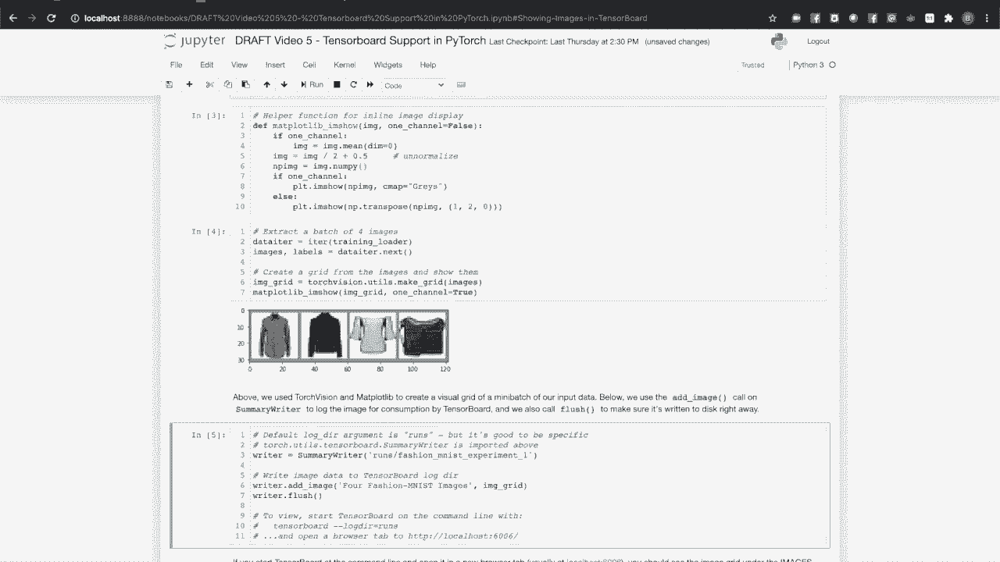

# 140分钟入门 PyTorch，官方教程手把手教你训练第一个深度学习模型！＜官方教程系列＞ - P5：L5- PyTorch TensorBoard 支持 

如果你还没有这样做，你需要设置一个 Python 环境，安装最新版本的 PyTorch 和 TensorBoard。屏幕上的命令展示了如何在 Conda 和 Pip 中执行此操作，我们还将使用 mapplotlib 操作图像。一旦安装了依赖项，你可以在设置好的环境中运行此视频的配套笔记本。

对于这个模型，我们将训练一个简单的神经网络，以识别不同的服装类型。我们将直接可视化数据元素，跟踪训练过程的成功。我们将使用 TensorBoard 观察模型本身的内部情况，并将对整个数据集及其内部关系进行更高级的可视化。

我们将使用 Fashion MNIST。这是一组小图像拼贴，描绘了按服装类型分类的各种服装。对于模型，我们将使用一个版本的 LeNet-5，以适应 Fashion MNIST 数据集。

我们将从导入所需的库和 Torchdo Util 的摘要写入类开始。这是一个封装了 PyTorch 中 TensorBoard 支持的类，将是你与 TensorBoard 交互的主要接口。在将训练数据输入到模型之前，进行可视化是一个好习惯，尤其是在计算机视觉任务中。让我们设置我们的数据集。

我们将使用 Torchvision 下载训练和验证数据集的分割。我们稍后会详细讨论验证，并为每个数据集分割设置数据加载器，定义我们要分类的类。让我们可视化数据集中的一些实例。我们将使用迭代器提取一些数据实例，并创建一个 mapplotlib 辅助函数将它们批量放在一个网格中。让我们在笔记本中展示它们。那么，我们如何将其添加到 TensorBoard 呢？

写入日志目录的数据只需一行代码。请注意，我们还调用了摘要写入对象的 flush。这确保了我们通过写入器记录的所有内容都已写入磁盘。

现在，让我们切换到终端并启动 TensorBoard。

我们将复制命令行给我们的 URL，并查看图像标签。请注意，我们添加的图像有一个包含我们在将图像保存到 TensorBoard 日志目录时应用的标签的标题。接下来，我们将使用 TensorBoard 帮助评估我们的训练过程。我们将绘制常规时间步的累积训练损失，并将其与针对验证数据集测量的损失进行比较。

关于背景，这里简要说明一下我们在做什么以及原因。如果你上过数学课，很可能会在一系列作业后得到作业问题集。在之后，你会得到一次考试。考试问题的性质与作业问题相似，但在具体内容上有所不同。

这旨在确保你学习课堂内容，而不仅仅是记住作业问题。同样，我们可以使用验证数据集，即未用于训练的总数据集的一部分，以查看我们的模型是否在一般情况下学习，或者是否过拟合到训练数据，就像记忆训练实例而不是建模我们试图优化的整体函数一样。

让我们建立一个带有验证检查的训练循环，并绘制结果。这里我们有一个训练循环。你可以看到在代码的顶部，我们声明了一个变量来累积模型预测的测量损失，每千次训练步骤时报告一次。我们还将对验证数据集进行单独的损失检查。

为了跟踪和比较两个不同的量，我们将使用总结写入器上的 add Scrs 调用。这使我们能够添加一个包含多个标量值的字典，每个值都有不同的标签，这些标签在图上各占一行。让我们运行一下，看看效果如何。切换到 TensorBoard 并查看 Scrs 标签。

我们可以看到，在训练过程中我们的损失在单调下降。这让人放心，表明训练有效。😊但是我们是否出现了过拟合？从图中可以看到，验证曲线和训练曲线很好地收敛。接下来，让我们使用 TensorBoard 更好地理解我们的模型以及数据如何流动。为此。

我们将使用总结写入器上的 add graph 方法。这个方法的参数是模型和一个将用于跟踪数据流动的示例输入。我们将运行这个单元并切换到 TensorBoard，查看图表标签。我们可以看到一个非常简单的图，展示了模型，输入从一侧进入，输出从另一侧提交。

当然，我们希望在这方面获取更多细节，可以通过双击图中的模型节点来实现。在这里，我们可以看到一个包含所有层的图，以及指示数据如何流动的箭头。请注意，由于模型使用了相同的最大池化对象两次，第二个卷积层似乎嵌入在一个循环中。但是从代码中你可以看到。

流程比这更加线性。我们已经使用 TensorBoard 显示了我们数据实例的可视化。但整个数据集呢？嵌入是将实例从高维空间映射到低维空间的过程。这是自然语言处理中的一种常见技术。如果你有一个由独热编码表示的 10000 个单词的词汇表，你的单词在 10000 维空间中是单位向量。

如果你训练一个嵌入层，将这些向量映射到一个较低维度的空间，关系就会显现出来。例如，像good、excellent和fabulous这样的词的新向量会倾向于在这个较低维度的空间中聚集。在我们的案例中，28 x 28的图像瓦片可以视为784维的向量。

我们可以使用摘要写入器的add embedding方法将其投影到一个交互式的3D可视化中。这是一些代码，用于选择我们数据的随机样本，标记它并进行投影。请注意，和往常一样，我们使用flush方法确保所有数据写入磁盘。

切换到tensorboard。

我们可以在投影器标签中看到我们新嵌入的3D可视化。

缩小后，我们可以看到一些大型结构，在3D空间中有一些弧线。放大这些结构中的一些，我们可以看到这些弧线聚集了相似的碳类型。放大你自己数据的样本，看看是否能识别出不同类型服装在这个3D投影中聚集的模式。

有关PyTorch对Tensorboard支持的更多信息，你可以访问Pytorch.org的文档，以获取torch.utils.tensorboard summarywriter的完整文档。Pytorch.org的教程部分有关于使用Tensorboard的教程。当然，还有Tensorboard的文档。

这里有关于Tensorboard本身的更多细节。如果你想更深入了解摘要写入器在背后做了什么。
