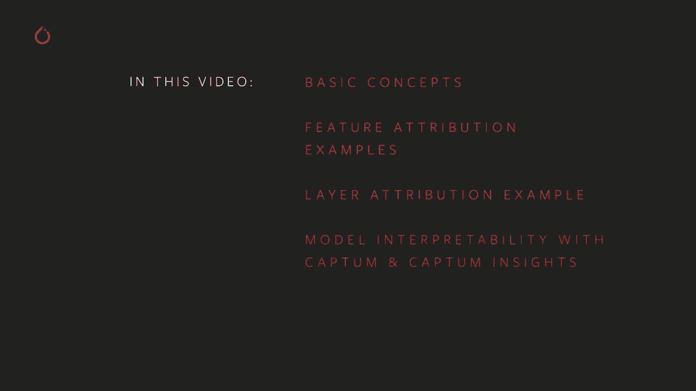
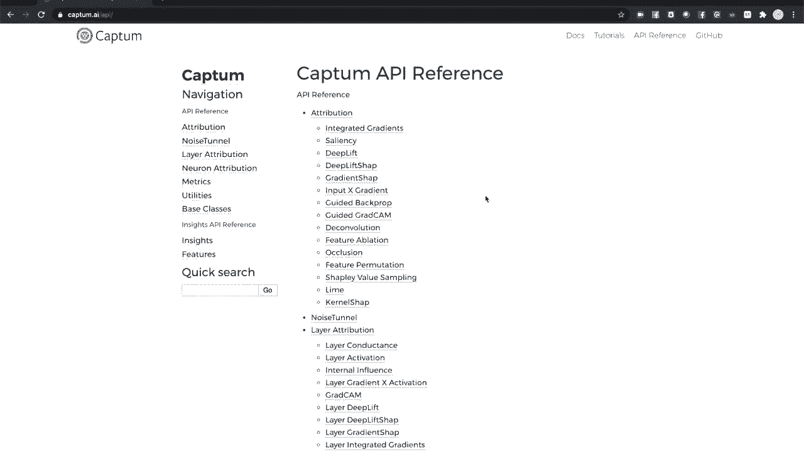
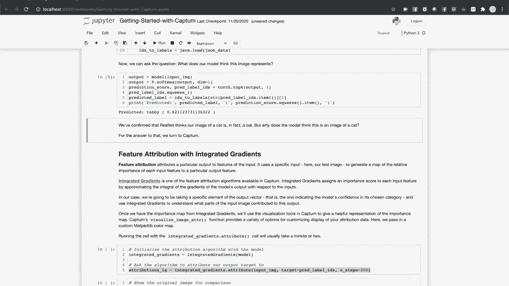
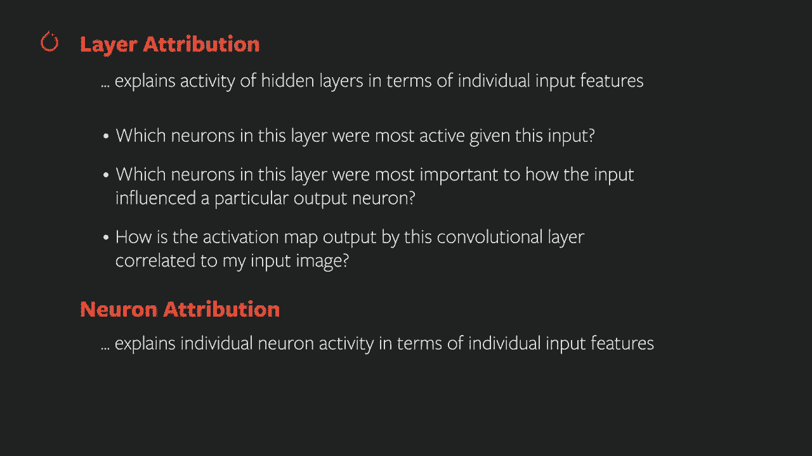
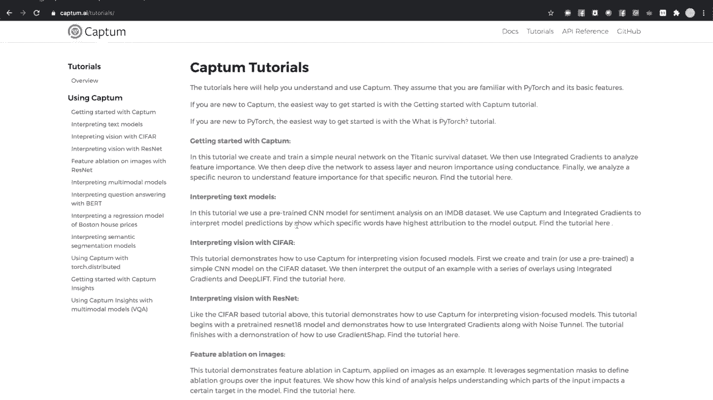

# 140分钟入门PyTorch，P7：L7- 使用Captum进行模型理解 

欢迎来到PyTorch Tra系列的下一个视频。这个视频概述了Captum PyTorch的模型可解释性工具集。😊在这个视频中，我们将讨论Captum的基本概念，包括归因、归因算法和可视化。我们将演示如何为计算机视觉分类器执行和可视化特征归因。

我们将对同一分类器应用层归因，以检查模型隐藏层的活动。最后，我们将查看Captum的见解和API，以创建用于图像、文本和其他特征的可视化小部件。

Captum提供了一套深层工具，用于解释你的PyTorch模型的行为。这个视频和附带的交互式笔记本仅提供核心功能的概述。Captum AI网站包含更深入的教程、文档和API参考。

要运行与此视频相关的交互式笔记本，你需要安装Python 3.6或更高版本，Flask 1.1或更高版本，以及最新版本的PyTorch、TorchVision和Captum。Captum可以通过Pip或指定PyTorch频道的Anaconda轻松安装。首先，我们将使用一个预训练的图像分类器。

ResNet在ImageNet数据集上训练，我们将使用Captum中的工具来深入了解模型如何响应特定输入图像以给出预测。这个部分包含了一系列导入，包括来自Captum的归因方法和可视化工具。

我们稍后将对此进行检查。接下来，我们将获取我们的预训练模型。然后，我们会调出一张图像来进行处理，无论你在交互式笔记本中获得了这个视频的哪一部分，应该也包括用于本教程的图像文件夹。在我们的案例中，它将是一只猫。接下来，我们将定义一些图像转换，以便为模型的处理做好准备，并引入千个ImageNet类别的人类可读标签。现在。

让我们看看模型认为这是什么。它认为我们的猫是一只猫。但为什么模型认为这是猫的图片呢？

要回答这个问题，我们可以看看Captum模型的底层实现。Captum的核心抽象是归因（attribution），这是一种定量方法，用于将模型的特定输出或活动与其输入相关联。第一种归因是特征归因。这使我们能够询问输入的哪些部分在确定模型的预测中最为重要。

它让我们找到一些问题的答案，比如：在这个输入问题中，哪些词在决定答案时最重要？在这个输入图像中，哪些像素推动了模型对图像的分类？输入数据的哪些特征对我的回归模型的预测最重要？不过，特征归因仅涵盖输入和输出。

如果我们想看看模型内部发生了什么。为此，我们有层归因。这将模型隐藏层的活动归因于模型的输入。它让我们回答一些问题，比如：在给定输入的情况下，这一层中哪些神经元最活跃？这一层中哪些神经元对输入如何影响特定输出神经元最重要？

卷积层输出的激活图与我的输入图像之间有什么关系？最后，还有神经元归因。这与层归因类似，但深入到模型中单个神经元的层面。在本教程中，我们将研究特征归因和层归因。

首先，特征归因。归因是通过归因算法实现的。

一种将模型活动映射到输入的特定方法。我们将要查看的第一个特征归因算法称为整合梯度。该算法数值上近似模型输出相对于其输入的梯度积分，实质上是为给定的输入输出对找到通过模型的最重要路径。

我们将继续创建一个整合梯度对象，并用我们的模型初始化它。然后我们将调用它的归因方法。我们将输入、输出标签以及一个可选的运行步骤数传入。请注意，运行该单元可能需要几分钟。

整合梯度的过程计算量很大。一旦该单元完成运行，我们就会生成一个关于猫图像和模型生成的猫标签的数值重要性图。对于一个输出类别较少的简单回归模型，我们可能只需将其打印为表格。但对于一个更复杂的 C 模型，输入更大，如图像。

视觉上将重要性图与图像关联将会有所帮助。Captain 已经为你准备好了。可视化模块正好提供了这方面的工具。在这里，我们将进行两次调用来可视化图像。第一次显示原始图像。首先，我们需要对图像进行一些调整。我们调用 squeeze 来移除图像上的批量维度。

我们确保在 CPU 上运行。我们将图像张量从计算历史中分离出来。否则，图像张量会不必要地继续跟踪其计算历史。最后，我们将其转换为 numpy 数组，调整维度，并将颜色通道放在最后。该方法的第一个参数通常是归因。但对于这个调用。

我们将把其设置为无。我们只显示原始图像。第二个参数是我们的变换图像。第三个参数是可视化方法，一个指示你希望可视化如何工作的字符串。在这里，我们告诉Captain，我们只想显示原始图像。最后，我们给我们的可视化一个说明性的标题。

第二个调用将对我们图像的重要区域进行可视化映射。第一个参数是我们从积分梯度中获得的归因。第二个是我们的变换图像。对于这种方法，我们将指定热图。颜色强度与图像区域的重要性相对应。

Capize你可以使用来自map plotlib的自定义颜色图。我们在这里创建了一个，可以稍微增强热图的对比度。我们将s指定为正面。我们只关注正面归因。运行一个单元。我们可以看到模型关注的是猫的轮廓。

以及猫脸中心周围的区域。让我们尝试另一种特征归因算法。接下来，我们将尝试遮挡。积分梯度是一种基于梯度的归因算法。遮挡则有所不同。它是一种基于扰动的方法，涉及遮蔽图像的部分区域，并查看这如何影响输出。

和之前一样，我们将指定我们的输入图像和输出标签给归因算法。对于遮挡，我们将指定几个更多的项目。第一个是滑动窗口和步幅长度。这些类似于卷积神经网络中的类似配置选项。

我们还将设置我们的基线。也就是我们对一个被遮挡的图像单元的表示，设置为0。根据你的数据如何归一化，你可能希望指定一个不同的基线。但对于以零为中心的数据，使用0是有意义的。我们将运行归因调用，给它一点时间。在下一个单元中，我们将进行一些新的操作。

我们正在调用可视化图像叠加多次。为了显示遮挡归因的多个可视化结果。除了原始图像，我们将展示三个可视化结果。前两个是正面和负面的归因热图。你可以看到我们提供了一个方法列表，其中热图是第二和第三个。

我们还为每个可视化指定了一个标志。在这里你可以看到，我们在一个热图上请求了正面归因，而在另一个上请求了负面归因。这些指示了哪一个。对于我们的最终可视化，我们将使用掩膜方法。这使用正面归因来选择性地遮蔽原始图像。

为该输入输出对提供了图像中模型最关注区域的显著视觉表示。运行单元，你可以看到这与我们从积分梯度中学到的内容很好地对应。大多数活动集中在猫脸中心的轮廓上。模型在后台是如何工作的呢？让我们使用层归因算法检查其中一个隐藏层的活动。

GradCAM是另一种基于梯度的归因算法，专为卷积设计。它计算输出相对于指定模型层的梯度，对每个通道的梯度进行平均，并将此平均值与层激活相乘，并将其作为层输出重要性的度量。

为了开始层归因，我们将创建一个层GradCAM对象，并用我们的模型和我们希望检查的层进行初始化。然后，我们将输入输出对传入，并请求进行归因。我们可以像之前那样用热图可视化。这种方式，你可以直观地检查激活图的哪些区域与输出相关。

不过，我们可以做得更好。由于卷积层的输出通常与输入在空间上相关，我们可以利用这一点，通过上采样激活图并直接与输入进行比较。层归因父类有一个方便的方法，可以将低分辨率的卷积激活图上采样到输入大小。我们将在这里使用插值方法。并请求可视化工具生成一个混合热图。

显示原始图像及其叠加的热图和掩模图像。这样的可视化可以让你深入了解隐藏层如何影响模型的特定输出。Captain配备了一个名为Cap Insights的高级可视化工具，它允许你在浏览器中组合多个可视化，配置归因算法及其参数。

Captain Inights让你可视化文本、图像和任意数据。我们现在将尝试三张图像，分别是猫、一壶茶和三叶虫化石。再次强调，这些图像应该可以在你获取互动笔记本及其视频的地方找到。首先，我们将查询模型，看看它对这些内容的理解如何。似乎效果还不错。

现在，让我们设置Cap Insights。我们将使用归因可视化对象，并用我们的模型进行配置。模型输出的评分函数在这里是softm。模型识别的类列表在这里，我将按顺序列出ImageNet的类名。我们会告诉它，我们在查看图像特征。

Captive Insights同样处理文本和任意数据，它会给出一个数据集，即一个可迭代对象，返回一批图像和标签。注意，我们尚未指定算法或可视化方法。这些是在浏览器小部件中设置的内容。现在，我们请求可视化工具进行渲染。

它最初是空的，但我们可以设置配置参数，并通过提取按钮请求它获取我们可视化的归因。我将保持集成梯度的默认设置。Captain需要几分钟生成归因。但现在我们可以看到它为每个图像排名前几的预测及其概率，并提供重要区域的热图归因。

通过这种方式，Captain insightights让你实验归因方法，理解导致模型预测的活动，无论是正确的还是错误的，并且以最少的代码进行可视化。最后，别忘了查看Captain AI以获取文档、教程和API参考，以及在GitHub上的源代码访问。

