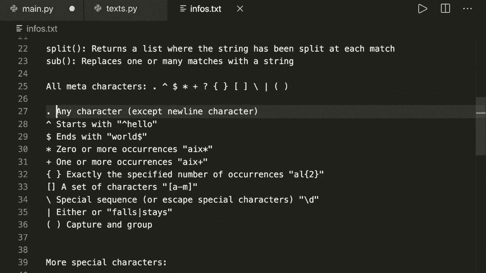
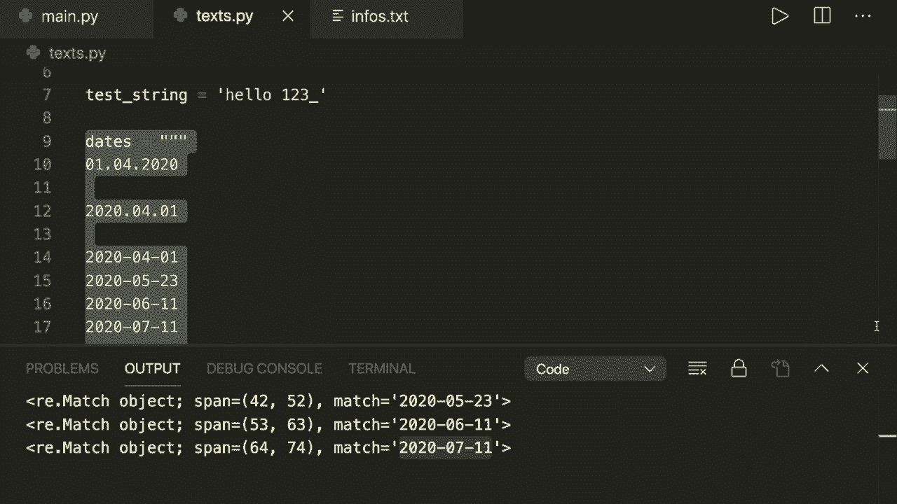
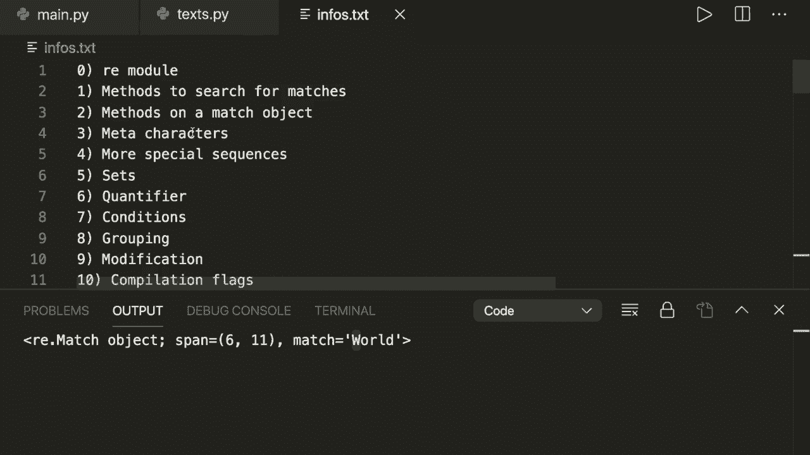

# 1小时掌握Python正则表达式的所有技巧！这些实用技巧可以极大加速你的查找过程~＜技能提升系列＞ - P1：Python中的正则表达式 - 完整课程（1小时） - 编程教程 

嘿，大家好，欢迎来到新的Python教程。今天，我想展示如何在Python中使用正则表达式。正则表达式，简称RE或rex，是一种用于搜索匹配文本模式的强大方法。例如，可以使用正则表达式从大型文本文件中提取的典型模式包括电子邮件或域名。😊所以在这个教程结束时，你将能够理解这个正则表达式的作用。

这个教程有很多内容要讲。不要感到不知所措。我保证一旦你理解了这些概念，就不会再那么难了。它可以大大简化和加速你的搜索任务。所以如果你观看整个教程，你将能够理解任何你想查找的模式。

现在让我快速展示一下我们将在这个视频中覆盖的内容。

当然，我们将看到如何在Python中使用R模块。然后我会向你展示我们有哪些方法来查找匹配项，以及我们可以对匹配对象做什么。接着我们会谈谈元字符和可以在模式中使用的更多特殊序列。然后我们会谈谈集合、量词、Con。接着是分组，以及修改。

我们如何使用Rs修改字符串。在最后，我会给你展示一些不同的编译标志。

所以让我们开始吧。正如我所说，Python有一个内置模块叫做RE，我们可以用它来处理正则表达式。因此我们需要导入RR。然后我们可以开始使用正则表达式。让我先给你展示一个非常简单的例子。假设我这里已经有一些测试字符串。

让我在这里复制并粘贴一下。这是我们的测试字符串。

现在，假设我们想搜索模式ABC。所以我们看到这里有三次。现在假设我们想查找ABC。我们创建一个模式。假设模式等于。然后我们使用RE模块和compile方法。然后在这里我们说R。

然后字符串是ABC。所以我们稍后会解释R的意思。然后我们可以使用这个模式来查找匹配项。所以我们说匹配项等于模式点find iter。然后我们想从测试字符串中找到匹配项。现在这将是一个可以迭代的对象。所以我们可以说对于匹配项中的每个匹配。

然后我们简单地。

打印匹配项。现在让我们运行这个。然后我们看到有两个匹配项。这是一个匹配对象，我们可以看到更多细节。例如，我们可以看到跨度。这是开始和结束位置。因此这是3，4和5。😊，这是我们的匹配项，ABC。第二个匹配在位置12。因此这是我们字符串中的位置或索引12。

所以我们看到这里有两个匹配项。我们还看到我们的正则表达式是区分大小写的。因此，它不包含大写的ABC在我们的匹配中。这是我们必须知道的一件事。

我想提到的一件事是，我们可以直接在RE模块上使用findIt方法，而不是显式编译我们的模式。因此，我们也可以直接写成我们的匹配等于RE.dot findIter。然后我们想查找我们的，比如说，字符串R ABC，以及我们的测试字符串。😊

所以你可以直接在RE模块上使用它。如果我们运行这个，我们会看到得到相同的结果。因此没有太多的区别。

这里没有太大区别。但我更喜欢这种方式来显式编译模式并将其绑定到这个对象上。因此，这提高了可读性，并且也稍微灵活一些。所以我更喜欢这样，但你应该知道你可以用两种方式。

现在让我们简要谈谈我在这里使用R的原因。这意味着这是一个原始字符串。例如，如果我有一个字符串A，并且它包含一些特殊字符，比如制表符。所以反斜杠T是制表符，或者反斜杠N是换行符。然后我有一个字符串。

所以现在如果我打印这个。然后你会看到一开始有一个制表符。所以它没有打印反斜杠T。在模式中，我通常想查找我模式中的实际字符。因此我可以在这里写一个R。这意味着这是一个原始字符串。所以Python将以这里指定的方式打印它。

😊，是的，我建议总是为你的模式使用原始字符串。你可以使用普通字符串，但请记住，你应该使用原始字符串。

是的，这是一个简单的例子，说明如何使用正则表达式。通常我们先想出我们的模式，然后编译它，然后使用模式来查找匹配项。我将向你展示现在我们在匹配项上有的不同方法。现在让我们来看看搜索匹配项的方法。我们已经看到了find iter。

方法将给我们一个匹配对象。我将稍后告诉你我们可以用匹配对象做什么。现在让我们谈谈其他方法。有三种其他方法。我们可以使用点匹配方法。所以这里点匹配。然后我们有搜索。然后我们还有查找所有。所以。😊，现在，让我们先看一下查找所有方法。

所以如果我们可以说模式点查找所有，那么我们将简单地得到字符串。所以如果你在这里看到。我正在打印整个匹配对象。现在如果我只想要一个字符串，那么我可以使用查找所有。现在如果我运行这个，它将仅打印我寻找的两个字符串。

这就定义了查找所有方法。现在，匹配方法确定表达式是否在字符串的开头匹配。所以这只会返回一个匹配。所以在这里我可以说匹配等于模式，然后匹配。现在。如果我打印匹配，那么让我们打印。匹配并运行这个。然后我们会看到这是 none，因为匹配只查找我们字符串开头的模式。

所以 ABC 不是在开头。现在如果我使用 1，2，3 作为模式。然后我们会看到这是在开头，所以这将返回一个匹配。我们在这里也有这个模式。但是再次强调，匹配只返回第一个。

匹配如果它在字符串的开头。现在我们也有搜索方法。所以搜索方法扫描字符串并查找正则表达式匹配的任何位置。所以如果你使用，例如，让我们再次查找匹配 ABC。然后我们会看到这将返回 none，因为 ABC 必须在开头。

现在如果我们使用搜索方法，那么它将再次找到匹配对象。它将简单地返回第一个匹配。所以我们有搜索、匹配、查找所有和查找迭代。这是我首选的方法。从现在起，我只会使用这个。然后我们还有一些可以用来修改对象的函数。

所以我们还有分割和 s。稍后我会讲到它们。所以现在让我们继续使用查找迭代方法。让我们看看我们可以对匹配对象做什么。因此，再次假设我们的匹配等于模式，然后查找迭代。然后让我们对其进行迭代。所以对匹配中的每一个匹配。然后我们想打印匹配。

然后。

再次，我们看到这里有整个匹配对象，我们可以在此上使用四种不同的方法，所以我们可以使用组方法。我们可以使用开始和结束方法。我们还可以获取跨度。所以。让我们先从跨度开始。这将给我提供该模式的位置的开始和停止索引。所以让我们打印匹配的跨度。然后我们简单地将其作为元组获取。所以。我们得到 3 和 6。

这是一个匹配对象，我们还可以立即获取开始和结束，只需说 print match dot start 和 print match dot。哦，抱歉。这里是我 dot match dot start。因此我们得到开始和停止索引。现在我们来谈谈 group 方法。因此，如果我们调用 match dot group，那么我们将获取或打印匹配的实际字符串。

我们还可以给这个 group 方法传递参数以查找组 0 或 1 和 2。我们稍后会讨论这个分组。但目前，如果你只想从匹配中获取字符串，只需调用 match dot group 或 group 0。这是一样的。😊 是的，这些是我们可以在匹配对象上使用的四种不同方法。

现在我们来看看元字符。在正则表达式中，有一些元字符具有特殊含义。这些都是我们必须了解的元字符。你不需要记住它们，所以我建议你在某个地方保留一张备忘单，上面有所有这些内容。

我还会在我的网站上提供一张备忘单。你可以在 Python minuseng dot com 上查看。这就是你需要知道的全部。😊！

现在我们一个一个地谈谈这些元字符。

然后我会向你展示这意味着什么。第一个是点。点表示我们要寻找任何字符。也就是除了换行符以外的任何字符，之后的插入符号意味着我们想要寻找一个以我们正在寻找的模式开头的模式。因此，它是以一个字符串开头，比如 hello，然后美元符号则相反。

如果我们想查找文本末尾的字符串。

然后我们有一些量词。所以星号、加号和方括号。我稍后会更详细地谈论它们。

然后我们有集合运算符，我稍后会涵盖这个。接着我们有条件和用括号进行分组。因此，我也会稍后讨论这个。当然，我们还要查看反斜杠。通过反斜杠，我们可以获得更多特殊序列或转义字符。所以，例如，如果我们实际上想要搜索点。

那么我们必须在模式中转义这个。

现在我们来谈谈前三个，并给你一些例子。

然后我们将更详细地讨论其他元字符。所以现在，首先。假设我们想寻找点号，然后打印所有匹配项。然后我们看到我们得到了所有的。

我们字符串中的所有字符，因为点号寻找任何字符，除了换行符。

所以，这就是点号。现在，假设我们在结尾有一个点。实际上我们想得到这个点。因此我们用反斜杠进行转义。现在，如果我们运行这个，那么我们只会得到点号。现在让我们打印整个匹配对象。

然后我们得到点号，看到它在这个位置。所以这是点号。然后我们来看一下插入符号。这是插入符号。假设我们想查找1到3。如果它以这个开头。然后我们得到了一个匹配对象。比如现在，如果我们查找ABC，那么它将返回空，因为它不在开头。

反之，如果我们想看看这个是否在结尾。那么我们可以在这里说美元符号。现在如果我们运行这个。它将找不到任何内容，因为抱歉，我们这里有AndCo。这将找不到任何内容，因为如我所说，它是区分大小写的。现在，如果我查找大写的ABC和结尾的美元符号。

所以它在结尾找到了匹配项。

好的，现在我们稍后将讨论其他元字符。现在我们来看看一些更特殊的字符。还有更多以反斜杠开头的特殊字符。所以有反斜杠和小D，这表示寻找任何数字。0到9。

然后是大写反斜杠大写D。所以这个匹配任何非数字字符。接着有反斜杠小写S。这个匹配任何空格字符，例如空格、制表符或换行符。然后我们有反斜杠大写S，这个匹配任何非空格字符。所以对于所有这些模式，所有这些特殊字符。

大写模式在这里有点相反于小写字符。😊。

然后我们有反斜杠小写W。这个匹配任何单词字符。所以我们有从a到C的字符。我们还有所有的大写字符，以及数字和下划线。然后大写W是任何非单词字符的相反，即非字母数字字符。然后，我们有反斜杠B。

这与指定字符位于单词的开头或结尾时匹配。

还有一次，我们有相反的情况。因此在这里不是在开头。让我们详细看看它们。

所以我们在这里使用另一个测试字符串。比如说，使用这个。

现在，如果我们想查找任何数字字符，我们可以简单地说我们想查找反斜杠D。现在如果你运行这个，那么我们会看到有三个匹配，dts 1、2和3。现在。如果我们使用相反的情况。所以大写D或任何非数字字符。那么它会找到所有的字符，除了1、2和3。

然后让我们看看空格。因此反斜杠S找到任何空格字符。这里我们看到有一个空格，这里有一个空格，还有一个空格。然后再一次，相反的情况。任何非空格字符就是其他任何字符。😊，所以这是S特殊字符。然后。让我们看看。

W字符。所以任何字母数字字符。如果我在这里放一个W，那么它会找到所有的字词字符。

再一次，相反的大写D，这只会找到这个例子中的空格。现在让我们看看。

反斜杠B，所以现在如果我在寻找hello，那么它会找到，因为它在一个块的开头。一个块不仅是字符串的开头，而是任何后面跟着空格字符的块的开头。例如，如果我们寻找。Hey。那么。它也会在那里找到。嗯。Hey，但它只会找到这个模式，而不是这个。

因为它正在查找位于块开头的匹配项。例如，如果我们在空格之前放这个，那么它将找到。然后它也会找到这个模式或这个匹配项。再一次，相反的情况。如果我们在寻找这个并且放。哦，他在这里。然后它会找到这个hay，因为它不在一个块的开头，而这个在块的开头。

所以这些是我们应该知道的特殊序列，特殊字符。

现在，让我们继续讨论集合。

我们可以使用方括号来查找集合。让我给你展示这意味着什么。假设我们现在只有这个字符串。但现在，假设我们只想查找。

以及非数字字符。所以仅限于这些字符，我们可以为此使用一个集合。因此，集合是在方括号之间的模式。在这个集合中，我们可以使用多个我们想要查找的字符。例如，我们想查找 L 和 O。现在，如果我们运行这个，它将找到所有这些字符。

你必须小心，因为它不是查找 L O，而是查找我们放入这个集合中的任何单个字符。我们也可以在这里指定范围。我们可以。比如说，我们还想要 H 和 E。那么它将找到任何。

这里的字符。那不是数字。而且也不是反斜杠，不是下划线。所以我们也可以在这里指定一个范围。这是一个非常典型的、非常常见的例子，正则表达式使用连字符 C。因此从 A 到 C。因此所有的。

小写字母。现在如果你运行这个。有时它不会自动保存这个文件。所以现在。如果你运行这个，我们会发现。

所有的。

这里的字母。我们也可以查找数字。所以我们可以说我们只想要数字 2 和 3。再一次，在这里，我们可以有一个范围。所以我们可以说 1 到 9。因此，这是，或者说 0 到 9。这将找到所有的数字。因此，这与使用反斜杠 D 查找数字是相同的。

所以，是的，如果你想指定一个范围，那么连字符可以用于声明以定义范围。如果你在一个范围后使用它，那么它就是在查找实际的连字符。所以现在，如果你还想查找一个连字符，那么我们可以在这里找到它。如果你把它放在两个事物之间，那么它就是一个范围。

所以这里要小心。我们也可以。将不同的范围背靠背地写出来。例如。如果你在这里有“Hello”用大写字母。首先，我们可以说我们只想要小写字母。然后我们还想要从 A 到 C 的所有大写字母。然后我们可以背靠背地写出这个，所以我们可以说小写字母，A 到 C 或 a - C，然后大写 A - C。

然后这也会包括所有的大写字母。再次，我们可以使用背靠背的方式，也包括数字。

所以，是的。然后它也找到这里的数字。所以这些数字。所以，是的。这就是我们如何使用带有这些括号的集合。

现在让我们谈谈量词。我们有这些量词，元字符。我们有一个星号。这是乘法符号。这意味着0个或更多。然后我们有加号，这意味着1个或更多。然后是问号，这意味着0个或1个。这可以用于查找可选字符。

它可能存在，也可能不存在。

如果我们想查找一个特定的确切数字，可以使用花括号。这里的数字将查找确切的数字。我们也可以用最小值和最大值指定一个范围。所以如果我们在花括号之间放两个数字，那就是在查找一个范围。

好吧，让我们详细看看它们。假设我们有一个字符串，比如说“hello_1,2,3”。现在假设我们想查找“diits”。请记住，我们可以用反斜杠D来做到这一点，然后它会找到所有的数字。假设我们想查找0个或更多。所以我们使用星号。

然后它还会找到这里的所有其他字符。因为这里没有“diitchit”，但它在查找0个或更多。在这种情况下，我们的匹配就是一个空字符串。😊。

然后再次，一个空字符串，空字符串，空字符串。这里我们有“diitchits”，然后它会将它们组合成一个匹配项。所以现在，如果我们只使用这个，而不带量词。它会将每一个“ditchit”作为一个匹配项。如果我们想查找0个或更多，可以使用带星号的这个。在这种情况下。

加号更好。所以我们想查找1个或更多。然后我们会看到它只有一个匹配项，并且它将所有的“ditits”合并为一个匹配项。然后假设我们想查找前面有下划线的“diitchit”。假设我们想查找下划线和“diitchit”，它就会找到那个。但现在假设我们不知道是否有下划线。

现在如果字符串看起来像这样。然后如果我们运行它，它就不会找到字符串，也没有匹配项。我们可以说下划线是。

通过使用问号来实现可选性。如果我们运行它，就会找到所有的匹配项。因为它没有下划线。如果我们这样做，那么它会找到相同的匹配项，因为这里也可以有一个下划线。这就是问号。现在让我们讨论特定范围或特定数字。

字符，现在如果你想查找三个数字，那么我们可以看到一个数字匹配，然后是花括号，然后是3。这样它就能找到匹配。因此，现在如果我们在寻找四个数字和运行者，那么我们没有匹配。我们也可以在这里使用范围。所以这可以是1到3之间。

然后它也会找到匹配。😊这些是量词。现在，让我们停下来，停一下所有概念，做一个例子。所以让我复制这个。

字符串在这里。现在让我们使用一些我们已经知道的概念。假设我们的字符串现在是日期字符串。这是不同格式的日期。例如，这里我们有日期、月份和年份，它们由冒号分隔。然后这里是年份在前面，然后是一个冒号。

然后在这里我们有年份、月份和日期，由破折号分隔。然后这里由s分隔，也由下划线分隔。

现在，假设我们只想提取这种格式的日期，即年份、月份和日期，并且只有破折号分隔。

让我们这样做。我们可以做的第一件事是现在在这里查找。

这种模式是4，2，再加上两个数字。所以我们可以写这个。所以反斜杠D，反斜杠D，反斜杠D。然后我们假设，首先。

我们想要查找任意字符。因此，请记住，点号是一个元字符。所以这是在查找。如果我们在这里看，这就是在查找任意字符，除了换行符。

然后我们有两个数字。所以反斜杠D，那么再次，我们可以有任意字符，然后是D和。

反斜杠D。所以，例如，如果我们的字符串中还有一些文本，现在如果我们运行这个。

现在，它被称为日期字符串。现在，如果我们运行这个，它将找到所有的。

嗯。所有的状态都有数字，但只有这种格式。所以是4，2，2。例如，它没有把文本放在这里，hello文本没有在这里，也没有把这个日期放在这里，因为它的格式不同。

所以，现在。这是我们的第一次尝试。我们可以做的事情是，例如。我们想做的下一件事是找到这种格式的内容。现在让我们看看。我们将点替换为破折号。所以这是在寻找一个实际的破折号。然后我们只有这种格式的日期。

所以4，2和两个用破折号分隔的数字。假设这可能也是一个有效的日期。所以我们还可以在这里使用斜杠作为分隔符，这样我们就可以使用一个集合。记住，集合是在方括号中定义的，我们可以定义在这个位置可能出现的字符。例如，我们有一个破折号，可能还有一个斜杠。再次强调。

这里我们使用一个集合。所以我们有破折号斜杠。并且关闭我们的集合。现在，如果我们再运行一次，就会看到。

3，我们看到这也包含在匹配中。现在，假设，例如。我们只在寻找五月或六月的日期。那么我们该怎么做呢，这里是月份。

所以我们现在做的是，这不是。

任何数字。所以这里我们只在寻找月份。

0，5和0，6。所以我们这里总是有一个0，然后我们可以再次使用一个集合。这里我们可以说只有5和6。现在如果我们运行这个。我们只得到五月或六月的日期。记住，我们也可以在这里使用范围。所以假设我们想要有五月、六月和七月。然后我们可以说从5到7。

然后我们有从五月到七月的所有日期。现在让我们在这里使用一个量词。所以我们不需要在这里写四个D，而是使用反斜杠D，我们可以说D，然后用花括号，并使用量词。所以我们想要这里有正好四个数字。这里我们想要正好两个数字。这样做可以找到所有在这种格式下的五月、六月或七月的日期。

这就是正则表达式有用的一个典型例子。

是的，现在让我们继续。所以我们已经涵盖了很多内容。那么接下来我们谈谈条件。

让我复制另一个字符串，做另一个例子。所以这里我有另一个包含一些名称的字符串。

让我复制并粘贴一下。这是我的新字符串。这里我们有一个“Mr。Simpson”，一个“Mrus Simpson”，一个“Mr。Brown”，一个“Miss Smith”和一个“Mr。T”。有时“Mr”和“.”之间有一个点，有时没有。现在，让我们提取这里的所有不同名字。举个例子，我们的文件中还有一些。举个例子。

我们有“hellello world”。

1，2，3。日期。嗯。现在我们只想提取名字，并且想要完整的名字。所以让我们在这里构建我们的模式。首先我们查找“Mr”。所以首先，我们想查找一个“Mr”。所以“M”。然后我们有一个空格。所以反斜杠S。然后我们有一个或多个字符。所以单词字符。在这里我们使用反斜杠W。然后我们说加号。所以这个，记住。

这是一个量词，表示一个或多个。然后我在这里查找我的字符串。我实际上没有写空格，因为我有这个反斜杠S。现在如果我运行这个，我们可以看到这里有一个匹配项。所以这是我们的“Mr。 Simpson”。这里我们有“M R”，然后是一个空格。然后。

1个或多个单词字符。现在，作为下一步，让我们也包括一个“Mr”，在这里有一个点。所以。我们可以有这个点。现在如果你这样写并运行它。然后它就找到了。抱歉，我必须在这里使用反斜杠点，因为它在寻找一个实际的。

我想查找实际的点。

现在它只找到“Mr。Brown”和“Mr。T”，而不再找到“Mr。Simpson”。所以现在，正如我们刚刚学习的，我们有一个可选量词，带有问号。现在让我们使点变为可选。现在如果我们运行这个。然后我们有所有的“Mr”。

现在让我们谈谈条件是如何有用的。在这种情况下，我们可能不仅有“Mr”，而且可能还有“miss”或“misses”。所以我们可以使用一个条件。所以我们在这里使用括号。然后我们把它们分开。

我们来看看这个。这是一个元字符，用于表示“要么...要么...”。所以现在，如果我们使用这个，我们可以写“Mr”或“miss”。

或者“missus”。然后如果我们运行这个，我们可以看到它从文本中提取了所有的名字。

所以这是条件有用的地方。正如我们刚才看到的，我们将这个条件与括号分组在一起。这是一个元字符。现在让我们更深入地讨论分组。所以让我们做一个新的例子。这也是一个典型的例子，因此让我们将一些电子邮件复制到我们的文本中。

假设我们只想从这个字符串中提取电子邮件。因此，再次，让我们构建我们的模式。

在这里我们可以使用集合来实现。所以让我们构建这个。假设我们想要一些字符。这里可以是字母字符，但也可以是连字符和数字。

所以让我们在这里使用一个集合，并且让我们在这里使用连续的范围，所以我们可以使用小写的a到C或大写的A到C。或者也可以是0到9的数字。或者我们也可以在这里有一个连字符。所以现在我们在寻找这些字符中的任何一个，并且我们希望有多个。我们说我们希望有多个。所以一个或多个。这将这个组合并为一个匹配。

然后它后面跟着一个@符号。所以现在如果我们编译这个并运行它，那么我们看到它提取了所有这些模式，其中包含任何单词或数字或连字符，然后是一个@符号。所以这是电子邮件之前的名称，然后。

我们的电子邮件可以有不同的域名。例如，我们有在Gmail dot com、Gm X dot D或者我的域名或我的连字符域名do org。因此，我们希望提取所有不同的域名。接下来我们想看的事情是仅寻找字母字符。因此域名中没有连字符。所以唯一允许的字符是。

让我们使用另一组，这里我们再次使用，可能是小写的a到C，大写的A到C，以及一个连字符。然后我们有了点。所以现在让我们运行这个。并且，当然，这里可能有一个或多个。所以在这里我必须加一个加号。然后它在寻找一个或多个。所以现在我们看到我们的匹配还包括域名和点。最后在这里。

让我们做另一组。在这里我们说我们的结尾，例如，我们可以说这里有一个点。嗯。抱歉。我又错过了。我没有寻找实际的点。所以这是我犯的一个典型错误。所以现在，例如，它也会找到这个，但这不是有效的电子邮件地址。因此，我必须通过使用反斜杠来寻找实际的点。

假设我只寻找.com结尾，但它也可以是.d或.org。因此，例如，我可以在这里使用一个组，通过使用括号，然后使用条件Com或D或.org。这样它就只会找到这些结尾，现在让我们不使用条件。

我只是想再次向你展示这个条件，但我们也可以在这里使用一个集合。让我们使用这个集合。在这里，我们可能会有大写的A到C。然后是一个或多个。没有数字在这里。如果你运行这个，它将为我们提取所有的电子邮件。这是一个典型的正则表达式模式，用于查找电子邮件。

这就是我一开始展示给你的。

现在你明白这意味着什么了。接下来让我们再谈谈分组。之前我用过一个条件，然后我不得不使用括号，但我们也可以在这里显式地将我们的匹配对象分组到不同的子字符串中。例如，我可以将所有在@符号前面的内容放入一个组。现在让我们使用括号。

然后。

让我们使用@符号。然后让我们使用域名。这是一个组直到点号。然后我们有一个组来获取结尾的年份。现在我们有三个组。正如我一开始所展示的那样，现在，如果我们运行这个，那么这将给出相同的结果。在这里，我们打印整个匹配对象。

然后我们可以使用点号组返回实际的字符串。这是默认的。这是组0。因此，这是整个匹配字符串。但现在我们也可以打印我们刚刚定义的单个组。例如，我们现在有组1、2和3，如果我们运行这个并打印它，我们就会看到。

让我们现在只打印组1。也让我们注释掉这个。然后我们看到它只打印这个组。因此，只有@符号前面的电子邮件名称，然后这是第二组。如果我们打印组2，这就是域名。如果我们想要结尾。

然后我们可以打印组3。这就是分组有用的地方。如果我们只想查看匹配中的特定内容，那么我们可以使用括号。现在让我们继续。现在我们谈到了分组，现在让我们谈谈修改。我们有两种方法可以修改字符串，分别是split方法和sub方法。

所以让我们谈谈这两者。分割方法将把字符串分割成一个列表，并在我们的正则表达式匹配的地方进行分割。而sub方法会找到所有匹配正则表达式的子串，并将它们替换为不同的字符串。😊。

所以让我们来看两个例子。假设让我这里抓一个字符串，好的。

我们再用这个。这个是我们的测试字符串。现在我们使用模式等于我们的E点编译。然后我们正在寻找原始字符串1，2，3。

嗯。哦，抱歉，我们换一个。这里有吗？没有，让我自己写。假设我们有ABC，1，2，3。A，B，C，D，E，F，还有大写字母，再来一次，1，2，3和ABC。现在假设这是我们的模式，1，2，和3。然后我们说我们的分割等于。接着我们说模式点分割，并将测试字符串作为参数。

现在让我们打印分割结果。现在，这将是一个列表。我们的字符串分割了，哦，抱歉。这是一个糟糕的例子。所以我们用ABC作为分割。然后我们有分割结果，它将我们的字符串分割成不同的子串，并将这个模式作为分割使用。所以在这里作为匹配的分割。所以这里有ABC。

所以它把我们的字符串分割成了这一部分。我们得到了1到3的部分。然后它又找到了我们的模式ABC。然后又分割了字符串。最后，我们得到了剩下的字符串。这是它找到的第三个子串，并用这个分割方法返回。因此，这就是分割方法。现在。

使用sub方法，我们找到了所有匹配我们模式的子串，然后用不同的字符串替换它们。假设我们的测试字符串等于hello world。😊。

然后假设你是世界上最好的。我们使用这个词“世界”两次。然后假设我们想找模式“世界”。所以我们说模式等于我们的E点编译，然后是一个R原始字符串。这里我们有“世界”。然后我们说我们的spt字符串等于，然后我们使用模式点sup。

然后我们想放入替换的内容。假设我们想放入“星球”。我们还需要放入测试字符串。现在，它拿到了我们的测试字符串，查找所有匹配的地方，模式匹配。它查找了“世界”，并将其替换为“星球”。所以现在这将返回一个被修改过的字符串。现在如果我们打印这个。

然后我们看到它打印了 Ho planet，你是最棒的星球。这就是 sub 方法。😊 现在。让我们做另一个例子来结合我们所学的所有内容。

再次使用 sub 方法。好的，那我们来做这个。

所以让我抓取这个字符串。这个是我们的 URL 字符串。这里我们又有不同的东西。

然后我们只寻找 URL，但它们可能有不同的格式。例如。我们有一个 H TTP URL，一个 H TTPS URL，然后有时我们有 WwW，有时没有。然后我们有典型的域名，和。

结束。

所以，好的。我们提取这个。我们再次构建我们的模式，模式等于 R E 点 compile，然后是一个原始字符串。现在我们开始说它以 H T T P 开头，然后是一个冒号和两个斜杠，然后我们有 W，W，W，然后是一个点。一个实际的点。然后，我们有一个或多个字符，所以。例如。

我们可以在这里再次使用一个 set，使用 a 到 C 和大写 A 到 C 还有一个破折号。就像这里一样。然后我们有一个加号，所以一个或多个。让我们立即将其放入一个组中。这将返回相同的内容。然后我们可以在稍后使用这个组。接下来，我们再次有一个点。所以反斜杠点。然后再次。

我们可以使用一个 setier 从 a 到 C 和大写的 A 到 C。现在让我们试试这个。假设 matches 等于模式点 find either。然后我们调用这个 URL。对于 matches 中的每个匹配项，我们想打印。

匹配。让我们试试并运行它。然后我们看到我们在这里犯了一些错误。这是因为我必须说 plus，当然，一个或多个，现在它只找到了这个 URL。因为它没有找到这个，因为我们这里有 H Ttps，而这个没有 www。所以我们可以做的第一件事是使用 S，这是一个可选的 S。

所以记住 S 问号，这是可选的。如果我们不把它放入一个组中，那么问号只会指代这里的这个字符。现在我们试试这个，现在我们看到它也找到了 H Ttps URL，接下来同样的事情。

关于 Www 这可能存在也可能不存在。所以再次把它放入一个组中，然后使用问号使其可选。现在如果我们再次运行它，它仍然找不到。这是因为我们必须有 W W 点。所以反斜杠点也必须是可选的。我不再需要它。现在让我们运行这个。

然后我们看到它找到了所有的URL并提取了它们。现在假设我们的字符串只有这些URL。现在假设我们想返回一个新的字符串，其中替换掉所有这些可选前缀。因此，它应该只打印实际的域名及其后缀。

所以正如我们所学，我们可以使用s方法。因此，我们可以说，除了只是找到匹配项。我们在这里想做的是，让我们也打印这个。然后假设我们的spped URL等于。然后我们使用模式，然后sup。然后我们在这里放入替换内容。因此，例如，如果我们只是说hello，然后U等于一个字符串，然后打印。

spt URL。所以我们看到这里是新的字符串。因此，它用hello替换了所有匹配项。现在，假设我们只想放这个。

在我们的字符串中，仅此而已，那么我们在这里可以将其分组，而我们已经这样做过。

所以。我们在这里有一个组。我们在这里有一个组。让我们也将这个放入我们的组中，放入一个组。

然后我们可以使用反向引用来替换它们。因此，这里我们可以说反斜杠2和。我们必须使用一个字符串，所以是一个原始字符串。然后我们说反斜杠2和反斜杠3。现在如果我们运行这个，那么这是我们的新字符串。所以如果我注释掉这个，然后我们看到这是我们的新字符串，发生了什么，重复了一遍。

如果我们看一下这个组。我们可以说，让我们打印所有不同的组。因此，我们已经匹配了这个组，这将是整体。

字符串。

现在这是组0。现在，让我们看看组1是什么。例如，这里。这是组1，括号中的第一个。而且因为这个可能是可选的。这也可能是无。因此，第一个URL的第一个组没有，因为它没有WWW。

这是第一个组。所以现在让我们打印第二个组。这是域名开头的实际名称。然后组3是后缀，如dot com、dot com、dot net。现在我们使用这个group2和group3与这个反向引用。

然后将整个找到的模式替换为域名。这就是这里发生的事情。因此，这在正则表达式中也非常常用。现在你知道这意味着什么。

我想现在我们差不多了。

通过所有上下文，所有的。

我想给你展示的事情。最后，让我们快速谈谈编译标志。所以当我们编译模式时。我们也有选择使用不同的编译标志。因此我在这里列出了它们。再次强调。你不需要记住它们。只需保持一个备忘单。

这里我们有不同的编译标志。所以问ki点全，忽略大小写。局部多行或诗句。

所以我建议你查看官方文档，以详细了解它们的含义。现在我。我只是想给你展示忽略大小写的编译标志。这也是一个非常常见的用例。假设我们有字符串。我的字符串等于hello world。然后我们想查找字符串world。

现在，如果我们编译这个，然后尝试找到匹配并打印它们。那么打印匹配。现在。如果我们运行这个，抱歉，这叫做我的字符串。现在如果我们运行这个。然后它找不到字符串。因为记住这是区分大小写的。现在如果我们把W大写。那么它找到匹配的world。假设我们不知道我们的字符串是什么。

所以它可能是大写，但可能不是大K。这对我们来说并不重要。然后我们可以使用编译fl R E点忽略大小写。所以我们可以写出这个，所以我们可以说忽略大小写。

或者我们可以简单地说R R E点I。然后如果我们使用小写W，它仍然会找到匹配项。因为现在它忽略了大小写。这就是忽略大小写的编译标志。现在，是的。你还有。

在这些编译标志中。所以我建议你自己查看一下。我将在描述中提供官方文档的链接。现在我想我们完成了。现在你应该能够理解所有不同的正则表达式。😊

我希望这对你来说不是太复杂。并且我希望你喜欢这个教程。如果你喜欢这个，请考虑订阅频道并给我点赞，我们下次见，拜拜！
