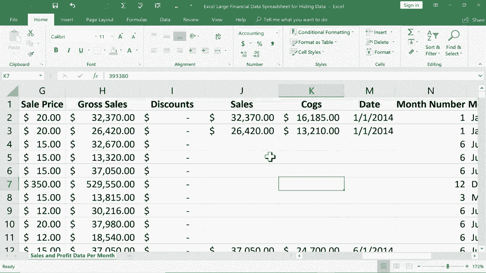

# Excel中级教程！(持续更新中) - P10：10）隐藏数据 

在这个教程中，我将向你展示如何在Excel中隐藏数据，我们还将讨论为什么有时这样做是一个好主意。所以在这里你可以看到我有一个大型财务数据电子表格，这是假设的，但里面有制造成本、销售价格、毛销售额和总利润。

所有这些数据都在这个相当大的电子表格中，并且它还与这些数字相关联的月份和年份。

我这里还有一个名为客户名单的第二个工作表。里面有人的姓名、电话号码、信用卡号码和信用卡类型。但是，假设我的一个合作伙伴或我合作的相关业务需要获取此电子表格中的一些信息。但也许我不希望他们获取我所有客户的个人信息。

我可能不希望他们知道，例如，我从所有这些销售中获得的利润。那么，我如何发送电子表格而不显示我不希望其他人看到的信息呢？那么，最简单的方法就是隐藏数据。你可以隐藏行、隐藏列和隐藏工作表。让我们来看一下如何做这些事情。

假设我想隐藏关于名为Montana的产品的这些数据。所以我想隐藏所有这些行。我所要做的就是在左侧点击并按住行号。因此，行号8。我点击并按住鼠标，然后向下拖动，直到我得到所有在C列中有Montana的记录。

然后我可以释放鼠标按钮。要隐藏那些行，我所要做的就是右键单击任意一个行号并选择“隐藏”。看起来我删除了第8行到第17行的行号，但在Excel中这根本不可能。你不能删除行号。你可以删除数据行，但行号本身永远不会消失。

这意味着它们被隐藏了。我会稍微放大一点，这样你可以更好地看到。在最近版本的Microsoft Excel中，查看隐藏数据变得稍微容易一些。所以如果你仔细看看这里，第7行和第18行之间的线，有一条比正常稍微厚一点的线，表示。

我注意到这里有隐藏的数据。现在，要显示它，有几种方法可以做到。我可以点击并拖动隐藏行的顶部，然后右键单击选择“取消隐藏”，一切都恢复正常。同样的操作也适用于列。正如你所期待的那样。因此，我要去利润部分。假设我不希望我合作的公司知道我们公司的利润。

我所要做的就是点击选择我想隐藏的列。现在，如果我想隐藏多于一列，我会点击并按住拖动。但在这种情况下，只有一列。现在选中后，我右键点击并选择隐藏。此外，客户名单，这很重要。这是客户的个人信息。

我不想让人们看到这个。所以看看我能做什么。我可以简单地右键点击工作表名称并选择隐藏。那张工作表就被隐藏了。现在，我该如何取消隐藏那张工作表呢？通过行和列，我们知道怎么做。通过这一列，我可以点击并拖动到隐藏列的顶部，然后选择取消隐藏。好吧。

关于工作表，你不需要点击和拖动，而是直接右键点击其中一个工作表名称，然后选择取消隐藏。接着你需要选择你想取消隐藏的工作表。在这种情况下，我只有一张隐藏的工作表。但在某些情况下，你可能有两张、五张或十张隐藏的工作表，你需要一次取消隐藏一张。所以在这种情况下。

只有一个，我选择它，点击确定。现在它不再隐藏。我会再隐藏一次，因为假设我确实想发送这个电子表格，我希望它保持隐藏。所以现在我可以保存这个电子表格，并可以发送出去，重要信息就安全隐藏了，对吧？好吧。

有些人可能会想，我发送这个电子表格给的人难道不会注意到隐藏的数据并点击拖动以取消隐藏，或者右键点击以取消隐藏隐藏的工作表吗？是的，他们可以。所以这是个问题。不过，解决方案在于审阅选项卡。

你可以在Pro工作簿上点击，输入密码并点击确认。它让我确认密码。因此，现在我已经保护了工作簿。如果我向下滚动并右键点击工作表名称尝试取消隐藏，看看，它不让我这么做。这是一种保护数据的方法。现在，不幸的是，这里并不适用。

如果我点击并拖动跨越K和M列，然后右键点击，我就能够取消隐藏隐藏的列。所以请注意，可能会有一些人足够聪明去取消隐藏特定列。他们即使在受保护的工作簿中也能做到这一点，但他们无法取消隐藏隐藏的工作表。那么在这种情况下，我该怎么做呢？我不想让他们看到总利润。

我会这样做：我会直接打印。因此，我会进入打印，如果我想的话，我甚至可以将其保存为PDF，然后将其发送给想查看的公司。我想给你展示最后一个技巧。在某些情况下，你可能不想隐藏整个列或行或一系列的行和列，而只是隐藏某个特定单元格。那么，如果我只想隐藏这个单元格呢？好吧。

有一种稍微复杂的方法来做到这一点。如果你去主页标签，这里在字体组中可以更改字体颜色并将其改为白色。你会看到这并没有真正隐藏单元格，但确实隐藏了数字。如果有人点击单元格，数字会在公式栏中显示出来。

所以对此要小心。但这是一种隐藏单元格或范围内信息的方法，而不必隐藏整个列或行的所有内容。如果我打印这个电子表格，它看起来就像那些单元格是完全空白的。感谢观看这个教程，希望你觉得有用。如果觉得有用，请点击下面的点赞按钮。

