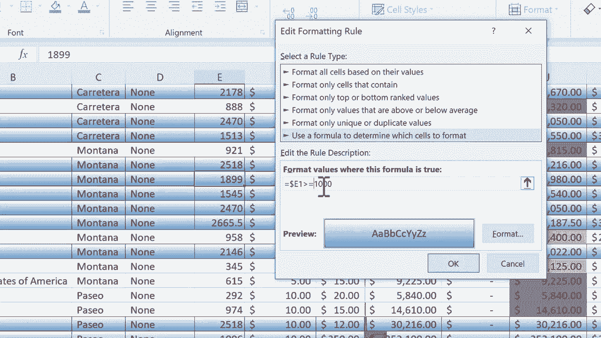

# Excel中级教程！(持续更新中) - P12：12）条件格式高级技巧 

在这个简短的Excel教程中，我想向你展示如何进行条件格式化的高级技巧。如果你还没有看过我的Excel条件格式化深入教程，你可能应该在看完这个教程后再看那个深入教程。在那个深入教程中，我展示了使用条件格式化时的许多选项。

我看过所有这些，但我想在这个简短的教程中分享一个高级技巧。那就是，不仅仅对一列应用条件格式化，就像我在这些案例中所做的那样，对吧，这一列是根据数字越高，单元格越绿来格式化的。这一列中的单元格以不同的方式格式化，数字越高。  

这个条越大。而且我在L列有这些红绿灯符号。但如果你想基于某个数字突出显示整个行呢？例如，在这个电子表格中，我会。

我想突出显示销售最多单位的产品的行等。因此这涉及到E列。但因为我想突出显示整行，所以我需要选择这个电子表格中的所有数据。所以我将点击左上角的A列。

我按住鼠标点击，然后拖动以突出显示所有数据。好了，从A到Q。现在我回到左侧。我的数据仍然被选中，但我只是使用这个条将其移回到电子表格的左侧。现在我要进入条件格式化，我在寻找一个突出显示整行而不是单元格的选项。

你需要去的地方实际上是在这里，新的规则。因此，我点击“新规则”。这里有很多高级选项可以选择，但我只想创建一个公式来确定哪些单元格。现在问题是，我的公式是什么？格式化值的条件是真。

所以我要点击这个框来输入公式。这将是一个绝对公式。这有点令人困惑，但你只需要知道这是一个绝对公式。因此，你需要使用美元符号。所以我在框中输入了等号。所以等于，然后美元符号来了，使其成为一个绝对公式。

然后我需要选择一列。这有点棘手。我该选哪一列呢？嗯，就是我将基于其进行格式化的那一列。这就是E列。记住，我想基于销售最多的产品进行格式化。所以我输入E。那么行呢？E是列，行，这有点棘手。我不知道该选什么。

那会是E2吗？这当然可以。但这样做有一个缺点。相反，我将使用左上角的内容。这是当前活动单元格。A1是活动单元格。所以我将在我的公式中放入这个。所以E1，如果E1大于。所以我输入大于符号。1000。

然后我想让一些格式化发生。作为示例，我会点击格式。我会选择一个边框样式，怎么样，外框，我也可以选择填充颜色，也许是深绿色。这里还有更多颜色可以选择。还有一些填充效果。你可以看到这些不同选项的一些情况。我将保持原样，点击O。

然后如果我点击O，看看会发生什么。我点击了O，Excel分析了整个E列，找到了高于1000的值。如果它们大于100。这整列都被高亮显示了。这样做的好处是，它可以更容易地聚焦于所有符合特定标准的数据。这可以很简单。

虽然，忘记了它基于哪一列。如果你忘记了，可以去这里进行条件格式管理规则，看看，那里有规则。我可以点击它，如果我不再需要这个规则，我可以删除它。我可以编辑这个规则，而我想要编辑一些内容。

注意，现在它被设置为大于1000的值。那么1000本身呢？当然，这不会被包括在内。所以我应该把它改为大于或等于1000，或者更好，更简洁的说法是大于999。这样就会包括1000及以上。然后我可以点击确定，然后应用，然后确定，现在已经改变了。

这是一。

这可能并没有真正影响我的条件格式，但这可能会出现。所以这是需要注意的。感谢这个高级格式。我希望你觉得这个教程有帮助。如果你觉得有帮助，请点击这个。
