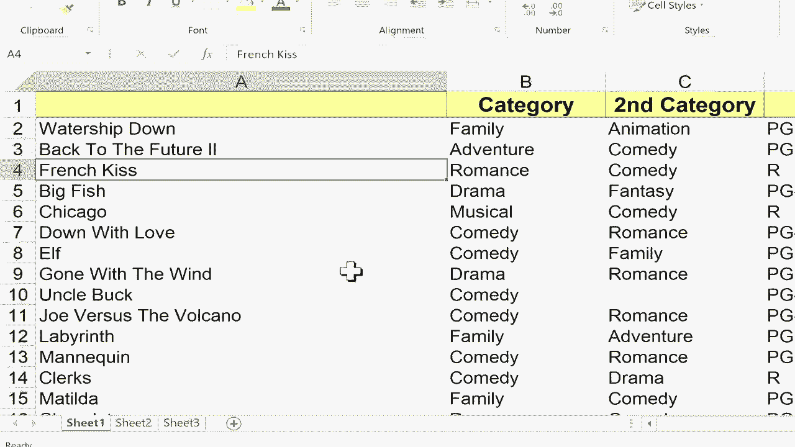

# Excel中级教程！(持续更新中) - P13：13）使用正确的函数修复不正确的大小写 - ShowMeAI - BV1uL411s7bt

在这个简短的Excel教程中，我想给你展示一个很棒的功能。这是Excel中较少为人知的功能，称为proper。现在，proper的作用是修复像我们在A列中看到的问题。假设我最近从别人那里收到这个电子表格。

显然，这是某人没有遵循英语写作规范。你可以看到这些电影标题有些是全大写，有些是全小写，还有些遵循某种疯狂的其他公式来决定什么要大写，什么不大写。因此，修复这个对我来说会相当困难且耗时。

除非我知道proper函数。所以让我们看看如何修复Excel中的这些大小写不规则。首先我会在有问题的列右侧的列上右击。所以我会在列字母上右击。

选择插入来获取一个紧挨着有问题的列的空白列。然后我会转到第一个可用单元格，输入等号和单词proper。然后我放入左括号，需要选择一个有不当大小写的单元格。所以这里是单元格A2。我只需点击那里。我应该放入右括号。

但这不是必需的。所以我不打算这样做。然后我在键盘上按下回车，看看它做了什么。它把这个文本处理成了proper。现在，好消息是我不必对每个有问题的单元格一次又一次地做同样的公式。相反，我只需点击我刚刚做的公式。看起来像单词。

所以如果你怀疑它是一个公式，你可以双击它。你会看到这个公式。当然，你也可以在这里查看公式栏。但无论如何，我只是点击它，然后转到那个单元格的右下角。你可以看到有一个小绿方块。如果你把鼠标指针放在那个方块上。

你应该得到一个黑色的加号，不是白色的加号，而是黑色的加号。只需点击并保持点击，然后向下拖动页面，然后释放鼠标点击，看看它做了什么。它把我所有的文本都处理成了proper。Watership down现在正确大写。Chicago也是如此。不再是全大写了。它修复了elf并使其变得正确。

注意这里的这个，Uncle Buck，完全是小写的。但proper修复了它并使其大写，而不是全大写。我们在这里有一个有趣的案例，但回到未来2。你可能能告诉为什么这会是个问题。因为制作这个电子表格的人把两个字母I都大写了。

而这就是他们如何写《回到未来2》的方式。因此，适当的功能认为那个第二个字母不应该大写。因此，偶尔，适当的用法确实会出错，但在这种情况下，这是一个非常合逻辑的错误。好的，很棒。现在唯一的问题是，我有两列是重复的。

一列有很多不当的大写，而另一列则非常好。你可能会想右键点击并删除A列，但如果这样做，看看会发生什么。你会搞乱已修复的列中的数据。因此，这就是你应该做的，点击B列以突出整个列，然后右键点击复制，再右键点击A列，但不要粘贴。如果粘贴，会有一些错误。相反，去选择特殊粘贴，将粘贴类型从“全部粘贴”切换到“粘贴值”。这样它将只粘贴B列中的值，而不是公式。因此，我点击值，点击确定，现在这些就是值。

它们不是公式。如果你查看公式栏，那儿没有公式。只是从B列复制的文本。因此，此时我可以右键点击并删除B列。我不再需要它，现在我有了电影标题，它们完全不依赖于任何其他列或数据。所以我清理了不规则的大写，感谢观看这个视频，我希望你觉得它有用，如果觉得有用，请点击下面的赞。

