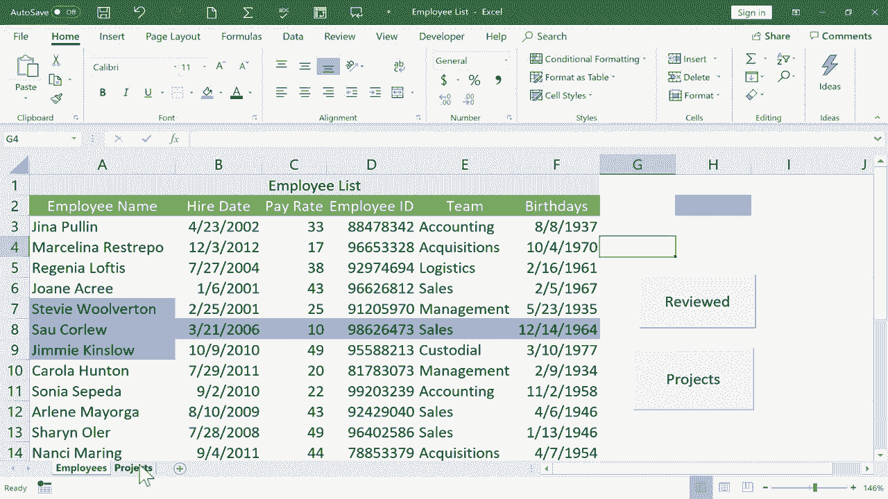

# Excel中级教程！(持续更新中) - P17：17）Excel 宏 - 创建 Excel 快捷方式 

这是Excel宏的初学者指南。如何使用宏为你在Excel中需要完成的任务创建快捷方式。我要用于这个例子的电子表格是一个员工列表。你可以看到这里有几个员工的列表，适用于一个假设的小型企业。

它包含了一些关于他们的信息，比如他们被雇佣的日期、员工ID以及他们所在的团队。在这个项目标签上，我有一个我希望将这些员工分配给的一些项目列表。这样他们就可以开始工作。因此我将在第一个标签和第二个标签之间来回切换。当然，我可以通过点击标签轻松做到这一点。

但是让我们创建一个宏，使这个过程变得稍微简单一些，更方便一些。我想要的是一个按钮，可能就在这里，当我点击那个按钮时，它将我带到第二个标签。其实是这个工作簿中的第二个工作表。那么我该如何做到呢？我只需去开发者标签。如果你没有看到开发者标签。

你可能需要在功能区上右键点击，选择自定义功能区，并确保开发者选项包含在内。但无论如何，我只会去开发者标签并点击它。然后功能区会更改以匹配它。在左侧，有一些与宏相关的选项。在这本初学者指南中。

我们基本上将坚持使用录制宏和这个宏按钮。所以在这种情况下，我将点击录制宏。它会打开一个小向导，我可以用来创建这个宏。默认情况下，它将这个宏命名为宏5，因为在过去，我在这个电子表格中创建了一些其他的宏。所以我要重新命名它。

我会把这个按钮命名为项目标签。接下来，我需要为这个宏建立一个快捷键，一个键盘快捷方式。现在，如果你考虑一下，你知道你在这里需要小心。因为它们已经有R。键盘快捷方式。我们有控制X、控制Z、控制C。这些都是已经存在的键盘快捷方式。所以我不想在这里放控制C。

这样做是个错误，因为控制C已经可以复制了。所以实际上在这个框中放入两个键是个好主意。所以我将按住Shift并点击A。因此控制Shift A现在是我为即将创建的宏保留的键盘快捷方式。这个宏将存储在哪里呢？在这个工作簿中。

这意味着我这里的电子表格集合。现在这里只有两个电子表格，但我可以添加另一个工作表、另一个、再另一个。它们都属于同一个工作簿。我想在这个工作簿中存储这个宏。还有其他选项，但我们就坚持这一点。接下来。

如果我想的话，我可以描述这个宏。我想我会这样做。所以请给我一分钟来输入描述，然后我会恢复视频。这是我非常详细的描述，我点击确定。然后我得到了一个错误信息。我希望你能看到这一点，以便你知道宏标题中不能有空格。

现在，当我点击O时，它应该接受。它确实如此。现在，请注意左上角。现在显示的是停止录制，而不是录制宏。所以它目前正在记录我在Excel中的操作，但重要的是要意识到它并没有记录时间的流逝。我可以坐在这里思考我将如何使用这个宏。我在录制。

我可以思考10分钟、一个小时或10天，随我所愿。没关系，因为它并没有记录时间。它也没有记录我鼠标指针的位置。我可以随意移动鼠标。那些都不会被记录。被记录的是我点击的地方，以及我在Excel中更改的选项和设置。

好的，我想让它记录什么呢。我想让它记录我从员工电子表格切换到项目电子表格。所以我只需点击项目。那就是我想让它记录的所有内容。所以我点击停止录制。这个宏已经成功录制。现在，我要跳回员工电子表格。让我们看看我创建的宏。

如果我点击这里的宏，它应该列出这个工作簿中存在的所有宏。那里就是按钮到项目标签。趁我在这里，我想让你注意到我刚刚选择的宏选项中。它确实允许你删除不想使用的宏，还有其他一些选项。

好吧，我只是想取消这个。现在是我创建一个按钮并将其链接到那个宏的时候了。所以在开发者选项卡中，我要下滑到插入，然后点击。这将弹出一些表单控件。在之前的教程中，我向你展示了如何创建一个滚动条并在Excel中使用它。

如果你还没有看过，我希望你回去看看那个视频。在这个教程中，我们将使用另一个表单控件，那就是按钮。所以我会点击按钮选项。请注意我的鼠标指针发生了什么。😊它变成了十字线，基本上变成了一个加号。这是我可以在屏幕上绘制某些东西的标志。

所以我会点击并拖动绘制一个按钮，我可以让它尽可能大或者尽可能小，尺寸和一切都由我决定。我想我会选择那个大小。当我松开鼠标按钮时，它弹出了这个窗口让我选择要链接到我创建的按钮的宏。目前只有一个选项。所以我点击按钮到项目标签点击O。

我的按钮已创建。如果我双击按钮文本，有时单击一下也有效。我可以更改按钮上的文本。所以我输入“项目”。好吧，现在我点击按钮外的地方来测试一下。我左键点击按钮，看看它做了什么。

它立即执行了我使用记录宏创建的宏，并且它在宏列表中存储着。😊当我点击按钮时，它把我带到了这里。现在我在这里，我可以为一个项目添加某个人。比如说我的好朋友 Marcellina Resrepo。我会把她放到项目 A。现在我强烈推荐，如果你要创建像这样的按钮，让你从一个电子表格切换到另一个。

在第二个电子表格上创建一个按钮，以便返回第一个电子表格是个好主意。所以我很快就会做到这一点，我只需点击开发者记录宏。我会将其命名为返回员工表。我会给它一个快捷键。这次我将跳过描述。我点击了 O，现在宏已经命名。

现在可以开始录制了。这次我点击员工。我完成录制。点击停止。然后我返回项目表以创建我的表单控件按钮。😊在这个弹出窗口中，我需要确保选择正确的，返回员工表，点击 O。也许点击并拖动突出按钮 1。我就将其命名为返回。现在。

当你使用按钮时，如果你点击了按钮之外的地方，下次你点击它时，它会正常工作。它会执行它应该执行的操作。那么我该如何编辑这个按钮呢？如果我后悔它的形状或位置怎么办？我不能点击和拖动。所以诀窍是右键点击按钮。如果你右键点击它，它就会被选中。

然后你可以点击其他地方，再次点击按钮来移动按钮，调整其大小。如果你想的话，你可以剪切它或做其他操作。所以到目前为止，我有两个按钮，一个带我去我的项目列表，另一个让我返回员工列表。现在。这只是一个宏。如果你仔细想想。

我还可以录制其他几个步骤。你可以创建包含多个操作的宏，这些操作在执行宏时会发生。但我选择从这些简单的按钮开始，它们只是从一个工作表切换到下一个。让我们在这个开始的地方看一个更多的例子。视频假设我是这家公司的所有者。

现在是我与所有员工进行绩效评估的时候了。也许我想跟踪我已经与哪些员工进行了评估，以及接下来要评估的是谁。展示这一点的一种方法是在表格中使用颜色。假设我和 M Rerepo 进行了评估。我可以点击并拖动以突出显示整行，或者如果我更喜欢，也可以只突出她的名字。

然后在主页选项卡中，我可以更改文本颜色，或者也许添加一个背景颜色。也许我会说蓝色意味着我们进行了审核。这是其中一种方法。但现在让我向你展示如何将其作为宏来实现。这样我就可以点击一个人的名字，点击一个按钮，自动将正确的颜色应用到那个人的名字上。为此。

我将创建一个宏。我想做的第一件事是点击一下，只需点击电子表格的空白部分。然后我将去开发者选项卡，点击录制宏。我将给它命名为“标记为已审核”。快捷键，我将使用控制键加 Shift 加 C。我点击，O。现在正在录制。现在，你可能认为我想点击这里选择 Gina Pullulin 或 Regia Loftus 或其他这些优秀的人。

但相反，我故意让这个单元格保持选中状态。我将简单地去主页选项卡，主页功能区，选择这个蓝色背景颜色。它只给那个单元格上了色。现在我将返回开发者选项卡并点击停止录制。现在，为什么我让这个单元格保持选中状态？原因是，如果我点击选择 Gina Pullulin 或 Regia Loftus 或其他任何人。

那么每次我执行宏时，那个特定的单元格，假设在这种情况下是单元格 A6，将变成蓝色，但只有这个单元格。原因是因为我在开始录制宏后点击了它。但我实际的操作是，我先点击了这里，然后录制了宏。

我没有点击其他任何东西。因此，Excel 的解释是，它表示 O。他没有点击任何东西。所以所选的内容将变成蓝色，而不是任何特定的单元格。现在，有时你会希望它是一个特定的单元格。在这种情况下，点击录制宏后，点击你想变成蓝色的内容或宏要执行的任何操作。O。

让我们创建一个按钮，看看它是否有效。所以我将去开发者选项卡，插入一个表单控件按钮，我只需单击并拖动以在屏幕上绘制它。我只需要点击“标记为已审核”，点击 O，那里就是我的按钮。在我忘记它的意思之前，我最好在按钮本身上更改名称。我将单击按钮外的地方。假设 Jimmy Kinslow 和我有一个很棒的审核。

我可以点击。名称点击已审核，它立即以我想要的确切蓝色高亮显示他的名字。因此，我不必猜测并试图记住其中的哪个。我可以简单地点击选择，然后点击已审核，它就会改变颜色。现在，如果我想让整行都变成蓝色，比如说对于 Salw Cordew。

我可以点击并拖动以高亮整行，然后点击已审阅。 现在，整行变成了蓝色。 当然，在这一点上，我可以创建另一个宏，如果这些名字或者选中的内容轮到审阅时，就将它们变成黄色。 希望这些例子能给你一些使用宏的想法。

你可以为很多不同的事情制作宏，然后创建一个链接到宏的表单控制按钮，这确实可以为你节省很多时间和精力。 它会帮助你快速从一个工作表跳转到另一个工作表。 当然，在这个特定的工作簿中，只有两个工作表，想象一下如果我这里有10或20个工作表，那确实很难准确点击到我需要的选项卡。因此，拥有一个按钮可以带你到特别重要的选项卡或工作表，确实能为你节省时间。 所以假设在这一点上。

我已经完成了在这个Excel电子表格中创建宏的工作。 当你在电子表格中构建宏时，还有一个重要的步骤就是要去左上角的文件，点击并选择另存为，因为这个电子表格中包含宏。

我必须去这里点击这个下拉箭头，把它从普通的Excel工作簿更改为启用宏的Excel工作簿。 如果你不这样做，未来就无法正常工作。 所以我会点击保存。 现在我们来试试看它是否有效。 假设是明天。

我需要再次处理那个电子表格，我可以直接打开。

看看我最近使用的电子表格列表，那里有。 注意后缀末尾有一个M。 通常在Microsoft Excel中，后缀以S或X结尾。 但在这种情况下，它是XLSM，表示启用宏。 现在，看看当我双击打开它时会发生什么，因为这个电子表格中包含宏。

至少在你第一次打开它时，你可能会看到一个安全警告，宏已被禁用。 所以为了使用它们，我必须点击启用内容。 现在，我的宏应该可以工作了。 而且确实可以！

谢谢观看。 希望你觉得这个教程有帮助。 如果有，请点击下面的点赞按钮。
