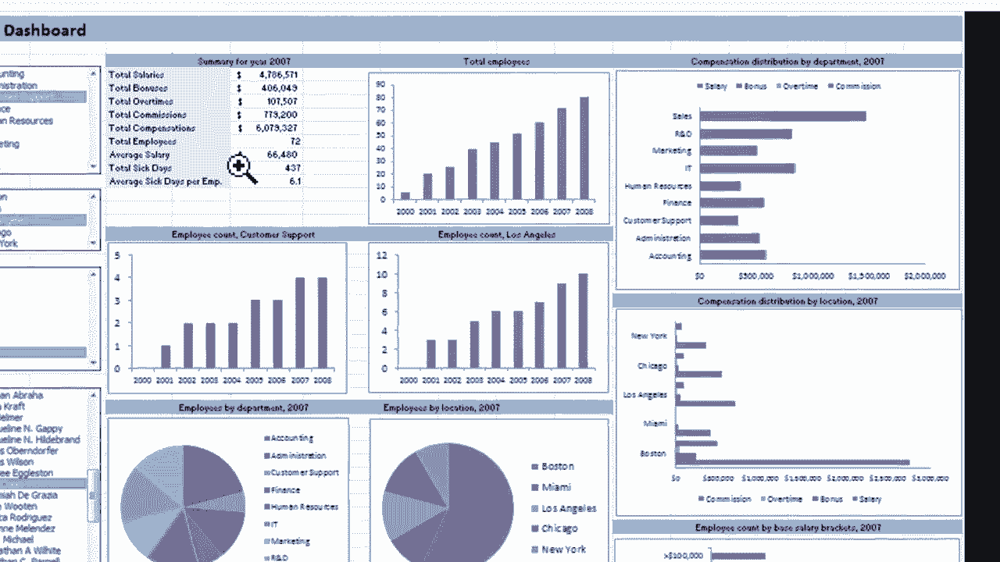
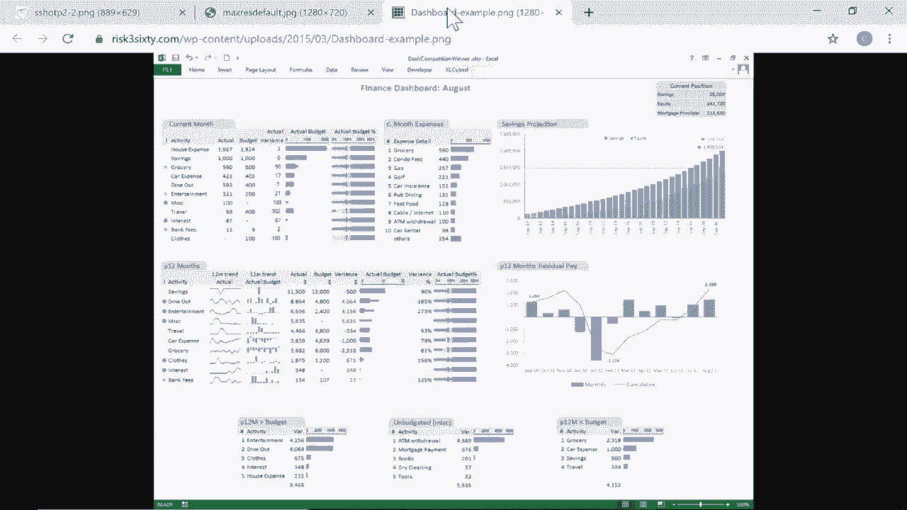
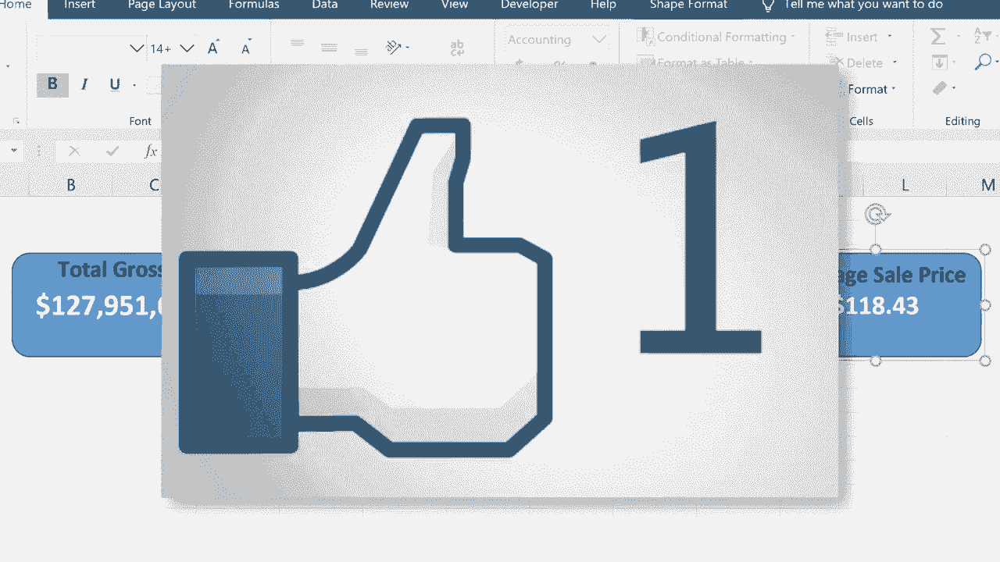

# Excel中级教程！(持续更新中) - P18：18）仪表板 - ShowMeAI - BV1uL411s7bt

这是为您的 Excel 工作簿创建仪表板的初学者指南。什么是仪表板呢？我可以给您几个例子。这是一个仪表板的例子。现在，这是一个美丽而复杂的仪表板，非常复杂。但这并不是我在这个视频中要展示的内容。

我们将从基础知识开始，看看如何入门创建仪表板。但您可以看到这里有一年的总结。这是在仪表板上显示的数据，但这些数据实际上来自另一个电子表格，或者在某些情况下，来自另一个工作簿。

这里是一个图表，一个饼图，还有一些图形等等。而且再次强调，这里在仪表板上显示的所有数据都来自一个电子表格。通常，电子表格看起来复杂得多。数据满是杂乱，但仪表板让您专注于特定的数据和指标。😊

您想看看另一个例子。这一个展示了按州的销售总额和趋势。现在，当然，在 Excel 中，您可以创建这样的东西。只需在普通电子表格上写。但通过仪表板，可以更美观地将重要的图表、图形和数字从您通常使用的常规电子表格中提取出来，并将它们分开放在自己的电子表格上。

这是第三个例子。因此，这些都是非常高级、复杂的例子。但现在，让我们看看创建您自己的 Excel 仪表板的基础知识。所以在这里我有一个复杂的大型财务数据电子表格。这里有数以百计的行数据，数以百计的记录，以及大量的信息。

还要注意，过去的年份列在右侧。因此我们有2018年、2019年和2020年。

所以这只是很多信息。我怎么知道我在看什么？我怎么知道什么是重要的？好吧，如果我知道如何创建电子表格，知道如何读取电子表格，我当然可以通过关注我所看到的来获取这些信息。但有时我们需要简化事情。所以在左下角这里。

在这种情况下，我想设置一个新的电子表格，新的工作表。所以我会点击加号，它自动命名为 sheet4。但我将双击该名称并更改它，称其为 dashboard。现在，如果您愿意，您可以称其为其他名称。我会在键盘上按回车键。我的第四个电子表格就来了。我打算把它移动到前面。

这将成为我的仪表板。现在，每当你创建一个仪表板时，最好先规划一下你究竟要在仪表板上显示什么。也许在左上角，我想要一份年度总销售额的列表。也许在这里，我想展示平均价格之类的东西。所以规划一下是个好主意。

有时候在纸上做会有帮助，或者你可以省略一些步骤，直接在Excel中完成。这就是我在这个教程中要做的。所以我想要去这里插入。设置仪表板的最简单方法之一就是使用一些简单的形状。对我来说，形状隐藏在插图下。对你来说。

只需寻找你的插图组。你应该能看到它。我会进入形状。这里有很多我可以使用的形状。😊，我会使用矩形，但可能是那种有弯边的形状。所以我会点击并拖动来设置一个形状。好的，我想要我的当前年份。

假设2020年的总销售额要在这里显示。我想它出现在这个蓝色框中。现在我可以点击这个框，然后输入。我可以输入文本。我可以输入数字。我可以找出2020年的总销售额是多少，然后输入进去。但这没什么特别的，对吧。

它不会随着更多项目的销售而更新。所以让我们来看看如何让它自动更新并与实际数据同步。所以我会删除我放在那里的数字。这个技巧是点击形状，使形状在这里，然后将形状链接到相关数据。做法是，一旦选择了形状，就上到公式栏输入等号。

所以这个形状等于。然后点击2020。我想要总销售额。所以我要一路向下到这个数据的底部。这是一个相当大的电子表格。让我快速给你展示一个技巧。如果我在总销售额上点击，即使在标题上，我可以按住控制键，然后按下箭头。

这应该把我带到电子表格的底部。好的，看看，这里有总计。所以我可以点击我想用的确切单元格，然后在这里。看，我的光标在闪烁。这就是我现在正在处理的内容。所以我在键盘上按下回车键，看看，它已经将这个形状链接到这个电子表格上的数据。

好的，你可以看到它以598结束。5598。5现在在仪表板上。我可以通过点击它使其看起来更好。我可以调整，比如字体大小，让它变大。也许这太大了。好了，我可以决定是否要居中，我想要。我可以水平和垂直居中。我觉得看起来好多了。

我还可以去字体颜色选项，选择黑色以外的颜色。我可以选择白色。我觉得这看起来不错。也可以选黄颜色，几乎可以用这些颜色中的任何一种，让它看起来更好一些，让它更吸引眼球。你也可以改变形状的背景色或填充色。

所以可以玩一下字体和形状填充颜色，找出最适合你的样式。现在，你可能会想这只是外观问题，没那么重要。你可能是对的，但其实，仪表板的整个意义就是让它看起来好看，吸引人，并且便于人们获取和阅读他们所需的信息。好的，现在我有了这个形状，它链接到这个电子表格上的数据。现在。

让我们看看如果下方数据改变会发生什么。这里我们有5061。如果它变成25065，当我输入这个数据时，它会改变这里的总数。仪表板会更新吗？是的，它会。仪表板应该始终与其链接的数据匹配。现在，我确实对这个有一个小问题，那就是我不太确定这个数字代表什么。

我有几种方法可以解决这个问题。我可以去插入并添加一个文本框，所以我可以在这里点击文本框，然后点击并输入总销售额。我可以点击并拖动，把它放在同一个框里，然后把它设为粗体，字体大小也许还要大一些。再次强调，当涉及到仪表板时。

我们所做的很多事情是让东西看起来更好。所以我觉得这个看起来相当不错。现在，如果我之后决定把这个移动到别的地方，我可以点击并拖动。可是，看看这两个项目，文本框和带数字的形状，它们并没有真正连接在一起。这可能会是个问题。

你可以尝试解决这个问题的方法是点击形状，按住控制键并点击文本框。现在它们都被选中了，然后在页面布局选项卡的排列组中，有一个选项可以对对象进行分组。所以我会点击那个分组。现在它们的行为就像是一个对象。

现在我可以非常轻松地移动仪表板的元素，把它们放在我想要的位置。这只是创建仪表板开端的一种方法。还有很多其他的选项可以选择。而不是把标题放在框里，我可以插入另一个形状，让它出现在这里。也许我会在上面再放一个矩形。

我把文本放在这里，然后可以把它们组合在一起。但是现在，我会先坚持这样。这只是一个基本的Excel仪表板。现在，关于我的仪表板的下一个元素，假设我想追踪售出商品的总数。但这次我想节省一点时间。所以我该怎么做呢？

我会右键点击我已经创建的仪表盘元素。然后选择复制，再右键点击粘贴。所以现在我有两个了。不幸的是，它没有复制标题，总销售额。所以我仍然想要那个。我只需选择它，控制+C控制+V复制粘贴，然后我会把它拖到这里。

现在我可以双击它，突出显示整段文字，并可以输入销售总数。所以左边是美元，这只是售出商品的总数。现在，很明显。我这里的数据链接不正确。它与我刚输入的文本不匹配。所以我必须改变这个形状链接到的内容，但这并不难。我只需点击它。

然后我上到公式栏。'。L那儿有什么。接着我会进入2020年的电子表格，找到售出单位。就在这里。按住控制键并点击向下箭头。它会带我到电子表格的最低部分。你会注意到我确实有点作弊。我在总计下面添加了平均值。

但现在我仍在处理总计。所以我会在售出商品的总数上点击那里。你可以看到上面，它已输入到公式栏。我按下回车键回到这个屏幕。你会看到它已正确链接，806806。现在，不幸的是，它确实改变了格式。但没关系。

我可以点击一下，然后再点击回去。我可以再次上到这里，进行之前做的相同调整。再一次，如果我想把这两件事连接起来。我应该在按住控制键的同时点击它们，然后去页面布局并分组。给我一点时间再添加一个元素到这个仪表盘。

这将是售出商品的平均价格。所以我需要获取其中一个平均数。我想是这个。仪表盘的其中一件事就是你必须非常小心。你必须确保获取正确的源数据。如果不这样做。

这可能是个大错误，会给人们造成很多问题。所以给我一点时间设置第三个仪表盘元素。这与我之前做的两次非常相似。然后我会继续录制视频。这是这个工作簿仪表盘的一个很好的开端。

我基本上会在这里结束这个初学者指南。但在结束视频之前，还有几个小的整理事项我需要做。第一，这是钱。它应该附带一个美元符号。这样我就能明白我在看什么。这个就很好，保持不变。这一个这里，又是。

应该有一个美元符号。此外，在所有这些数字中有118并没有太大意义。我想改变这些，使它们更易读和理解。但如果我在这里点击，然后去主页选项卡，主页功能区，通常我可以使用这些工具来改变这些数字的显示方式。

它们看起来是灰色的。我无法做到这一点。所以这里有个窍门。我必须去源数据。所以在2020年的电子表格中，这是第一条信息。我需要点击它，然后在这里更改格式。所以我将其更改为货币格式，并注意到这也解决了美分的问题。

现在如果我回到仪表板，看看，它显示为美元和美分。现在这个数字太大，我需要做一些更改以使其适应。实际上，我可能只需拉伸矩形。我觉得这样看起来不错，但至少是可读的。哇，看看这个，我希望这是我的公司。

让我们尝试对平均价格做同样的事情。我将在这里找到平均销售价格。请注意，我可以直接去主页选项卡，使用这些工具来增加或减少小数位数。这样我就可以将小数位数减少到只有两位数字。如果你回到仪表板，看看，这解决了问题的一部分。但实际上，这个数字是货币。

所以我真正需要做的就是将其切换为货币格式，这样也能解决问题。好了，这就是你需要了解的，以开始创建自己的Excel仪表板。还有一些其他的中级技能和一些高级技能。如果这个视频和这个主题引起了很多兴趣。

我会考虑创建一个Excel仪表板的中级指南，然后可能再做一个高级指南。与此同时，我希望你觉得这个教程对你有帮助。如果有，请点击下面的喜欢按钮。
