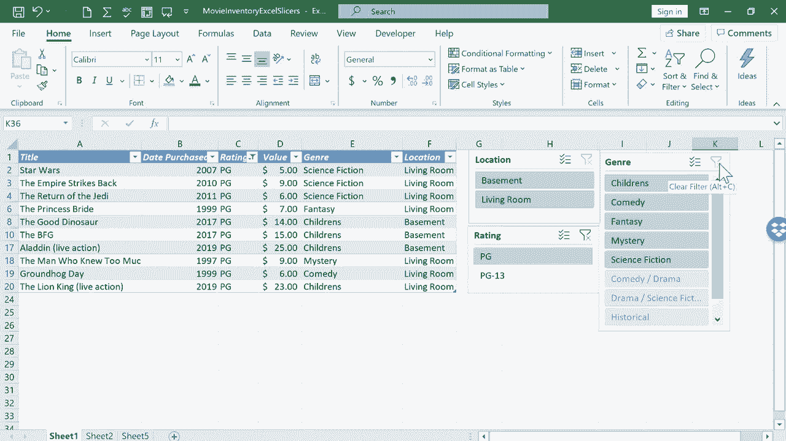

# Excel中级教程！(持续更新中) - P20：20）使用切片器筛选数据 - ShowMeAI - BV1uL411s7bt

在本教程中，我将向你展示如何在Excel中使用切片器来显示你想查看的确切数据。那么，什么是切片器呢？基本上，切片器是过滤器的替代方案。在之前的视频中，我展示了如何在Excel中排序和过滤。我演示了如何选择包含列标题的行，然后去主页选项卡，点击排序和过滤，再点击过滤。

这使得你可以过滤特定数据。例如，假设我不想在这个列表中看到任何Pg13的电影。我只需取消选择Pg13，点击“确定”，所有Pg13的结果现在都因为这个过滤器而被隐藏。这是展示你想在电子表格中显示数据的一种方式。但在某些情况下。

过滤器并不是理想的选择。它们可能会隐藏数据，使得其他可能使用同一电子表格的人不知道这些数据的存在，可能会错过它。此外，过滤器有时可能会有点笨重且难以使用。因此，我想向你展示切片器作为过滤器的替代方案。如果你打算使用切片器。

首先，你必须清理你的电子表格。这是我在很早之前的第一个Excel视频中使用的电子表格。《Excel初学者指南》。但我需要清理一些东西。首先，我想去掉顶部的这个电影库存标题。我其实不需要它。

这是电子表格上方的名称。所以我其实不需要它。它实际上会妨碍我想做的事情。所以我会删除它。我只需右键点击行号一，选择删除，就可以删除整个行。清理这个电子表格的另一件事是注意数据底部的情况。

我有一些额外的信息。但是为了创建切片器并正确使用它们，你不想在电子表格的主要数据下面有额外的数据。因此，我将把这些清除掉，清除的方法之一是选择数据，右键点击并选择清除内容。我甚至会在右侧做同样的事情，清除这里的额外数据。

只需选择它，右键点击，清除内容。我也会清除这部分内容。我将选择无边框来去掉这个。现在，清理电子表格的原因是我想把它变成一个表格，现在它只是一堆在一个范围内的数据。这是一个数据范围。但我想将其变为正式的表格，所要做的就是在数据内部的某个地方点击。

就在这里。然后我会去插入功能区的插入选项卡。那里有表格的选项。所以我点击表格，Excel会查看数据并试图猜测我想要表格的位置。我觉得它猜对了。我会点击O，看看它做了什么，它将这些数据格式化为表格。如果我不喜欢它的格式，我可以上去选择表格设计。

我可以做一些更改，选择不同的颜色和其他东西。但这对我想做的事情来说已经很好了。好的，下一步是添加切片器，这将帮助我更轻松、更直观地筛选数据。我只需点击表格内的任意位置。当我这样做时，我会得到表格设计选项卡。

我会在那里点击。然后在工具组中，它显示插入切片器。所以我会点击。Excel给我提供了选择在电子表格中使用哪些切片器的选项。在这里，你只需选择你最关心的数据，也就是对你最重要的数据。例如，对于电影，我认为类型是相当重要的。

我可能想看一部奇幻电影。我可能想看一个悬疑片。所以这是一种非常重要的数据。存储在房子里的位置，这很重要。还有电影评分，比如P G、P G 13，这类的。所以我就选择这三项。然后我会点击O。看看它做了什么，它给了我。

三个切片器，这个名字有点奇怪。但这三个框确实让我对电子表格中显示的内容有很大的控制。我会把它们缩小一点，这样在屏幕上放置会更容易。这个框可能会有点麻烦，适应不良。我想我可以把右下角的视图缩小。这应该能更容易地适应所有内容。我就把它放在那儿。

我会再放大一点。因此，现在激活了这些切片器，我只需点击它创建的一些按钮。假设有个家庭要来我家拜访。我们的一些朋友，我们邀请他们来和我们一起看电影。假设我们想看一部喜剧。

我所要做的就是点击喜剧。看，只有两个选项。现在，因为这两个选项都存储在客厅。注意地下室发生了什么，地下室变灰了。我不能选择，因为没有结果会发生。我现在也可以按评分进行筛选。假设孩子们要观看。

而且我们不想要P G 13。我可以点击P G。现在我知道我们要再看哪部电影。太好了。不过，现在假设我想再运行一次。我所要做的就是清除筛选器。你不能只点击取消选择客厅和取消选择P G。你必须点击这个按钮，清除筛选器，清除筛选器，清除筛选器。

现在我们回到了完整的电影列表。有些人可能注意到我之前遇到的小问题。当我点击喜剧时，它排除了喜剧剧情片。好吧，那些也是喜剧。所以这里有一个小按钮，你需要了解一下。它叫做多重选择。如果你想能够点击多个按钮。

你实际上需要点击这个按钮，以允许你选择多个。所以如果我想在这里看到喜剧剧情片和喜剧，看看你该怎么做。首先，你点击这两个中的一个，假设是喜剧。再一次，它只给我两个结果。然后我尝试点击喜剧剧情片，但那会切换掉喜剧。

所以你需要点击多重选择，以便选择第二个选项。好的，现在我看到有三部电影的观看列表。希望你能看到Excel中切片器的实用性。这是生成你想查看和展示的特定数据列表的好方法。

感谢观看本教程。希望你觉得它有用。😊
