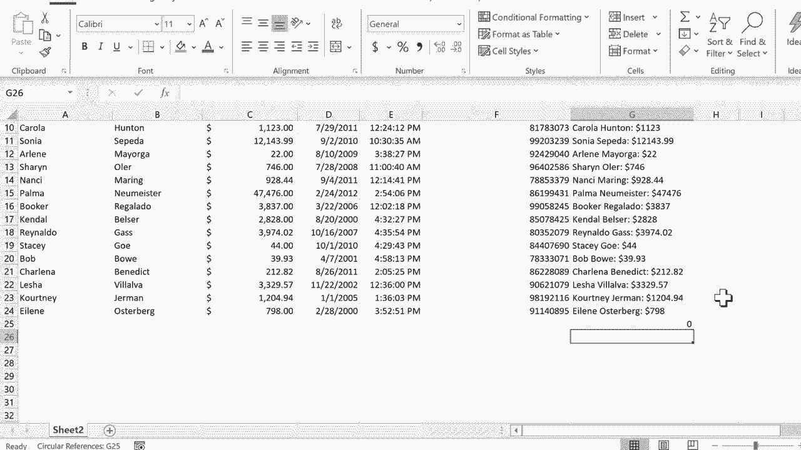

# Excel中级教程！(持续更新中) - P21：21）组合来自多个单元格的数据 

在这个教程中，我将向你展示如何轻松地将多个单元格中的数据合并在Excel中。所以我们来看这个电子表格。这是一个假设公司的客户关系追踪器。这些都是这个公司的客户。你可以看到他们的名字在这里。姓在单独的列中。他们从公司购买的总额和其他一些数据。

那么如果我想将一些数据合并在一起呢？假设要生成一个客户档案，并将这些信息放在右侧的一列中。所以我可以在G2中点击这里，输入客户档案。看起来它没有复制格式。我只需点击我想要复制格式的单元格，然后去主页选项卡。

点击格式刷，然后点击这里。这样格式就一致了。好的，看看我怎么能做到这一点。我可以将单词Gina添加到单词pullin中。假设他们的购买总额是以美元计的。我只需在G3单元格点击这里，输入等于。这个单元格等于。

我想要它等于Gina，所以我点击Gina。然后我还想要它包含单词pullin。但如果我点击pullin，它就变成了B3。那么如果我点击Gina加pullen并按回车，会怎么样呢？看，Excel似乎不理解。它似乎无法计算。你知道，如何将一个名字加上另一个名字。所以正确的做法是输入等于，点击Gina。

然后你输入一个&，有些人称它为“和”符号。所以输入A3&pullen。现在看，如果我在键盘上按Enter或Return，会发生什么。它显示Gina pullen，它将A3单元格的内容与B3单元格的内容合并。现在这里有个问题。Gina和pullen之间没有空格。我们来解决这个问题。

我只需在&后面放一个空格。输入引号，按空格键，再输入引号，然后再输入&。这样做应该将A3中的内容与一个空格连接，然后再与B3中的内容连接。所以我在键盘上按回车，成功了。现在我们再做一点改变。我想要添加购买总额。

我再添加一个&，可能还要再加一个空格，或者也许是一个冒号。我们试试冒号，然后再加一个&，可能我还想再加一个空格。所以我在引号中输入空格，然后再加一个&，现在我要点击这里的购买总额，按键盘上的Enter键，或者如果你用的是Mac，按回车，看看我们得到了什么。Gina pullin $40。如果我真的想要挑剔一下这个。

我可以进去加一个美元符号。所以在最后的和号引号美元符号引号之后，我需要另一个和号，然后在键盘上按回车或输入。现在看起来正是我想要的样子。所以这是一个非常简单的客户档案，但它让我知道多年来购买我们产品最多的客户名字。

现在，不幸的是，我必须对每一个客户都这样做，对吧？

嗯，实际上我只需要点击Gina Pullin 40，然后去自动填充手柄。我会稍微放大一下。但是你可以在这里看到，每当你点击单元格的右下角时，应该会有一个非常小的方块。你可以在那看到它，绿色的。

这就是自动填充手柄。它的作用是复制。当你点击并拖动时，它会复制所选单元格中的内容。有时它不仅复制，还会扩展。如果你还没看我关于自动填充手柄的教程，真的需要去看一下。但在这种情况下，我确实只想复制这个单元格中的内容。现在。

有些人可能会说，不，你不想复制Gina 40。好吧，如果你想想，这并不是这个单元格里的内容。如果我双击这个单元格，或者只点击一次并查看公式栏，你可以看到这实际上是一个公式。它不仅仅是Gina和$40。

所以我想把这个公式复制到这一列。于是我点击并按住自动填充手柄，向下拖动表格并释放。看看它做了什么。它将名字、姓氏和每个客户的总销售额组合在一起。

现在，有一点需要注意的是，G列的结果会被视为文本。所以这些并不是真正的数字。虽然包含数字，但如果我做自动求和，它实际上不知道如何处理，因为这些并不是真正的数字。它们只是将文本与数字组合在一起的公式，结果基本上被视为文本。

我真的认为你使用Excel越多，你就越会看到机会使用和号将多个单元格的数据组合在一起，汇总到一个单元格中。感谢观看。我希望你觉得这个教程有帮助。如果你觉得有帮助，请点击下面的喜欢按钮。

