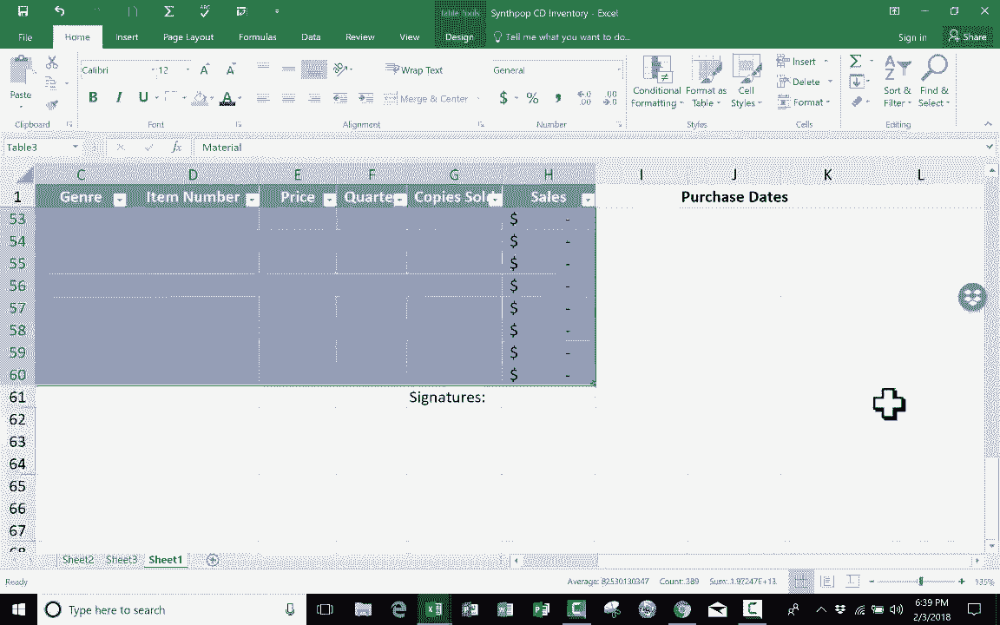

# Excel中级教程！(持续更新中) - P23：23）最有用的键盘快捷键 

这个 Excel 教程涵盖了 Microsoft Excel 中最有用的键盘快捷键。我想先从两个非常常见的键盘快捷键开始。这些几乎可以在每个程序中使用，但我仍然认为它们很重要，对你来说很有用。第一个是控制键 S。你按住控制键，然后轻按字母 S。当你这么做时。

它会保存你的电子表格。因此，这相当于点击保存按钮或点击文件然后保存。接下来，我们有控制键 P。你按住控制键，轻按 P。这样会在 Microsoft Excel 中弹出打印选项。现在你可以直接点击打印按钮，将文档打印出来。就像我说的。

这些快捷键非常常见，但我认为如果你不知道它们，你需要了解它们。接下来，我们有控制键 T。控制键 T 的作用是将所选单元格转换为表格。你可以看到我屏幕上已经有一个表格。这是合成流行和新浪潮乐队的列表，最近发布的作品。

专辑以及它们在 Amazon.com 上的当前价格。你可以看到这是一个表格。你可以告诉这是一个表格，因为它以特殊的方式格式化。颜色交替等等。你可以明显看出这些数据是要一起在这个表格中呈现的。我可以简单地通过按住控制键并轻按 T 来创建这样的表格。所以例如。

在这里的第三张表上。我将点击这里，数据是我想要转换为表格的。我要做的就是点击并拖动以高亮显示我想转换为表格的范围。我松开鼠标。现在我按住控制键并轻按 T，Excel 会询问数据在哪里。它似乎已经知道了，但如果出错了，我可以更改。我的表格有标题。

是的，它确实按照我们支出的日期来操作，但如果没有标题，我可以取消选中它，然后点击确定。看看它做了什么。它自动将数据转换成了一个表格。所以控制键 T。一个我经常使用的非常有用的工具。回到 sheet1，接下来我要展示的 Excel 键盘快捷键与在 Excel 电子表格中移动有关。

在很多情况下，这就是使用 Excel 最困难、最乏味的部分。我不断需要在电子表格中的数据之间导航。因此，我需要向上移动以进行更改，然后需要向下移动到底部，说实话，这是一个相当小的电子表格。但如果你有 2000 条记录，或者有 5000 或 10000 条记录在你的电子表格中。

想象一下要在电子表格的顶部和底部之间跳转，反之亦然。有时选择正确的数据时，点击和拖动也可能很困难。如果我想选择整个行，有时这会比较困难，我可能会不准确地选择，同样如果我想选择整个列。

有时这很难做到。所以我们来看看一些键盘快捷键，这些快捷键可以使这些任务变得更简单、更快速。第一个例子是，每当你想要到达电子表格中的数据左上角时，只需使用键盘快捷键控制+Home。按住控制键，点击Home，看看它做了什么。它把我带到了数据的顶部。

不仅如此，它实际上还去了左上角。所以这个单元格实际上是突出显示的单元格A2，因为数据就是从这里开始的。所以控制+Home非常有用。让我们看看相反的例子。很多时候你需要到达数据的底部。

你按住控制键并点击End键。注意它做了什么。它把我带到了电子表格中数据的右下角。现在，我将再次点击控制+Home，向你展示另一种到达数据底部的方法。但这个方法有点不同。也就是按住控制键并点击下箭头。

当你这样做时，它会把你带到数据的最底部。但请注意，虽然它位于右下角，但它只是把我带到了底部记录。因为我已经在A列，所以它带我到A46。但我们再试一次。我将按控制+Home回到顶部。假设我在单元格E2。

我按住控制键，点击下箭头。看看它做了什么。它把我带到了底部记录。它没有把我移到左边或右边，而是让我停留在同一列。下一个键盘快捷键与在表格内移动无关，而是从一张表到另一张表。

现在，我在第一张表中，所有内容都是乱序的。好的，但sheet1实际上是列表中的第三张表。如果我想去第三张表，我只需点击它。如果我想去第二张表，我只需点击它，然后再回到第一张表。但键盘快捷键的主要目的之一是让你的手保持在键盘上。每当你不得不把手离开键盘去使用鼠标或做其他事情时，效率就会降低。

你现在使用Excel的效率更低。这就是为什么我们有键盘快捷键，让我们的手保持在键盘上，以便我们可以完成需要做的工作。因此，不用鼠标点击sheet3或sheet2，我只需按住控制键并点击Page Up键，看看发生了什么。它把我移回了这张表，如果我再次点击控制+Page Up，它会把我带回到之前的表。

那么反向情况如何？如果你想移动到右边的下一个工作表，你按住控制键并点击向下翻页，再按一下向下翻页，我就回到了起点。所以那些最后几个键盘快捷键，我想你会觉得它们有用且相当有帮助，能够快速在电子表格中导航，迅速到达顶部、底部或其他工作表。下一个键盘快捷键有点有趣。

说实话，我并不常用它。但控制键D是用来向下复制项目的。例如，这些惊人的合成流行或新浪潮乐队在这个电子表格中列出了多个CD，除了布兰登·弗拉沃斯。但他除了这张惊人的CD外还有其他发行物。

一两年前出现的期望效果。如果我想为布兰登·弗拉沃斯添加更多条目，我可以点击那个单元格，复制并粘贴，或者我可以点击它并使用自动填充手柄来填充。但是相反，我将使用控制键D。为了做到这一点，首先。

我需要选择我想复制的布兰登·弗拉沃斯（Brandon Flowers）。然后向下拖动到我想要复制的地方，直到60。然后我按住控制键T D。因为我在一个表格中，所以我收到这个警告，但不用担心。我只需点击确定，它就把布兰登·弗拉沃斯添加了几次到这个电子表格中。

就像我说的，控制加D，挺有趣的。我喜欢使用它，发现它很有帮助，但我并不常用。那么现在让我们来看最后三个我推荐每个人学习的键盘快捷键。这最后三个将涉及在Excel中选择数据。你必须经常选择数据以便进行复制和粘贴，或更改电子表格中数据的字体、格式或对齐方式。

有很多例子和很多时候你需要选择数据。当然，你可以手动选择，只需点击并拖动以高亮选择文本。这是一种好的方法。让我们看一些快捷键。如果你点击了电子表格，可以按住控制键并点击A，它应该选择全部。

现在如果你在一个表格中，注意它选择了表格中的所有内容，而不包括表格外的任何信息。然而，如果我再次按住控制键并点击A，那么它确实会选择所有内容。所以你可以看到这确实发生了。然而，在这种情况下。

我只想选择这个表格。所以按控制键A，仅选择这个表格。我将使用控制键C，当然，这是复制，然后我去，假设是工作表2。我将按住控制键并点击V粘贴，它就在那个表格中粘贴了。所以控制键A选择所有内容，除非你在一个表格中。

然后它会选择表格中的所有内容，但没有其他的。但是再说一次。你可以双击 Control A 来选择所有内容。好的，接下来我们有 Control 空格。Control 空格用于选择整列。把光标放在你想要的位置，按住 Control，轻敲空格。整列就被选中了。

然后你可以根据需要复制、粘贴它，或者更改其字体、对齐方式或你需要做的任何事情。最后，我们有 Shift 加空格。这是我们第一次使用 Shift 而不是 Control。但是你按住 Shift，轻敲空格，就会选中整行。所以我希望你觉得这些键盘快捷键有用。如果你有。

请点击下面的赞按钮。
