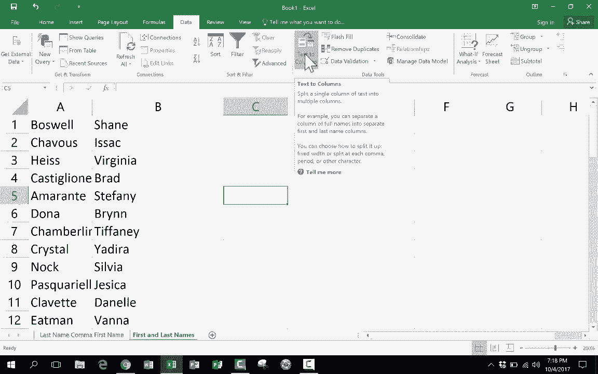

# Excel中级教程！(持续更新中) - P24：24）拆分名称教程 - ShowMeAI - BV1uL411s7bt

在这个Excel教程中，我们将看看如何在Excel中拆分名称。这个视频是我关于Excel制作的系列中的一个。所以如果你还没看过我的其他Excel教程，请尽快观看。但在这个特别的视频中，我们将要做的是看看如何拆分名称。

这是Excel中的一个常见问题。也许你在像这样的工作表中工作，工作表中有人的姓氏，后面跟着逗号。然后是他们的名字。这在处理数据时非常非常常见。这样处理数据很不错，因为你可以根据姓氏字母顺序排序和排列这些信息。这样挺好的。但不时地，将这些分开并将名字放在B列中是很重要的。

例如，如果你不想一个一个地进入每个单元格并删除，然后复制粘贴，将名字放在这边的列上，你该怎么做呢？

如何将这些分开？另一个常见问题是数据像这样。名字，空格。姓氏。在某种程度上，这甚至更糟，因为这使得按姓氏字母顺序排列变得非常困难。好的，让我们看看如何解决这些问题。我将回到第一个示例。姓氏，逗号，名字。就像我说的，这并不糟糕。

但如果我想知道这个列表中有多少人名字是乔纳森，或者名字是玛丽，或者其他什么名字。在同一列中有名字和姓氏将很难做到这一点。所以解决这个问题的方法是点击该列的字母，在这种情况下是列A。然后我只需要确保我在数据选项卡上，数据功能区。

我去数据工具组，寻找文本到列。我只需点击它。然后我会看到一个弹出窗口，它是将文本转换为列的向导。第一步是我必须选择这两个描述中的哪个最能描述我的数据。它是分隔符字符，例如逗号或制表符分隔每个字段。那么我们来想一想，是否真的有逗号或制表符分隔每个字段？是的，我确实在每一个字段之间有逗号。所以我将选择分隔符，然后点击下一步。接下来，这个屏幕让我设置数据包含的分隔符，默认选中了制表符。我将取消选中制表符，然后向下选择逗号。刚刚我这样做后，注意发生了什么，它在下面显示了数据预览，并显示这将有效。现在在我点击下一步之前。

注意它说将连续分隔符视为一个，所以例如，姓和名之间也有一个空格，我会选中“将连续分隔符视为一个”。这样做应该去掉它们之间的额外空格。

现在我将点击下一步，如果我想的话，我可以设置列数据格式。所以我想保持为普通文本，但如果我想的话，我可以将其特定设置为文本或日期，并可以选择我想使用的日期格式。所以我就将其保持为普通，点击完成，看看它做了什么。

它成功地分割了名字。姓氏在这里，名字在这里。它去掉了逗号和额外的空格，只有一个例外。看起来Eselle的姓和名字之间有两个空格，逗号和名字之间，所以我将删除那个，现在我有了完美分割的名字。现在我们来看另一个问题，姓和名之间唯一的分隔是一个空格，几乎是一样的。我只需点击列字母，然后再次进入数据文本到列，真的很简单。

再次分隔。所以这次我将点击下一步，而不是逗号，我只会检查空格。在这种情况下，我可以取消选中将连续分隔符视为一个的选项。然后我只需点击下一步。我真的不想更改任何内容。我会点击完成，这样它就能完美地分割这些名字。现在我完成了分割名字。

如果我想让姓在第一列，这很简单。我只需去到A列，右键点击列字母并剪切，然后转到C列，右键点击并粘贴。你可以看到这做了什么。它只是将A列的名字复制粘贴到C列。我甚至可以现在右键点击A列并删除整个列，现在我在A列有姓，在B列有名。

所以文本到列确实是相当简单，非常容易。但这是一个很多人不知道的不错的Excel功能。所以感谢观看。我希望你喜欢这个视频。如果你喜欢，请点击下面的点赞按钮。
