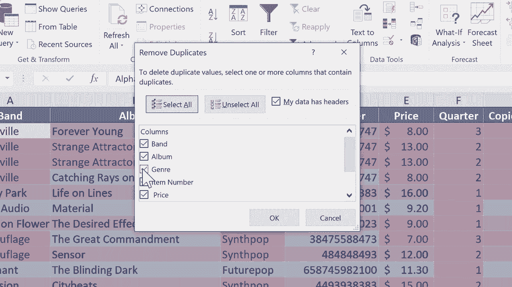

# Excel中级教程！(持续更新中) - P27：27）处理重复项并查找唯一数据 - ShowMeAI - BV1uL411s7bt

在这个Excel教程中，我们将解决重复项的问题。所以在这个电子表格中，我有一个假想的音乐CD商店的库存，假设吧。它专注于有史以来创造的最佳音乐，也就是合成波和80年代新浪潮。我相信你已经知道这一点。但你可以在这里看到一些非常精彩的乐队名单。

这里还有其他数据。这很好。但不知怎么的，一些重复项出现在这个电子表格中。所以你可以看到这里，阿尔法维尔（Alphaville），这是一支以他们的歌曲《永远年轻》而闻名的德国乐队，也在日本非常受欢迎。他们最近推出了一张名为《St attractor》的新专辑。你可以在这里看到。

不知为何，我有两条该专辑的记录。在稍微浏览一下电子表格时，我可以看到这里有一条来自最近的OM D C D的重复记录。还有杀手乐队。😊。太棒了。所以这里确实有一些重复项。也许这没什么问题，可能只是取决于电子表格的用途。但在这种情况下。

我不想要重复项。我想把它们去掉。我只需点击并拖动以突出显示数据范围。所以我在这里输入的所有内容，都是选中的。然后我将去到条件格式，并选择突出显示单元格规则中的重复值。

现在我将保持默认设置。但如果我想，我可以将重复项改为唯一项。这样只会突出显示唯一数据。但我会坚持使用重复项，并保持这里的设置：浅红色填充和深红色文本。如果我想，我可以把它改为其他格式。

我将点击确定。这将为我识别出重复项。现在，如果“合成波”这个词被重复是可以的，对吧。这里有很多精彩的合成波音乐。所以“合成波”这个词重复是没问题的。我不担心这个，但如果我看到前两列以红色突出显示，这告诉我某处有重复项。好的，所以我有五到六个，也许七个不同的专辑是重复的。所以此时，因为只有六到七个，我可以通过选择行，仅仅通过点击那行的行号来解决这个问题。事实上，我将右键点击它并选择删除。所以它删除了那个重复项。

那是Binary Park。你可以看到，现在因为我删除了重复项，Binary Park不再以红色显示。所以这是处理重复项的一个好方法。它突出显示可能是问题的内容。它们可能是重复记录。然后你只需删除想要删除的那一条。

但想象一下，如果不是一个有3到31条记录的电子表格，而是有5010000条记录。我不想一个一个地删除那些重复项。所以我可以去数据那里。在数据功能区中，你会看到一个数据工具组。这里有一个删除重复项的选项，但注意它是灰色的，我不能使用。

原因是因为我选择了整个范围。我只会点击这个范围中特定的单元格，位置真的无所谓。现在，看看，删除重复项是一个选项。我会点击它来删除。选择一个或多个包含重复项的列。

那么我关心的重复项是什么呢？乐队和专辑怎么样？所以剩下的这些我将取消选中，然后我会点击“O”，找到了6个重复值并删除，剩下24个唯一值。因此你可以看到，因为我选择了乐队和专辑，即使Alphaville乐队重复，Depeche Mode重复，The Killers也重复。

因为专辑名称并不总是重复。它没有去掉我想保留的记录。所以我列出了三个不同的Alphaville，两个不同的Depeche Mode，等等。

再试一次。但这次，当我删除重复项时，我只会说乐队。所以我完全不想要任何重复的乐队。我点击“O”。现在，没有重复项了。但我去掉了一些我想保留的这些乐队的专辑。所以希望这能解释我为什么选择乐队和专辑。

所以在两者中寻找重复项。好的，我要撤销那个，尽管这正是我想要的。对于最后一个例子，假设有人打电话到我的新浪潮合成流行音乐商店，说我不关心你们的专辑。

我只想要一个我可以在你的商店找到的所有乐队的列表。你能给我那个列表吗？当然，我可以使用我刚刚展示给你的那个技巧。我可以使用它，然后复制粘贴列表，发送给那个人。但还有另一种方法可以做到同样的事情。我只是会点击A列，假设在Binary Park。

这是他们的一张很棒的新专辑。然后在数据标签和功能区中，排序和筛选组。我将点击“高级”，然后弹出一个我可以用来做一些事情的窗口。首先，我想做的是将其复制到另一个位置。我想将乐队列表复制到另一个位置，假设在右侧。

但它可以在任何地方。接下来，让我们看看Excel为我选择的列表范围。它选择了A1到A62。所以听起来是对的。是A列。接下来，我可以输入一个条件范围，但在这种情况下，我不想这样做。我就留空，然后我会说将我找到的内容复制到，并且我将点击这个按钮。

然后我会点击我想要它出现的地方。我希望将数据复制到单元格 I2。所以我点击了那个单元格，新的数据将从那里开始。然后我可以点击这个按钮。实际上，在我点击 O 之前，我需要勾选这个框，表示仅包含唯一记录。我点击 O，看看它做了什么。

现在它为我进行了格式化，我并不一定想要这样。但没关系。我可以高亮列，去条件格式设置，清除所选单元格的规则。这更像是我所期望的。但这给我产生了一个仅包含我所点击的列中唯一记录的列表。所以我在 A 列的任意地方点击了，然后去数据。

排序、筛选、进阶并遵循其他步骤。现在我得到了一个独特乐队的列表，我可以复制粘贴，发送给某人，或做我需要做的事情。这些是一些帮助你解决 Excel 中重复问题并获取唯一项目列表的技巧和技术。

感谢观看。我希望你觉得这个教程对你有帮助。如果你觉得不错，请点击下面的点赞按钮。
