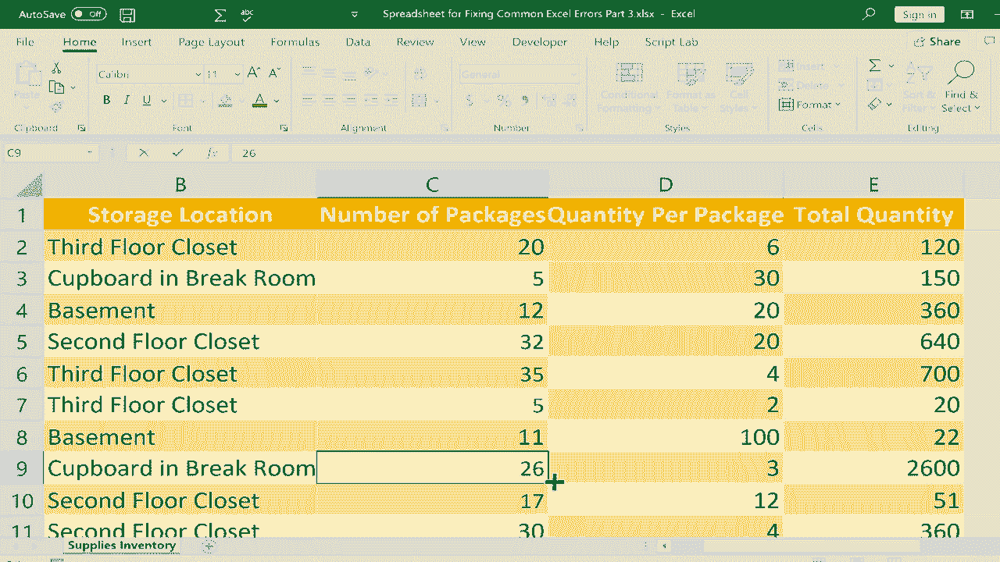

# Excel中级教程！(持续更新中) - P35：36）修复常见错误3 - REF 和 VALUE 

这是修复常见Excel错误的第三部分。这是关于如何修复常见Excel错误的三部分系列中的第三个视频。在这个视频中，我们将重点讨论两种常见错误，一个是引用错误，另一个是值错误。你可以看到我们将使用的电子表格，这是一个包含存储地点和其他细节的物资清单。

每包的数量。然后我们有一个公式来计算，如果有20包电池，每包6个电池，总共就是120个电池。正如我所说，这是通过这个公式自动计算的。现在，为了说明引用错误，假设我决定这边的数据实际上并不必要，我只需要知道总数量，所以如果我删除列呢。

我只是从C拖动到D，选中了整个列，然后删除。你可以看到发生了什么。我得到了引用错误，引用错误的原因是公式引用了在此公式中不再存在的单元格。那些单元格完全消失了。我删除了整列，这些单元格不见了。我将点击其他地方，用Ctrl + Z撤销以恢复它。

你可以看到这解决了问题。现在，如果我只删除一个单元格。我右键单击这个单元格，点击删除，Excel会移动其他单元格试图替代我破坏的单元格。你可以看到它所做的。它毁坏了这里的公式。它找不到所引用的单元格，那个单元格不见了。

所以这基本上给我们一个引用错误。那么怎么修复呢？你可以撤销，意识到这是一个错误。我可以直接删除这些数据，或者如果你真的需要删除数据，那也可以。但请点击带有引用错误的单元格进入公式。

你可以双击它，直接在单元格中进行更改，或者只需单击一次，然后上移到公式栏。不管你选择哪种方式，都需要进入并修复公式。这就是错误所在。我可以直接删除它，然后说，好吧，C3乘以D3，按下回车，这修复了引用。现在引用是有效的，这很好。

现在让我们继续讨论值错误，当你使用错误的函数参数时，通常会出现值错误，或者你试图组合不兼容的数据类型。例如，数字加文本，或者将一个单词乘以一个数字，在大多数情况下都没有意义。

所以让我们看一下可能导致值错误的第一个例子。假设在右侧，我试图将包裹的数量乘以每包的数量，就像我在这里成功做的那样。但假设我不是C2，而是B。现在我把三楼的储藏室乘以6，看看结果如何。我按下回车键。

然后我得到了值错误。为什么呢，因为我把两种数据类型组合在一起，它们并不兼容，文本乘以数字。另一个常见的例子是，假设我在输入数字11时。如果我在急忙中不小心输入了一个空格，它看起来还是不错，对我来说像是11，但我在键盘上按下回车键，结果却是值错误。

这个额外的空格在数字中是不计算的。再来看一个例子，假设我又在急忙中，在输入数字30时，不小心输入了30而不是30。假设大写锁定开启了，它看起来像30，但我按下回车。再次地，我将不兼容的内容结合在一起，30乘以4，这没有任何意义。

所以我得到了值错误。另一个相当常见的错误是，有时当你在包含数字的单元格中输入符号时，Excel不喜欢这样，可能会导致值错误。现在看看如果我在里面放一个美元符号会发生什么。通常，你不会这样做，你不会仅仅放一个美元符号。相反，你应该选择单元格，然后在主菜单的数字组中点击美元符号。

这是显示这些是美元的正确方式。但不时地，人们会直接输入一个美元符号。实际上这样是可行的，它不会导致错误，但其他符号通常会导致错误。例如，假设我在里面放一个井号。所以井号28，也许我想说的是数字28。

我在键盘上按下回车键，得到值错误。所以每当你输入这些符号并且在同一个单元格中输入数字时，要小心，这常常会导致值错误。所以当你遇到这些值错误时，要注意单元格中的内容。如果有错误，你需要修复它们。显然，我可以将B2改为C2，这样就能解决这个问题。

我可以把O改成0。在这种情况下，我可以去掉这些符号。你们中的一些人可能注意到我的公式有点混乱，这就是我之前提到的引用错误，以及我删除了一个单元格，注意到它把所有东西都上移了，这就是我的公式有点不正确的原因。但要点是，如果你尝试在公式中组合不同类型的数据，如果它们不兼容，你可能会得到值错误。谢谢观看，我希望你觉得这个教程有帮助。

