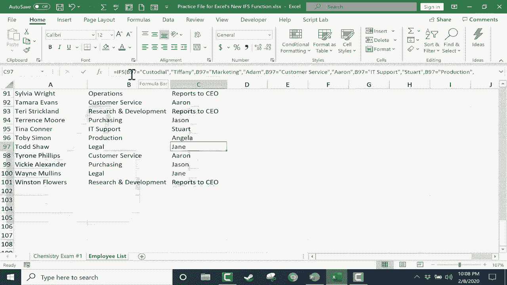

# Excel中级教程！(持续更新中) - P36：37）使用新的IFS函数 - ShowMeAI - BV1uL411s7bt

在本教程中，我们将看一下Excel中令人兴奋的新ifs函数。这是一个新功能，在Excel 2019中首次出现，同时也包括Office 365。所以在深入了解这个新的ifs函数之前，让我们先看一下在Excel中使用了很多年的常规if函数。

这里我们有一个电子表格，上面列出了学生编号、学生姓名和他们的考试分数。假设这是一个大学班级，他们参加了考试，这些是他们的分数。那么，我可以使用if函数来进行一些基本的自动评分。让我们看看如何使用我们已有一段时间的传统if函数来做到这一点。

第一步是点击一个单元格，输入等于if左括号。然后我们会弹出一个帮助提示。它显示“如果逻辑测试值为真，逗号值为假”。所以我需要一个逻辑测试。😊，假设如果D2大于59，那么我会放一个逗号来表示“那么”，如果你看看我们这里的帮助文本，它说现在是“值如果为真”，所以我应该放在这里的内容是如果D2确实大于59时显示的内容。我希望它在屏幕上打印出“pass”，引号表示在屏幕上打印。现在我放一个逗号，这就像说“如果不是”，所以让我们回过头来，如果D2大于59。

那么打印pass，如果不是就打印fail，然后我将放入括号并按下键盘上的回车键，注意它的做法。Excel会测试D2是否大于59，如果是就打印pass，这就是发生的事情，所以现在我可以使用自动填充手柄，点击E2单元格（我的公式所在），然后点击并拖动整个学生列表。

我们可以计算他们是通过还是未通过。现在，有一种更快的方法。我只需双击自动填充手柄，它就会自动延伸到整列。所以这很好，对吧，嗯，是的，确实如此。但是如果我想做的不仅仅是通过或未通过呢？如果我想说如果大于92，那么就是a。那么。

我可以输入等于if左括号，D2大于92然后打印a。我不必再写if not或if false，我可以直接停止在那里。或者我可以继续说如果它不大于92。那么我该说什么？通过或未通过，或B或C，我需要更多的信息。

我需要能够创建一个公式，不仅仅计算一个语句是否为真。你可以在这里看到我得到的结果。它们要么是假的，要么是a。这就是它所能做的一切。所以传统上，解决这个问题的方法是创建一个所谓的嵌套if公式。

但是嵌套的if在开始时可能会让人感到困惑和困难。因此在Excel 2019中，此外如果你有Office 365。现在我们有了一个新解决方案。我们有一个叫做ifs的新函数。它确实解决了我刚刚给你解释的问题。我会点击并向下拖动，删除我创建的公式生成的结果。

所以回到顶部，我们做一个类似的事情，但使用ifs。所以我点击E2单元格，等于ifs左括号。你可以再次看到，我得到了帮助文本。它想要一个逻辑测试，然后是逗号，如果为真则的值，逗号，等等。让我们看看这将如何工作。首先，我将点击D2。

就像我之前做的那样。所以如果D2大于92，那么打印A。然后我会再加一个逗号。如果不大于92。那么也许下一个逻辑测试为真。也许D2大于89。如果是这样的话，我想打印一个减号。让我稍微挪动一下，这样你能更好地看到，如果这不是真的，那么。

然后也许D2大于84，如果是，那么打印B加。我加上了括号。那么如果这不是真的，怎么办？如果这些都不是真的，那么，让我们看看D2是否大于79。如果是，那么打印B。希望你能看到这里的模式，我正在创建一系列测试。如果第一个测试为真，那么逻辑就停止在这里，Excel会在E2单元格中填入A。

但是如果那个测试结果为假，那么它会寻找下一个测试，看看这个测试的结果是否为真。如果结果是负数。那么它就会一直寻找某个真实的东西。给我一分钟完成这个模式，然后我会继续视频。好的。所以我已经完成了我的公式。让我快速展示给你。正如你所看到的。

我为每个字母等级建立了不同的分数范围。注意在D减之后。我说如果D2小于58。那么就是F。好的。所以现在我有了一个包含许多if的公式。这就是为什么这个函数叫做ifs。我所要做的就是在键盘上按下Enter，它会为我列表中的第一个人计算出成绩，针对吉娜。

现在我可以双击自动填充手柄。它应该会计算所有学生的成绩。你可以看到分数范围和字母等级。这个例子。我认为展示了为什么if的使用如此重要。它是Excel的一个伟大补充。

这比嵌套的if要简单得多。现在，看看会发生什么，假设有一个新学生来到课堂上。老好人约翰·怀特，我们把公式向下扩展。注意到它给约翰打了个F。那么，约翰实际上并没有参加考试。所以假设我在这里标记为不适用或类似的东西。

这个公式有点乱。所以让我们看看能做些什么来修复它。这并不总是需要发生，但有时当你使用 ifs 创建公式时，可能需要在公式末尾放入一个最终的逻辑测试。如果这些逻辑测试都没有返回真。那么。

你可以强制让逻辑为真，为此，只需再加一个逗号，输入单词 true，放一个逗号，然后在引号中输入你希望出现的内容。如果其他逻辑测试都不成立。我将这一点强制设为最后的手段。我会输入“未参加测试”。我将它放在引号中，按下键盘的 Enter。

自动填充向下。但注意它仍然没有完全成功。原因是公式以某种方式将其解释为大于 92。在 Excel 中，字母有时会被解释为数值。这可能就是它显示为 A 的原因。

尽管这在这个案例中并没有真正帮助我们，但了解公式末尾的这个真实逻辑测试是很重要的。让我们看一个 ifs 函数可能在我第二个电子表格中有用的第二个例子。这是一个员工列表。所以我在这里有我的员工。

我这里有他们所属的部门。我希望 Excel 能自动计算并显示他们的主管。是的，我可以手动完成这个，但将来会有新员工加入。我会输入他们的部门，主管会自动计算并显示在屏幕上。

那么如何做到这一点呢？就像之前一样，我会先点击，输入等于。左括号 B2 是否等于清洁。现在，因为我处理的是一个单词，我处理的是文本，而不是数字。我必须把它放在引号中。这一点很容易忘记，但你必须做到。

所以如果 B2 等于清洁，那么就打印 Tiffany 作为主管。如果这个逻辑测试不成立，那么测试 B 是否等于市场部。如果是，那么就打印出。 如果这个逻辑测试失败，那么测试 B2 是否等于客户服务。给我一点时间来完成这个公式，然后我会继续视频。

所以我至少暂时完成了我的公式，你可以看到它的样子。这是一个相当复杂的 ifs 公式，它将从左到右进行工作。它会检查这是否为真，如果是，它将打印出 Tiffany，如果不为真，它将继续下一个。它在寻找真实的东西。

现在你可以看到我没有输入每一个。那么当我按下键盘的 Enter 使这个公式生效时会发生什么呢？它找到了 Alan 在清洁部门的主管是 Tiffany。那么，让我们通过双击自动填充手柄来向下填充。让我们看看效果如何。你可以看到它工作得相当不错。但看。

我在公式中没有输入任何人力资源的内容。因此，Excel将其视为错误，并显示“不可用”的N错误消息。这里还有其他类似的例子。这看起来有点难看，并不美观。因此，这是一个很好的例子，说明在公式末尾强制为真是多么重要。

所以我们来这样做。为了更好地查看这个，我需要稍微缩小一点。但我会双击公式。你可以看到在最后，我会加上一个逗号，然后强制为真。所以就是“真，逗号”，然后我会输入“不可用”。现在你会注意到“真”没有加引号。

因为这并不是真正的文本，而是一个函数。好的。我将按下键盘上的回车键。让我们自动填充，看看会发生什么。现在没有错误消息了。它只显示“不可用”。当然，稍后我可能会决定更改它，并说像“报告给CEO”之类的话。

所以没有主管，直接向最高层汇报。卢西的同事们。所以我可以向下自动填充，这样所有的内容都会改变。假设一个人调到其他部门。托德调到法律部，他的主管也会改变。因此，我希望你能看到IFS函数在公式中使用的巨大潜力。

使用IFS函数，你可以在一个公式中执行大约150个逻辑测试。我希望你觉得这个教程对你有帮助。
