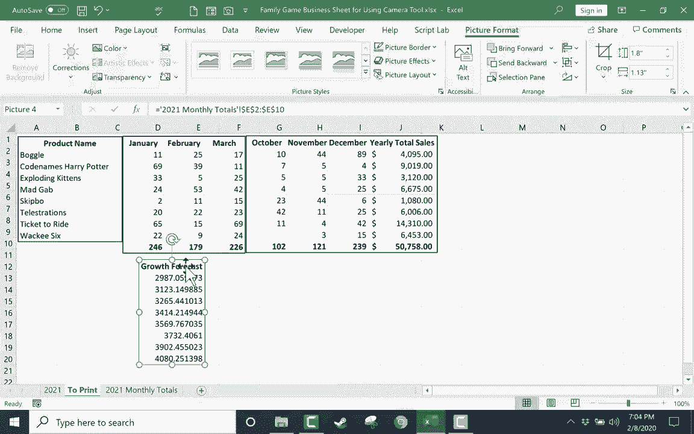

# Excel中级教程！(持续更新中) - P38：39）使用相机工具 

在这个视频中，我们将学习如何使用Excel中的便捷相机工具。第一步是将相机图标添加到工具栏。最佳方法是在屏幕顶部找到所谓的快速访问工具栏，那里有一个按钮位于快速访问工具栏的右边，代表自定义。所以自定义快速访问工具栏，我将点击它。

我希望以更多的方式自定义它，而不是这里列出的方式。因此，我将去更多命令。它会打开一个菜单，里面有很多我们可以添加到这个快速访问工具栏的额外工具。目前它只显示我可以添加到工具栏的常用命令，但我想查看所有命令。所以我点击所有命令。

这里有一个巨大的列表。如果我往下浏览，命令之一叫做相机，就在这里。所以我点击它，然后点击添加按钮，将其添加到我的快速访问工具栏。现在我可以点击，它出现在这里的顶部。那么，我为什么要在快速访问工具栏上放这个相机命令呢？

它能做的事情之一是让你能够拍摄电子表格不同部分的照片，然后将它们组合在一起。所以你可以看到，我这里有一个游戏销售图表。假设这是一个销售桌游和卡牌游戏的小企业。

假设我有一个即将到来的会议，我需要展示我们在十月的销售情况、十一月、十二月。但我也想展示一下这一年的开始情况。所以我想包含一月份、二月份、三月份，同时也想包括十月、十一月、十二月，还有可能是年度总额。

这可能有点困难，不能重建图表或打印整个内容，但这样我就会有一些我不一定想要的数据。所以看看我可以如何使用相机工具。现在我们已经将相机放在快速访问工具栏上。下一步是点击你想拍照的区域。现在，也许只是一个单元格，但在大多数情况下，它是一个单元格范围。所以我想要产品名称一直到最底部。

所有被选中的产品我只需在这里点击相机按钮，它就截图了。至少看起来像是截图。我将向你展示这不仅仅是截图。但无论如何，既然已经拍好了，你可以看到数据周围有这个虚线。

现在我要去一个新表格。我将点击这个加号打开一个新表格。名称并不重要，我可以将其重命名为任何名字。我将其称为“打印”。然后点击你想让信息截图显示的单元格。我希望它显示在左上角。所以我点击，但没有成功。

那么我们再试一次。我回去，它已经被选中。我点击相机按钮，然后去我的两个打印电子表格，点击我想要它出现的位置。就在这里。这是我的截图。我只需点击并拖动，将其放在我想要的位置。让我看看我还想在这个打印输出中包含什么内容。好吧。

就像我说的，我想要一月、二月和三月。我选择了这个范围。点击相机图标，进入打印。点击后，数据就出现了。我可以将其放在我想要的位置。返回到我的另一个电子表格，我可以获取十月、十一月、十二月以及年度总销售额，获取所有这些内容。拍个快照，然后再去打印。

点击我想要它出现的位置。这是一个很好的方式，将电子表格中的信息收集到一页上，这样你就可以更轻松地打印出来。所以现在打印它，当然，我们可以去文件中选择。😊

Pnt，或者你可以按住控制键并点击P，这样就会打开打印选项。你可以看到我的数据几乎适合纸张。我可以用多种方式来修正这一点。实际上，我还有一整部关于打印技巧和窍门的视频，如果你还没看过，绝对应该去看。但在这种情况下。

我只是将其从纵向方向切换到横向方向，现在我的数据在打印输出中非常合适。我只需点击打印。我也可以打印到文件中，你可以看到这样做会有什么效果。它不会打印到打印机，而是会将其转化为PDF，成为这个的数字表示，我可以随后将其通过电子邮件发送给人们。

这两者都是不错的选择。现在，还有一件事你真的需要看到。如果我回到源数据，让我们假设我注意到一个错误。也许skipkbo并不是真的花费677美元，而是实际上花费5美元。并且可能我们在一月份只售出了两个，而不是7或8个。那么我可以在这里更改数据。

然后当我去我的两个打印电子表格时，看看那个数字是如何更新的。这张截图其实不是真正的截图。它是从我的另一个表格中提取数据并显示在那张截图中的。所以这就是我有点犹豫称之为截图的原因，实际上它并不是真正的截图。假设我们不是在销售普通的代号游戏，而是“代号：哈利·波特”。

这是一个有趣的代号版本。我在这里更改了数据。让我们看看两个打印，它那边也进行了更改。因此，现在除了打印这个电子表格，我还可以把它移动到前面。当我保存这个文件时，这个报告将会打开，这将是人们第一次打开电子表格时所看到的内容。

如果那是你想做的。不过，无论如何，这个相机工具是从多个表中提取数据的好方法。我可以从一个完全不同的表中引入额外的信息。假设这是增长预测。点击相机图标进入打印。这里其实没什么意义，但我可以将多个表中的信息整合到一页，然后打印出来或保存为PDF并发送给其他人。所以请查看这个相机工具。谢谢观看，我希望你觉得这个教程有帮助。

