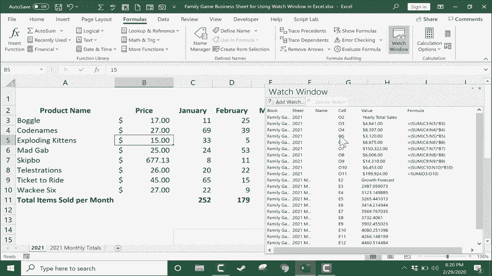

# Excel中级教程！(持续更新中) - P39：40）使用监视窗口 - ShowMeAI - BV1uL411s7bt

在本教程中，我们将看看如何在Excel中设置监视窗口。你将看到它是如何工作的，以及它在你的Excel电子表格中有多么有用。所以这里我有一个简单的电子表格，包含一个假想的桌游和卡牌游戏商店的游戏销售数据，你可以看到数据延伸到右边相当远的地方。

我的年度总销售额是通过将这些月份的销售额相加，然后将销售数量乘以桌游的价格来计算的。所以这个电子表格对我来说工作得很好。但假设我想运行一些场景。

或许我想知道，如果我们对Boggle收取16美元，而不是15美元，如果我们以某种方式有相同数量的销售，这将如何改变我们的年度总销售额。好吧，它确实进行了调整。数字上升了，但我没能看到它上升的过程。因此，我很难知道它增加了多少。

回去，把它改回15。所以注意我接下来要做的。我将设置一个监视窗口来跟踪年度总销售额。这样，当我在左边更改这些数字时，我可以同时看到它如何影响右边的年度总销售额。

设置监视窗口的第一步是点击一个单元格，或者在这种情况下，点击你想要监视的单元格范围。所以我刚刚点击这里，按住点击，然后向下拖动以选择我想监视的整个范围。现在我可以松开鼠标按钮。接下来我将在公式选项卡的公式功能区中找到监视窗口。现在，监视窗口应该在大多数现代版本的Excel中都有，除了我认为的Mac版本。

如果你有Excel for Mac，我认为监视窗口不包括在内。好的，再次强调，选择这个范围后，我将上去点击监视窗口。它将我带到这个屏幕，这个窗口，但它是空的。通常，它第一次弹出时大约是这个大小。但你需要做的是点击添加监视。

由于我已经选择了这个范围，Excel很聪明，明白这可能是我想要监视的内容。我可以再确认一下，但它是正确的。然后我只需点击添加，现在我已设置好监视窗口。现在让我们看看它正在监视的数据。注意它列出了书名。换句话说。

这个数据来自的工作簿。它还指出了工作表。这是2021年的电子表格。它列出了范围或单元格的名称，在这种情况下，这些不是命名单元格。它列出了每个正在监视的单元格及其值和产生该值的公式。所以这是一个有趣的监视窗口，它给了我一些相当有趣的数据。

现在如果我使用滚动条向左滚动，监视窗口会专注于我告诉它监视的内容。所以现在我可以回到数据中进行一些计算。假设我们为**Boggle**收取17美元。在监视窗口中，我可以看到它上升了不少。

**Boggle**的年度总销售额。所以请关注这里的总额4代码名称。这是这个9000的数字，看看如果我们只收取27美元并售出相同数量会怎样。年度总销售额下降了。因此，你可以在公式选项卡中设置的这些监视窗口，公式功能区的这里，就是监视窗口。

它们可以真正帮助你看到那些否则很难看到的数据。如果你有一个巨大的电子表格或者由多个工作表组成的工作簿，这尤其有用。如果你想查看相距较远的数据，但又想将其与其他数据一起查看，**监视窗口**可以很好地帮助你。让我们通过转到另一个电子表格或甚至工作簿来提升一下这个层次。

在这种情况下，我将转到2021年每月总额的电子表格。这可能没有太大意义，但我会点击这里的**增长预测**，然后点击并拖动选择，至少选择到完整数据集的底部。

我可以点击监视窗口，但监视窗口实际上已经激活了。所以这次不需要点击监视窗口。相反，我可以直接点击**添加监视**，Excel让我确认它将要监视的范围，这看起来不错，所以我点击**添加**。现在我的监视窗口更长了，更大了，但希望你能看到它现在正在跟踪两种不同的信息来源。

两个不同范围的信息。因此，通过这个添加监视，你可以在两个不同的电子表格或同一电子表格的两个不同部分，甚至不同的工作簿中监视数据。当你完成监视窗口的使用后，如果不再需要，直接关闭它，继续像往常一样使用Excel。如果你想重新打开监视窗口，只需再次点击，它应该会记住你之前添加的监视窗口。

した？
