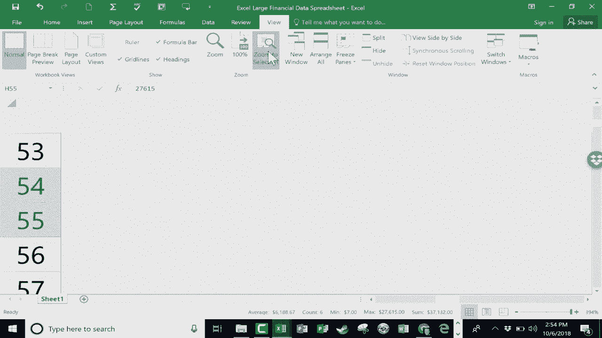

# Excel中级教程！(持续更新中) - P4：4）电子表格中的导航 

在这个视频教程中，我们将讨论在Excel中有时会出现的问题，那就是如何在巨大的电子表格中导航。我们都能处理小型电子表格。假设电子表格中有10到15条记录。移动和跟踪数据很容易。

但当你有数百条甚至数千条记录时，跟踪数据的位置和如何快速到达电子表格的不同部分就容易变得混乱。所以让我们看看你有哪些选择。我想指出的是，在右下角我们有一个视图缩放级别。对我来说，现在设定为235%。但我可以点击并拖动这个条。

使它更小。因此，我可以快速了解电子表格中的数据。现在，当你这样做时，你会注意到一些数据会发生什么。如果数据在列中不自然适应，你会看到这些井号。别担心，数据仍然是好的，看看我再次放大，更多地放大。

那些井号消失了。这是你可以做的一件事，以了解数据的大小以及一切的位置。只需更改那个缩放级别。现在，还有另一种方法可以做到这一点，那就是按住键盘上的控制键，然后使用鼠标的滚轮。如果你向上滚动，它会放大；如果你向下滚动，缩放会减小。

你可以看到它在这里也进行了调整。接下来，让我们看看如何从电子表格的顶部跳到底部。所以我现在几乎在这个电子表格的顶部。我正在查看信息和数据。但现在我想返回到表格的底部，以输入更多信息。我有几种方法可以做到这一点。一种是使用键盘快捷键。

如果你按住控制键，然后点击结束键，它会带你不仅到达电子表格的底部，还会到达右边缘。所以数据范围的右下角，对我来说这非常有效。现在，如果我想回到顶部，还有另一个键盘快捷键，这就是。

按住控制键并点击主屏幕按钮。这将带我到左上角。现在，有一种鲜为人知的方法可以做类似的事情。假设我在G列。我想要到达电子表格的底部，但我并不想去右下角。所以我不会使用控制键加结束键。

我只是想到达 G 列的底部。看看这个。我将稍微增加缩放，以便你能更清楚地看到。但请注意这个技巧。你只需移动到当前单元格的底边，将鼠标放在底边，然后快速双击。如此迅速。

它把我带到了电子表格的底部。现在，如果我想回到同一列的顶部，我只需双击我当前所在单元格的顶部边缘。它会把我带到顶部。因此，双击是一个美丽、简单而优雅的方式，让你非常快速地到达电子表格的底部和顶部。正如我之前指出的，它让你保持在当前工作的同一列中。

我想展示的最后一个技巧是，假设你在放大、缩小，跳到顶部和底部，也许是电子表格的右下角。假设你到达一个点，发现你想专注于一个部分，可能只是这个范围。那是我现在想要工作的部分。

我可以点击并拖动以高亮显示，然后我可以到这里查看，并选择缩放到选择。让我们看看这有什么效果。它放大了视图。所以我高亮的那部分被尽可能地放大了。现在，如果我选择了电子表格的其他部分并点击缩放到选择。你会看到效果更加显著。这是你可以在 Microsoft Excel 中使用的三到四个小技巧，帮助你在电子表格中更好地移动。

尤其是大型数据，这可以帮助你更好地观察。

数据，并在数据中更好、更轻松地导航。感谢观看。我希望你觉得这个教程有帮助。如果有，请点击下面的喜欢按钮。
