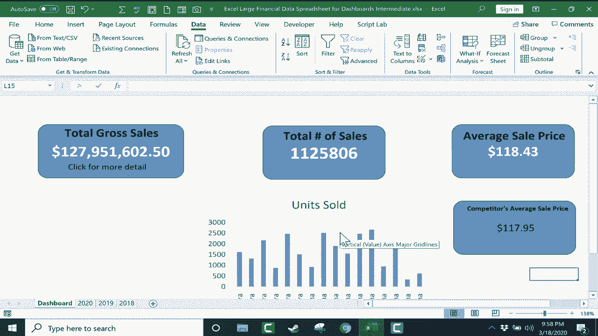

# Excel中级教程！(持续更新中) - P40：41）Excel仪表板中级指南 

这是Excel仪表板的中级指南。我希望你已经观看了我的Excel仪表板初级指南。如果你看过，你知道我是如何设置这些的。这只是一个仪表板的开始，用于跟踪我工作簿中其他数据。你可以看到我有三个满是数据的电子表格。

我在我的仪表板上高亮显示这三项数据。在这个中级指南中，我将展示如何为仪表板添加一些额外功能。我还会向你展示如何让它看起来更好一些，然后我们将通过查看如何从一个完全不同的工作簿中提取数据来结束。

并把它放在这个电子表格的仪表板上。首先我想关注的，如果你看这个仪表板。这很好。我可以看到总的毛销售额，并且我可以看到总销售数量和平均单价。这是个好的开始。但是不时地，我可能想深入挖掘数据。为了帮助我做到这一点。

我将添加一些超链接。😊 在插入选项卡上，这里在功能区我将添加一些文本。我会点击并添加文本框，然后我将输入“点击获取更多细节”。然后我会在文本框的边缘点击并拖动到我想要的位置。我觉得这样看起来不错，我可能想实际让它变小。但随你怎么做。

你可以调整文本框的外观和感觉。我真的应该将这段文本与仪表板的其余部分进行分组。但现在这没关系。现在我将三次点击文本以高亮显示它。或者如果你愿意，你可以点击并拖动以高亮显示它。

然后回到插入选项卡，插入功能区，寻找链接组并点击链接按钮。这个弹出窗口帮助我决定将这个文本链接到什么。我不想将其链接到这个现有文件或任何现有文件，或者任何电子邮件地址之类的东西。我想要的是在这个工作簿中的这个位置，也许我想专注于我2上的数据。

20Spsheet在这里。所以点击O。那么现在当任何人点击那个按钮时，它会直接带他们到2020年电子表格，他们可以看到基础数据。现在，回到我的仪表板电子表格。我实际上可能想调整一下那个链接。所以我右键点击它，选择编辑链接。

因为请注意，它直接带我到销售单元格A1。而毛销售额实际上在H1。所以我将把它改为H1，点击O，现在当我点击超链接时，它带我到H1。这样，你可以专注于特定的单元格或你想要链接的电子表格部分。我也可以轻松地对总销售数量和平均销售价格的链接做同样的事情。现在。

让我们看看一些我可以用来美化这个仪表板并让其看起来更好的方法。例如，我可以进入这里的基础数据。我可以创建一个图表添加到仪表板。现在，这在这个特定情况下可能没有意义。但如果我想包含一个图表，我可以。 我可以点击并拖动以突出我关心的图表的一部分。

也许是产品标题。然后按住控制键。我会移动并点击并拖动以选择销售单位。因此，选中这两个后，我将按住alt键，然后按键盘上的F1，这会弹出我所选数据的图表。正如我所说，在这种情况下，图表并没有告诉我很多信息。

但现在，有了这个图表，我可以右键单击它，剪切，然后转到我的仪表板并粘贴我的图表。这个图表与销售单位总销售数量有关。我想我可以把它放在我想要的位置，它成为我仪表板的重要部分。让仪表板更漂亮的另一种方法是通过转到视图并查看显示组。

有时我喜欢让网格线可见。但其他时候，这会使其看起来杂乱。因此，我将从这个电子表格中移除网格线。如果我想的话，我也可以移除标题，去掉ABC D等内容以及这里的公式栏。我可以取消勾选它，它就消失了。现在，功能区呢？如果我不想让功能区分散我仪表板的注意力。

隐藏它是可能的。如果你去这里的右上角，上面写着功能区显示选项，我可以点击自动隐藏功能区，这样在我不需要时它就会消失。如果我需要它，我可以在顶部绿色部分点击，功能区会出现，然后如果我点击别处，它又会隐藏。如果你不想那样，你可以让它显示选项卡，它只会显示选项卡，或者你可以让它使用默认设置。

显示选项卡和命令。我将回去并完全自动隐藏功能区，现在如果我返回2020年的电子表格或2019年或2018年，你会注意到功能区仍然消失。它是自动隐藏的。但我仍然有网格线，仍然有我的标题，因此至少有这个选项。

我在视图选项卡的显示组中选择的这些选项仅适用于我正在设置为仪表板的这个特定电子表格。因此，知道这一点是好的。做这一切的目的就是让仪表板看起来更漂亮，我们希望它看起来吸引人，并简单地显示对我、我的观众或股东或任何观众重要的数据。让它看起来更好的一种方法是调整缩放级别。

这已经放大得相当不错了，但我想稍微调整一下。通常在右下角我会有一些缩放选项，一个滑块基本上可以用来调整缩放，但由于我隐藏了功能区，这个选项消失了。但如果我在上面的绿色区域点击，它会恢复那个缩放级别的滑块。

所以我想稍微放大一下，因此我将其拖到右侧，这有点过了，我可以通过反复试验来调整到我想要的合适缩放，然后我可以点击，我觉得这看起来真的不错。如果我想的话。

我可以稍微把这个拉过来，使其真正居中，呈现出我想要的样子。现在，我想给你展示的最后一件事是如何从当前工作簿中的另一个电子表格提取数据，而不是从完全不同的Excel工作簿中提取数据。所以你可以看到，当我把鼠标放在任务栏上的Excel图标上时。

弹出两个工作簿。我正在使用的一个和第二个工作簿，我在跟踪竞争对手的平均销售额。假设公司的竞争对手发布他们的平均销售价格的历史数据。我想在我的仪表板中使用一些这些信息。让我们看看如何做到这一点。首先，我想添加另一个仪表板元素。我可以直接复制粘贴我这里的内容。

所以我点击它以突出显示，按控制C复制，按控制V粘贴。现在我有了另一个仪表板元素。现在我将调整文本，而不是平均销售价格。我将其称为竞争对手的平均销售价格。我的文本太大了，所以我选择它。然后缩小文本。仍然太大。好了。

当然，我本可以调整文本框的大小，但现在数据本身，我将双击它，光标出现，我可以删除那个文本。因为我想从另一个单独的工作簿中提取这里的数字。

所以下一步我将点击我的形状外，以便正确执行此操作，我认为如果我点击以恢复我的功能区，那会更有意义，然后我放在公式栏中。我想我会让功能区保持至少现在是这样。显示选项卡和功能区。所以现在我点击我的形状，删除已经在那里存在的数字。

当光标闪烁时，我将去上面在公式栏中输入等号，然后我只需按住alt键并轻点tab，这会显示我所有打开的不同窗口和文件的选项。我得按几次tab，直到我选择了包含我想提取数据的工作簿。

这里是2020年我竞争对手的平均销售价格。我选择那个单元格，按下键盘上的回车键。看，现在它从一个完全独立的工作簿中提取信息到我的仪表板中。我将回到我正在使用的工作簿和仪表板。显然。

我可以更改文本。我可以努力改变颜色方案等等。我可以改变背景颜色，尝试更改文本颜色。但老实说，我对现在的样子很满意。现在我可以保存这个工作簿，我的仪表板应该始终在这个工作簿和我提取数据的另一个工作簿之间保持连接。因此，如果这个数字在我的第二个工作簿中更新。

它也应该在当前工作簿的仪表板上更新。😊现在，如果你经常从其他工作簿提取数据到仪表板，你可能会遇到一些问题。如果那个其他工作簿被删除了，或者被移动了，链接可能会损坏。所以如果发生这种情况，你需要去数据选项卡，查看查询和连接组。

那里有一个编辑链接的选项。所以你可以点击它，它会显示你所拥有的链接。这个工作簿只有我刚创建的一个链接。我可以点击它并点击检查状态，它告诉我源是打开的。所以我有一个良好的连接，源是打开的。现在。

如果我关闭这个弹出窗口，然后关闭我提取信息的第二个工作簿，我可以返回到数据选项卡。查询和连接组，点击编辑链接。这次如果我点击检查状态。它仍然有一个连接，但请注意，有警告，引用其他工作簿的值未更新，所以我可以点击更新值。这应该会更新这些值。我可以更改我的来源。

我可以通过点击打开源来打开源。它会打开那个其他工作簿。我在这里有很多选项，可以帮助我确保我与其他工作簿的链接仍然有效并正常工作。这就是Excel仪表板的中级指南。从这里开始，你可以继续添加更多的数据和可视元素。

像图表和图形这样的内容，让它看起来越来越好，把你想要突出显示的信息汇集到你的仪表板上。😊！
