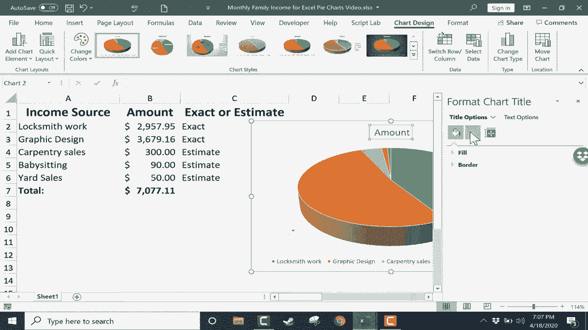
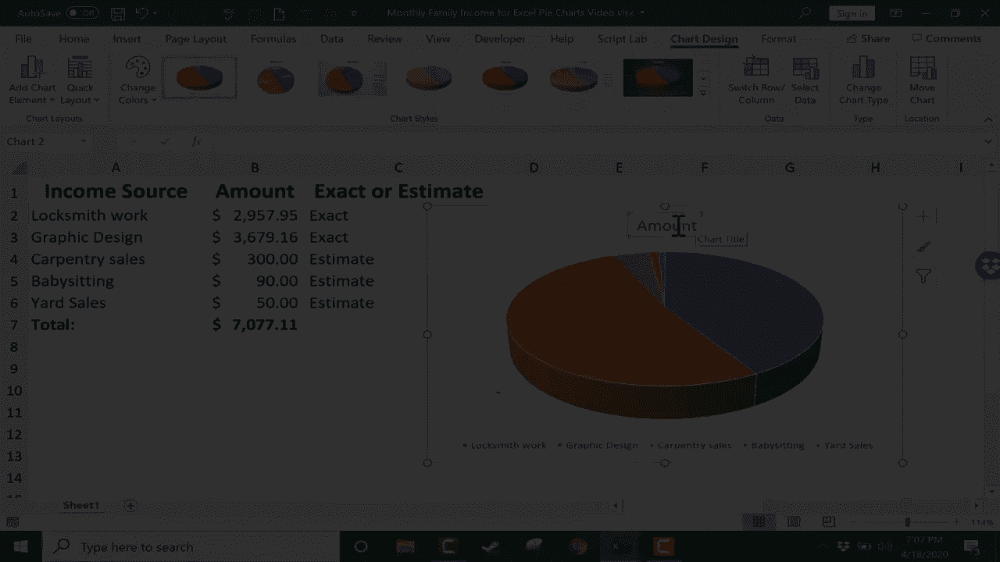
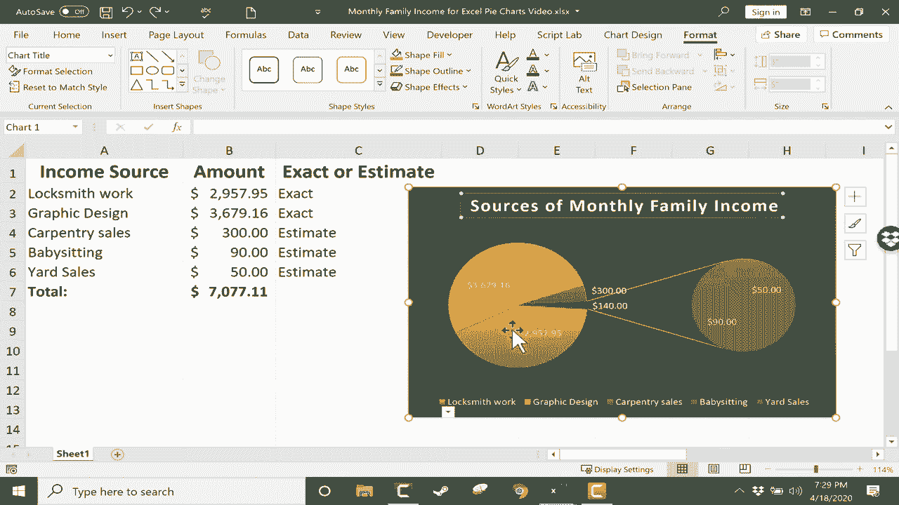
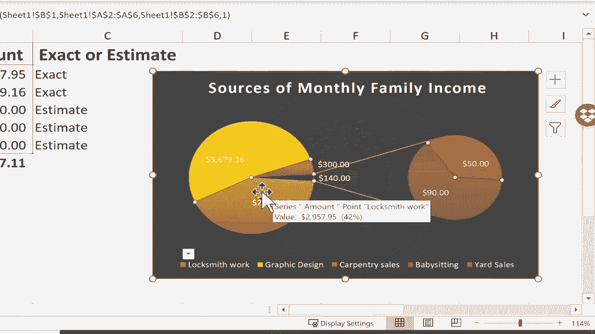
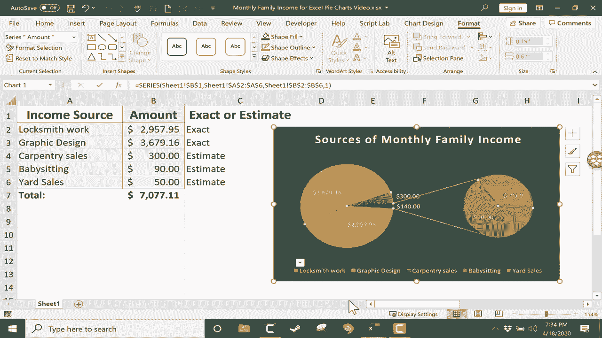

# Excel中级教程！(持续更新中) - P42：43）创建饼图 - ShowMeAI - BV1uL411s7bt

在这个视频中，我们将看看如何以及何时在Excel中使用饼图。首先，让我们讨论何时饼图是有用的。饼图的目的是显示个别部分与整体之间的关系。例如，在这个电子表格中，我们有一个家庭的收入来源列表。假设一个配偶是锁匠，赚取这笔收入。每月是一个确切的金额。

另一个配偶是平面设计师，收入不同，也不是精确的。然后他们俩还有副业，这些都是估算，而不是确切的数字。所以我会修改这两个估算。这种方式是，每一项收入都是总金额的一个组成部分。所以每一项都是下面整体的一部分。

这是一个饼图会有用的实例，能够传达有趣且有用的信息。在继续之前，我想给你展示一个单独的例子，一个饼图没有太多意义的例子。这个电子表格是一个非常复杂的电子表格，包含重复的段落、国家和产品。

由于其复杂性，这并不是一个很好的饼图候选者。我稍后会向你展示我的意思。但现在，让我们回到我们的每月家庭收入电子表格。如果我想为这个数据创建一个饼图。

第一步是选择图表的数据。因此，我会点击并按住鼠标，拖动以选择A列和B列，但我不包括总数在内。我们包括列标题，以便Excel知道这些数字代表什么。

但我们不包括总数，因为总数会扭曲饼图，使其基本上变得无用。因此，选择好数据后，我可以直接进入插入选项卡。我们在这里有多种图表，列表中有插入饼图。所以我会点击它，然后出现各种选项。当我把鼠标放在选项上时。

我可以预览它们的样子。这是Excel中的一个很棒的功能，帮助我决定选择哪个。我们有一些二维饼图、一个三维饼图和一个甜甜圈图，所有这些饼和甜甜圈让我有点饿，但我会尽量集中注意力。现在我决定选择三维饼图。所以我只需点击它。

我的图表出现在电子表格上。我可以点击并拖动，将饼图放置到我想要的位置。我觉得这个位置看起来很不错。现在我有了我的饼图。如果我选择了它，我会在顶部看到两个额外的选项卡，图表设计和格式。如果我点击图表之外的地方，这两个选项卡就会消失，但我只需再次点击图表，它们就会重新出现。

让我们看看这两个标签提供的一些选项。如果你点击“图表设计”标签，你会看到有一个添加图表元素的选项。如果你点击这个按钮，它会给你一些图表标题选项。我可以通过选择“无”来去掉这个金额图表标题，或者我可以把它移动到饼图的中心，更多标题选项也有。

如果你在这里点击，你会得到额外的填充和边框选项、阴影以及各种不同的对齐选项等等。我希望我的标题在顶部，但我不喜欢它为标题选择的文本。我想把它从金额改成别的什么。我将把它改为“家庭月收入来源”。

我认为这更好地描述了我在这里展示的数据。这比仅仅用“金额”这个词要好得多。在“添加图表元素”按钮中，我还可以进行其他操作，比如添加数据标签。目前，我没有数据标签。如果我选择“居中”，看看会发生什么。这个饼图切片或部分上的数字现在就放在了那里。

这个部分作为标签。但是你可以看到这样的问题。有时它不起作用。它们会挤在一起。因此，我可以回去选择不同的选项为我的数据标签。外部结尾是另一个可能的选择，最佳适配，数据标注。这在很多情况下是一个很好的选项。如果我想，还可以加载更多选项，类似于我的标题选项。

我认为我最喜欢的选项是最佳适配。看起来很不错，而且每个饼图切片或部分代表的内容很清晰。我还有一些图例选项。我可以选择没有图例，也可以在右上、左侧或底部有一个图例。如果我想，我还可以获取更多图例选项。我决定把图例移到右侧。

我觉得这看起来真的不错。在图表设计标签上我可以做的其他一些更改包括快速布局。你可以通过将鼠标放在这些选项上快速调整布局，😊。我实际上喜欢现在的样子。我还可以点击更改颜色以选择不同的配色方案。

这个功能的原理是颜色调色板。所以如果我在这些颜色上点击，整个图表的颜色调色板或颜色方案就会改变。如果我更喜欢蓝灰色的配色方案，我只需点击这里，所有的颜色都会变成蓝色或灰色。我们还有其他所有这些选项，如果我向下浏览，还有更多选择。

我要选择多彩调色板3。我觉得看起来真的很好。接下来，我可以选择不同的图表样式。现在，这会改变我已经选择或调整的一些设置，但你可以看到这些每一个选项都可以改变饼图对观众的影响。根据你展示图表的目的和你对观众最吸引的样式来选择。

其中一些可能比其他的效果更好。我觉得那个看起来很有趣，尽管😊有点奇怪。还有另一个样式我觉得看起来真的很好，还有一个。但我想我会点击这个撤销按钮几次，回到我最初的样子。在图表样式旁边，我有选项可以切换数据，交换行和列或选择不同的数据。

如果我想，我还可以更改图表类型。如果我点击那里，它再次给我选择从3D回到2D图表，或选择甜甜圈图表的选项。我甚至可以切换到完全不同类型的图表。但这是我向你展示这些选项的好机会，例如饼图的饼图或饼图的条形图。

饼图的饼图是一个特别有趣的选项，尤其是当你有一些大块的饼图，以及一些更小的饼图时，比如我们这里的数据。所以如果你看看这个例子，饼图的饼图设置展示了这个小块代表的内容。它是从保姆工作中赚得的$90和从 yard sales中赚得的$50。这个小饼图有助于突出饼图中的小块。

我现在非常喜欢这个样子，尽管我可能会换成这个其他样式，这对我来说看起来很棒。我们在图表设计选项卡上的最后一个选项是移动图表。如果我点击它，可以注意到我可以将此图表放在新工作表上，或者将其保留为工作表1中的对象。让我们尝试将其移动到新工作表。

如果我想的话可以命名，但我只会点击O。现在我有了一个新的工作表，具体来说是图表工作表chart1。现在工作表1上完全没有饼图。我将通过再次选择图表来撤销此操作，转到图表设计，然后将其移动到工作表1中的对象，点击O。

现在让我们快速看一下格式选项卡。在这里，我们有很多形状可以添加箭头，例如三角形、正方形等。此外，还有一些样式可以选择。如果我将鼠标放在这些形状上，它会给我一个预览，你可以看到选择其他主题样式会如何改变饼图的外观和感觉。

在某些情况下变化非常明显。所以你会得到一些看起来非常漂亮的选项。只需试一下，注意我并没有点击，只是将鼠标放在不同样式的顶部，我就能获得即时预览。我还可以在这里选择特定的形状填充。

如果我喜欢这个饼图的外观，除了背景颜色有点黑或深灰色，我可以为形状填充选择特定的颜色。其实在这个情况下我不想这样做，但你可能想。我会下滑到形状轮廓，我可以选择一种颜色，比如红色。现在这个饼图框的轮廓是红色的。我还可以去形状轮廓下拉菜单中更改轮廓的粗细。

如果我想，我可以把它做得非常厚。我并不一定认为那看起来好，但这就是你可以更改的内容。通过进入饼图的格式选项卡，你也可以看看其他一些快速样式，如果你对它们感兴趣的话。现在。

饼图和Excel中其他图表的美妙之处在于，随着时间的推移，如果这些数字发生变化，比如说木工销售额上升，我按下回车，饼图会调整以显示这些变化。假设庭院销售额也大幅上升，饼图会再次根据这些变化进行调整。在结束之前，我想向你展示几个很多人完全不了解但非常有用的饼图功能。

这些功能可以帮助你的饼图看起来更出色。一个是你可以“爆炸”饼图的任何部分。例如，只要饼图被选中，我可以双击饼图的任何一部分，然后点击并拖动以“爆炸”这一部分。这就是这个词的意思，Exp。

我可以双击这个饼图的一部分，然后点击并拖动。😊。

“爆炸”那一片饼图以及其他各部分。这样做可以帮助将标签彼此稍微分开，并把焦点放在饼图的特定部分。另一个常常被忽视的功能是，你可以右键点击任何饼图元素，以调整其填充、轮廓或格式化数据标签，可能通过改变其颜色。

如果你对任何这些变化感到后悔，可以右键点击那一片饼图，选择“重置以匹配样式”。我也会这样处理文本。因此，我希望你在Excel中创建饼图时玩得开心。只需记住，饼图并不适合每种数据或电子表格。例如，如果我只选择这张电子表格的一部分，只有一列包含数值数据。

如果我去插入饼图，看看我得到的结果。这完全没用且无关紧要。

因此，考虑清楚你制作饼图的目的以及你希望通过图表展示的数据是非常重要的。
