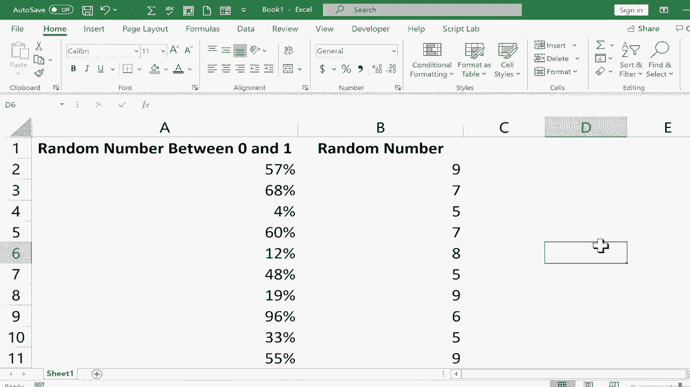

# Excel中级教程！(持续更新中) - P43：44）生成随机数 

在这个教程中，我将向你展示如何快速生成Excel中的随机数。偶尔，你会发现自己在Excel中遇到的情况，你可能需要一个随机数。我们将看看如何生成两种不同类型的随机数。第一个例子是介于0和1之间的随机数，为此。

你要做的就是点击一个单元格，输入等号。然后输入R。你可以看到这里弹出的提示，它告诉我R的作用。返回一个大于或等于0且小于1的随机数。请注意它这里说的内容。重新计算时会发生变化。我想你很快就会明白这意味着什么。

所以在输入等于R后，我要做的就是放入一个左括号，然后一个右括号。中间不需要放任何东西。然后只需按下键盘上的回车键。你就得到了一个介于0和1之间的随机数。现在，如果我想要一系列随机数。好吧，我只需使用自动填充手柄。如果你不熟悉自动填充。

观看我其他的教程，其中讲解了自动填充手柄。但这是一个很棒的工具，可以让这种事情变得非常简单。所以我想要一系列随机数。这是一个随机数。我只需点击具有随机函数和公式的单元格。

所以这就到达右下角，那里有一个小绿色方块，把我的鼠标放在绿色方块上，然后点击并向下拖动。我会一直拖到第12行。我会松开，然后生成一整系列的随机数。现在你可能注意到，我的第一个随机数实际上变了一点。每次你重新计算或调整任何随机数时，它都会被重新计算。

看，他们都变得不错了。所以现在我有了随机数。我可以点击B列来选择整个列，然后如果我想的话，或许可以点击这里的百分比，这样就把小数变成了百分比79%82%。

这更易读且更易理解。现在如果你只是想要介于5和5000之间或介于1和10000之间的随机数，并且你想要的是整数，而不是小数。那么在这种情况下，你需要使用稍微不同的函数和公式。在这种情况下，你输入等号R之间，并注意它说的内容，返回你指定的数字之间的随机数。你放入一个左括号，然后是你希望生成的最低数字，比如1，接着逗号，再假设5000是最高数字，然后我放入右括号，按下键盘上的回车键。

这是我在1到5000之间的随机数。现在注意，即使这样做也改变了B列中的随机数。现在我可以使用自动填充手柄将其下拉，我会得到一系列随机数，这些数都不小于0，且都不大于5000。为了测试这一点，确保它真的在工作，我可以使用`RANDBETWEEN`。

假设我们要说5，9。所以如果真的有效，这将更容易看出。每生成的数字应该在5和9之间，确实如此。好的。那么现在我们有了这些随机数，如果我对这组随机数满意，不想让它们继续重新计算，我该怎么办？我可以通过点击并拖动选择数字范围，然后复制刚才的信息，按`Control C`复制，然后可以点击另一列，随便选一个单元格。

我就选这个单元格，然后进行“粘贴特殊”。在这里粘贴，我会下拉到“粘贴特殊”，选择值，所以它将只粘贴值。现在如果你点击其中一个数字，这些是随机生成的，但它们是通过`RANDBETWEEN`函数在这一列中生成的，你可以在上面的公式栏中看到，但这些数字只是数字。

我复制了公式，并使用“粘贴特殊”作为值进行粘贴。所以这些数字将来不会改变，尽管这些明显会。你刚刚看到它们在你眼前改变，所以我可以对这些数字做同样的事情。选择范围，按`Control C`复制，点击这里，我想粘贴，但记得我需要做“特殊粘贴”，所以我去粘贴按钮的底部，在“粘贴特殊”中选择值。点击确定，这些确切的值被粘贴，当然我可以再次将它们改为百分比。现在这些数字将继续变化，因为它们仍然是随机的，但这些是固定不变的。

它们只是值。所以现在完成后，如果我想，我可以直接复制粘贴这一列的标题，删除随机化的列，因为它会不断变化，或者实际上我可以只复制值并将其粘贴到公式上，然后删除这列。

无论你想怎么做，但现在我已经生成了随机数，这些是稳定的，它们不会再不断变化。
