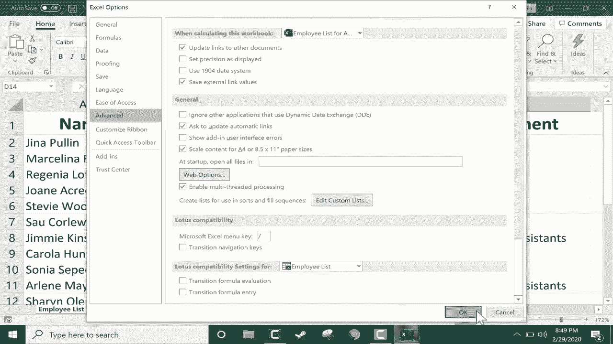
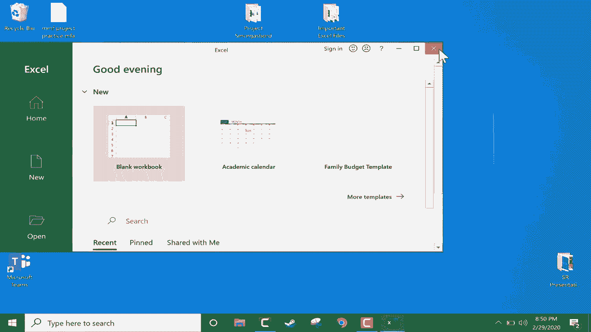

# Excel中级教程！(持续更新中) - P44：45）自动打开多个文件 - ShowMeAI - BV1uL411s7bt

在这个简短的Excel教程中，我想展示如何快速而相对轻松地设置Excel，以便每次打开时总是打开相同的文件。因此，这里我有三个不同的电子表格。假设出于某种原因，我需要定期打开这三个文件。

不必一个一个打开文件。我可以直接去桌面。所以我将最小化这三个Excel文件。然后你只需创建一个像我这样的新文件夹。要创建你自己的文件夹，只需右键单击桌面。但这个文件夹不一定要在桌面上。

它可能在你的文件Expr中，计算机上的任何地方。但无论如何，右键单击新建文件夹，给它起个名字，然后简单地把Excel文件放入那个文件夹中。现在，这些应该只是你每次打开Excel时想打开的Excel文件。所以对你放进去的文件要挑剔。如果你真的不想移动文件。

这是共享文件，如果你移动它们，其他人将很难访问这些文件。在这种情况下，看看你可以做什么。你可以右键单击你不想实际移动到文件夹中的文件，然后选择创建快捷方式。一旦你有了快捷方式，点击并拖动将快捷方式放入文件夹中。所以快速回顾一下，我们创建了一个文件夹，并将Excel文件或Excel文件的快捷方式放入该文件夹，这就是我之前为这个非常重要的项目smorrgs board3所做的，现在那非常重要的Excel文件都在那个文件夹里。

我可以打开Excel，实际上我在哪个Excel电子表格中并不重要。我甚至可以只是在一个完全空白的Excel电子表格中，但诀窍是去文件那里，然后下拉到选项，带出一些基本的常规选项，但如果你进入高级并几乎滚动到最底部，你应该能看到这里的一个选项。

开始时，打开所有文件，这里你需要输入该文件夹的文件位置。这是我文件夹的文件位置。你的可能类似，但那是硬盘的一个文件夹和另一个子文件夹，对我来说是在桌面。但对你来说可能不是，可能是你的文档文件夹或计算机上的其他地方。

然后最后提到的是包含你想每次打开Excel时打开的Excel文档或快捷方式的文件夹。一旦你设置好了，点击确定。现在我将关闭我所有的Excel电子表格。

Excel完全关闭了，现在我再打开它，看看会发生什么。看，所有三个重要的电子表格都打开了，准备使用。这是一个节省时间的好方法。如果你经常使用Excel，当然，可能每天只节省你5秒钟。但如果你每天都使用Excel，这会累积起来，这个技巧将为你节省一些时间和麻烦。

如果你改变主意，想要自动打开的文件，你当然可以，只需更改文件夹中的内容。所以我可以将这些移出文件夹，或者如果这些只是快捷方式，比如这个，你甚至不需要将其移出文件夹，只需右键点击并删除。你只是在删除一个快捷方式，而不是删除实际文件，这将改变当你启动Excel时自动打开的文件。

如果你想添加额外的Excel电子表格或文件，只需点击并拖动它们到文件夹中，你就可以开始使用了。现在，如果你决定不希望任何文件自动打开，这没问题。你可以去文件选项，返回到高级设置，向下滚动到选项列表的底部，然后选择系统中的文件位置，删除它。现在，当我打开Excel时，它不会。

自动打开任何文件。
