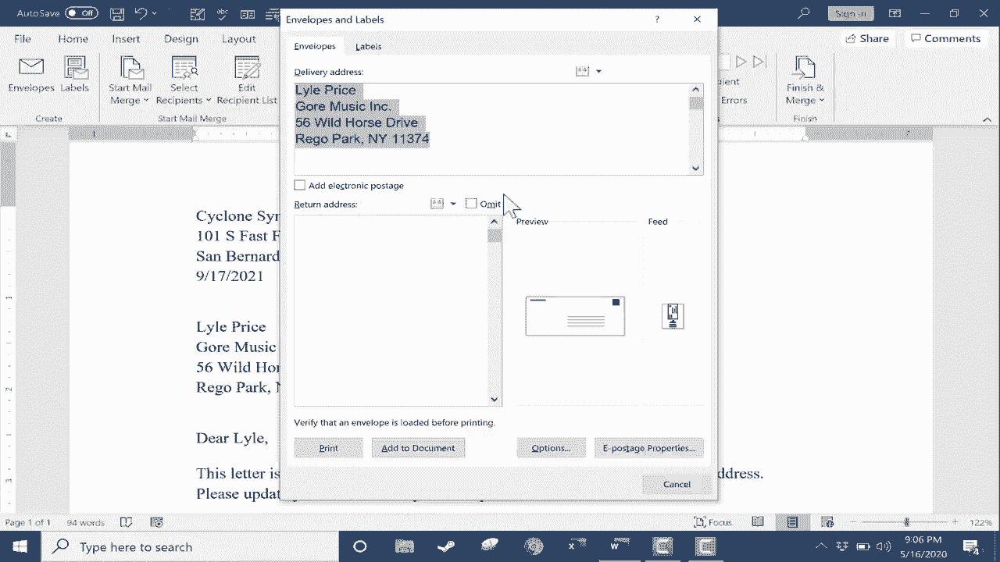

# Excel中级教程！(持续更新中) - P45：46）从 Excel 到 Microsoft Word 的邮件合并 

在这个视频中，我将向你展示如何从 Microsoft Excel 到 Microsoft Word 进行邮件合并。让我向你展示我所说的，这里我有一封为一个假设的小企业写的表格信，几乎准备好发送给我所有的商业联系人。但你会看到，表格信的一些方面需要自定义。

我不想说亲爱的收件人姓名，我想插入实际的人的名字。此外，还有收件人的公司名称、地址和其他详细信息。我在 Microsoft Excel 中有联系信息。这些是我的商业联系人，包括姓名、公司名称、地址等等。好消息是，通过使用邮件合并。

我不需要为我的每一个联系人重新创建这封表格信 50 次。相反，我可以简单地从这个 Excel 电子表格中提取重要数据。让我们看看如何做到这一点。第一步是仔细查看包含联系信息的 Excel 电子表格。在我的案例中，这是一个我从头创建并添加到的电子表格，我非常小心。

我已经按照我想要的方式整理了它。但在你的情况下，你可能是从另一个程序或来源导出这些数据。因此，你需要做的第一件事是确保你的 Excel 数据是好的。例如，拥有一个标题行确实很有帮助。

你可以看到我的第一行有列标题。这在进行邮件合并时非常有帮助。每个标题名称基本上会成为我 Microsoft Word 文档中的占位符。你可能还想考虑的是，是否要将商业地址或联系地址分开。

你可以看到我这里有街道地址、城市、州和邮政编码都分开了。现在，在你的情况下，可能不需要这样做。将整个地址放在一列中可能也可以。这有利有弊。但请注意，如果你想更改，最好在邮件合并之前进行。

Sam与名字。你真的想把名字和姓氏分开吗？这样可以，但你只是想确保你的数据准备好合并到 Word 中。我对这些数据很满意，所以此时我将退出这个文档，实际上，我想保存它，然后退出。

然后数据就可以准备好被导入到 Microsoft Word 中。现在，回到 Microsoft Word，我要做的就是使用这个邮件选项卡来定制我的表格信，点击邮件，打开邮件功能区。在左侧，你会注意到它说开始邮件合并，点击这个开始邮件合并按钮是很诱人的。

但是，我需要首先选择收件人。这给了我三个选项。我可以从我的 Outlook 联系人中提取，这绝对是一个好选项。如果你经常使用 Microsoft Outlook，你也可以点击这里输入新列表。我可以进去为我想发送的62个人输入联系信息，但在这种情况下，这会非常繁琐且不必要。

所以我会取消我真正想用的选项，第二个选项是使用现有列表，所以我点击那里。希望我知道我存储了那个 Excel 电子表格的位置。在我的情况下，我把它存储在桌面上，所以我可以直接点击那里。这就是我的邮件合并联系人列表。在你的情况下，你可能需要浏览文档，或者搜索你的电脑以找到存储源电子表格的位置，但对我来说，它就在那儿，我会双击打开它。

现在，Microsoft Word 只是试图验证我想用哪个 Excel 工作簿的部分作为我的收件人来源。在这种情况下，只有一个选项，即我的 Excel 表格的第一个工作表。联系人列表只有一个包含数据的电子表格。因此，Word 发现这可能是我想要的。而且确实如此。还需要注意左下角的这个复选框。

第一行数据包含列标题。如果你还记得，我说如果你有列标题，邮件合并会更容易，而我的电子表格中有列标题。所以我需要确保这一点被选中，然后点击“确定”。现在，当我点击确定时，看起来什么也没有发生。但如果你仔细观察。

你可能已经注意到，这些按钮中的一些稍微变化了一下。它们看起来有点不同。许多按钮之前是灰色的，但现在不是了。其中一个变化是现在有“编辑收件人列表”的通知。现在我已选择了收件人列表，我可以点击编辑，你可以看到我 Excel 工作簿的第一个工作表中的所有名字现在都包含在我的收件人列表中。

现在，如果我想把这封表单信发送给列表上的每个人，除了兰娜，那该怎么办呢？我可以简单地取消选中她的名字。如果我想把信发送给除了居住在某个特定州的人以外的所有人，那我可以点击过滤，并根据联系人居住的州或其他任何条件进行过滤。也许是邮政编码，请注意你也可以排序，这实际上应该没有太大区别。

但是如果你想，你可以对收件人列表进行排序。你还可以查找重复项，甚至可以尝试验证地址，以确保它们是真实的地址。因此，这里有很多很棒的选项。我将兰娜重新放回收件人列表中，然后我会点击“确定”。好，现在我准备开始识别我想从 Excel 中提取到 Microsoft Word 的信息。

所以左上角的信息是关于我虚构的小企业的信息。我不需要根据收件人来更改这一点。但我确实需要更改收件人姓名。如果你往下看，还有另一个收件人姓名。所以我将高亮所有这些内容，包括逗号。这是我想替换的内容。

现在在邮件选项卡的邮件功能区右侧，插入字段组。注意有一个问候行按钮。如果我点击它，就可以很容易地自定义这一点。所以我可以说亲爱的某某，或者对某某，或者直接省略亲爱的或对。我想我会保留亲爱的。

我是否想列出收件人的全名，还是这有点过于繁琐？也许我只想要姓，兰道尔先生，或者我只想用名字。然后我可以决定，在这种情况下，亲爱的约书亚后面是否要加逗号、分号或什么都不加。接下来，看看这个，它说无效收件人姓名的问候行。所以偶尔。

有一个错误。如果有错误，我希望默认消息是什么。这就是了，亲爱的先生或女士。但这里还有其他选项。现在，看看我们下面的内容。这太好了。这是一个预览，以确保我所做的会有效。所以亲爱的拉娜，亲爱的埃利斯，亲爱的道格拉斯，在大多数情况下，这些似乎都是名字。

似乎工作得很好。所以我可以通过预览浏览这些内容。如果我注意到一些问题，比如说亲爱的德克萨斯或亲爱的路易斯安那，我会知道有问题。为了修复它，我只需去匹配字段。这向我展示了Microsoft Word如何尝试从Excel中获取数据。在左侧。

Word给我提供了一些在表单信中常用的数据字段。然后在右侧，这些是我Excel工作簿中的列标题。因此，它将名字匹配到名字，姓氏匹配到姓氏。但很多其他内容没有匹配，可能也没关系。

我不需要为每个可能的领域准备内容。但如果有错误，我可以在这里纠正。现在，我只需点击O，然后再点击O。现在，注意发生了什么。Microsoft Word就在这里插入了问候行。现在它在这里，我不需要保留原始的措辞或文本。所以我可以高亮它。

在键盘上点击删除或退格。这部分我的表单信现在准备好了。所以信的其余部分看起来不错。但在顶部，如果你还记得，我想在这里再次显示收件人的名字，然后是其余的信息。和之前一样，我将高亮收件人姓名，其实你不必这么做。

我觉得这是一种有用的方法来处理这个任务。不过，我这次高亮了收件人姓名。这次，它不是一个问候行。所以我将选择这个，插入合并字段。现在，不知为什么，它变成灰色的。我无法使用它。我注意到每当发生这种情况时，我可以点击选定文本之外的地方，然后快速三次点击它。

有时候这样做是有效的。但看看它做了什么。现在我可以选择插入合并字段。当我点击时，它给我一个来自Excel工作表的所有数据片段的列表。你应该认得这个。所以我会选择名字。我会点击插入，再选择姓氏，然后点击插入。然后我可以点击关闭。现在我把这些都放进去了。

我可以删除公司名称。现在，我漏掉了一个小步骤。😊。但我想稍后再保存并强调一下。所以接下来，我将继续处理街道地址。我会选择街道地址和城市、州、邮政编码，所有的部分。都已高亮显示，我会来到这里。

我可以再次去这里插入合并字段。我可以组合地址的各个部分。或者注意到有一个特定的地址块按钮。所以我可以直接点击那里。它给我一个预览。艾伦·霍金斯·奇诺蒂克音乐，地址在这里。我可以通过点击右侧和左侧的这些按钮来循环查看预览。

现在，我越看越能发现问题。地址缺少街道地址。只有城市、州和邮政编码。与我之前给你展示的非常相似，我可以在这里匹配字段。我要查看地址。地址1没有匹配。所以这就是问题所在。

我只需点击箭头并选择商务地址。在我的情况中，你的文档中可能是不同的短语或标题，但在我这里，街道地址就存储在这里。现在我可以点击O。让我们看看这是否解决了问题。斯蒂芬妮·巴·斯特城，这里是街道地址，城市、州和邮政编码。

匹配字段在邮件合并输出有错误时真的能帮你省事。在左侧，你可以自定义姓名的显示方式。如果你不想包含公司名称，可以选择去掉。我是想包含的。还有其他选项可以尝试。我对现在的样子很满意，我会点击O。

现在我可以删除之前的文本。我觉得这个文档现在已经准备好进行邮件合并。在我展示之前，我想让你知道，可以在此文档中的任何地方插入合并字段列表中包含的内容。所以我可以放入电子邮件地址。

我可以输入电话号码或其他列出的任何信息。在这里，这些信息再次是从我的Excel工作簿中提取的。好吧，在我点击完成合并之前，我想点击预览结果。如果你还记得，我说我漏掉了一两个步骤。让我们看看我犯的错误。在这种情况下，我的Stephanie Ba重复了。

Stephanie和ball之间没有空格。现在，在这个预览结果模式下，你可以直接修正这个错误。我们试试看吧。现在我在Stephanie和ball之间加了一个空格。如果我向上点击下一箭头查看下一个收件人。看，genie的名字修正了。

对于Aez和Reginald，它已经修复了，其他所有人也是如此。这是预览结果的一大好处。打开它，然后进行更改。现在你可以将其关闭。这是一个切换功能，所以你可以来回切换。我本可以在预览模式之外进行相同的更改。我可以插入一个空格。

好吧，但更大的问题是名字重复了两次。当我设置地址块时，我没有多想，但注意它会再次插入收件人的名字。所以我根本不需要第一个名字。我将其高亮并删除。和之前一样，我可以预览并看到它将为所有收件人修复。

你会注意到，它正在这里和我从Microsoft Excel插入的任何合并字段处更改数据。如果需要，你可以点击检查错误，你可以看到三个选项。但就我而言，我可以确认这正按我想要的方式工作。所以我会点击完成合并。这给了我三个选项，我可以编辑单个文档。

这基本上会创建62个不同的独立文档，每个文档对应一个我将发送邮件的人。我还可以发送包含该文档的电子邮件消息。注意它所做的事情。它会自动从我的源Excel电子表格中提取数据。它发现我有一个名为电子邮件地址的列标题，并自动处理。

然后我可以输入主题行，仔细检查所有这些设置，然后点击确定，它应该会打开Outlook。我可以向每个人发送电子邮件。但在我的情况下，我只是想打印这些文档，所以我可以点击打印。即使这只是一个页面，你也可以在左下角看到，页面是1/1。

我将直接打印这个文档。实际上会打印62次，每次对应我从Microsoft Excel合并的记录。我只需选择我的打印机，然后点击打印，它就会一次打印一份。在这一点上，如果我认为我可能会再次使用这个文档，去文件选项卡保存一份副本是个好主意，这样我可以轻松调出。

将其与不同的联系人列表合并并发送给其他人。现在，我想让你看到还有一个选项，可以使用信封做同样的事情。我可以设置一个邮件合并，并定制这个信封，以便它也可以与我的表格信一起打印。如果对此感兴趣，我很乐意创建另一个教程，回顾一些这些步骤，并展示如何创建邮件合并信封。

