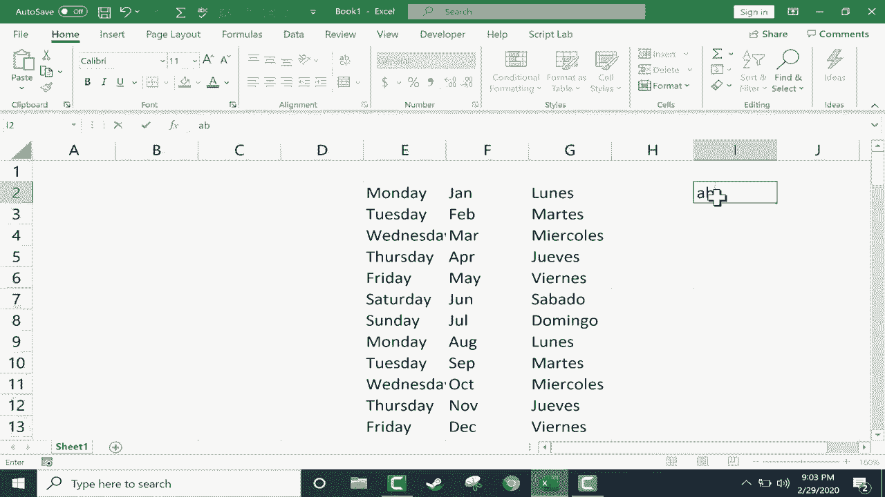

# Excel中级教程！(持续更新中) - P48：49）自定义自动填充句柄 - ShowMeAI - BV1uL411s7bt

在本教程中，我将向你展示如何更改或添加Excel中预定义的文本系列，这些系列与自动填充句柄一起使用。在我之前制作的一个视频中，标题为“Excel的自动填充句柄深入解析”，我展示了如何输入，比如星期一，点击星期一并使用自动填充句柄向下点击和拖动，看看发生了什么。Excel在电子表格中生成了一个系列。从星期一到星期天，然后又重复。

这在几个月和其他事情上也可以类似地工作。我们试试一月的Jann。但我的一位观众保罗联系了我，并指出还有另一种使用自动填充句柄的方法。如果你点击左上角的文件选项卡，可以向下找到选项和高级，然后滚动到选项列表的最底部。你会看到有一个常规部分，其中有一些可以更改的内容。

你可以编辑自定义列表。它说明创建可用于排序和填充序列的列表。所以我会点击编辑自定义列表，你可以看到它带有一些预设的自定义列表，可以与自动填充句柄一起使用。好吧，我想创建我自己的新列表，可能不想用星期一、星期二、星期三等等，而是想用西班牙语来表示。我当然还应该加上重音符号。好的。

所以我们在西班牙语中有了星期几的名称。现在我已经输入了整个列表，我可以点击确定。让我们试一下。我会再次点击O，点击屏幕，然后输入luase。点击它，使用自动填充句柄，我可以点击并拖动，一直拉到使用自动填充句柄。

如果你的自动填充句柄左侧或右侧已有数据，你只需双击填充句柄，它会将其扩展到与相邻数据相同的程度和长度。返回到选项。一旦进入选项，你必须去高级选项，然后在选项列表的底部编辑自定义列表。

我现在有一个自定义列表，我其实并不需要那个列表，所以我会删除它。点击O，你会注意到你也可以将项目导入到这些列表之一。例如，从你的电子表格中，因此你可以在电子表格中输入你想保存到自定义列表中的系列，然后可以点击这里进行选择。

再次点击这里，然后在这种情况下点击导入，我实际上并不需要这样做，所以我会将其删除。因此，使用这种方法，你可以在新列表中放入几乎任何你想要的内容，一个可与Excel的自动填充句柄一起使用的自定义列表，只需点击O，再次点击O，你就可以使用那个自定义列表了。

