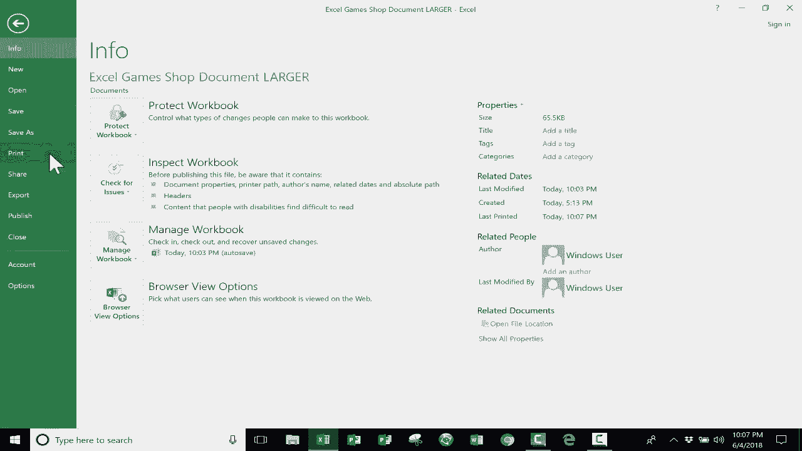

# Excel中级教程！(持续更新中) - P5：5）打印选项巧教程 

在这个高级Excel教程中，我将向你展示Excel中的一些打印选项。老实说，我希望你不需要经常在Excel中打印。在当今世界，你应该能够以数字方式共享Excel文件，尤其是使用Dropbox和Microsoft Office在线等工具。希望你不需要频繁打印。

但是如果你确实需要打印这个教程，我们将向你展示一些关键的技巧和窍门，以便你能有效地打印。把打印看作一个过程，而不是单一的步骤或事件。这是一个过程。你在观看这个教程时会明白我的意思。

我们在打印时使用的工具可以在不同的地方找到。一个你会找到一些打印工具和选项的地方是点击文件选项卡时。它会改变视图，你会进入后台视图。然后你可以点击打印，这会给你一个打印选项。

所以你可以感受到打印后文档的样子。这里有各种选项。你在Excel的其他地方也会看到一些这些选项。可能我展示的内容会有重复。但这里有一些选项，而且有些相当重要。你还会注意到这个页面设置的链接。

这相当重要。在我们退出打印预览之前，我希望你注意到这个文档将需要多少页。如果现在打印，将会是30页。我可以点击这个箭头查看各页及其性质。我也可以使用右侧的滑块。所以你可以看到这些看起来不错。

但是当我向下翻页时，注意到一些列也会以有点奇怪的方式打印。似乎并不是所有的数据都整齐地放在一起。它没有正确组织。所以这是一点需要注意的。而且30页，一定有办法解决这个问题。所以继续观看，我会向你展示一些技巧和窍门。我想退出这个打印预览。

我可以通过点击这里的箭头，或者直接按键盘上的Esc键来实现。我已经退出打印预览。这是查找打印选项的一个地方。另一个地方是在页面布局中。你会在那里找到一些不错的选项。信不信由你，在右下角有这三个按钮。

在某种程度上，这个视图缩放，右下角的这些工具在我们尝试设置打印时会很有帮助。所以让我们看看能否将30页减少到更易管理的数量。让我们从页面布局选项卡开始，看看我们有哪些选项。如果你记得打印预览。我想告诉你一个打印预览的快捷方式。

你不一定要在文件中点击这里。快捷键是控制F2。因此在任何时候，我只需按住控制键并轻点F2，它就会带我到打印预览。好的，如果你记得有30页，让我们减少到这个数量，一种方法是注意这个打印预览页面是纵向的，纵向比横向高，如果你看我的数据，纵向有很多数据，但横向有不少列。

所以改变文档的方向可能是有利的，我可以在页面布局选项卡和页面设置组中做到这一点。因此我将点击方向，将其从纵向改为横向。现在让我们按控制F2，你会发现这并没有改变太多。

事实上，现在我有39页。但在许多情况下，这会解决很多问题。所以我们还能做什么，以便让这些数据适应，不让最后两列占用单独的页面。基本上，我将退出打印预览。我能立刻看到我可以改变的事情，你会注意到我的列宽。

其中一些列可能过宽。我不需要看到这些家庭纸牌游戏和棋盘游戏名称的所有空间。因此我可以调整每一列的大小。当然，最简单、最快的方法是点击并拖动选择所有列，然后在你选择的任意两列之间双击。所以可以在P和Q之间，或在S和T之间，或者其他任何地方。我选择T和U。

我将双击该列，它会将所有列的大小调整得刚好适合提供的空间。因此现在如果我按控制F2进入打印预览。看，现在我只有26页要处理。这确实大大帮助了我浏览这些其他页面。它仍然不是完美的。我希望这些列的数据能适合在另一页上。

但至少我得到了少于30页。我们在这里取得了一些进展。回到电子表格。你可以尝试的另一件事是，假设你并不需要所有这些信息。也许我只需要打印几个月的数据。如果是这种情况。

我可以只点击并拖动选择我需要打印的列和数据。然后我只需转到页面布局选项卡，点击打印区域，设置打印区域。因此，这告诉Excel，我只想打印电子表格的这一部分。现在试试，如果我转到文件打印，似乎我得点击显示打印预览。

这可能稍微有帮助，但你会注意到它仍然是26页。它占用了这些空间。但请知道设置打印区域可能非常有用。我将清除打印区域，因为我想打印所有这些数据，而不仅仅是其中的一部分。还有其他一些可以尝试的事情，包括我可以缩短月份的名称。

如果我缩写十二月、一月和二月，那将使这些列变得更窄，所以这是我可以尝试的。 我也可以将这些文字倾斜，使其呈对角线。 这是一个选择。我可以单击以选择整行，然后我可以去主页标签，在对齐组中。

这里有一个选项可以改变文本的方向，我可以逆时针倾斜，甚至完全垂直。 这可能使我能够进一步缩小这些列。 但假设你不想这样做。 你还能尝试什么，以便让所有数据在更少的页面上打印，从而避免仅从最右边的两列出现页面。你可以尝试隐藏不必要的数据。

所以，与其简单地选择你想打印的区域并转到页面布局，打印区域，设置打印区域。 不如说，我不真的需要几个月前的数据。 所以我可以单击并拖动列字母，比如B到G。

然后我可以右键单击任意一列字母并选择隐藏。 这会隐藏这些列。 现在让我们再试一次。我将去文件，打印或按控制F2。 现在看，它不包括我隐藏的一月到六月。 所以这也是你可以尝试的。 但是看，我仍然有26页。

所以我向你展示的所有这些步骤，它们确实有帮助。 但你可能需要做不止一个步骤。 你可能需要不断尝试。 并且不断返回打印预览和你的电子表格，直到你获得你想要的打印预览效果，以便继续打印。现在，让我们看看右下角这三个按钮能为我们提供什么。

它是在普通视图中。 所以这就是那个按钮的用途。普通视图。 但现在让我们看看页面布局。 当你点击页面布局时，它会显示你的电子表格在页面上的效果。 所以你可以看到这是页面结束的地方。 这就是我们遇到一些问题的原因。

我们遇到了一些麻烦，因为这最后两列根本不适合页面。 所以我最终不得不打印，基本上是双倍，很可能是双倍的页数。 因为这两小列偏得太远到右边。 所以页面布局按钮非常有用。 你会看到那个名字，页面布局。

你会在Excel的其他部分看到这一点。 就在这里，页面布局。 但这是页面布局标签。 这与这个页面布局按钮不同。 这更像是页面布局视图按钮。对，你有你的普通视图，你的页面布局视图。 然后还有另一个我们一会儿再看看。

但是在页面布局视图中，它允许我对这个页眉进行一些更改。所以现在，我的页眉几乎是空白的，对吧？页面最顶部的数据上方，目前那里实际上什么都没有。但是我可以在那输入一些内容，也许我可以写上我假设的小商店的名字，出售这些神奇的游戏。

我会称这个为“惊人的有趣游戏”。好的，漂亮的名字。我喜欢它。现在，既然我在这里，我想暂时停止尝试减少我们要打印的页数，只是为了让你看到在页眉中你有一些很酷的选项。除了在顶部放一些像标题这样的页眉文本之外。

你还可以放入一些东西，比如当前日期和当前时间。你会注意到我在它们之间留了一个空格。你不必这样做。你可以放一个逗号，或者在它们之间放任何你想要的东西，或者什么都不放。但是现在我有了日期，我要放入当前时间。这些应该会自动更新。😊

每次查看电子表格时都会由Excel更新。所以这样，当我打印时，我总是知道我在右侧打印的内容，我可以写上页数之类的。现在，所有这些选项都是在设计选项卡中获得的，几乎仅仅因为我在页眉中。

如果你记得的话，我是通过点击这个页面布局按钮来到页眉的。好的，所以在页面的右上角我想点击。我想设置一下，让它显示页码。我们来看一下第一页的页码。如果我想的话，我可以说这是总页数中的第一页。

这有点令人困惑。现在是第1页，共26页。也许我需要在这两个之间放一些像“共”的东西，也许在开头我可以输入“第”这个词。所以“第1页，共”，然后是总页数。最后，我可能会再输入一次“页”。让我们试试，看看它看起来如何。“第1页，共26页”。

相当不错。也许最后那个“页”这个词不是必要的。但是，这些是你点击页面布局后得到的一些不错的选项。但同样，页面布局还告诉我们页面的边缘在哪里。好的，让我们回到打印预览，看看它的样子。看起来相当不错。

注意到我的页眉现在显示出来了，如果我去第2页、第3页、第4页，看看那。我们仍然在顶部有页眉。但是缺少的一件事是对这些数据的解释。当我翻到第10页或第20页时，我可能会失去这些列标题的跟踪，对吧，七月、八月、九月，所有这些。所以为了帮助解决这个问题，我们回到电子表格中去。

我将前往页面布局选项卡。 我可能应该早点做这个。 但在页面布局选项卡中，看，这里有一个打印标题的选项。 这里说的是顶部重复的行。 然后我可以选择要重复的行。 也许我不需要这行说游戏单元格的。 我就选择第2行。

我点击确定。 现在，当我们打印预览时，看看它的样子。 当我从第10页到第12页时，顶部的那一行仍然保持不变。 所以我知道这些数据的含义。 此时，你可能理解我为什么说打印是一个过程。 这不仅仅是一个快速的事件，你会频繁进入打印预览。

然后再回到电子表格。 让我们看看我们可以做的一些其他更改。 这些更改的许多选项，你可以在页面布局选项卡的页面设置组中找到。 在文件打印与打印预览中，你可能也能找到一些相同的选项。 所以在这里你可以看到，我本可以这样更改方向，但我选择在选项卡上做。

但没关系。我可以更改的其他一些内容包括边距。 我可以在这里或在页面设置组的选项卡中更改这些内容。 所以你可以看到有很多重复。 我通常更喜欢在页面设置组的选项卡上做很多更改。 但有时在打印预览中进行这些更改是有意义的，这样你可以立即看到结果。

那么让我们尝试一下。 我会选择正常边距。 这涉及到页面左侧和顶部，右侧和底部的边距。 如果我从正常改为窄边距，看看会怎样。 好吧，这有所帮助，一切都有所帮助。

不过如果你注意到，我们仍然有26页。 我仍然认为这是一种改进。 看吧。 我们只剩下一列不合适。 每次我们进行更改时，离我们想要的目标又近了一点。 我们的目标是减少页面数量，并将所有数据放在一组页面上。

对于下一个我想尝试的更改，我会再次点击这个向后箭头，回到我的电子表格。 这次我会再次去右下角，改变视图。 我想看到页面分隔预览，而不是页面布局。 所以如果我点击这个，它会显示另一种在某些方面类似于页面布局视图的视图。

不过这次我看到了一些虚线和一些实线的蓝色线条。 我将使用右下角的滑块放大一下，这样你就能更清楚地看到。 现在你可以清楚地看到，第一页在这个虚线下面。 这是第二页。 然后继续到第三页等。 所以请注意这里。

这一列在这里无法适应。正如我们所知道的，它被打印为第14页。这显然是不可接受的。所以我有几个选项。这些选项大多数只有在页面分隔预览中才能找到。第一个选项是我可以决定，知道吗，12月，我不需要它。

所以我会点击右侧的这条实心蓝线，然后向左拖动，这样就会省略那一列。现在当我进行打印预览时，看看我得到了什么，原本的26页，现在变成了13页。所以这正是我想要的。这正是我想要的效果。

只是我可以打印的一堆Excel信息。但如果12月真的很重要，我不想就这样忽略它。我还有另一个选项。我可以点击这条虚线并向右拖动。这是在说无论如何都要让这些数据适应页面。这样做的缺点是。

有时它会将数据缩小得几乎不可读。所以我们来看看效果。我会点击打印预览，看看。我认为我们成功了，所有内容都适合在一页宽、13页高，效果很好，12月的数据也包括在内。现在，如果你记得，我确实隐藏了1月到6月。如果我回去取消隐藏它。

显示隐藏内容的方法是点击并拖动以选择被隐藏的部分。然后我可以右键点击选择取消隐藏。这会将所有内容恢复回来。所以现在，当然，我又回到了之前的问题，但我可以再试一次。我可以点击并拖动那条虚线，试着包含所有数据。

这次我们看看效果是否可接受。你知道，即便如此也是可以阅读的。所以我认为我们状况良好，总页数降至10页。甚至有更多数据能够放在一页上。在这一点上，我准备点击打印，打印我的电子表格，除非我错过了网格线。

所以你会注意到我的打印预览中没有网格线。在Excel中，我习惯有这些网格线，这些显示单元格开始和结束的垂直和水平线。如果我想在打印中保留这些，我只需转到页面布局的工作表选项组，确保我有网格线。😊

打印的不仅仅是查看，还有标题。那就是从A到Y。如果你想让它显示出来，你也可以打印。但注意，这改变了情况，现在我又失去了这一列。所以我要撤销那个。让我们进行最后一次打印预览，看看那是什么样的。

看起来这是一个相当不错的电子表格，可能仍然可以阅读。这得益于我们进行的许多更改，比如使用窄边距和这个分页预览按钮。顺便说一下，我现在可以恢复到正常模式，但是我们所做的所有小更改使得我能够打印并以一种有意义的方式展示我的数据，看起来像Excel且实际上可读。感谢您观看这个教程。希望您觉得它有用。如果您觉得。

请点击下面的点赞按钮。
