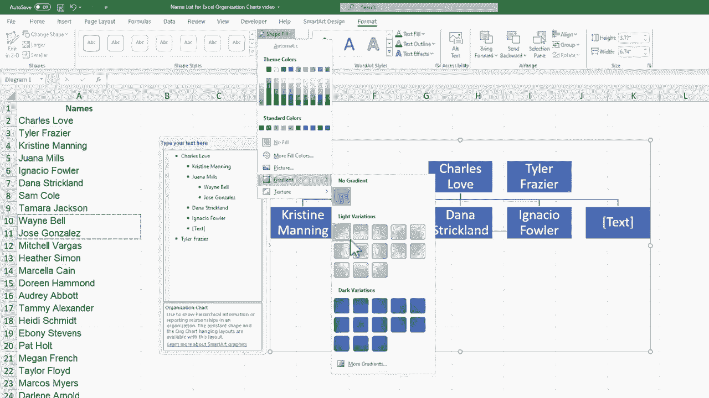

# Excel中级教程！(持续更新中) - P50：51）创建组织结构图 - ShowMeAI - BV1uL411s7bt

在这个视频中，我们将学习如何在Microsoft Excel中轻松创建组织结构图或组织图。您可以看到左边有一个工作在某个组织中的人员名单，我想将他们组织成一个层级和组织图，在sheet2上展示。

您会注意到我有一个示例的USDA组织结构图。假设我在USDA工作，并被要求遵循这个模式为组织创建一个组织图。顺便说一下，如果您查看视频下方的描述，您可以访问这个练习文件。那么，我该如何在Microsoft Excel中创建这个组织图呢？好吧。

在Excel中创建组织结构图的最佳方法之一是点击这里的插入，然后使用智能艺术选项。如果我点击智能艺术，您会看到有大量的智能艺术形状可供选择，包括过程和循环，您可以使用它们。

这些智能艺术对象易于自定义和修改，并且在许多不同的方式中都很有用。您可以看到可以添加矩阵、金字塔、不同类型的图形组织者，智能艺术形状和视觉效果的丰富资源。我将下移到层级，您可以看到这些层级中的每一个都可以用作组织图，您可以将CEO放在顶部，副总裁放在这里，或者按照您想要的方式组织您的组织图。所以选择最符合您需求的组织图。

我将简单选择默认的组织图，您可以看到这里有一些关于它的细节，然后点击一下，我就在我的Excel电子表格上方添加了一个组织图，确实是在它的上方，您可以看到我可以点击并拖动来移动。

组织图。它就浮在电子表格单元格的上方。如果我想让组织图变大，可以在角落点击并拖动来调整大小。不过现在这样做可能还为时已早，稍后您会明白。好的，现在让我们开始向这个组织图中添加人员。如果我切换回sheet 2。

我可以看到秘书在顶部。所以我将切换回sheet 1。假设查尔斯·洛夫在这里。我可以点击文本并输入查尔斯·洛夫。请注意，文本会调整大小以匹配提供的空间。您还可以点击并拖动来更改空间本身。

所以回到之前，如果我一开始就调整了我在那个框中的空间。请注意，文本的处理会有所不同。我实际上很喜欢Excel处理这个的方式，所以我可以点击这里输入文本，它会调整为所需的宽度和大小。但我想向您展示，有时在左侧的面板中输入名字或其他文本会更好。

与其直接在框中点击和输入，不如点击这里并输入名称。如果我想的话，我还可以输入职称，比如副秘书Charles Love。但为了简洁起见，我只会保留名称。在这一点上，我可以点击这里添加组织结构图中的下一个人。但如果你还记得，在第二张表上。

这个组织结构图的设置方式与我在Excel中得到的层级不同。我该如何复制它？我该如何匹配它，以便这些其他人被视为副秘书的兄弟姐妹，而不是子女？好吧，回到第一张表。我可以通过右键点击Charles Love框来做到这一点。

然后我可以选择在Charles Love形状之后添加形状。所以如果我点击它，就会在Charles Love的右侧添加一个形状。现在，这是一个不寻常的情况。通常在添加新形状时会自动提供链接。但在这种情况下，由于某种很好的原因，它没有这样做。因此，我可能需要插入一条显示这种关系的线。

现在，我可以点击这个框，或者直接点击面板，输入Tyler Fraser。现在，有一个很好的优势是将文本直接放在同一个电子表格或另一张表上，这样你可以使用控制C点击复制，然后点击框或面板，然后粘贴文本。

所以在某些情况下，这是一种优势，这样做可能会更快。在这一点上，我只想开始处理组织结构图的这一部分。回到第一张表，你会注意到我可能不需要这个特定的框。我可以点击它选择，然后按下键盘上的删除，它现在已经被移除。

所以我可以继续点击并复制各种名称，然后粘贴到这里。现在我们试试一次复制粘贴多个名称。如果我点击并粘贴到这里，会发现它自动将两个名称放在一起。现在，如果我决定需要为Ignatio Fowler添加一个新兄弟姐妹或为Charles Love添加一个新孩子怎么办？

嗯，我可以选择Ignatio Fowler，右键点击选择添加形状，选择在之前添加形状。假设我想让新的人列在这里。当我在之前添加形状时，看看会发生什么。现在我有了一个新形状，它在Ignatio Fowler之前。所以这将是Dana Strickland，我会把她的名字直接粘贴进去。接下来我可以继续添加更多名称。

我可以继续添加更多名称和组织到这个组织结构图中。假设Juana Mills是团队负责人。我可以右键点击Juana Mills，添加另一个形状。这将是一个下面的形状，我想列出她的团队，每个团队成员都有自己的框。现在，因为我刚创建了这个新框来添加另一个框。

我所要做的就是再次点击胡安娜·米尔斯，然后按 F4 键，这将为胡安娜·米尔斯添加另一个子项。所以我可以很快在胡安娜·米尔斯的下面添加一个完整的团队。我可以将他们的名字直接复制粘贴到面板中，并删除任何不需要的形状。

就像在 Excel 中添加的大多数对象一样，制作的智能艺术组织图可以被点击，当它们被选中时，顶部会出现额外的选项卡。所以有一个智能艺术选项卡，里面有一些相当激动人心的选项。在这里，你可以为组织图添加一种3D效果，或者让它看起来有点倒角。

你可以选择一些其他样式或选项进行浏览。你甚至可以改变颜色，所以我可以将其调整为不同的颜色，或者选择全橙色，如果你想的话，这里有许多不同的颜色选项。如果需要，你可以点击“重置图形”将其恢复到原来的样子。如果你还记得一开始我添加智能艺术时，你也可以改变组织图的层级类型。

我选择了基本层级，但如果你想的话，可以切换到其他样式，只需将鼠标悬停在这些其他布局上，即可预览效果。如果你认为这比原来的布局更好，那就继续切换吧。我会坚持使用这个原始布局。

我在顶部还有一个格式选项卡，可以改变文本的显示方式。我并不特别喜欢那种样式，但如果需要，我可以切换到那种。我还可以改变形状的填充，所以我的组织图的背景。我甚至可以通过这里使用渐变。我还可以使用纹理，因此如果你愿意，可以让这些组织图变得相当花哨。

我打算撤销几次，以便让我们回到之前的样子。我对这个样子挺满意的。现在，你可能注意到，我用这条线将泰勒·弗雷泽和查尔斯·洛夫连接起来的解决方案有点麻烦。每当图表调整时，这条线似乎都不在合适的位置。所以让我们寻找一种更好的方法来连接泰勒·弗雷泽和这个组织图。

一种选择是简单地添加另一个形状，但我可以选择“添加助手”而不是“添加形状”。然后我可以点击并拖动这个助手到我想要的位置。所以我打算删除泰勒·弗雷泽，并将助手拉到这里的侧面。

我会在这里复制泰勒·弗雷泽，作为查尔斯·洛夫的助手，所以尽管你当然可以在组织图中添加自己的形状、线条等，但通常直接使用内置的层级工具会更好，特别是在添加形状时。
