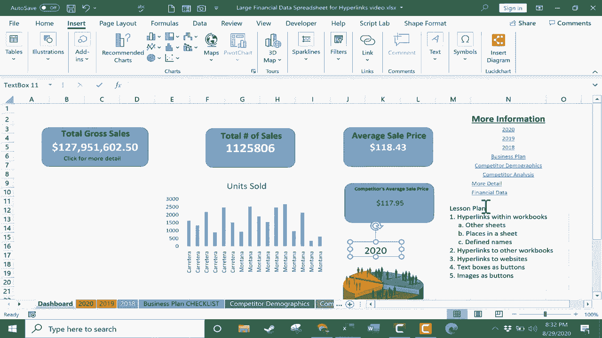

# Excel中级教程！(持续更新中) - P53：54）使用超链接 - ShowMeAI - BV1uL411s7bt

在这个视频中，我将向你展示如何在Microsoft Excel中使用超链接。我们将看看如何做到这一点，以及为什么这可能是个好主意。在这里，你可以看到这个视频的课程计划的简单大纲。那么首先，让我们看看在工作簿中进行超链接的情况。所以你可以在我的工作簿中看到。

我有我的第一张工作表，这是一个从工作簿的其余部分提取信息的仪表板。如果你想学习如何在Excel中创建自己的仪表板，你应该观看我的Excel仪表板视频。但假设我完成了这个仪表板，我决定，观众可能想看到比仅仅是亮点和总销售额更多的信息。

销售总数等。如果观众想深入了解数据本身呢？是的，观众可以直接在这里向下点击其中一个电子表格标签。但相反，我可能想使用超链接来帮助观众快速获取他们想要看到的信息。因此，我在电子表格中输入了一些日期和文本，将其转变为超链接。

我所要做的就是点击它并转到插入选项卡，在插入功能区的链接组中，有一个链接按钮，我会点击它，你可以看到在Excel中创建超链接时有四个主要选项。

我想从选项2开始，在这个文档中的一个位置。所以我会点击它，它会弹出我所有电子表格的列表，2020年我只需选择它并点击。所以现在这是一个超链接，就像你在互联网上找到的那样，当你点击网页上的链接时，它会带你到另一个网页，情况是一样的。因此，作为观众，如果我点击那个单元格。

它带我到2020年的电子表格。我回到仪表板，选择了2019的单元格，我只需上去再次点击链接按钮，这次我只需双击2019，你不必先点击，然后。好的，你可以直接双击选择它。现在，如果你不想链接到特定的工作表呢？

而不是链接到那个电子表格内部的一个位置。好吧，当你点击添加链接时，除了选择哪个工作表外，只需去这里，输入单元格引用，也许我想链接到H25，我点击。所以现在当观众点击那个按钮时，他或她会被带到2018电子表格上的H25，跳回仪表板。

我确实想让你看到这在同一工作表中也是有效的。例如，使用商业计划，我可以选择文本添加超链接，但我会把它保持在仪表板上，我只需点击这里并输入单元格引用。假设是N500点击，所以现在当点击它时，会带我到是的。

在同一个电子表格中，但在单元格 N500 下。快速跳回顶部。现在，当然，这真的不是我的商业计划。所以我将按住 Control 并按 Z 来移除该超链接。到此为止，我们已经看到了如何在工作簿内添加超链接到其他表和同一表或其他表中的位置。我还想向你展示如何链接到定义名称。例如。

如果我去商业计划检查表。我可以单击并拖动以突出显示此工作簿中的重要部分，然后在左上角我可以转到名称框，删除那里的内容并输入其他名称，我将其命名为 good，按 Enter。

现在我的工作表部分，商业计划工作表被称为 good。那么我们跳回仪表板。如果我希望这个按钮不仅带我去商业计划表，还带我到那个特定的定义名称。我只需点击单元格，向上去链接，当然我可以在这里选择将其链接到商业计划检查表。但看看，这里有一个定义名称部分。其中一个定义名称是 good 这个词。

我会点击这个，然后点击 O。因此现在当我点击按钮时，它将我带到电子表格的特定部分。正好是在顶部。我本该用底部作为示例，但我想你明白我的意思。回到仪表板。给我一点时间来为另外两段文本添加超链接。

然后我将恢复视频。接下来，让我们看看如何将这个工作簿链接到另一个工作簿。假设我有一个包含更多相关信息的单独工作簿。我可以输入一些文本，点击它并选择链接。但这次，我将链接到一个现有文件。

在这种情况下，我将选择另一个 Excel 工作簿。但这并不一定要是另一个 Excel 工作簿。我就选择这里的这个。我双击以选择它。现在当任何人点击该链接时，它将打开工作簿的链接。如果你要这样做。

你需要确保这两个工作簿保持在一起，如果其中一个工作簿在不同的计算机上，或者如果它被移动出当前文件夹，该链接可能无法继续工作。使用超链接的另一种方法是链接到一个网站。因此，再次，我可以输入一些文本，然后再次点击单元格以选择它，然后上去链接，但这次不是这个文档中的位置。

我将选择现有文件，但这不是我电脑上的文件。这是一个地址，一个网址。因此，打开一个网页浏览器，这是我希望链接到的地址。我会点击选择，按 Control C 复制，然后回到 Excel。我会点击，然后按 Control V 粘贴，点击确定，现在观众在点击该链接时。

系统会询问你想如何打开此文档或网页，我将选择一个网页浏览器，它将直接打开网页。最后，我希望你考虑另外两种使用超链接的选项，而不是像我在这里展示的那样总是与文本一起使用。

为什么不使用文本框或图像作为超链接按钮呢？例如，在插入选项卡的插入功能区，我可以去文本组并点击插入一个文本框。点击并拖动以绘制一个文本框。我将其命名为2020，然后我可以点击文本框外部，再点击回去，我可以将其居中，然后可以改变文本框的大小。

我可以更改文本本身的字体大小。无论我想做什么，以使其看起来像一个按钮。现在我完成了这个，可以点击选择它，再次去插入，链接到这个文档中的2020。我将双击它，这样它在点击时将作为一个按钮工作。

它将引导用户到2020电子表格。现在我可能想在2020电子表格上创建另一个按钮，上面写着“返回仪表盘”或仅仅是“仪表盘”。这将是一个不错、简单且快速的方法，能让用户返回仪表盘。除了使用文本框作为按钮外，你还可以插入图像。我可以去插入插图，选择图片。

有很多方法可以获取这些图像。我将选择在线图片。我会搜索人口统计数据。看起来不错。我将选择它，点击插入。现在我有了一张图像。如果我愿意，可以将其缩小，然后我可以很容易地将其转换为超链接，只需选择图像，插入链接。

我希望它链接到竞争对手的人口统计数据。点击确认。现在这是一个有效的按钮。所以在Excel中使用超链接确实可以为你的电子表格增添一些美观，并为其增加一些互动性。还有创造性的方法可以使用这些链接创建一些令人兴奋的Excel项目。现在，你可能已经注意到还有两种其他类型的超链接。

你可以添加一个新文档。只需给该文档命名，点击确定，它就会为你创建一个链接并生成一个新的文档。另一个选项是将超链接指向电子邮件地址，这样做的话，任何点击该链接的人，如果在其计算机上安装了电子邮件程序，都会打开他们的专用电子邮件程序，并准备好一封电子邮件，地址可能已经填写，主题也可能已经设置，他们只需输入自己的信息。

我希望你看到在Excel中使用超链接的潜力。
