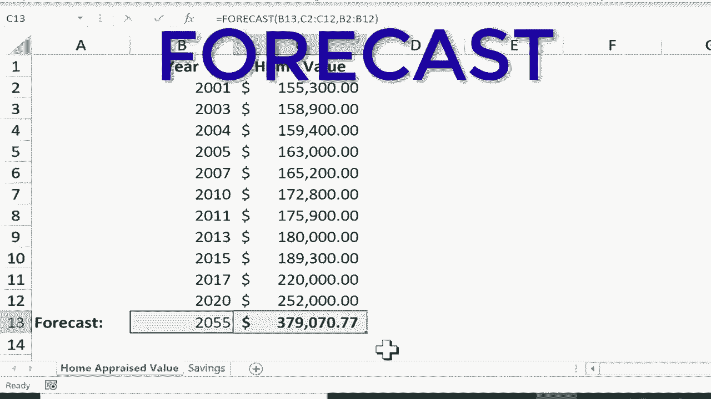

# Excel中级教程！(持续更新中) - P54：55）预测函数 

在本教程中，我将向你展示如何使用Excel预测函数。这只是你可以使用它的一种方式。但我认为这将帮助你了解它的用途。你可以看到我这里的工作簿。它由两个电子表格组成，一个是房屋评估价值，另一个是储蓄。这就像银行中的储蓄账户。

这将是我们的两个示例。所以在房屋评估价值的电子表格中，你可以看到我有一系列的年份。假设我在2001年买了一栋房子。当时它的价值是多少。然后也许每年或两年或三年，房子会被评估，但每一年都有不同的房屋价值。

而这些年份都是过去的。当然，但未来呢？有没有办法预测这栋房子在2035年的价值呢？在我向你展示如何在Excel中做到这一点之前，请知道这是有限的。显然，Excel对房屋价值并不了解。

它不知道房地产是如何增值的，也不知道我住的社区或其他因素。有很多变量，但利用我们确实知道的信息，Excel可以对未来做出有根据的猜测。因此在这个空白单元格中，我将点击，然后输入等号，并输入预测函数。你会注意到有六种不同的预测函数，它们都很相似，但如果你知道你正在查看的是线性模型。

你可以选择预测线性。如果你知道你正在查看的是指数模型，你可以使用预测进行ETS，还有其他略微不同的预测函数版本。如果你不确定用哪个，就坚持使用基本的预测。这就是我输入预测后的操作。

我只需输入一个左括号，你可以看到Excel在寻找什么。它在寻找一个X值，然后是逗号和已知的Y，再加一个已知的X。所以这开始时可能会让人困惑。但基本上，我希望预测是基于2035年。因此我将点击2035，它将成为X。

所以我点击2035。现在，我并不是点击数字，而是点击了单元格B13。所以我在B13中输入的任何内容，将成为X。现在我输入逗号和已知的Y。好的，由于这是X，Y必须是这里的信息，没错。这就是我们已知的信息。

我们知道过去的评估值是多少。因此我只是点击并拖动以选择所有过去的评估金额。现在我会输入一个逗号。现在它需要已知的X。那么这就是X。已知的X是什么呢？就是所有这些年份，过去的这些年份。因此，我点击并拖动以突出显示所有过去的年份。然后我应该输入右括号并在键盘上按下回车。

它根据过去的结果计算出Excel认为我家在2035年的价值。好的，咱们再试一次。这次我会去储蓄电子表格。这同样是有限的，会有一些缺陷。Excel并不知道我的储蓄习惯等等。但假设在1995年。

我在银行里有10美元，而在2005年我有3000美元。我会遵循之前的模式。我会去这个单元格，点击并输入等于预测左括号。这个X是什么？这个预测是基于什么的？好吧，它是基于2030年。因此，我点击那个单元格B11，输入逗号。这个数据的已知Y是什么？如果这是X。

然后这是Y。所以我会点击这里选择所有的Y逗号。现在已知的。好吧，这里是已知的X。所以我点击并拖动来选择这些，加上右括号，按下回车。显然，这就是我在2030年会有的。这对于10年来说并不算很多储蓄。正如我所说，这个预测能力是相当有限的。

但Excel正在尽力计算，好的，考虑到这些数字及其与这些数字的关系，这就是Excel对2030年的预期。现在，请注意，你可以在这里更改为2030。我可以输入2055，按下回车，模型更新，预测更新。这现在是预期的金额。我可以对房屋评估价值做同样的事情。

所以我可以将这个改为2035。2055怎么样？我按下回车键，然后我可以看到，哦，这就是我家在2055年的预期价值。因此，尽管预测有限，这其实很有趣，而且是一种快速获得估算的方法。

基于过去的结果。
