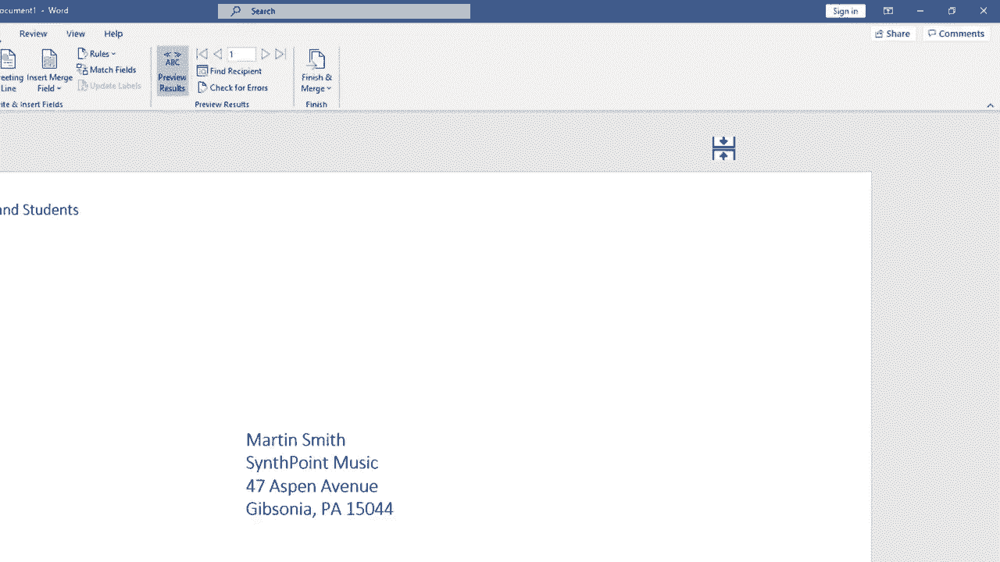

# Excel中级教程！(持续更新中) - P56：57）Microsoft Word 中的邮件合并信封 

在这个视频中，我将向你展示如何创建数百甚至数千个信封，每个信封都有自己独特的地址，发送给数百或数千个不同的人。我们将在 Microsoft Word 中完成此操作。如果你还没有观看我关于如何在 Microsoft Word 中使用 Microsoft Excel 进行邮件合并的教程，你绝对应该观看那个视频。但在这个视频中。

我们不打算关注邮件合并的文档或信件，而是关注它们所放入的信封。所以我现在在 Microsoft Word 中。如果你观看了之前的视频，你知道我已经将文档本身进行了邮件合并，但现在我需要这些文档的信封。

我将从 Microsoft Word 的一个空白页面开始。但我在 Microsoft Excel 中也有一个联系人列表，里面有姓名、地址、电话号码、所在城市等信息。如果你想获取这个练习文件的副本，请查看下面的描述，所有这些都是虚构的。

人员、姓名和地址。所以我们来看看如何为联系人列表中的每个人创建一个信封。开始时，我会去 Microsoft Word，并进入邮件选项卡，以便查看邮件功能区，在开始邮件合并组中，我需要在这里进行我的工作。

现在，我知道去创建组并以这种方式创建信封是很有诱惑力的。但这实际上只是创建一个包含一个地址等的信封。所以你不想这样做，而是应该去开始邮件合并并选择信封。此时，我会看到一些信封的选项弹出窗口。现在我使用的是 Microsoft Word 2020。

如果你有较旧版本的 Microsoft Word，这可能看起来略有不同，但概念是相同的。这对未来版本的 Microsoft Word 也可能是正确的。因此，我在信封上的第一个选项是更改信封大小，可能是最典型的大小。

在美国，信封的大小是10号，所以你可以看到这里的尺寸。如果你需要或想要，可以更改信封的大小。我会坚持使用10号大小。接下来，我可以更改投递地址的字体类型。我要选择代理 FB 吗？你可以在这里看到预览。我想选择乔治亚 Pro light。 我可以将其设置为粗体。

我也可以更改字体大小或颜色。在大多数情况下，你不会想更改这些。所以我将取消这个选项，但我只是想让你看到这是一个选项。接下来，我们有一些信封的定位选项，包括左侧和顶部，默认情况下。

它应该显示自动，在大多数情况下，这就是你想要保持的状态。但一旦你完成了信封的邮件合并，如果发现间距有些不对，这里可以从左侧框中进行一些调整。如果我点击上，它会将送达地址向上移动。

你还可以直接输入确切的数字。我将切换回自动，在大多数情况下，这会对你有效。同样在顶部，我们也可以将送达地址向不同方向调整。接下来，信封的左上角有类似的选项用于返回地址，与送达地址选项非常相似。现在，除了信封选项，我还有打印选项。

如果你的电脑连接到打印机，默认选项可能是你希望的，以使其与那台打印机兼容。但如果需要，你也可以切换，可以尝试不同的方向和选项。

我们这里也有一些进纸选项，我们可以选择手动进纸或托盘进纸，有很多不同的选项可以尝试。在这种情况下，我将坚持使用手动，然后点击 O。现在，当我点击确定时，这一页的布局将会改变，看起来更像一个信封。为了看到这一点，我需要稍微缩小一点。但让我们先点击 O。

我不知道你是否注意到细微的变化，但如果我缩小，你可以看到这现在被格式化并排版得像一个信封。现在是我从 Excel 电子表格中提取信息的时候了。在 Word 中，我只需点击选择收件人。此时，我可以手动输入所有收件人的列表。

但假设我有 1000 人需要发送信封。这对我来说不是一个好的选择。因此，我将点击使用现有列表。然后我所要做的就是导航到我电脑上存放 Excel 电子表格的文件夹。哪里有包含所有收件人姓名的表格。

地址等。我找到了它，并双击了它。现在我双击之后，我只需要验证几件事情。我的数据是否有包含列标题的第一行？如果我回到 Excel，你可以看到确实有。这些是列标题。因此我需要确保这被选中。

然后我需要确保选择了正确的表格。在这种情况下，实际上只有一个表格。所以这是一个简单的决定。我可以点击 O，似乎没有发生什么，但实际上，我现在准备将信息从 Excel 合并到 Microsoft Word 的信封上，实际操作之前。

不过，我可以在左上角输入返回地址。所以这是返回地址名称。然后我可以在键盘上按回车，输入街道地址，按回车，输入城市、州和邮政编码。现在我有了返回地址，我需要填写送达地址。

屏幕上似乎没有任何内容，但实际上有。那里有一个不可见的文本框。如果我在这里某处点击，你可以看到文本框的轮廓。接下来，我可以使用这个地址块按钮或插入合并字段按钮来放入收件人的地址。我们试试地址块。如果我点击它，它会尝试自动拼凑在一起。

收件人的姓名和地址。😊，但是如果你仔细看，它并没有完全成功。街道地址缺失。如果我回到Excel，你会看到有街道地址。只不过我称它为公司地址，而不是街道地址。那么我该如何修复呢？在Microsoft Word中，我可以进入这里插入地址块。

弹出窗口并选择匹配字段。这里显示地址1未匹配。我只需点击这个下拉菜单，选择公司地址。点击O，看看。这现在已修正马丁·史密斯的送货地址。我也可以为下一个人测试一下，亚德里安·托马斯，对我来说很好。

艾利斯·阿雷维洛，情况也是如此。这样可以输入送货地址。只需使用这里的按钮。确保它是正确的。如果不正确，点击字段，然后点击O。与其点击确定，我将点击取消，只是为了向你展示你也可以手动拼凑地址，使用这个插入合并字段。

我会点击这个底部部分，选择名字，Word会立即插入名字占位符。我要留一个空格，所以我用键盘打一个空格，然后可以回到插入合并字段姓氏，然后在这一点上。

我会按下回车键移动到下一行，回到上面插入合并字段公司名称，这可能是必要的，也可能不是。按下回车插入合并字段公司地址。如果你愿意，可以在这里放一个逗号。你可以放其他任何你想调整的内容，我再按一次回车。插入合并字段城市，逗号，然后留一个空格，再回到插入合并字段州。

我会放一个或两个空格，然后插入合并字段邮政编码。所以我为这整个收件人列表拼凑了自己的地址块。让我们测试一下，看看它是否能工作。我们可以通过在邮件选项卡中点击这里，进入预览来进行测试。

群组并点击预览结果。所以这是艾利斯。看起来不错。对我来说没问题。还有道格拉斯。我可以点击这些按钮浏览所有的名字，或少数名字，以确保它正常工作。看起来很好。你也可以搜索特定的收件人进行测试，并检查错误。但此时，我对它的工作情况感到满意，结果会很好。

所以我准备完成合并了。现在，在我这样做之前，我将通过点击这个按钮回到第一条记录。这是将要打印的第一封信封，然后我将点击完成和合并。有不同的方法可以进行合并，我将专注于打印文档。现在。

在这一点上，即使我对事情进展顺利充满信心。如果我真的要打印100个信封或1000个信封，我不会第一次就打印所有信封。相反，我会仅打印当前记录。在这种情况下，首先打印信封以进行测试。

确保这真的在工作，并且我正确地将信封正向喂入。如果这样可以，那么我可以回去再做一次，打印所有信封。让我们看看当你点击打印所有时会发生什么。我点击O，这弹出典型的打印机选项，您习惯看到的。

我可以通过这里的按钮切换打印机，调整属性等。现在，如果我点击O，它将开始打印所有这些信封的过程。所以这就是如何在Microsoft Word中进行信封的邮件合并，同时也使用Microsoft Excel。如果你觉得这有点吓人，你可以通过点击这里的开始邮件合并并选择逐步邮件合并向导来进行相同的步骤。

有些人发现这稍微简单一些。老实说，我不一定觉得它更简单，但它确实引导你完成步骤。因此，如果你对邮件合并这个概念非常陌生，你可能想使用向导。同样，你将使用现有列表，然后点击。然后它会给你一些如何继续的提示，然后你会再次点击下一步进行预览，再次点击下一步完成合并。

因此，知道这一点是好的，以防你遇到困难并需要一点指导。
