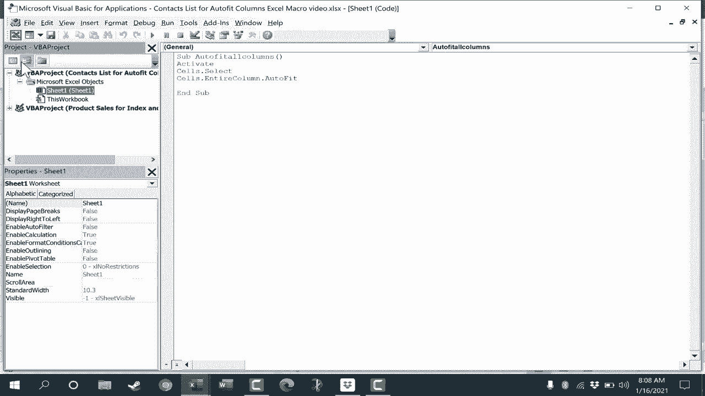

# Excel中级教程！(持续更新中) - P60：61）从头开始创建 Excel 宏 - 自动调整列 

在这个视频中，我将向你展示如何创建自己的Excel宏。具体来说，这个视频将介绍一个宏，你只需点击一个按钮。通过这样做，你的Excel电子表格中的所有列将自动调整为这些列中的数据，并查看我们正在使用的电子表格。

这是一个包含一些虚构人物所有种类个人信息的联系人列表。你可以在视频描述中获取这个副本。但正如你所看到的，一些列的宽度有点不对。例如，B列太宽。当然，我可以通过点击并拖动B列和C列之间的区域来调整它。

在那条线上，点击并拖动来调整列的大小。还有一个更快的方法。我可以通过点击并拖动来选择所有列标题来调整所有列的大小。然后我可以在任意两个列之间双击，这样所有列就会调整到完美的宽度。我刚刚按了Ctrl Z撤销。因此，尽管这样更快。

我可以创建一个宏，让这一切变得更快吗？那么，我该如何创建自己的宏呢？其中一种方法是录制自己的宏。如果你还没有观看我的Excel宏初学者指南，建议你观看。在很多情况下，录制宏是最佳选择。

然后将其分配给一个按钮。但让我们看看如何从头开始创建一个宏。第一步是确保你已经在Excel中添加了开发者选项卡。目前，我没有开发者选项卡。有几种方法可以添加开发者选项卡。最简单的方法之一是右键单击任何一个选项卡，选择“自定义功能区”。

这将弹出这些选项。你可以在右侧查看，那里有主选项卡，你可以查找“开发者”，确保该框被选中，然后点击确定。现在我在开发者选项卡上有一个开发者选项卡。在开发者选项卡中，你可以查看代码组，在那里我们有Visual Basic。去点击它。请注意，还有一个键盘快捷键Alt F 11，可以打开Visual Basic编辑器。

什么是Visual Basic？它是一种编程语言，类似于C++或其他编程语言。微软为你在Word、PowerPoint和Excel中使用包含了Visual Basic的一个版本。但它的名称是VBA，即“应用程序的Visual Basic”。因此，我们将在这里进行一些编程。

但我希望你会发现这很简单，不会太令人畏惧。那么我们要做的是选择工作表1。这是我现在正在处理的电子表格。如果我双击它，你会注意到弹出一个窗口。在这里我可以放入我的代码。

如果你熟悉Visual Basic，并且知道如何编写代码，你可以直接输入那段代码。你就创建了一个Excel宏。在这个视频中，我们将使用一小段简单的代码。我会把它包含在描述中，放在视频下方，以便你想复制粘贴的话。我们将开始输入sub，sub代表子程序，然后我将输入autofit all columns（自动调整所有列）括号，按下回车键，输入C.dot.select，注意当我输入dot时，弹出了一个菜单，我可以点击选择其中的选项。我就选择select，所以我可以继续输入或者双击输入select，然后在键盘上按回车，输入cellss.dot.entire column.dot.autofit，在这里我可以直接按回车选择autofit，最后一部分会自动添加，sub，换句话说，我们完成了这个子程序。此时我将关闭VBA编码窗口，然后在开发者选项卡的代码组中，我可以直接点击宏按钮。

运行我创建的这个宏，并点击运行。注意它做了什么。它自动调整了所有列的大小，以完美适应这些列中的内容，这样一切都能适合，而最大的项目刚好适应每一列。好吧，我会再次搞乱一些列，只是为了向你展示，有时候使用宏的更好方法是创建一个按钮并将那个按钮附加到你创建的宏上。

所以在开发者选项卡上，我将去插入按钮，选择一个表单控件来添加，它将是一个按钮。你也可以添加Active X控件，但为了简单起见，我将点击表单控件按钮，然后在屏幕上点击并拖动来创建按钮的轮廓。

接下来，我应该为那个按钮分配一个宏。有时候，宏还不存在，在这种情况下，你可以直接点击确定，然后稍后再分配按钮。但在这个案例中，我已经创建了宏。它是自动调整所有列的。我点击O。

现在，如果我想更改按钮的名称，只需点击高亮文本，删除它，我将这个按钮命名为autofit columns（自动调整列）。接下来，我想把这个按钮移到一边，以便它不覆盖数据。现在，使用这些开发者按钮，你不能左键点击并拖动来移动按钮。相反。

你需要右键点击并拖动。所以我会把它拉到一边，松开鼠标按钮，移动到这里。然后，一旦你点击了那个开发者按钮，你就无法再移动它或进行其他操作，只能点击按钮。相反，你需要右键点击按钮。这会给你提供选项。你可以格式化控件，分配一个不同的宏。

剪切、复制或进行任何你需要的操作。但启用这些选项的是右键单击。所以我将继续左键单击它，看看是否能执行宏。我单击了，它成功了。它漂亮地调整了所有列的大小，确保一切再次完美契合。现在，此时我想😊，保存这个工作簿和这个电子表格，因为我希望在未来能使用这个按钮。

我不想每次使用这个电子表格时都创建我的宏和按钮。所以我可以直接点击保存按钮，但看看会发生什么。它给我发出了警告。以下功能无法保存在启用宏的工作簿中，因为我创建了一个宏，并且我使用了Visual Basic for Applications来创建这个伟大的功能。

我必须以特殊的方式保存这个工作簿。系统提示要保存带有这些功能的文件。点击否，然后在文件类型列表中选择一个启用宏的文件类型。所以我会这样做。点击否，然后我会在这里更改文件类型，选择Excel启用宏的工作簿。

注意它在文件扩展名末尾添加了一个M。我也稍微更改了文件名，仅仅是出于我自己的原因。现在当我关闭这个文件时，它会关闭，然后也许在一天或一周后，我会去文件，选择那个相同的电子表格。

打开后，这就是我创建并链接到我的宏的自适应列按钮。但请注意，除非我单击此按钮以启用宏，否则它不会工作。所以我会点击启用内容。现在，当我工作时，假设我输入某个地址，而这个地址比其他地址长得多，因此数据不再适合该列，我只需单击这个按钮，它就会自动调整大小。因此，这些可视基本脚本或代码片段，输入时几乎看起来像魔法咒语。

直到你理解代码本身。它确实有点像魔法。如果我知道这些单词，并把它们粘贴到这个窗口中，它可以做出几乎像魔法一样强大的事情。这是从这里继续进行的一种方式。如果你愿意，可以在互联网上搜索一些VB代码的片段。

插入它们，看看它们如何影响你的电子表格。现在确保你从可信的来源获取这些代码，并理解这些代码会做什么，否则可能会破坏你的数据。除了在互联网上搜索之外，还有一些不错的书籍可以参考。我会在下面的描述中提供一些关于VBA和Excel的书籍链接。

如果这个视频反响良好，我很乐意制作其他视频，向你展示一些你可以从零开始在Microsoft Excel中构建的有用Excel宏。
