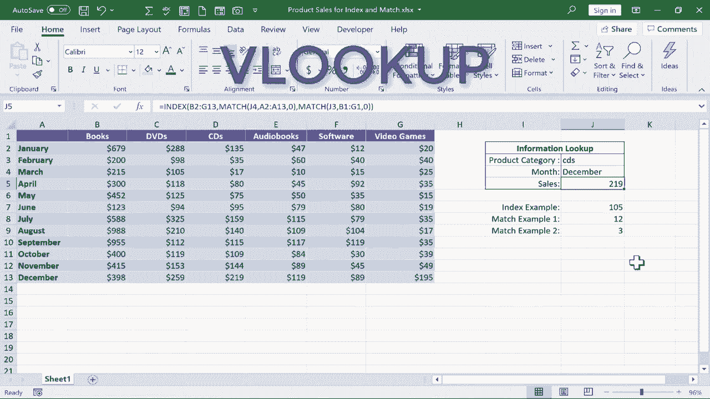

# Excel中级教程！(持续更新中) - P61：62）索引和匹配 

在这个视频中，我将向你展示如何使用两个函数。索引和匹配来在Microsoft Excel中进行强大的查找。这里是我们将在这个视频中使用的示例电子表格，如果你想下载并跟着一起做，你可以在这个视频下方的描述中找到它。

我们这里有的是一个假想媒体企业的销售记录，销售这些商品。他们每个月跟踪在每个产品类别中的销售额。因此，我希望能够在右侧产品类别旁边输入，比如DVD和6月的月份，然后能够看到6月DVD的总销售额。

那么我们该如何实现呢？使用索引和匹配是实现这一目标的最佳方法之一。让我们开始尝试理解每个函数，索引和匹配。索引的目的在于帮助你提取信息。😊，从一个范围中。因此，例如，我可以使用索引来搜索这个范围，并生成第二列和第三行中的信息。

例如，第二列第三行应该是105，然后它将产生那个结果。我们来看看在单元格J7是如何工作的，我将输入等于索引，然后左括号。和往常一样，Excel给我们一些提示和建议。我们可以采取几种不同的路径，我将坚持顶部的例子。

它正在寻找一个数组，基本上就是一个范围。因此，就像我之前的例子一样。我将点击并拖动以突出显示电子表格中的数字范围。接下来，Excel期望一个逗号，然后是行号逗号列号。所以我将输入逗号，行号先来。那么假设我想生成那个105。

如果你还记得，我的选择是从这里开始的，一直到这里。因此这是第1行。即使左侧显示的是2，这实际上是第2行，而这就是第3行。因此我将输入数字3以表示第三行，然后放入我的逗号。那这一列是什么呢？嗯，它是我所选择的第二列。所以我输入2。

然后我应该放入一个右括号，在许多情况下你不需要放入右括号，然后只需按下回车。注意，它生成了正确的数字105。所以它成功了。这就是索引为我们做的事情。它帮助我们识别第三行和第二列或第五行和第10列，然后产生结果。我们放入的任何数字都将决定它查看哪一行和哪一列，然后生成该单元格中的数字或数据。

现在，如果你看着这个说，嗯，那用途有限。你可能是对的。如果它仅仅是这样，我对使用 index 不会太兴奋。它还有很多其他用途。但待会儿我会向你展示如何将它与 match 结合使用，以便做一个 index 和 match。

这确实使它非常有用。不过首先让我们继续在 J8 单元格中使用 match。我会输入等于，然后输入 match 作为我的函数，后面跟一个左括号。接下来，Excel 在寻找一个查找值。换句话说，Excel 将会查找这个公式的结果是什么。

也许我想让它查找一个特定的月份。比如说 July。现在，由于 July 是一个单词而不是数字，我应该将其放在引号中，以便它能正常工作。所以 July。接下来，Excel 期待一个逗号，然后是查找数组。所以我输入逗号。查找数组是什么呢？这意味着 Excel 我想让它检查并搜索这个单词 July 的范围是什么呢？

数组在这里。我会单击并拖动以选择每个月。接下来，Excel 期待一个逗号，然后。看看它做了什么，它在说。我们在寻找什么样的匹配？我们在寻找小于这个的匹配，精确匹配还是大于这个的匹配？现在，谈到单词。

思考小于大于有点令人困惑，但我们先考虑精确匹配。所以我只输入 a0。这代表精确匹配。我应该输入右括号，然后按下回车键。它产生了数字 7。现在，为什么它产生了数字 7？因为我让 Excel 在范围 a2 到 a12 中搜索单词 July。

如果你数一下，它是 1，2，3，4，5，6，7。它是数组或范围中的第七个项目。所以这有效。让我们做第二个例子。假设我在寻找单词 software。我可以输入等于 match 左括号。我的查找值是 software，查找数组是这里的信息。同样，我想要一个精确匹配。所以 0，然后右括号，按下回车。

让我们检查一下，确保它是准确的。我们在寻找 software。Soft 是 1，2，3，4，5。它产生了正确的数字。再一次，如果你在心里想，这很好，但这并没有什么帮助。但是如果我不在这里输入单词 software，而是将匹配函数与某个变化的内容联系起来，比如 DVDds 和 June。

这是我预计会变化的电子表格区域。我预计会输入不同的月份和不同的类别。因此，如果我能将这些匹配示例与某些变化的内容联系起来，它就会变得更强大。让我们看看如何做到这一点。所以在我的匹配示例一中，我可以删除单词 July，而不是 July，我只需单击这个空白的月份单元格，按下回车。

它给我一个错误，表示不适用。但如果我现在输入单词 July，然后按回车，它会产生与之前相同的结果，数字 7。不过这很不错的是这个是可调整的，所以我可以输入 August。它会改变。我可以输入 January，结果也会改变。第二个匹配示例也是如此。与其在引号中输入单词 software。

为什么不简单地点击这里，在产品类别中输入。按下键盘上的回车。是的。我第一次空白时会出现错误。但现在当我输入单词 books 时，它会产生一个结果。这是一个可调整的结果。我可以将其更改为 DVDs，匹配也会更新。好的。

这让它变得更有用和令人兴奋。这些公式现在与某些变量相关联，它是变化的。现在我们可以将这两个函数结合起来。在一个公式中使用索引和匹配，自动生成例如一月份的 DVD 销售额。那么我们来做吧。我会点击这里，选择单元格 J5，输入等于索引左括号。

如果你记得索引的要点。😊，就是查看一个数组或范围，然后根据指定的行和列生成结果。所以它首先是在寻找一个数组。我们给它之前用过的那个数组。只需点击并拖动以选择该范围。现在 Excel 正在等待一个逗号，然后是行号，逗号，列号。所以我会输入我的逗号。那我这里该输入哪个行号呢？好吧。

我不知道该输入哪个行号。这将是一个变量。它将根据在这个单元格中输入的月份而变化。那将决定行号。我不知道那个单元格中会输入什么。因此，我们在这里使用匹配函数。这是在一个以不同函数索引开头的公式中使用一个函数。

在匹配之后，我们输入一个左括号。它正在寻找一个查找值。我不知道查找值是什么。它是变化的。但它将是一个月份。所以我只需点击这里。这是最终用户将输入月份的地方。注意，当我点击那里时，它将单词 January 放在这里。

不如输入单元格引用 J4。这很好。这就是我想要的查找数组。Excel 将搜索这个单元格中输入的内容。好吧。就是这个范围。所以我点击并拖动，仅选择月份。上面和下面没有空单元格，只有月份。我输入我的逗号，这将是什么样的匹配呢？

这将是一个精确匹配。所以0。然后我的右括号。现在 Excel 让我回到这里，提醒我，是的，我一直在使用匹配。但这实际上是一个索引公式。这是启动这个公式的函数。所以它提醒我，我需要现在进去输入一个逗号，然后是列号。

这是我为列号准备的逗号。同样，我需要将其匹配。我不知道确切的列号是什么，但它将基于在产品类别框中输入的内容来决定我感兴趣的列（现在Excel在寻找一个查找值。我不知道那会是什么。这是一个变量。它会改变，但它会位于这里。

所以我点击那里。J3a。查找数组是什么？为了找到DVD、书籍或CD，将搜索什么？嗯，就是这个。就是这个范围。我们要寻找什么样的匹配，精确匹配。所以我输入0，然后写右括号。然后我真的应该再输入一个右括号来结束这个公式。按下Enter，Excel为我生成了结果，288。让我们检查一下。一月的DVD销量。

一月的DVD销量为288。现在，我们可以进入并修改这些单元格。假设我对10月30日的软件感兴趣。那么10月30日。这个功能运行得非常完美。现在，这对于这样一个小型电子表格来说是很有帮助且有趣的。但是想象一下，如果这个电子表格不是只有13行和7列，会是什么样子。

数据量如此庞大，以至于有50列和10000行或类似的东西。将索引和匹配结合起来，从你的电子表格中提取特定结果的概念将更加有帮助和实用。现在，有些人可能知道你可以使用V查找做类似的事情。如果你还没有，绝对应该观看我关于V查找的视频。

