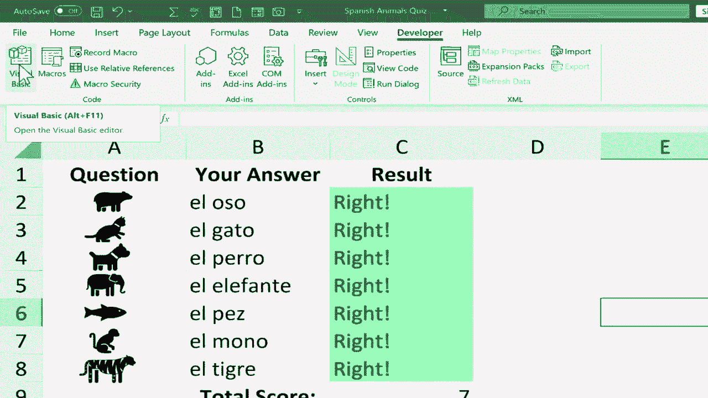
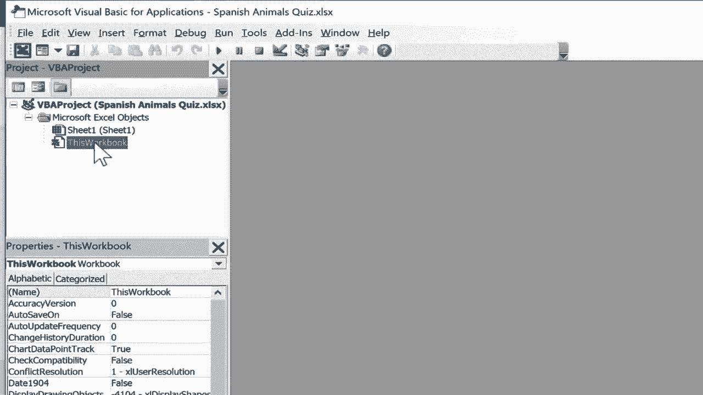
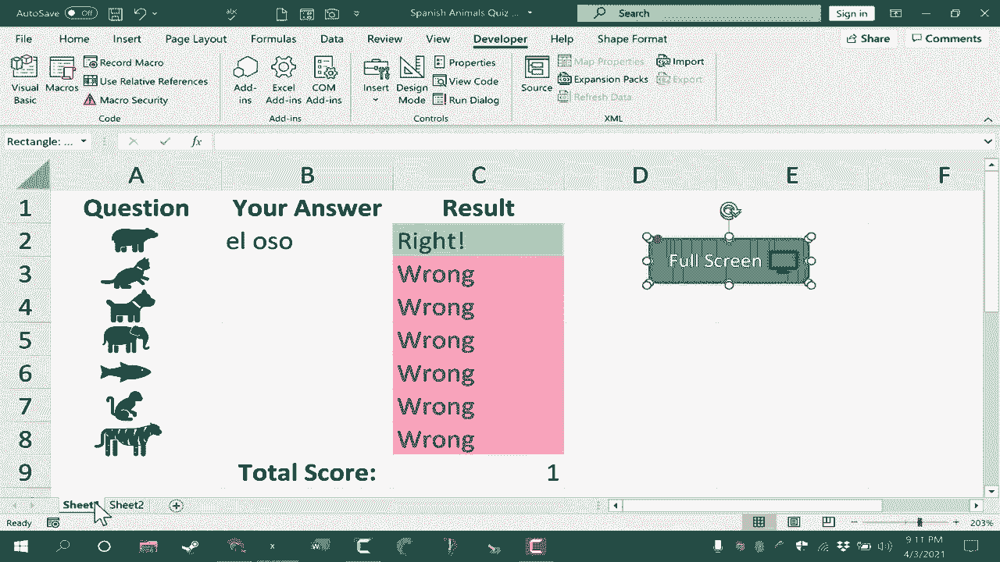

# Excel中级教程！(持续更新中) - P64：65）创建 Go 全屏宏以及如何创建自定义按钮 

在本视频中，我将向你展示如何从零开始创建一个Excel宏。这是一个简单的宏，但它将使你在需要时进入全屏模式。本视频是创建Excel宏系列中的一个，请务必查看其他宏视频。所以第一步是去快速访问工具栏，点击这里的按钮。

现在我将去更多命令。在这一点上，我实际上要切换到自定义功能区，还有其他方法可以到达自定义功能区，但重要的是你必须选中“开发者”选项。如果“开发者”旁边没有勾选，你需要完成这一步。你需要打上这个勾。我在这里做的是自定义功能区，添加一个额外的选项卡，你可以看到还有其他可选的选项卡可以添加，但对于本视频来说，开发者是你必须拥有的。

现在我已经有了开发者选项卡，我可以点击它。在开发者选项卡上，我有一个代码组，这里有一些非常有趣的东西可以做。你可以录制一个宏，这真的很有趣，而且很简单。我有一个专门关于这个的视频，希望你能观看，或者你可以从头创建和管理宏，这就是我们要做的。我将点击Visual Basic来创建一个VBA宏，VB是Visual Basic for Applications。这是编程，但不要让它让你感到畏惧。我们将使用一个简单的程序，它基本上就像一个食谱或魔法咒语，随你怎么理解。视频下方我将包括这个代码，如果你想复制粘贴，可以这样做。你会注意到，在左上角的项目窗口中，显示的是VB项目西班牙动物测验，这是我使用的电子表格，列出了sheet1，也列出了这个工作簿。那么我希望这个代码存储在哪里呢？在工作簿本身的任何工作表中。

在一个特定的工作表中，我想我会将它放在整个工作簿中，这样我添加的任何额外工作表都应该有效。所以我会双击“这个工作簿”，这会给我一个输入代码的空间，我将用于这个 VBA 宏。我将开始输入“sub”这个词，这里我基本上是在命名一个子程序，我将其命名为“go full screen”，然后加上左右括号，按下回车键，然后我将输入“application.dot display”。你会注意到，一旦我开始输入“display”，就会出现一个弹出菜单，提供我可以选择的选项。我将向下浏览，选择“display full screen”，这就是我想要做的。然后我会双击它，接着输入“= 空格”，然后是“_”，然后按下回车，接着我会输入“not 空格 application.dot display full screen”，我再按下回车，你会看到 Microsoft VBA 在 Excel 中自动填入“end sub”。

所以在这一点结束子程序，我可以退出它，回到 Excel，现在我可以点击我的宏按钮，那里有我的宏，我们可以测试一下。所以选择这个宏后，我会点击运行，看看它将我带入全屏模式，这在这种情况下可能是个很有帮助的做法，因为这是一个工作表或测验，我的学生将要参加，以帮助他们练习西班牙语动物词汇。

进入全屏对这个来说有点帮助。我想我会按下键盘上的 Esc 键以退出全屏。因为我希望你看到有一个更好的方法来访问那个宏，远比去宏按钮那里好得多。我们可以设置自己的按钮，点击时将激活宏。所以我可以去插入，然后以这种方式插入一个按钮。

这是个不错的方法。但正如你所看到的，那些按钮看起来并不总是很好。它们有点简单。因此，在这个视频中，我想展示一种将按钮放入电子表格的替代方法。我将插入插图形状，现在我将绘制一个按钮。你可以使用这些形状中的任何一种。可以是星形按钮、三角形按钮，随便，但我将选择这个带圆角的矩形按钮。我点击它，然后在屏幕上点击并拖动以绘制我的按钮。现在它已经绘制好，我可以去刚出现的形状格式选项卡，选择我想要使用的配色方案，任何我觉得好看的颜色。然后我可以双击形状，输入“全屏”，按下回车。我的文字比较大，所以我需要稍微拉伸我的按钮，或者缩小文字。我觉得这样看起来不错。如果我想，我甚至可以插入一个图标。我可以去插入插图图标，然后搜索“屏幕”，假设这代表全屏。我会点击插入，这样我就可以将这个图标添加到按钮上，然后将它缩小到合适的大小，放在右边。

现在要把这个按钮变成一个可以执行宏的实际按钮，我们还需要做几个步骤。首先，我需要将图标和按钮组合在一起，所以我点击了按钮，现在按住控制键同时点击图标，选中后我可以右键点击并选择组合。现在这被视为一个整体，此时我可以再次右键点击按钮，这次选择“分配宏”，选择宏时就选这个工作簿，点击确认。如果我点击按钮外部，完整屏幕按钮就可以使用了。假设学生们准备进行这个练习测验，我当然需要清除正确答案，但此时我可以点击全屏，电子表格就会全屏，学生可以开始使用这个互动工作表或测验。如果我再次点击全屏，请注意它会切换出全屏，这也是一个不错的功能。

如果你记得我是在这个工作簿中创建的，而不仅仅是sheet1，所以让我们测试一下。如果我到左下角点击加号来添加第二个工作表。我看不到我的按钮，但如果我去宏的选项，会发现宏依然存在。我需要做的就是回到sheet1，右键点击我的按钮复制，然后转到sheet2，右键粘贴。让我们看看是否有效，我点击，它全屏，我再次点击，它就会退出全屏。所以我希望你能看到使用这个简单的Excel宏创建全屏按钮的潜力。

