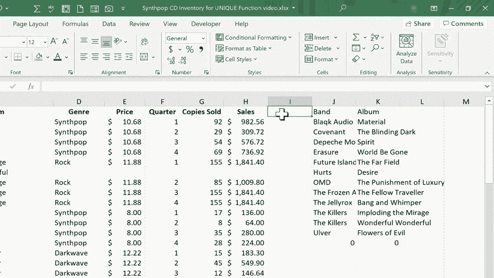

# Excel中级教程！(持续更新中) - P65：66）两个动态数组函数：UNIQUE 和 SORT - ShowMeAI - BV1uL411s7bt

在这个视频中，我们将看Excel的两个新动态数组函数：唯一函数和排序函数。我们将看看如何将这两个函数结合起来做一些相当令人兴奋的事情。所以这里我有一个包含乐队、专辑和关于这些专辑的一些更多信息的电子表格。但是如你所见，乐队和专辑都是重复的，为什么？因为它按季度列出每年的每个季度。

不同的销售结果，诸如此类。那么如果我想生成所有乐队的列表呢？就这样，我不需要重复项，只需要每一个乐队的列表。好吧。我现在可以通过使用微软Excel中相对较新的唯一函数来做到这一点。如果你有Microsoft 365版本的Excel，就应该能够使用这个功能。

所以我将点击J2单元格，然后输入等于唯一，你会注意到当我开始输入唯一时，Excel建议一些我可能想要使用的函数，但唯一就是我想要的。我输入左括号。接下来是什么？Excel在询问一个数组。

那么我希望Excel在什么数组中查找唯一项目呢？嗯，就是这个。是B列。现在我可以通过左键单击B来选择整个列。你可以看到Excel会做什么。它输入了B列B。换句话说，整个B列。我应该输入右括号。其实我不一定要这样做。我按下回车，你会注意到它做了什么。

它找到了该列中的每一个唯一单词或短语，并在J2中再现了它。现在，它无法将所有数据放入J2。因此，它溢出了结果。希望你看过我之前关于Excel中溢出结果的视频。现在，这些结果是动态的。我们溢出了一个动态数组或范围。所以现在看看会发生什么。

如果我更改所基于的数据。例如，假设我删除The Jelly Rocks。他们是一个非常有趣的乐队。如果我将它们从乐队列表中删除所有引用。你会注意到我的溢出结果发生了变化。我将撤销这个。好的，让我们再试一次。但这次我想不仅仅获取乐队。

但我也想得到专辑。让我们试试。我要点击J2。我可以点击J1，其实无所谓。实际上，我这次会选择J1。等于唯一左括号。我要从B拖到C，右括号，按回车。看看溢出的结果。它溢出了专辑和乐队。

但只有独特的那些。那么看看会发生什么。如果我插入另一个记录。比如说The Killers，太棒了，我按下回车。看看我的动态范围或动态数组发生了什么。溢出的结果会反映我所添加的内容。现在，你可能会说，等等，乐队。

乐队“the killers”并不是独特的。乐队“the killers”。好吧，这是真的。但是在我的公式中，我说我想要的是B和C列中的唯一值。所以它考虑了B和C中的数据，以决定什么是唯一的，什么不是。因此，因为乐队和专辑的组合是唯一的，它在我的结果中列出。接下来我想尝试的是，我不仅想过滤掉那些不是唯一的东西。

我还想根据乐队名称对结果进行排序。让我们看看能否做到这一点。我会点击J1，删除该单元格的内容。正如你所知，所有这些溢出数据都是根据J1中的公式生成的。因此，当我删除它时，所有溢出数据也会被去掉。

所以在J1这一栏，我将输入等于unique左括号，然后输入sort。这是另一个动态数组函数。左括号。接着我会选择B和C，让我们看看到目前为止我的公式。

看上去，在这一点上我要加一个右括号，再加一个右括号，然后在键盘上按回车，看看右侧的结果，不仅生成了独特的专辑和乐队，而且它们都是按乐队名称字母排序的。现在，只需输入等于sort左括号并选择一个范围，在这个例子中是整列，按回车也是可以的。

所以你可以使用sort函数对任何范围进行排序，并在下方或有时向右溢出结果，你可以这样做。但我认为将sort和unique结合使用的方式特别令人兴奋。在这种情况下，你还可以将其与其他动态数组函数结合，做到一次产生唯一数据并进行排序。

