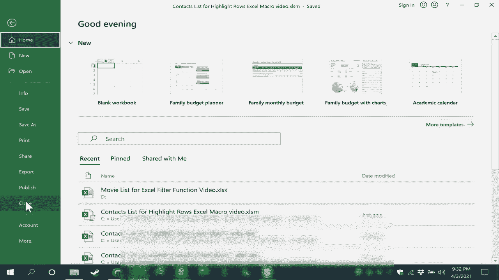

# Excel中级教程！(持续更新中) - P67：68）创建突出显示行的 Excel 宏 

在这个 Excel 视频中，我将向你展示如何创建一个 Excel 宏，使你所选的任意范围内的每隔一行以你选择的颜色高亮显示，而这个视频是关于 Excel 宏系列中的一部分。

请观看整个系列，像往常一样，当我们创建宏时，第一步总是确保你在功能区上有开发者选项卡。如果没有，你可以在这里点击这个快速访问工具栏按钮，去更多命令，切换到自定义功能区，并确保这里选中，然后点击确定。下一步是去点击 Visual Basic 按钮，你会看到 Visual Basic for Applications 识别了我的电子表格，它是一个联系人列表。顺便说一下，如果你想要一个副本来练习，请查看视频下方的描述，你会找到一个链接。接下来，我需要决定这个宏是只在 Sheet1 上存在，还是在整个工作簿中。在这种情况下，这并不重要。

我想我会选择这个工作簿，所以我会双击这个工作簿，这样我就可以在一个白色的工作区中输入代码，让每隔一行高亮显示，并且在这种情况下，我只是将代码粘贴到这个空间，而不是逐字输入，尽管你正在观看。现在这是一种编程语言，但请不要因此感到害怕。我喜欢把这样的代码想象成食谱或魔法咒语，只要你知道食谱。

现在代码已经到位，我可以简单地在右上角关闭 Microsoft Visual Basic for Applications，这个功能内置于现代版本的 Excel 中。我会关闭它，看起来好像没有发生什么，但如果我去开发者选项卡的代码组中，会看到宏，我可以点击查看宏确实存在，我可以点击运行来执行宏，但我想。

创建一个我可以在需要时使用的按钮，这样更方便访问宏。因此，我将通过双击两个列之间来缩短一些列，它会自动调整大小。我想我也会稍微缩小一下，因为我希望我的按钮在这里，而有几种不同的方式可以创建按钮。你可以去开发者选项卡插入按钮并放置它，这是一种很好的方法。

或者你可以插入一个插图，比如说一个形状。我选择这个矩形形状。在屏幕上点击并拖动。这是我的按钮，我可以选择我想要的按钮样式，然后双击它。我将其命名为“高亮行”，如果需要，我可以居中文本，也可以选择垂直居中。我可以把它做得更大，可以调整文本大小，随心所欲地定制这个按钮，使其看起来如我所愿。

所以这是我的按钮。当然，你可以按照自己的想法设计按钮，但此时的操作是右击按钮并选择“分配宏”。这里是我已经创建的宏。我选择它，点击“确定”，然后可以点击按钮之外，现在它准备好可以使用了。

但是看看如果我现在点击按钮会发生什么，如果我点击它，什么也没有发生。为什么呢？原因在于这个宏的目的是检查所选内容，然后使每隔一行高亮，因此我需要高亮一个范围，不能只选择一个单元格。现在范围被高亮。

我可以点击“高亮行”，你可以看到结果。现在这个蓝色有点浓，可能太暗了，所以我可以去开发者选项卡，选择宏，然后编辑选中的宏，我可以删除蓝色并替换为另一种颜色，可能是黄色，退出VB。这次为了对比，我要点击并拖动，只选择部分范围，我会点击“高亮”。行。

你可以看到这效果好一点。所以可以随意尝试不同的颜色。让我们试试这个。“高亮行”。那个效果不错。现在，因为我在这个电子表格中创建或使用了一个宏。当我去保存这个电子表格时，注意会发生什么。

我收到一个警告，提示以下功能。基本上，VBA 项目无法在无宏工作簿中保存。因此，我需要将此工作簿转换为启用宏的工作簿。这很简单，你只需点击“否”，会弹出窗口。然后在这里选择“另存为类型”。

只需点击以将其更改为Excel启用宏的工作簿。点击保存，注意到该文件的扩展名已更改为XLSM。现在当我关闭电子表格然后重新打开时，注意到我收到关于宏的安全警告。我必须启用内容才能使用宏按钮。
