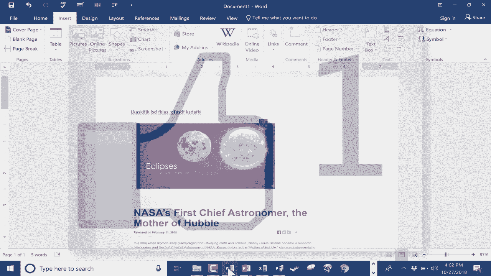

# Excel中级教程！(持续更新中) - P8：8）Word、PPT和Excel的屏幕截图工具 

在这个 Microsoft Office 教程中，我将向您展示一个内置于许多常见 Microsoft Office 工具中的工具，比如 Word、PowerPoint 和 Excel。这个工具非常有用，使用起来也很方便。它是什么呢？就是截图工具。现在，很多人知道大多数现代 Windows 电脑都有一个叫做 Snipping Tool 的工具，它是一个很棒的截图工具，可以将截图添加到您正在使用的任何程序中。如果您对 Snipping Tool 不熟悉，可以观看我的教程，了解如何使用它。

但是如果您在 Microsoft Office 中工作，还有一个内置工具，至少比 Snipping Tool 好一到两个步骤。所以让我们看看它是如何运作的。我在 Microsoft Word 中，假设我正在写一份报告。我决定想要添加一些来自我打开的其他软件程序的内容。比如说，我想要截取我在 PowerPoint 中打开的演示文稿的截图。

我只需要点击插入，然后选择截图，它会打开我当前所有打开的窗口。因此，这是我的 PowerPoint 演示文稿，这里是 Excel 以及更多。所以我可以简单地点击，它会对我的 PowerPoint 演示文稿进行截图，并将其放入我的 Word 文档中。通常，如果您打开了浏览器窗口，它也应该会显示出来。

如果您去插入截图，您应该也能看到那个浏览器窗口，您应该能够对其进行截图并将其放入您的文档中。现在这是一个很好的选项，非常方便，使用起来也很简单。但它的缺点是您会获得整个窗口的截图，整个屏幕。因此，我们还有另一个选项，就在这里。

您可以向下点击屏幕剪辑，而不是简单地点击一个可用的窗口。当您这样做时，它会带您到最近访问的窗口，然后您可以对其进行截图。所以我会退出并且实际上不进行屏幕剪辑，因为那不是我想要的屏幕剪辑。所以不点击截图，而是选择屏幕剪辑。

我需要考虑我想截取什么的截图。在这种情况下，它是一篇来自 NASA 的互联网文章，我想要这张图片、标题和这段文字的截图。当然，它不能全部适应屏幕。但如果我按住键盘上的控制键并点击减号。

它应该会缩小到我可以在屏幕上看到所有内容的程度。好吧，现在这是我最近访问的窗口，回到 Microsoft Word。我可以将鼠标光标放在我想要出现屏幕剪辑的位置，然后转到截图，选择屏幕剪辑。它会带我到我最近访问的窗口或程序。

你可以看到我得到了一个加号，然后我可以点击并拖动，以准确高亮我想要截图或剪辑的部分。然后我只需释放鼠标按钮。这会将该屏幕剪辑放入我的Word文档中。因此，这两种技术都非常优秀，我认为比剪贴工具要简单得多，因为它们直接集成在Microsoft Office的插入截图或屏幕剪辑中。

现在，一旦你插入了截图或屏幕剪辑，你可以点击它们。如果你愿意，可以旋转它们。你也可以像处理照片一样调整它们的大小。如果需要，你还可以裁剪它们。例如，在这个案例中，我并不想显示所有的PowerPoint界面。那么，我该如何裁剪这张图片呢？

我只需右键点击图像，寻找裁剪的选项。这里有一个。我点击裁剪。然后出现这些黑条，黑条相当厚。然后我可以用它们来调整大小，基本上裁掉我不想要的图像部分。现在，为了使这个裁剪有效，我必须点击别处。

现在，照片已经被裁剪了。好的，我们已经看过在Microsoft Word中如何操作。让我们看看PowerPoint。在PowerPoint中。我能做同样的事情吗？我点击插入。我们有截图。我所有的其他窗口都出现了。点击一下，我得到了一个截图。当然，我们还有选项进行屏幕剪辑。让我们试试Microsoft Excel。

在Excel中。我可以插入截图吗？不幸的是，在我的Microsoft Excel版本中，我没有看到截图的选项。现在，我认为原因是我使用的屏幕大小没有适合所有选项。但如果我到插入插图这里，我点击，看看，有截图，它的工作方式和之前一样，可以选择可截图的窗口，屏幕剪辑也可以使用。

到目前为止，我能够在Word、PowerPoint和Excel中使用截图工具。那么，在Publisher中呢？让我们试试看。如果我点击插入。😊。我在Microsoft Publisher中没有看到截图的选项。就我所知，这个功能并不可用。如果有人知道有不同的方法，或者知道如何在Microsoft Publisher中使用截图工具。

欢迎在下面的描述中添加它的使用说明。因此，最终结论是，使用我们最常用的Microsoft Office工具，Word、PowerPoint和Excel。好消息是我们可以使用内置的插入截图工具来截图整个窗口，或对窗口的一部分进行屏幕剪辑。

不好的消息是，它似乎并不适用于所有Office产品，比如Microsoft Pub。感谢观看这个教程。我希望你觉得它有帮助。如果你觉得有用，请点击下面的点赞按钮。
