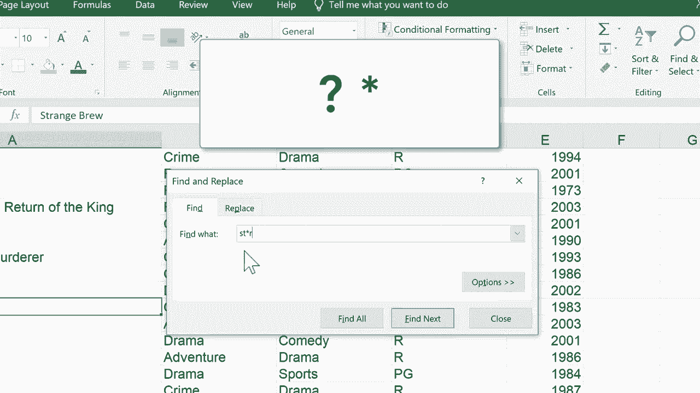

# Excel正确打开方式！提效技巧大合集！(持续更新中) - P10：10）使用查找和替换以及通配符 

在这个 Excel 教程中，我将向你展示如何使用 Excel 的查找和替换功能来定位电子表格中的数据。所以这里我有一个电影标题和一些关于这些电影的信息的电子表格。但假设我想快速检查一下是否包含特定的电影。我只需按住控制键，然后按 F，就会弹出查找和替换。

先看查找功能。所以在选中查找标签的情况下，我可以直接输入我想定位的内容。假设电影是《黑暗骑士》。输入后，我可以直接按回车键或点击查找下一个，它就会定位到该数据。现在，如果这就是我需要的，仅仅是验证数据是否存在，那我就完成了。

但有时我可能想用其他东西查找和替换。所以也许应该把它命名为《黑暗骑士》，而不是仅仅《黑暗骑士》。我可以输入这个，点击替换。如果这个问题有多个实例，我可以直接点击替换全部，它就会修复所有问题。我点击，O。

这真是一个节省时间的好方法。如果你拼写错误或其他错误，你可以让 Excel 查找所有该错误的实例并用正确的数据替换它们。现在，如果你知道你在寻找某个东西，但不确切知道那是什么，你不太确定自己犯了什么错误，但你知道你可能犯了错误。

或者假设你在寻找 Excel 中所有相似的数据。你可以使用 Excel 中的通配符字符。所以让我们看看通配符符号。我们有问号和星号。这是两个主要的通配符符号。所以假设我在寻找一些名字中包含字母 S T 的电影。

但也许我不确定接下来是什么。所以在 S T 后，我可以放一个问号。这个问号是一个通配符。它可以代表任何一个字符。因此 S T 后面跟着任意字符，再后面跟着一个 R。点击查找下一个时，任何符合条件的例子都应该被找到。让我们试试。

它找到了小丑，因为 S T E R，问号可以替代那个 E。让我们找下一个。Western，它找到了词 Western、Star Trek 4 和 Star Wars。因此，当我使用这个问号通配符时，每个都被找到了，因为它可以替代任何一个字符。好的，让我们再试一次，但这次。

让我们使用星号通配符。所以 S T 星号 R。星号可以替代任何数量的字符。因此，这应该可以找到这个电子表格中任何包含 S T 和尽可能多字符的任何数据，然后跟着一个 R。所以让我们试试。它找到了 Western。它找到了《星际迷航》和《星球大战》。

但它也找到了奇怪的酿造和法庭小丑。因此，它给我们提供了一个额外的搜索结果。嗜好酿造。所以查找和替换是内置于Excel的一个非常有用的工具。你可以用它来查找数据并替换数据。当你需要时，记得使用问号和星号。

这些是你的通配符，可以帮助你找到你可能不确定如何拼写的数据，或者如果你犯了拼写错误，但你仍然想能够定位它。感谢观看。我希望你觉得这个教程有帮助。如果觉得有用，请点击下面的点赞按钮。

