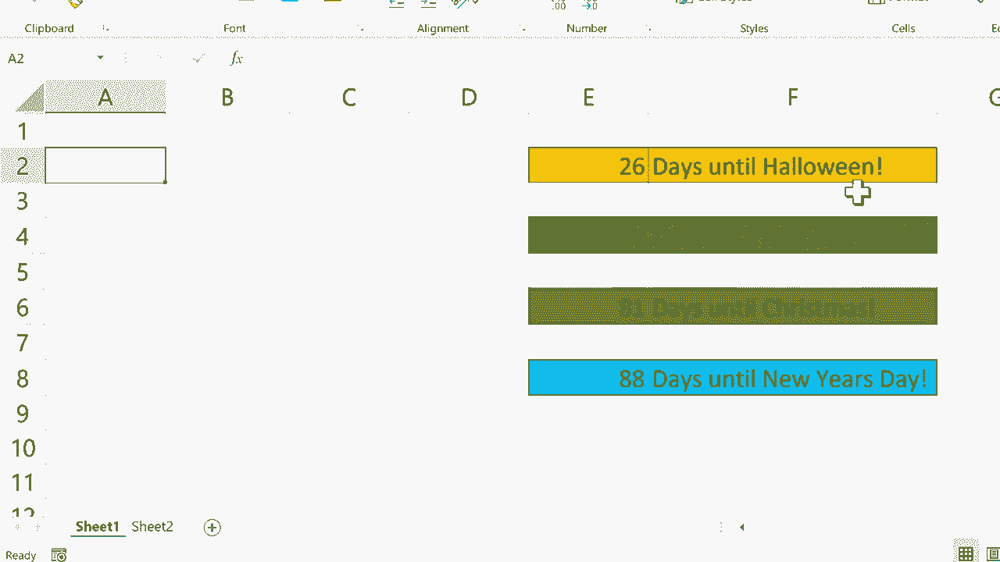

# Excel正确打开方式！提效技巧大合集！(持续更新中) - P13：13）使用 Today 函数设置目标日期 

在这个教程中，我将向你展示一个Excel函数。这个函数就是今天函数。让我们看看它是如何工作的。我这里有一个电子表格，我们一会儿会使用，但现在，我只是想在右下角稍微放大一点。我想放大到大约1070%。然后我会点击一个单元格，比如说B3单元格。

我会输入等于。所以这个单元格等于今天。然后你只需输入左括号和右括号，然后在键盘上按下回车键。它就会给你今天的日期。考虑到这一点，这有什么用呢？嗯，也许你会打印你的电子表格。

每次你打印时，你都想知道打印时是哪个日期。你想要有这个记录。你可以创建一个包含这个函数和公式的单元格，然后继续打印，这个日期总会打印在那里。这只是一个例子。使用今天函数的情况还有很多。但为了好玩，我在这里放了一些节日。

我希望它能自动生成到这些节日还有多少天。现在。我希望你能看到，你也可以把这个应用到其他事情上。也许有一个即将到来的目标日期，或者一个团队期待或正在努力的活动，你也可以做类似的事情。所以我首先要做的是删除这个。我们不需要它放在那里。

假设这个电子表格上已经有各种其他数据。我不想干扰已经存在的数据。所以我将去左下角，点击加号以获取第二个工作表。然后我会稍微放大一下。

我将在这里输入我的公式，即今天，左括号和右括号，按下回车键。这将每次打开电子表格时生成今天的日期。然后我会点击B单元格，并输入万圣节的日期。就这样，现在我需要做的就是回到Sheet1，在E2单元格点击这里。

我会输入等于。所以这个单元格等于，然后我会点击左下角的sheet2。它等于这个日期，并注意公式栏中输入的内容。它只是把sheet2中的单元格引用放进来。所以这个单元格。然后我会点击上面，输入减去这个单元格。

然后我会在键盘上按下回车键，距离万圣节还有26天。现在我可以很容易地为感恩节、圣诞节和新年做同样的事情。就我上面的公式而言，我只需点击它，然后点击右下角，使用自动填充句柄向下拖动并复制这个公式到4。但现在我需要输入这三个额外节日的日期。

所以给我一分钟来完成这个，然后我会继续视频。好的，你可以看到我已经输入了即将到来的假期的所有日期。现在我可以直接去sheet1，重复我在这里为万圣节所做的过程。只需点击输入等于，然后去sheet2。它等于感恩节减去今天的日期。

按下回车，萨姆，圣诞节。这单元格等于sheet2中的圣诞节。然后我去这里的公式栏，减去今天的日期，回车和新年。这个单元格等于sheet2中的新年，减去今天的日期。按下回车。现在我有了一个内置的跟踪器，让我知道距离某些激动人心的目标日期还有多少天。

根据我设置的方式，这些目标日期被设置在sheet2中。这样它就和我在这个电子表格中日常使用的数据分开了。因此，我希望你能找到使用这个方法的方式，也许将其添加到你的电子表格中，以便让你知道某些事情的到期时间。也许这可以成为某些数据需要发布或某些目标需要完成的提醒。

感谢观看。我希望你觉得这个教程有帮助。如果你觉得有用，请点击点赞。
