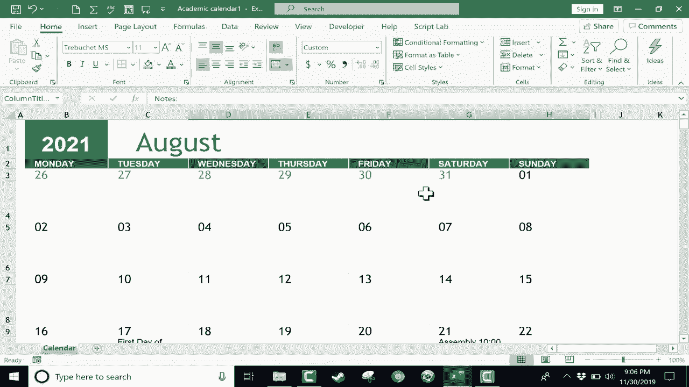

# Excel正确打开方式！提效技巧大合集！(持续更新中) - P15：15）创建日历 - ShowMeAI - BV1Jg411F7cS

在这个教程中，我将向你展示如何在 Excel 中创建日历，有几种方法可以做到这一点，但我们来看一下最简单的方法。同时我也会加入一些我认为你会喜欢的有趣功能和选项。假设你和我一样在使用 Excel。创建日历的第一件事是点击左上角的文件选项卡，然后向下点击新建按钮。

它给你提供了一个空白工作簿和其他一些选项。但我将浏览页面，看看你可以使用的一些模板。有预算、发票，还有一些日历。因此，我将去学术日历那里点击。顺便说一下。

如果你没有看到这个特定的日历，或者想要找到其他日历，你可以在顶部搜索在线模板，输入日历，它会给你很多很多其他选项，除了那些我在电脑上默认安装的。不过，我只是要向下选择学术日历，双击它。

它会弹出一个预览，然后我可以点击创建，这就是我的学术日历。如你所见，模板会为家长教师会议等事情设置一些默认日期。如果不符合实际情况，你可能想删除它。这个日历的顶部默认情况下显示了。

它显示的是当前年份。但如果我想的话，可以将其更改为，比如说 2021 年。现在，看看日历上的日期发生了什么。当我按下回车键时，它们会调整。因此，这是这些 Excel 日历模板的一个很好的内置功能，无论你在这个单元格中输入哪个年份，它都会匹配日期数字和星期。这就是我认为它远远超过其他模板的原因。

这是在 Excel 中创建日历的最佳方式。它可以节省你大量的工作时间。现在，如果你不是从八月开始，你可以点击这里的八月。也许你希望你的日历从一月开始。没问题。你只需选择一月，一切都会自动调整。但再次提醒。

这是一个学术日历，在美国，这通常意味着八月是第一个月。我喜欢这个事实，你可以轻松更改它。这个 Excel 模板会自动调整日期和星期。因此，我将浏览到，假设是八月 17 日，假设这是开学的第一天。请注意，这个模板的构建方式，除了底下的数字。

有一个大单元格，你可以在里面输入事件。我会输入“开学第一天”。然后如果我向下浏览，你会注意到。尽管我选择了八月，其他月份还是在这里。它只是从八月开始。所以我可以向下浏览到五月，比如说5月28日，学期最后一天。

我现在回到顶部。接下来我们看看九月。假设九月份每个星期五都会有小测验。好的，我可以点击并输入，然后点击其他地方，再按控制+C复制。然后我就可以把同样的事件粘贴到九月份的每个星期五。

假设每个星期二的作业到期，我可以直接使用控制+C和控制+V进行粘贴。好的，你明白了，你只需点击并输入这些天的事件。如果有事件的话，我就在8月21日填写“集会”。但你只需填写这些事件。如果你想的话，甚至可以把时间也填进去。

这个日历的制作进行得很顺利。如果你想稍微美化一下，可以。你可以点击并拖动以高亮显示某个月。然后在页面布局选项卡中，如果你想的话，可以更改颜色，选择一些主题。这些都是你可以选择的选项。但我将撤销这些更改，恢复到模板自带的默认设置。我觉得现在的样子很好。

现在，我有了一个不错的日历。我可以保存它，如果我想的话，还可以数字分享给别人。但在某些情况下，你可能想打印。为了打印，只需点击文件，然后选择打印。

你也可以按住控制键再按P。它会带你进入打印界面，并给你一个不错的预览，展示打印后的日历效果。我认为这看起来很不错。九月有所有的作业和小测验。可怜的学生们。八月有开学第一天和集会。

所以这已经准备好打印了。现在，我想给你展示另一个选项。你可以做的一件事是让你的事件更加突出，那就是使用条件格式。这其实很简单。你只需选择整个电子表格。如果按住控制键再按A。😊

它选择了整个电子表格。所以控制+A，然后去到首页选项卡的“开始”组。寻找条件格式。如果你点击那里，会有一个高亮单元格规则的选项，查找包含的文本。所以我想查找包含“测验”这个词的文本。如果确实包含“测验”，我想用黄色填充并使用深黄色文本高亮显示。

所以我点击O，让我们看看它是否有效。我们去九月。在那里你可以看到单元格背景现在是黄色的，文本是深黄色的。这有助于引起对有测验的日期的注意。至少如果你是打印彩色的，或者如果你是数字分享日历。

那作业呢，我可以做同样的事情。控制A选择所有内容。条件格式化，高亮单元格规则，文本包含作业。默认情况下，它想要格式化它。用浅红色填充，深红色文本。但是我将更改它。我将去自定义格式。我可以直接去填充选择不同的颜色。

我甚至可以更改样式模式，如果我想的话。然后点击O。在我看来，这看起来不是很好。所以我要撤销。但是这个想法是你实际上可以在这里创建自己的自定义配色方案和自定义字体格式。我可以更改文本本身的自动颜色。假设选择深绿色边框。

我想要有边框还是不想要，我会说是的，让我们有一个轮廓，然后填充。让我们填充橙色。点击O，点击O，看来我对我的选择不太满意。所以我要上去使用条件格式化。这次，不是去高亮单元格规则。我将往下滚到最底部，那里写着管理规则。

在那里我可以更改我选择的选项。😊，所以这个特定的选项。我将双击它，然后点击格式。尽管看起来不是完全熟悉，但基本上与我之前输入的信息是相同的。所以我点击确定。

点击确定，点击应用，然后确定，这样好一些。好的，所以我有作业到期。我有小测验在那儿。现在，假设在十一月份，假设在这个特定的日子。那是星期三，有一个小测验。我按下回车，立刻根据我设置的规则进行了格式化。那如果这一天有作业到期呢。

我可以输入作业，它会适当地格式化。所以在这种情况下，条件格式化对于为你的Excel日历进行颜色编码非常好。感谢观看。我希望你觉得这个教程有帮助。如果你觉得有帮助，请点击喜欢按钮。

